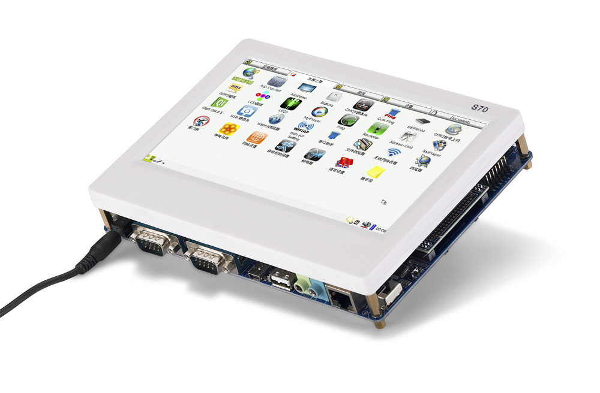
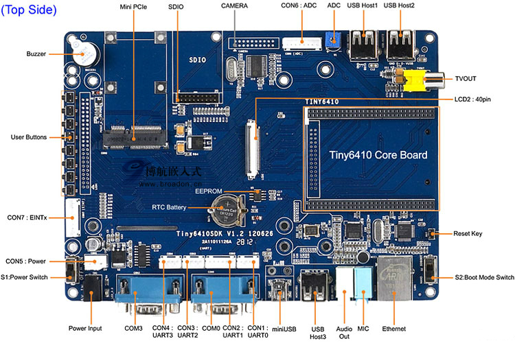
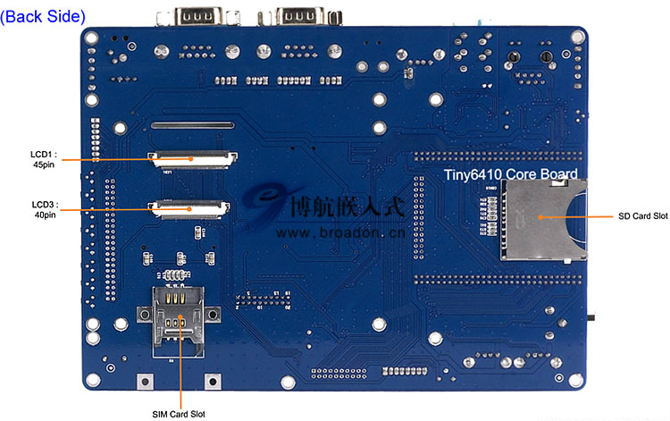
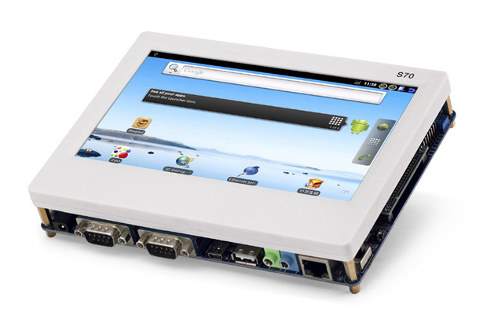
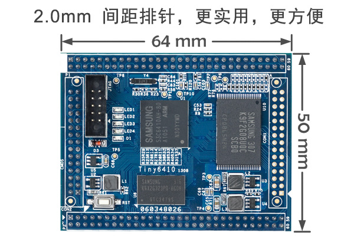

# FriendlyARM-Tiny6410

本仓库已经开始作为gitbook仓库，访问地址

<https://yifengyou.gitbooks.io/friendlyarm-tiny6410/content/>

GitHub访问地址

<https://github.com/yifengyou/FriendlyARM-Tiny6410/>

>Tiny6410简介

* Tiny6410是一款以ARM11芯片(三星S3C6410)作为主处理器的嵌入式核心板，该CPU基于ARM1176JZF-S核设计，内部集成了强大的多媒体处理单元，支持Mpeg4, H.264/H.263等格式的视频文件硬件编解码，可同时输出至LCD和TV显示；它还并带有3D图形硬件加速器，以实现OpenGL ES 1.1 & 2.0加速渲染，另外它还支持2D图形图像的平滑缩放，翻转等操作。

* Tiny6410采用高密度6层板设计，尺寸为64 x 50mm，它集成了256M Mobile DDR RAM，256M/1GB SLC Nand Flash存储器，采用5V供电，在板实现CPU必需的各种核心电压转换，还带有专业复位芯片，通过2.0mm间距的排针，引出各种常见的接口资源，以供不打算自行设计CPU板的开发者进行快捷的二次开发使用。

*  Tiny6410SDK是采用Tiny6410核心板的一款参考设计底板，它主要帮助开发者以此为参考进行核心板的功能验证以及扩展开发。该底板具有三LCD接口、4线电阻触摸屏接口、100M标准网络接口、标准DB9五线串口、Mini USB 2.0接口、USB Host 1.1、3.5mm音频输入输出口、标准TV-OUT接口、SD卡座等常用接口；另外还引出4路TTL串口，另1路TV-OUT、SDIO2接口(可接SD WiFi)接口等；在板的还有蜂鸣器、I2C-EEPROM、备份电池、AD可调电阻、8个中断式按键等。

*  充分地发挥了6410支持SD卡启动这一特性，使用精心研制的Superboot-6410，无需连接电脑，只要把目标文件拷贝到SD卡中(可支持高达32G的高速大容量卡)，你就可以在开发板上极快极简单地自动安装各种嵌入式系统(WindowsCE6/Linux/Android/Ubuntu/uCos2等)；甚至无需烧写，就可以在SD卡上直接运行它们！配合MiniTools，开发者还可以十分方便地通过USB下载单个文件到内存运行，并且通吃各种Windows/Linux平台环境，非常便于调试之用！

---

 

 

 

 

- ##### CPU处理器
  - ###### Samsung S3C6410A，ARM1176JZF-S核，主频533MHz，最高667Mhz
- ##### DDR RAM内存
  - ###### 256M Mobile DDR RAM, 32bit数据总线
- ##### FLASH存储
  - ###### 标配为256M SLC NAND Flash
  - ###### 可选1GB SLC NAND Flash（500PCS起订）
- ##### 接口资源
  - ###### 2 x 60 pin 2.0mm space DIP connector
  - ###### 2 x 30 pin 2.0mm space DIP connector
- ##### 在板资源
  - ###### 4 x User Leds (Green)
  - ###### 10 pin 2.0mm space Jtag connector
  - ###### Reset button on board
  - ###### Supply Voltage from 4.75V to 5.25V
- ##### PCB规格尺寸
  - ###### 6层高密度电路板，采用沉金工艺生产
  - ###### 64 x 50 x 12 (mm)
- ##### 操作系统支持
  - ###### U-boot
  - ###### Linux2.6.38 + Qtopia2+ QtE4.8.5
  - ###### WindowsCE 6.0
  - ###### Android 2.3.4
  - ###### Ubuntu-0910
  - ###### 详细的6410裸机教程
  - ###### uCos2-6410

---

>教程

国嵌嵌入式Linux视频教程全套2011新版，强烈推荐！！！

**国嵌视频1.iso**

- 学习方法与课程体系介绍（学前必看）
- 学习方法介绍.avi
- 国嵌嵌入式课程体系.pdf
- 嵌入式Linux学习方法.pdf

- 国嵌课程1-嵌入式入门体验班（上）
  - 第1天（嵌入式系统概述）
    - 国嵌体验入门班-1-1（嵌入式系统概述）.avi
    - 国嵌体验入门班-1-2（ARM概述）.avi
    - 国嵌体验入门班-1-3（嵌入式Linux概述）.avi
    - 国嵌体验入门班-1-4（2440开发板介绍）.avi
    - 国嵌体验入门班-1-5（软硬件环境搭建）.avi

  - 第2天（开发板快乐体验）
    - 国嵌体验入门班-2-1（开发板系统安装）.avi
    - 国嵌体验入门班-2-1（开发板系统安装-Jlink方式）.avi
    - 国嵌体验入门班-2-1（开发板系统安装-并口方式）.avi
    - 国嵌体验入门班-2-2（裸机程序体验）.avi
    - 国嵌体验入门班-2-3（QT系统体验）.avi
    - 国嵌体验入门班-2-4（Android系统体验）.avi

**国嵌视频2.iso**

- 国嵌课程1-嵌入式入门体验班（下）
  - 第3天（Linux系统体验）
    - 国嵌体验入门班-3-1（Linux定制安装）.avi
    - 国嵌体验入门班-3-2（Linux命令）.avi
    - 国嵌体验入门班-3-3（VI使用）.avi
    - 国嵌体验入门班-3-4（Linux系统管理）.avi
    - 国嵌体验入门班-3-5（Shell编程）.avi
    - 国嵌体验入门班-3-6（Qcd功能演示）.avi
    - 国嵌体验入门班-3-7（必修实验）.avi

- 国嵌课程2-嵌入式Linux应用开发班
  - 第1天（编程基础）
    - 国嵌应用班-1-1（GCC程序编译）.avi
    - 国嵌应用班-1-2（GDB程序调试）.avi
    - 国嵌应用班-1-3（makefile工程管理）.avi
    - 国嵌应用班-1-4（必修实验）.avi

  - 第2天（文件时间编程）
    - 国嵌应用班-2-1（系统调用方式访问文件）.avi
    - 国嵌应用班-2-2（库函数访问文件）.avi
    - 国嵌应用班-2-3（时间编程）.avi
    - 国嵌应用班-2-4（必修实验）.avi

  - 第3天（多进程程序设计）
    - 国嵌应用班-3-1（进程控制原理）.avi
    - 国嵌应用班-3-2（进程控制程序设计）.avi
    - 国嵌应用班-3-3（必修实验）.avi

  - 第4天（进程间通讯）
    - 国嵌应用班-4-1（进程间通讯概述）.avi
    - 国嵌应用班-4-2（管道通讯）.avi
    - 国嵌应用班-4-3（信号通讯）.avi
    - 国嵌应用班-4-4（共享内存通讯）.avi
    - 国嵌应用班-4-5（必修实验）.avi

  - 第5天（进程间通讯）
    - 国嵌应用班-5-1（消息队列）.avi
    - 国嵌应用班-5-2（信号量）.avi
    - 国嵌应用班-5-3（必修实验）.avi

  - 第6天（进程间通讯）
    - 国嵌应用班-6-1（线程基础）.avi
    - 国嵌应用班-6-2（多线程程序设计）.avi
    - 国嵌应用班-6-3（必修实验）.avi

  - 第7天（网络编程）
    - 国嵌应用班-7-1（Linux网络概述）.avi
    - 国嵌应用班-7-2（Linux网络编程基础）.avi
    - 国嵌应用班-7-3（TCP程序设计）.avi
    - 国嵌应用班-7-4（UDP网络程序设计）.avi
    - 国嵌应用班-7-5（并发服务器）.avi
    - 国嵌应用班-7-6（必修实验）.avi

**国嵌视频3.iso**

- 国嵌课程3-ARM系统进阶班
  - 第1天（ARM系统开发基础）
  - ARM系统精讲班-1-1（ADS集成开发环境）.avi
  - ARM系统精讲班-1-2（ARM工作模式）.avi
  - ARM系统精讲班-1-3（ARM寄存器）.avi
  - ARM系统精讲班-1-4（ARM寻址方式）.avi
  - ARM系统精讲班-1-5（ARM汇编指令详解）.avi

  - 第2天（ARM系统开发基础）
    - ARM系统精讲班-2-1（ARM汇编指令详解）.avi
    - ARM系统精讲班-2-2（ARM伪指令）.avi
    - ARM系统精讲班-2-3（（混合编程）.avi
    - ARM系统精讲班-1-8（必修实验）.avi

  - 第3天（LED驱动程序设计）
    - ARM系统精讲班-2-1（GPIO）.avi
    - ARM系统精讲班-2-2（LED控制程序设计）.avi
    - ARM系统精讲班-2-3（（LED闪烁）.avi

  - 第4天（LED与按键驱动程序设计）
    - ARM系统精讲班-4-1（ARM中断控制系统）.avi
    - ARM系统精讲班-4-2（按键控制程序设计）.avi
    - ARM系统精讲班-2-6（必修实验）.avi

  - 第5天（定时器与时钟驱动程序设计）
    - ARM系统精讲班-5-1（ARM时钟体系）.avi
    - ARM系统精讲班-5-2（定时器驱动程序设计）.avi

- 国嵌课程4（嵌入式LINUX内核驱动进阶班-上）
  - 第1天（内核开发基础）
    - 国嵌内核驱动进阶班-1-1（Linux内核简介）.avi
    - 国嵌内核驱动进阶班-1-2（Linux内核源代码）.avi
    - 国嵌内核驱动进阶班-1-3（Linux内核配置与编译）.avi
    - 国嵌内核驱动进阶班-1-4（Linux内核模块开发）.avi
    - 国嵌内核驱动进阶班-1-5（必修实验）.avi

  - 第2天（U-Boot移植）
    - 国嵌内核驱动进阶班-2-1（嵌入式linux系统架构）.avi
    - 国嵌内核驱动进阶班-2-2（交叉工具链）.avi
    - 国嵌内核驱动进阶班-2-3（Bootloader介绍）.avi
    - 国嵌内核驱动进阶班-2-4（U-Boot介绍）.avi
    - 国嵌内核驱动进阶班-2-5（U-Boot命令）.avi
    - 国嵌内核驱动进阶班-2-6（U-Boot启动流程）.avi
    - 国嵌内核驱动进阶班-2-7（Uboot移植）.avi
    - 国嵌内核驱动进阶班-2-8（必修实验）.avi

**国嵌视频4.iso**

- 国嵌课程4（嵌入式LINUX内核驱动进阶班-下）
  - 第3天（内核开发基础）
    - 国嵌内核驱动进阶班-3-1（嵌入式linux内核制作）.avi
    - 国嵌内核驱动进阶班-3-2（根文件系统制作）.avi
    - 国嵌内核驱动进阶班-3-3（内核启动流程）.avi
    - 国嵌内核驱动进阶班-3-4（嵌入式文件系统）.avi
    - 国嵌内核驱动进阶班-3-5（必修实验）.avi

  - 第4天（内存管理子系统）
    - 国嵌内核驱动进阶班-4-1（Linux内存管理）.avi
    - 国嵌内核驱动进阶班-4-2（进程地址空间）.avi
    - 国嵌内核驱动进阶班-4-3（内核地址空间）.avi
    - 国嵌内核驱动进阶班-4-4（Linux内核链表）.avi
    - 国嵌内核驱动进阶班-4-5（Linux内核定时器）.avi
    - 国嵌内核驱动进阶班-2-7（Uboot移植）.avi
    - 国嵌内核驱动进阶班-2-8（必修实验）.avi

  - 第5天（进程管理子系统）
    - 国嵌内核驱动进阶班-5-1（LINUX进程控制）.avi
    - 国嵌内核驱动进阶班-5-2（LINUX进程调度）.avi
    - 国嵌内核驱动进阶班-5-3（Linux系统调用）.avi
    - 国嵌内核驱动进阶班-5-4（Proc文件系统）.avi
    - 国嵌内核驱动进阶班-5-5（内核异常分析）.avi
    - 国嵌内核驱动进阶班-5-6（必修实验）.avi

  - 第6天（简单字符设备驱动程序设计）
    - 国嵌内核驱动进阶班-6-1（LINUX驱动程序介绍）.avi
    - 国嵌内核驱动进阶班-6-2（字符设备驱动程序设计）.avi
    - 国嵌内核驱动进阶班-6-3（字符设备驱动程序实例分析）.avi
    - 国嵌内核驱动进阶班-6-4（竞争与互斥）.avi
    - 国嵌内核驱动进阶班-6-5（必修实验）.avi

  - 第7天（高级字符设备驱动程序设计）
    - 国嵌内核驱动进阶班-7-1（Ioctl设备控制）.avi
    - 国嵌内核驱动进阶班-7-2（内核等待队列）.avi
    - 国嵌内核驱动进阶班-7-3（阻塞型字符设备驱动）.avi
    - 国嵌内核驱动进阶班-7-4（Poll设备方法）.avi
    - 国嵌内核驱动进阶班-7-5（自动创建设备文件）.avi
    - 国嵌内核驱动进阶班-7-6（必修实验）.avi
