# 第10课-Windows与Linux文件互享

* xftp
      为方便实验关闭防火墙，检测是否可以ping通主机。检测主机ip

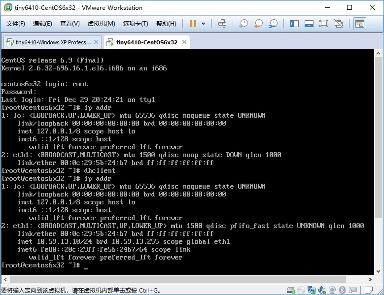

      使用Xmanager的xftp通过SSH登录到虚拟机，即可操作文件

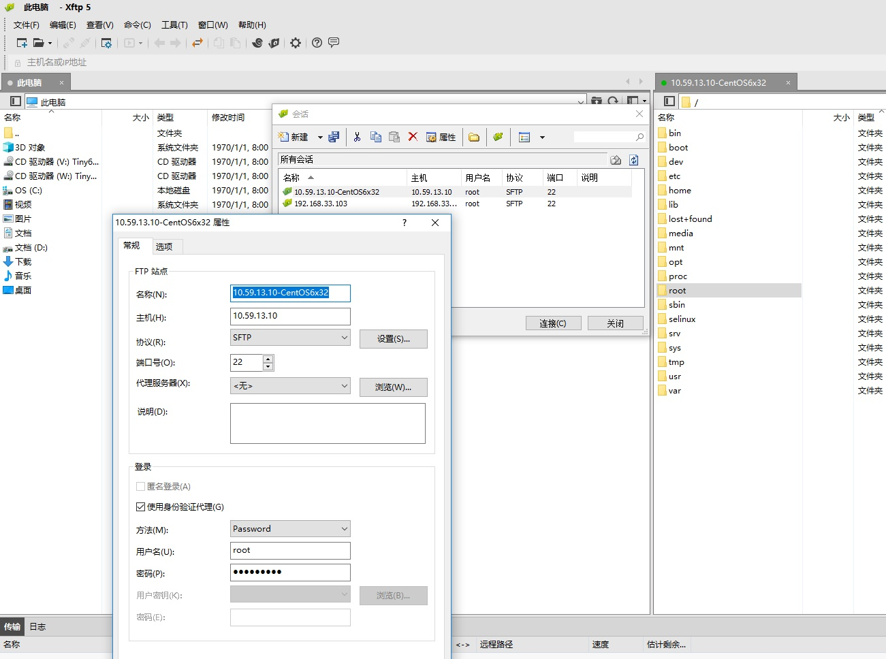

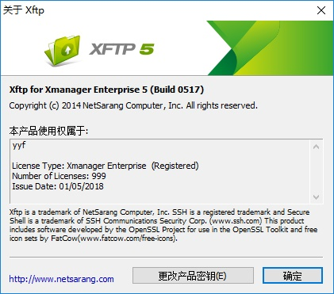

* 使用Xshell终端通过lrzsz上传下载单个文件(不支持目录)

      sz 下载 rz 上传

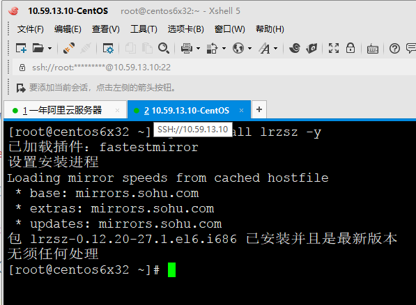

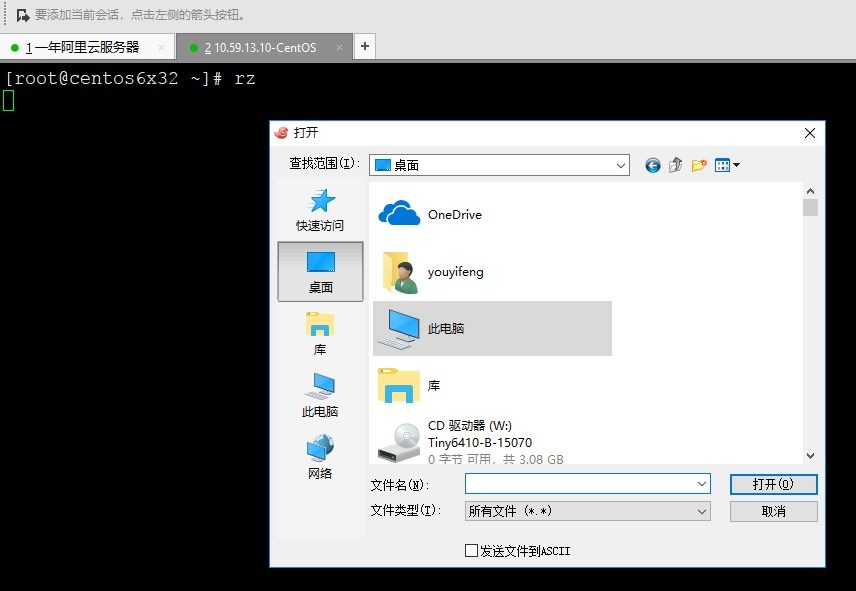

* samba

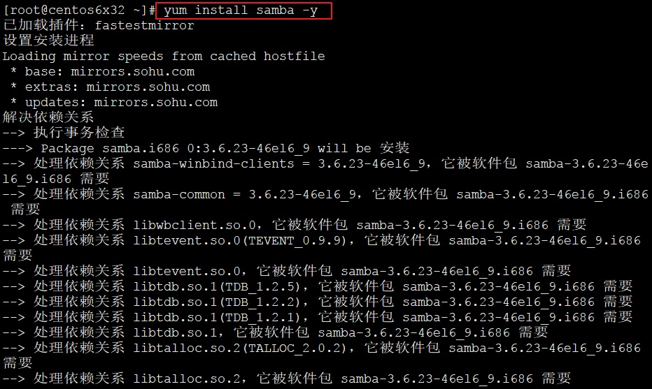

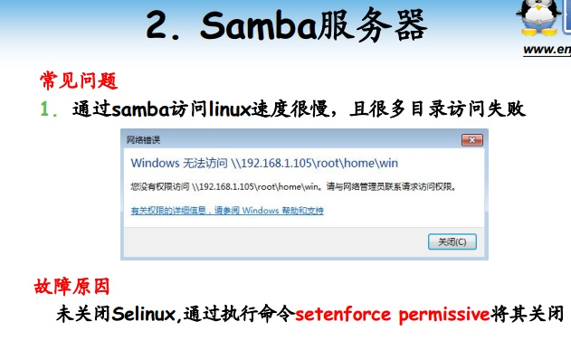

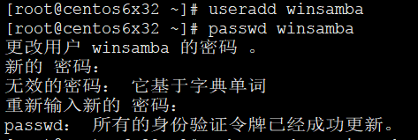

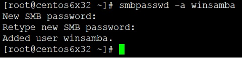

      查找home配置，复制该配置，修改其内容，允许访问，可写，添加默认访问路径，添加有效用户

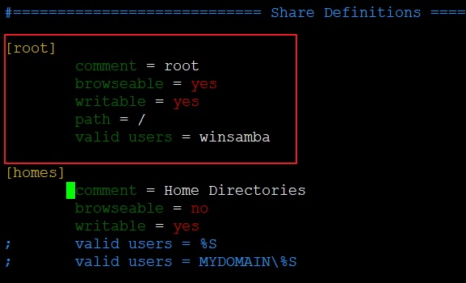

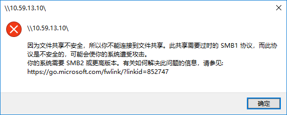

      输入的用户名密码是Linux创建的用户和smbpasswd设定的用户名密码，为了区别于samba密码和用户密码

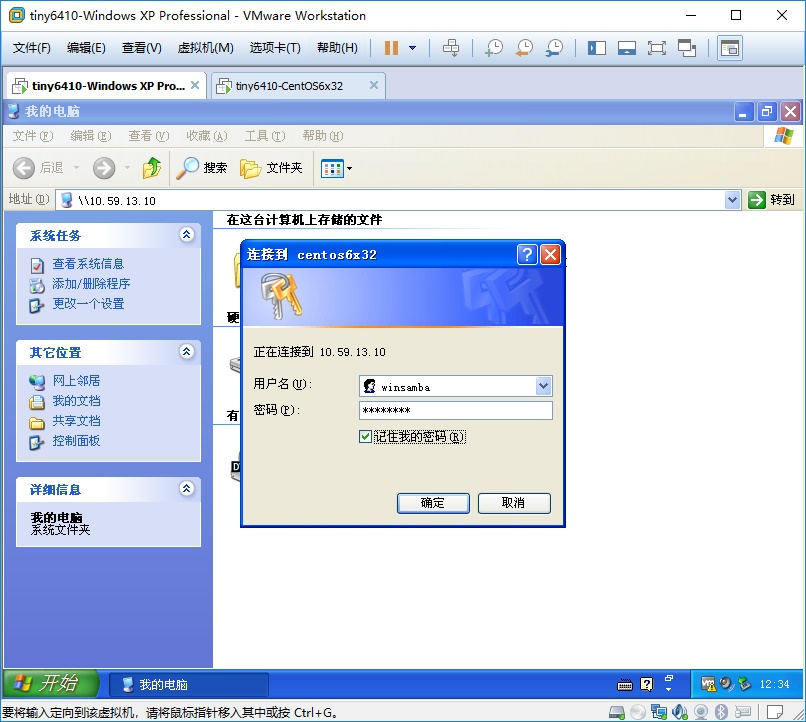

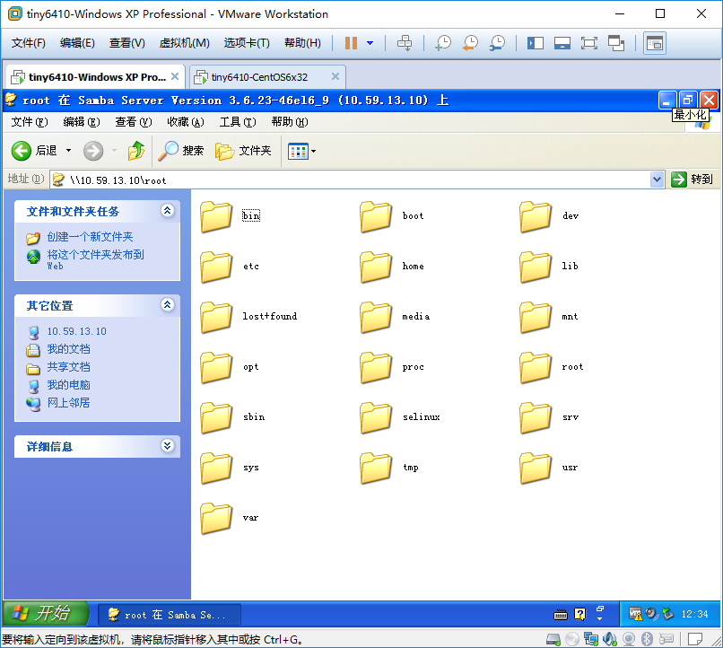

      SeLinux是Linux的安全模块。普通samba用户无法正常读写文件。

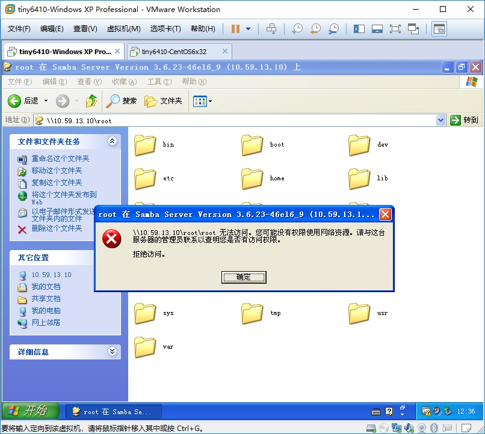

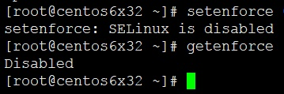

* VMware tools

      不建议使用
