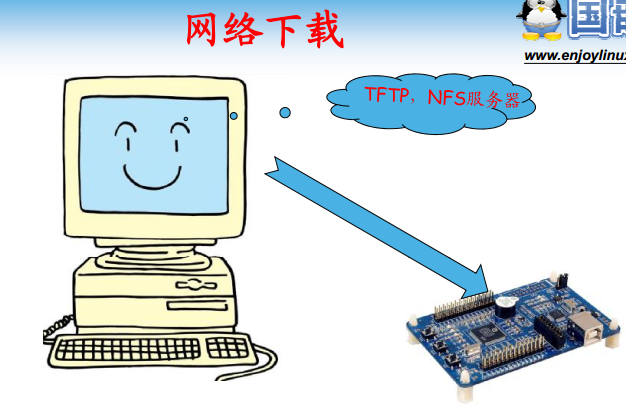
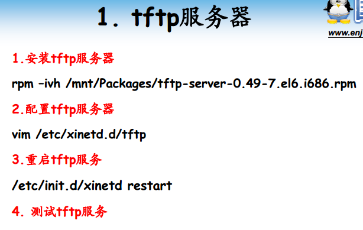
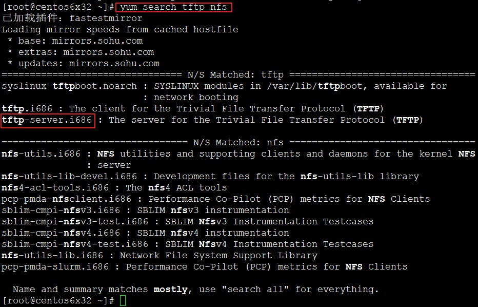
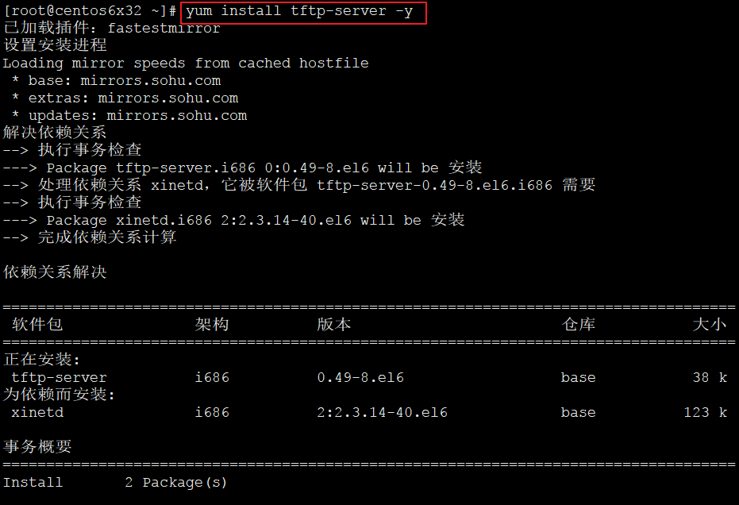
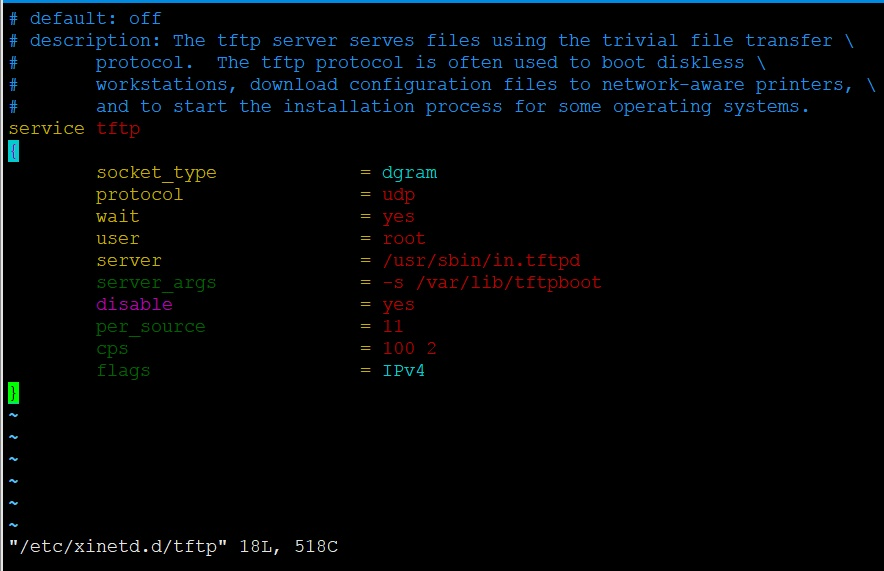
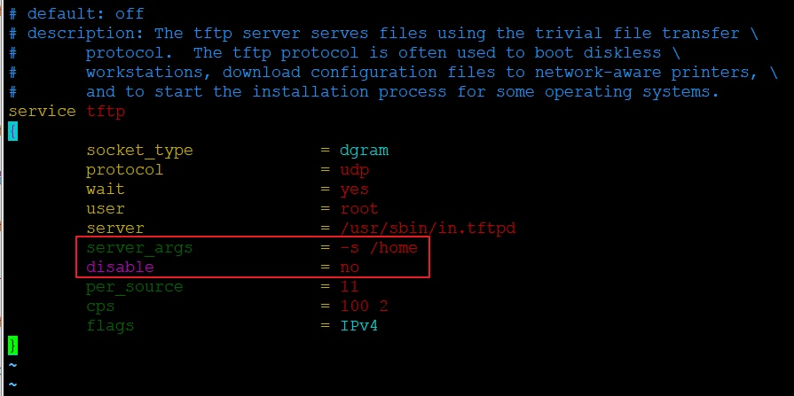
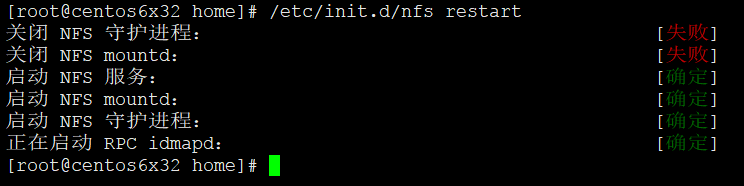
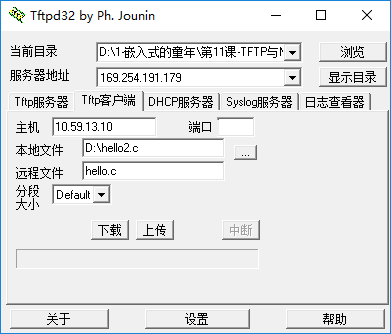
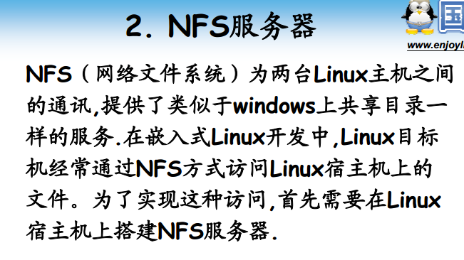
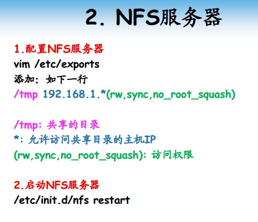

# 第11课-TFTP与NFS服务器配置

交叉开发的需要，因此需要配置该服务。如何把宿主机的软件上传到目标机呢?因此用到了tftp和NFS
      宿主机：产生嵌入式软件，开发端
      目标机：宿主机产生的软件由目标机运行

* tftp

      红帽系统默认没有安装tftp，NFS默认有

      tftp默认配置，路劲在/etc/xinetd.d/tftp

      xinetd(extended internet daemon)是新一代的网络守护进程服务程序，又叫超级Internet服务器,常用来管理多种轻量级Internet服务。

      前提知道目标文件路径，完成文件下载
      TFTP 的端口号是69 port
          读取和写入请求
          RRQ (read request)
          WRQ (write request)
          皆采用 69 port
      需要注意的是，传送档案时并不是用69 port

* NFS

      指定共享目录
      赋予访问权限

      修改/etc/exports，默认为空文件。指定共享目录路径，其次，访问权限(指定用户或所有用户或网段用户，读写权限)
        no_root_squash：如果客户端是root用户登录，那么在服务器端也以root对待创建读写文件
        rw：读写权限
        sync：异步写
      一般只修改开头ip段

~~~
/tmp 10.59.13.*(rw,sync,no_root_squash)
~~~

