# 第15课-GCC程序编译

* Gcc特点

        高效率，开源免费

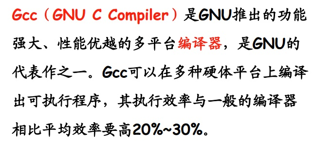

* Gcc基本用法

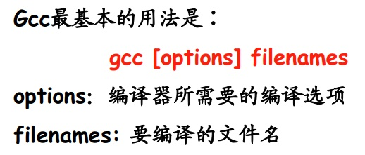

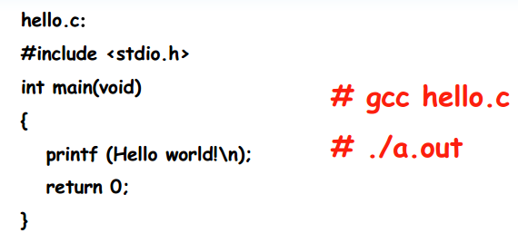

* Gcc编译流程

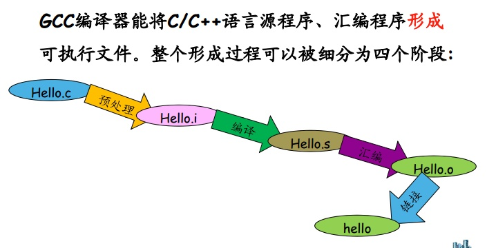

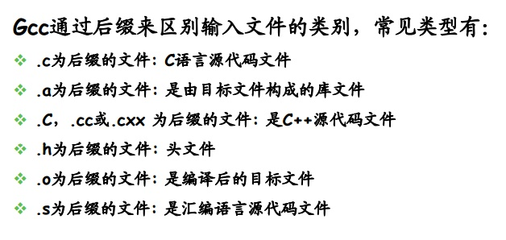

* Gcc选项

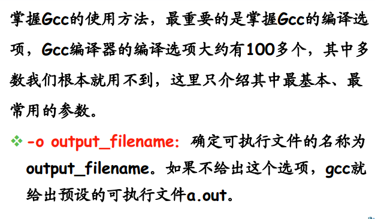

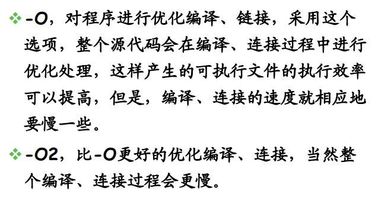

        -E:只进行预处理，不编译
        -S:只编译，不汇编
        -c:只编译、汇编，不链接
        -g:包含调试信息
        -I:指定include包含文件的搜索目录
        -o:输出成指定文件名

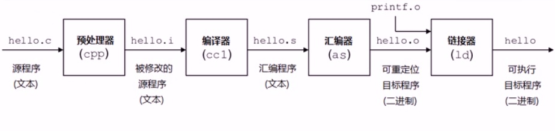

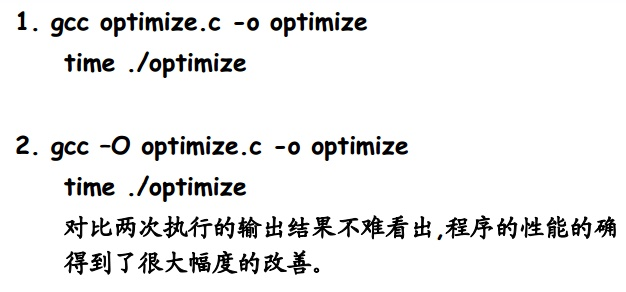

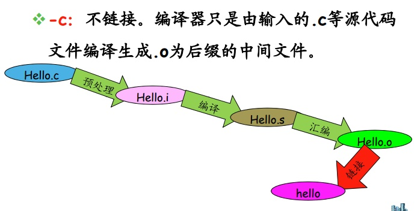

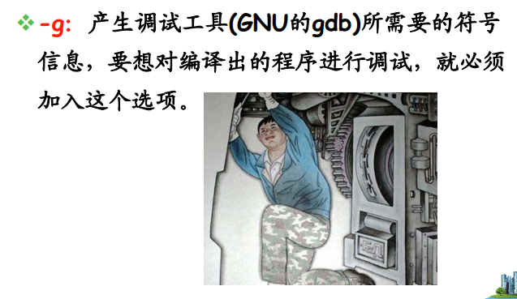

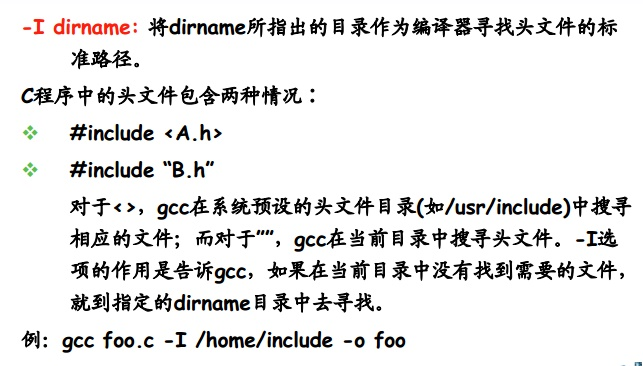

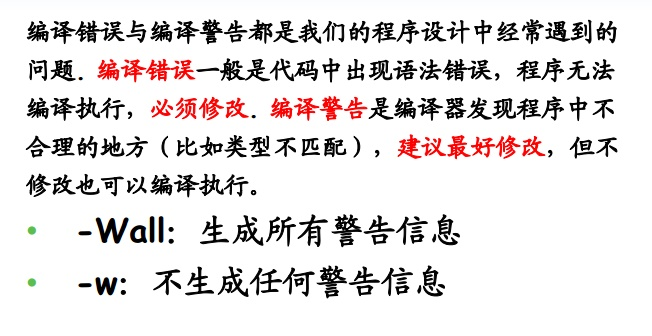

