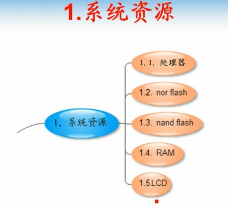
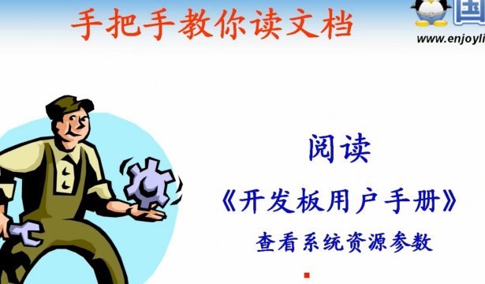
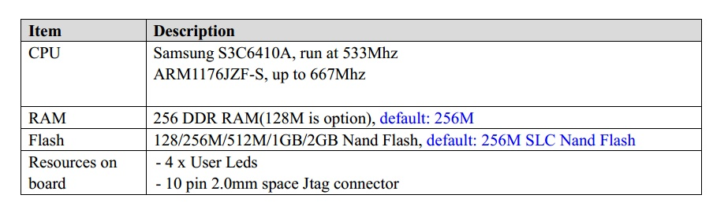
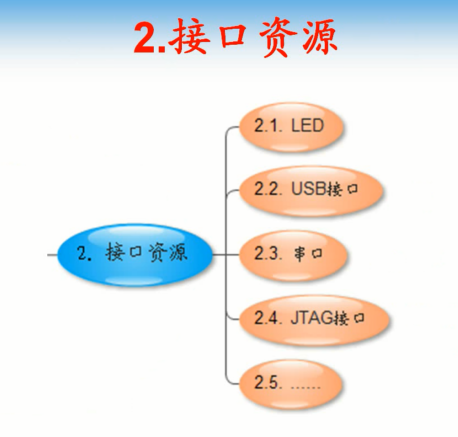
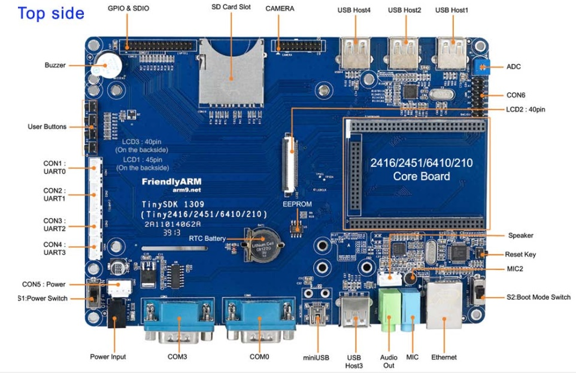
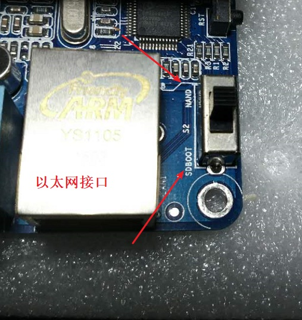
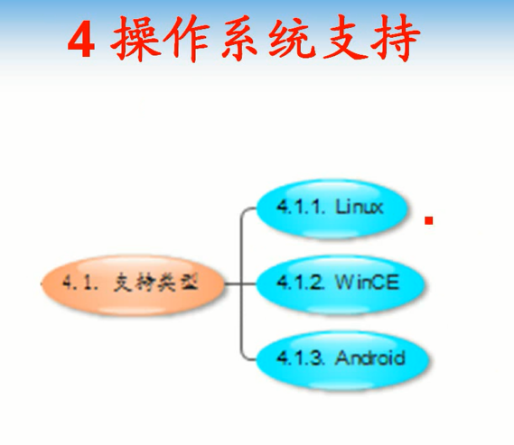
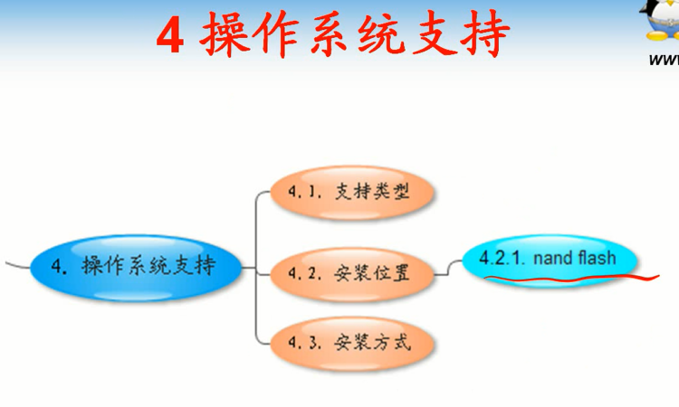

# 第16课-开发板介绍

开发板简单介绍

* 了解开发板资源

      系统资源
      接口资源
      启动模式
      操作系统支持

* 系统资源

      嵌入式系统 - 特殊用途的系统
      NorFlash:容量小，运行速度快，价格高 - 类似于固态硬盘
      NandFlash:容量大，运行速度慢，价格低 - 相当于PC的机械硬盘

      系统配套光盘，01- Tiny6410硬件手册.pdf
      内存还是用的DDR一代
      RAM、LCD可选多种配置

* 接口资源

      各种接口资源了解

* 启动方式

      传统PC机通过BIOS设置选择不同的启动设备，光盘 or 硬盘 or U盘等
      6410开发板支持从NandFlash启动(相当于硬盘)，SD卡启动，如何选择呢？

      开关编号是S2，只有上下，不是上中下开关，上面是NandFlash启动(相当于硬盘启动)，下方是SDBOOT，从SD卡启动

* 操作系统支持

      一般安装在大容量的NandFlash中

* 操作系统安装方式

      1.将引导安装程序烧写到SD卡中
      2.复制系统镜像到SD卡文件系统
      3.SD卡插到开发板，SD卡已经有引导，有系统。设置开发板从SD卡启动。SD卡引导程序自动将系统镜像烧写到NandFlash中
      4.烧写过后重启开发板，启动引导选择NandFlash
