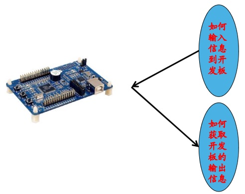
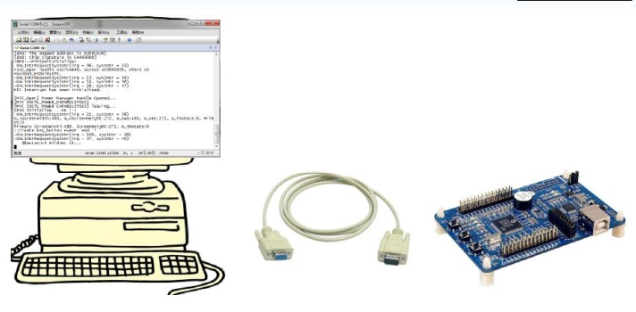
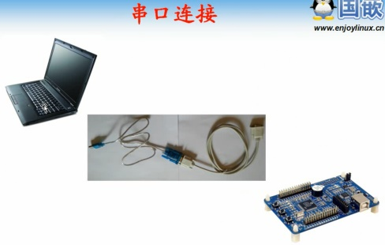
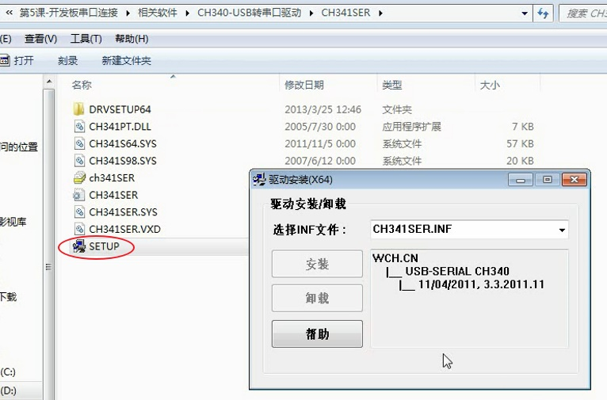
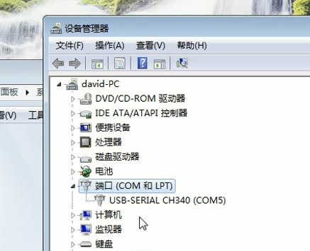
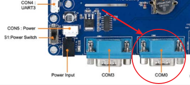
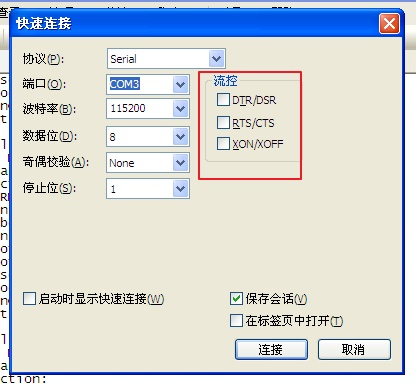
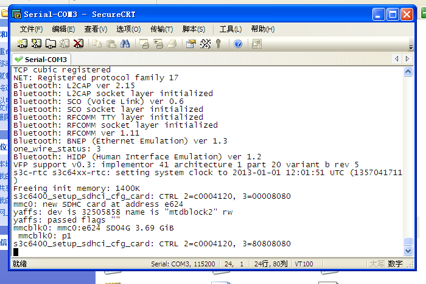

# 第17课-开发板串口连接

      PC机通过显示器输出，通过键盘输入
      嵌入式是被怎么输入输出？

      所有输入输出都可以通过串口连接

      笔记本需要串口转换工具，USB转串口线
      还需要安装USB转串口线驱动

      安装CH341USB转串口驱动

      检查驱动是否工作正常

      注意：串口务必接到COM0，也就是右边接口

      设定波特率，关闭流控，根据设备管理器中的端口号选择合适端口
      开启电源即可捕获输出
      串口不像SSH可以开多个，只能开一个连接。**尝试多开会报错**

