# 第18课-开发板系统安装准备

* 安装系统前疑问

      系统安装在什么位置？NandFlash，因为其容量大，系统本身就大
      安装的系统分几个部分？？

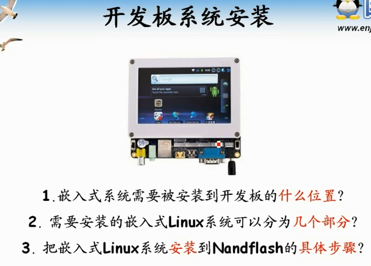

      完整的嵌入式Linux分为三部分
          Bootloader：类似于PC记得BIOS程序，初始化硬件，内核引导。体积最小
          Linux内核：驱动
          文件系统：应用程序，用户文件，配置文件。体积最大

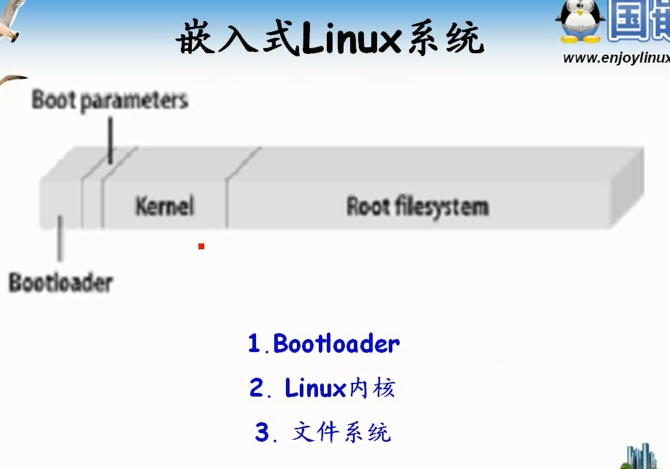

* 安装步骤

      Bootloader烧写到SD卡固定分区
      内核以及文件系统可以放到SD卡文件系统即可
      SD卡开头几个分区是用来做引导的，至少2个扇区没有用到。一个扇区512B
      其实并不是这样的哦~

一般市场上买到的 SD 卡为全盘 FAT32 格式,如果卡中存放了很多数据,强制烧写就可能会不知不觉中破坏这些数据;

基于此原因考虑, FriendlyARM在 Vista/Winows7 中,先把 SD 卡自动分割为普通的 FAT32 格式区(自动命名卷标为"FriendlyARM")和无格式区(占 130M) 两部分,烧写软件将会依据卷标名称作为标志,把 bootloader 烧写到无格式区,这样就不会 破坏普通 FAT32 格式区中的数据了。

例如一个8G的SDHC卡, 7.4 GiB, 7948206080 bytes, 15523840 sectors（2048-15523839，前2048个扇区被保留）:

* FAT32, (第2048扇区~15259647扇区），共15257600扇区。
* 无格式区, (第15259648扇区 ~ 15523840扇区)，共有264193扇区（约129M）
*
除了FAT32分区以外，其他扇区总数共266240个扇区。

而前2048个扇区，为FAT32的保留扇区。作为“第一分区”，存放主启动记录(MBR)和分区表，占512字节，

其中最后两个字节为信号字"0x55","0xaa"： % sudo dd if=/dev/sdc bs=1 skip=510 count=2 | od -t x1c

具体可以参考

<https://github.com/elvischen/ARM-Tiny6410/blob/fc693260334946b21bc2584def300abf03fc0931/linux/readme.md/>

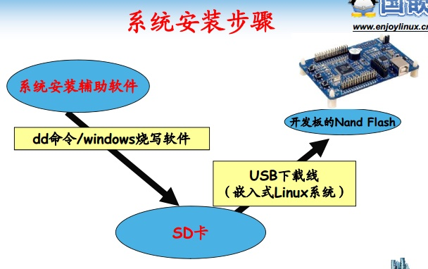


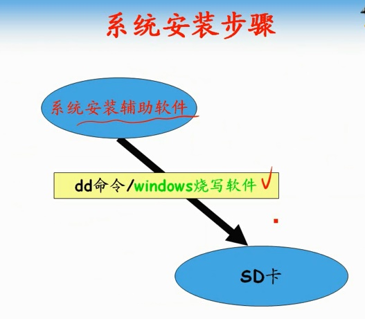

      小卡加个卡套的那种不得行，测试发现，规格不同

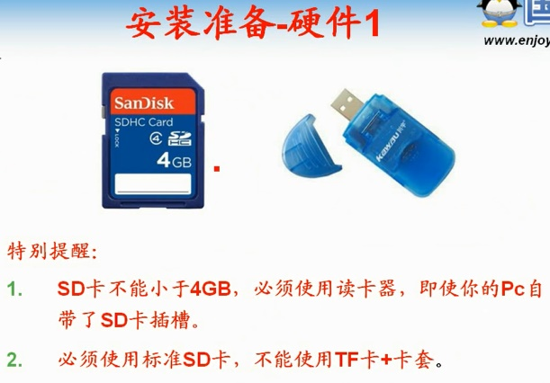

      串口连接COM0，启动模式选择SDBOOT

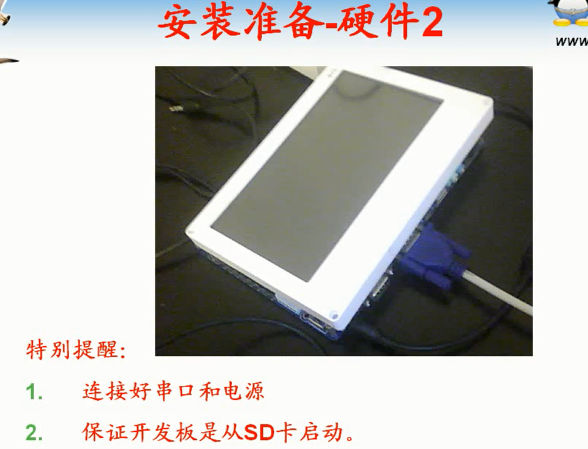


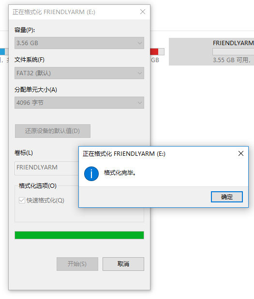

      开发光盘中SD Flasher工具
          先SCAN一下，扫描到SD看，如果Aviailable为No，点击ReLayout！然后在Scan一下即可变成Yes

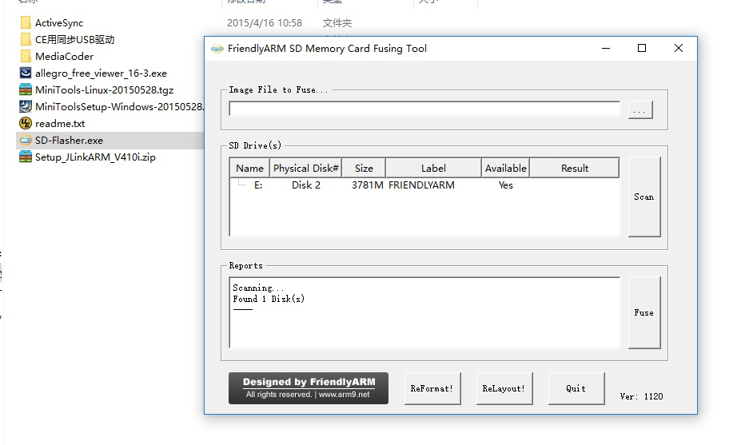

      SD Flasher烧写Superboot.bin(光盘中找)


      烧写成功提示

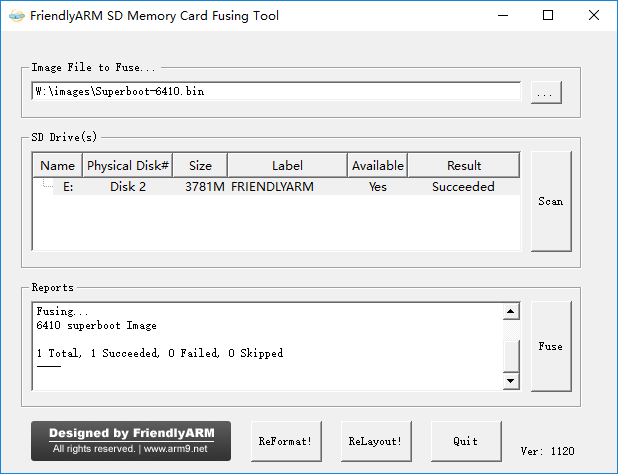

      将SD卡插入开发板，设定SDBOOT，串口连接COM0,可以看到输出

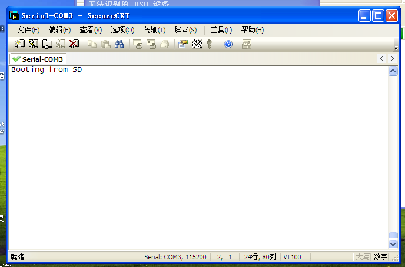

      这个输出绝对是个坑,博客找答案http://www.arm9home.net/read.php?tid=83607/

百度博客上找，不得行也
```
楼主和我遇到的情况一样啊！我觉得应该是superboot的问题。我是这样解决的：在刷机的时候images文件夹里面的bootloader不要用Superboot-6410.bin，用u-boot_nand-ram256.bin，然后在FriendlyARM.ini文件中做相应的配置，即，把Linux-BootLoader = Superboot-6410.bin
改为Linux-BootLoader = u-boot_nand-ram256.bin。然后将SD卡插到开发板，将开关拨到SD启动。等刷完系统后将开关拨到Nand启动，此时在超级终端或putty中3秒之内按下回车键，就会进入到BIOS菜单！
希望能解决你的问题！
```

谷歌一艘，好到github仓库，发现可以用的。哦也。

      但是，老子的开发板就是不能用。后来还发现，人家都是2GB NandFlash，我的才1GB。无良卖家。。可怕，所以友善唧唧了。。你们那，素质呀，人品呀。。败光了都。。好奇哟~~
      在这上面找到可以用的https://github.com/SeanXP/ARM-Tiny6410


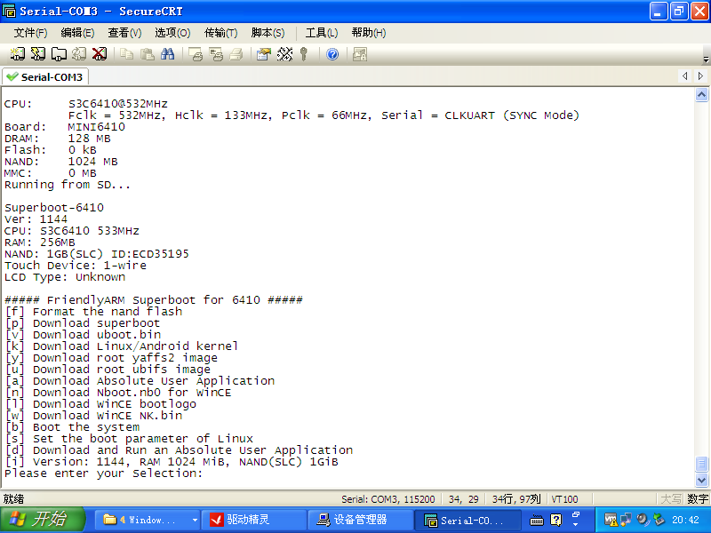

      很明显1GB的256MB内存还得单独找Superboot。光盘里给的不对。


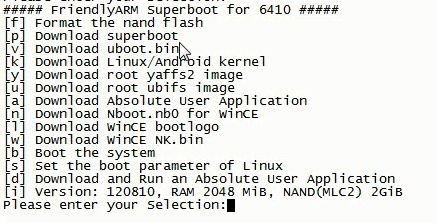
