# 第19课-安装Linux到开发板

* 安装嵌入式Linux系统到开发板

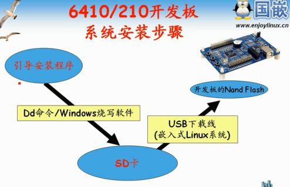

      如何使用USB下载线安装系统

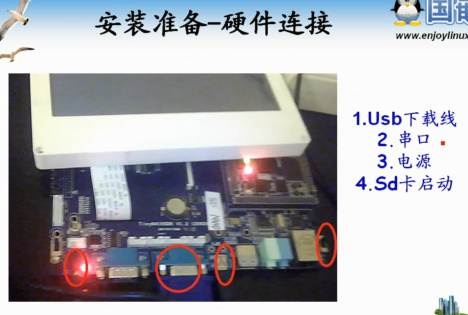

      系统是安装到NandFlash的，还是分三步骤
        bootloader
        内核
        文件系统
      首先格式化NandFlash

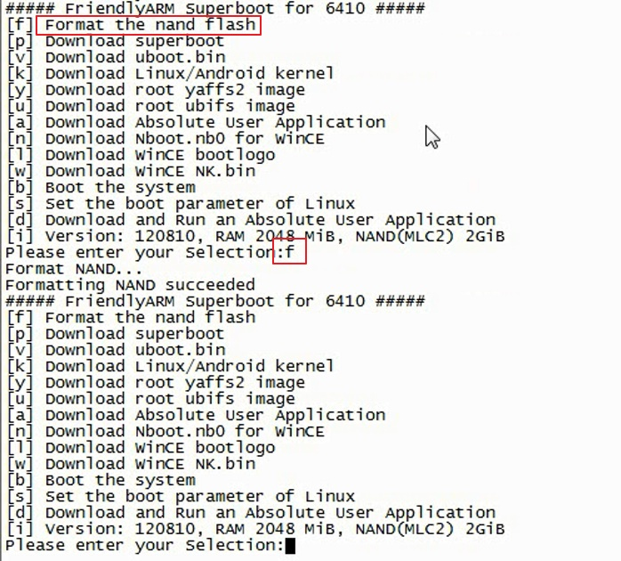

      需要安装superboot到NandFlash

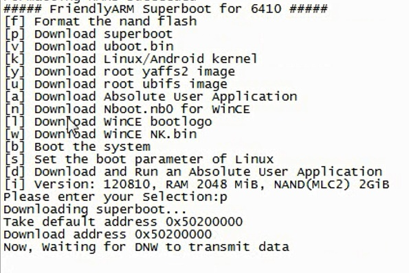


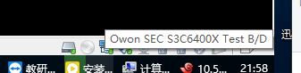

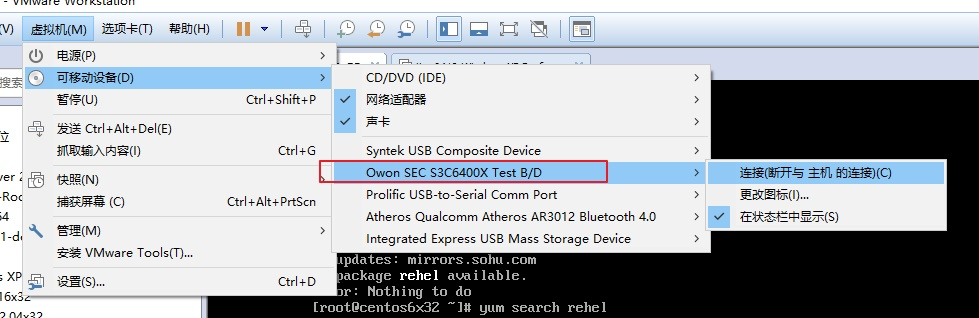

      根据测试发现，上面操作压根儿跑不起。。
      博客谈到的问题跟我一模一样，都是比较新的板子，比较新的光盘
      提供的Superboot不是这么用的哦~
      光盘提供的内容并不支持视频中的操作
      基本都搞成minitools的形式，通过usb接口刷，好比安卓刷机一样。
      光盘提供的superboot就是配套minitools使用
      具体操作查看光盘的操作手册，里面讲的也就minitools使用，并没有把
      bootloader，kernelImage，filesystem分开刷的步骤

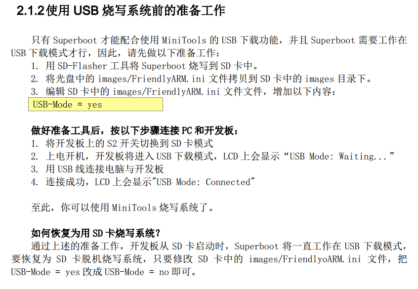

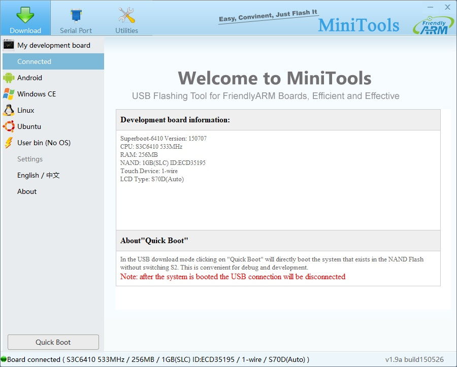

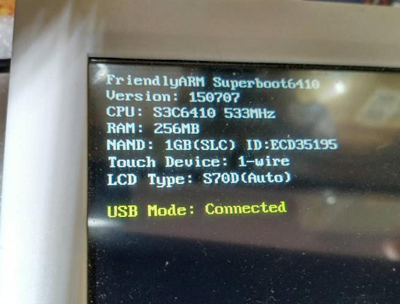

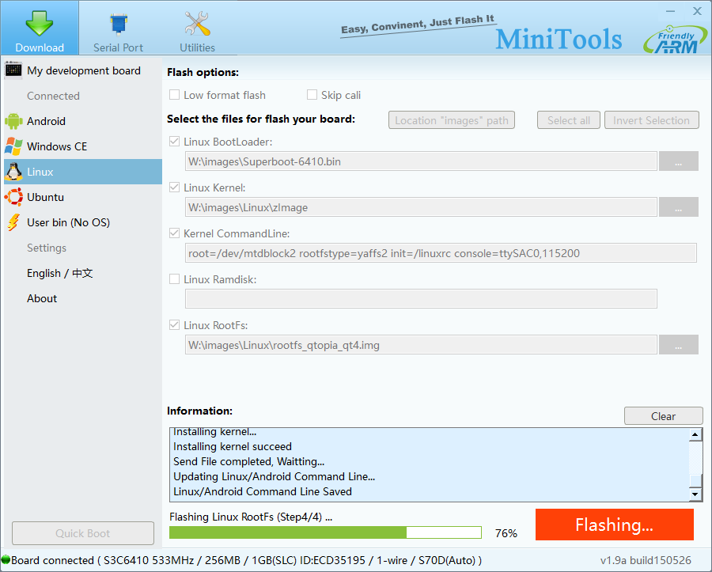


      刷机完成后，拨动启动开关到NandFlash，就可以进入Linux系统了

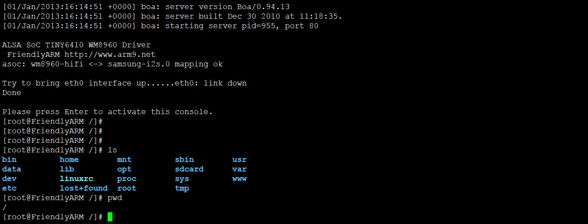

      光盘中还提供了其他快速刷机的办法，无非是修改FriendlyARM.ini配置
      说明Superboot已经做得很智能了，可以识别文件系统，识别硬件，读取配置。。尴尬的是不开源
      配置文件里面已经把各种镜像种类配置好了，可能只需要改安装的系统类型了

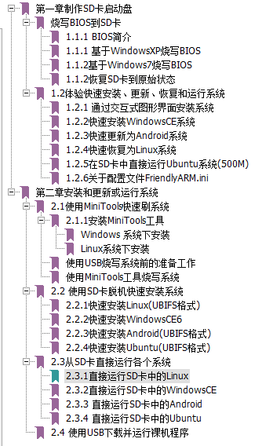

* FriendlyARM.ini配置内容

```
#This line cannot be removed. by FriendlyARM(www.arm9.net)

LCD-Type = S70

CheckOneButton=No
Action=install
OS= Linux

VerifyNandWrite=No

StatusType = Beeper| LED

#################### Linux #####################
Linux-BootLoader = Superboot-6410.bin
Linux-Kernel = Linux/zImage
Linux-CommandLine = root=/dev/mtdblock2 rootfstype=yaffs2 init=/linuxrc console=ttySAC0,115200 skipcali=yes ctp=2
Linux-RootFs-InstallImage = Linux/rootfs_qtopia_qt4.img
Linux-RootFs-RunImage = Linux/rootfs_qtopia_qt4.ext3

################### Android ####################
Android-BootLoader = Superboot-6410.bin
Android-Kernel = Android/azImage
Android-CommandLine = root=/dev/mtdblock2 rootfstype=yaffs2 init=/linuxrc console=ttySAC0,115200 androidboot.console=s3c2410_serial0 skipcali=yes ctp=2
Android-RootFs-InstallImage = Android/rootfs_android.img
Android-RootFs-RunImage = Android/rootfs_android.ext3

################### WindowsCE6 #################
WindowsCE6-Bootloader= Superboot-6410.bin
WindowsCE6-BootLogo = WindowsCE6\bootlogo.bmp
WindowsCE6-InstallImage = WindowsCE6\NK-i.bin
WindowsCE6-RunImage = WindowsCE6\NK-i.bin

#################### Ubuntu #####################
Ubuntu-BootLoader = Superboot-6410.bin
Ubuntu-Kernel = Ubuntu/uzImage
Ubuntu-CommandLine = root=ubi0:FriendlyARM-root ubi.mtd=2 rootfstype=ubifs  init=/linuxrc console=ttySAC0,115200 skipcali=yes ctp=2
Ubuntu-RootFs-InstallImage = Ubuntu/rootfs_ubuntu-slc.ubi
Ubuntu-RootFs-RunImage = Ubuntu/rootfs_ubuntu.ext3

############### UserBin #################
UserBin-Image=WindowsCE/NK-i.nb0
userBin-StartAddress=50100000

```

    进入QT图形化界面，难看有莫有。。实用就好了，有本事自己写一个

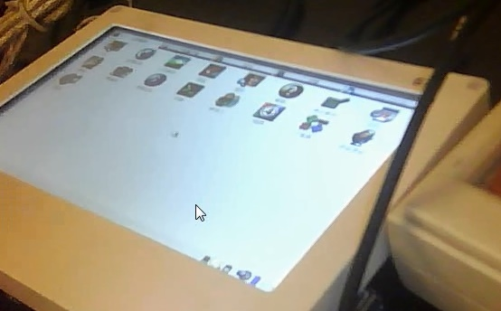

    修改配置，快速安装

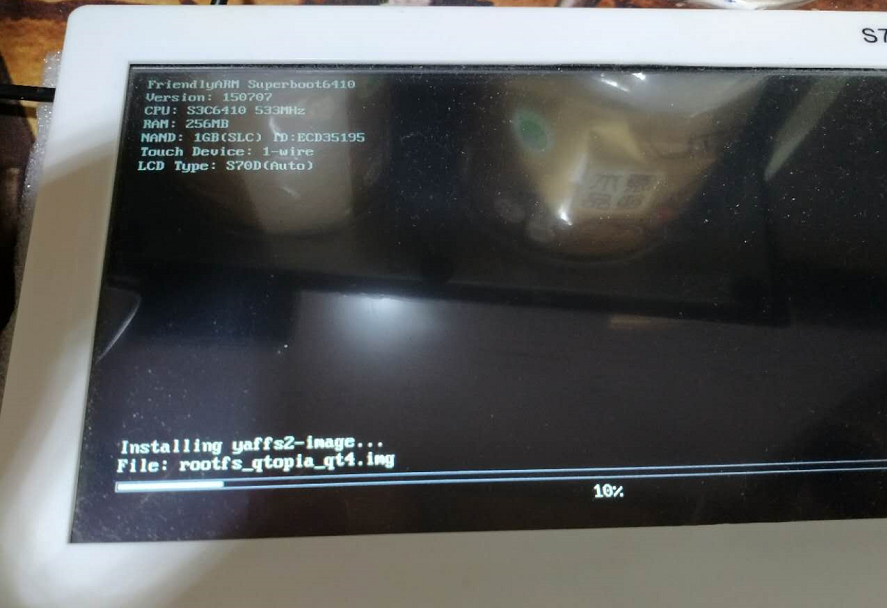

```
Booting from SD

Superboot6410
Ver: 150707
CPU: S3C6410 533MHz
RAM: 256MB
NAND: 1GB(SLC) ID:ECD35195
Touch Device: 1-wire
LCD Type: S70D(Auto)

Installing OS 'LINUX'
Installing bootloader...
file: /images/Superboot-6410.bin: 264 KB(270336 Byte)
Installing bootloader succeed
Installing kernel...
file: /images/Linux/zImage: 3 MB(3758808 Byte)
Installing kernel succeed
Installing yaffs2-image...
file: /images/Linux/rootfs_qtopia_qt4.img: 240 MB(251889792 Byte)
Installing yaffs2-image succeed
OS 'LINUX' Installed
```

    贴上冗长的启动过程

```
Booting from NAND

Superboot6410 V150707
Load Kernel...
Uncompressing Linux... done, booting the kernel.
Initializing cgroup subsys cpu
Linux version 2.6.38-FriendlyARM (fa@fa) (gcc version 4.5.1 (ctng-1.8.1-FA) ) #1 PREEMPT Wed Jul 8 14:41:36 CST 2015
CPU: ARMv6-compatible processor [410fb766] revision 6 (ARMv7), cr=00c5387f
CPU: VIPT nonaliasing data cache, VIPT nonaliasing instruction cache
Machine: MINI6410
MINI6410: S70D selected
Memory policy: ECC disabled, Data cache writeback
CPU S3C6410 (id 0x36410101)
S3C24XX Clocks, Copyright 2004 Simtec Electronics
camera: no parent clock specified
S3C64XX: PLL settings, A=532000000, M=266000000, E=84666666
S3C64XX: HCLK2=266000000, HCLK=133000000, PCLK=66500000
mout_apll: source is fout_apll (1), rate is 532000000
mout_epll: source is epll (1), rate is 84666666
mout_mpll: source is mpll (1), rate is 266000000
mmc_bus: source is mout_epll (0), rate is 84666666
mmc_bus: source is mout_epll (0), rate is 84666666
mmc_bus: source is mout_epll (0), rate is 84666666
usb-bus-host: source is clk_48m (0), rate is 48000000
uclk1: source is mout_epll (0), rate is 84666666
spi-bus: source is mout_epll (0), rate is 84666666
spi-bus: source is mout_epll (0), rate is 84666666
audio-bus: source is mout_epll (0), rate is 84666666
audio-bus: source is mout_epll (0), rate is 84666666
audio-bus: source is mout_epll (0), rate is 84666666
irda-bus: source is mout_epll (0), rate is 84666666
camera: no parent clock specified
s3c64xx: 10485760 bytes SDRAM reserved for fimc at 0x5f5f8000
s3c64xx: 8388608 bytes SDRAM reserved for pp at 0x5edf8000
s3c64xx: 8388608 bytes SDRAM reserved for tv at 0x5e5f8000
s3c64xx: 6291456 bytes SDRAM reserved for mfc at 0x5dff8000
s3c64xx: 4194304 bytes SDRAM reserved for jpeg at 0x5dbf8000
Built 1 zonelists in Zone order, mobility grouping on.  Total pages: 65024
Kernel command line: root=/dev/mtdblock2 rootfstype=yaffs2 init=/linuxrc console=ttySAC0,115200 lcd=S70D
PID hash table entries: 1024 (order: 0, 4096 bytes)
Dentry cache hash table entries: 32768 (order: 5, 131072 bytes)
Inode-cache hash table entries: 16384 (order: 4, 65536 bytes)
Memory: 256MB = 256MB total
Memory: 215180k/215180k available, 46964k reserved, 0K highmem
Virtual kernel memory layout:
    vector  : 0xffff0000 - 0xffff1000   (   4 kB)
    fixmap  : 0xfff00000 - 0xfffe0000   ( 896 kB)
    DMA     : 0xff000000 - 0xffe00000   (  14 MB)
    vmalloc : 0xd0800000 - 0xf6000000   ( 600 MB)
    lowmem  : 0xc0000000 - 0xd0000000   ( 256 MB)
    modules : 0xbf000000 - 0xc0000000   (  16 MB)
      .init : 0xc0008000 - 0xc0168000   (1408 kB)
      .text : 0xc0168000 - 0xc0714c80   (5812 kB)
      .data : 0xc0716000 - 0xc075a540   ( 274 kB)
SLUB: Genslabs=13, HWalign=32, Order=0-3, MinObjects=0, CPUs=1, Nodes=1
Preemptable hierarchical RCU implementation.
	RCU-based detection of stalled CPUs is disabled.
	Verbose stalled-CPUs detection is disabled.
NR_IRQS:246
VIC @f6000000: id 0x00041192, vendor 0x41
VIC @f6010000: id 0x00041192, vendor 0x41
Console: colour dummy device 80x30
console [ttySAC0] enabled
Calibrating delay loop... 530.84 BogoMIPS (lpj=2654208)
pid_max: default: 32768 minimum: 301
Mount-cache hash table entries: 512
CPU: Testing write buffer coherency: ok
NET: Registered protocol family 16
s3c64xx_dma_init: Registering DMA channels
PL080: IRQ 73, at d0808000, channels 0..8
PL080: IRQ 74, at d080c000, channels 8..16
S3C6410: Initialising architecture
bio: create slab <bio-0> at 0
SCSI subsystem initialized
usbcore: registered new interface driver usbfs
usbcore: registered new interface driver hub
usbcore: registered new device driver usb
s3c-i2c s3c2440-i2c: slave address 0x10
s3c-i2c s3c2440-i2c: bus frequency set to 64 KHz
s3c-i2c s3c2440-i2c: i2c-0: S3C I2C adapter
Advanced Linux Sound Architecture Driver Version 1.0.23.
NET: Registered protocol family 2
IP route cache hash table entries: 2048 (order: 1, 8192 bytes)
TCP established hash table entries: 8192 (order: 4, 65536 bytes)
TCP bind hash table entries: 8192 (order: 5, 163840 bytes)
TCP: Hash tables configured (established 8192 bind 8192)
TCP reno registered
UDP hash table entries: 128 (order: 0, 6144 bytes)
UDP-Lite hash table entries: 128 (order: 0, 6144 bytes)
NET: Registered protocol family 1
RPC: Registered udp transport module.
RPC: Registered tcp transport module.
RPC: Registered tcp NFSv4.1 backchannel transport module.
NetWinder Floating Point Emulator V0.97 (double precision)
squashfs: version 4.0 (2009/01/31) Phillip Lougher
msgmni has been set to 420
io scheduler noop registered (default)
io scheduler cfq registered
S3C_LCD clock got enabled :: 133.000 Mhz
LCD TYPE :: Mini6410 will be initialized
Window[0] - FB1: map_video_memory: clear ff000000:00177000
            FB1: map_video_memory: dma=5cc00000 cpu=ff000000 size=00177000
Window[0] - FB2: map_video_memory: clear ff0bb800:000bb800
            FB2: map_video_memory: dma=5ccbb800 cpu=ff0bb800 size=000bb800
Console: switching to colour frame buffer device 100x30
fb0: s3cfb frame buffer device
Window[1] - FB1: map_video_memory: clear ff200000:00177000
            FB1: map_video_memory: dma=5ce00000 cpu=ff200000 size=00177000
Window[1] - FB2: map_video_memory: clear ff2bb800:000bb800
            FB2: map_video_memory: dma=5cebb800 cpu=ff2bb800 size=000bb800
fb1: s3cfb frame buffer device
Window[2] - FB1: map_video_memory: clear ff400000:000bb800
            FB1: map_video_memory: dma=5c800000 cpu=ff400000 size=000bb800
fb2: s3cfb frame buffer device
Window[3] - FB1: map_video_memory: clear ff500000:000bb800
            FB1: map_video_memory: dma=5c900000 cpu=ff500000 size=000bb800
fb3: s3cfb frame buffer device
backlight	initialized
s3c6400-uart.0: ttySAC0 at MMIO 0x7f005000 (irq = 16) is a S3C6400/10
s3c6400-uart.1: ttySAC1 at MMIO 0x7f005400 (irq = 20) is a S3C6400/10
s3c6400-uart.2: ttySAC2 at MMIO 0x7f005800 (irq = 24) is a S3C6400/10
s3c6400-uart.3: ttySAC3 at MMIO 0x7f005c00 (irq = 28) is a S3C6400/10
leds	initialized
buttons	initialized
pwm	initialized
adc	initialized
loop: module loaded
S3C NAND Driver, (c) 2008 Samsung Electronics
S3C NAND Driver is using hardware ECC.
NAND device: Manufacturer ID: 0xec, Chip ID: 0xd3 (Samsung NAND 1GiB 3,3V 8-bit)
Creating 3 MTD partitions on "NAND 1GiB 3,3V 8-bit":
0x000000000000-0x000000080000 : "Bootloader"
0x000000080000-0x000000580000 : "Kernel"
0x000000580000-0x000040000000 : "File System"
PPP generic driver version 2.4.2
PPP Deflate Compression module registered
PPP BSD Compression module registered
PPP MPPE Compression module registered
NET: Registered protocol family 24
dm9000 Ethernet Driver, V1.31
eth0: dm9000a at d081e000,d0c00004 IRQ 108 MAC: 08:90:00:a0:90:90 (platform data)
ohci_hcd: USB 1.1 'Open' Host Controller (OHCI) Driver
s3c2410-ohci s3c2410-ohci: S3C24XX OHCI
s3c2410-ohci s3c2410-ohci: new USB bus registered, assigned bus number 1
s3c2410-ohci s3c2410-ohci: irq 79, io mem 0x74300000
usb usb1: New USB device found, idVendor=1d6b, idProduct=0001
usb usb1: New USB device strings: Mfr=3, Product=2, SerialNumber=1
usb usb1: Product: S3C24XX OHCI
usb usb1: Manufacturer: Linux 2.6.38-FriendlyARM ohci_hcd
usb usb1: SerialNumber: s3c24xx
hub 1-0:1.0: USB hub found
hub 1-0:1.0: 2 ports detected
usbcore: registered new interface driver usbserial
USB Serial support registered for generic
usbcore: registered new interface driver usbserial_generic
usbserial: USB Serial Driver core
USB Serial support registered for GSM modem (1-port)
usbcore: registered new interface driver option
option: v0.7.2:USB Driver for GSM modems
USB Serial support registered for aircable
usbcore: registered new interface driver aircable
USB Serial support registered for ark3116
usbcore: registered new interface driver ark3116
ark3116:v0.6:USB ARK3116 serial/IrDA driver
USB Serial support registered for Belkin / Peracom / GoHubs USB Serial Adapter
usbcore: registered new interface driver belkin
belkin_sa: v1.3:USB Belkin Serial converter driver
USB Serial support registered for ch341-uart
usbcore: registered new interface driver ch341
USB Serial support registered for cp210x
usbcore: registered new interface driver cp210x
cp210x: v0.09:Silicon Labs CP210x RS232 serial adaptor driver
USB Serial support registered for Reiner SCT Cyberjack USB card reader
usbcore: registered new interface driver cyberjack
cyberjack: v1.01 Matthias Bruestle
cyberjack: REINER SCT cyberJack pinpad/e-com USB Chipcard Reader Driver
USB Serial support registered for DeLorme Earthmate USB
USB Serial support registered for HID->COM RS232 Adapter
USB Serial support registered for Nokia CA-42 V2 Adapter
usbcore: registered new interface driver cypress
cypress_m8: v1.10:Cypress USB to Serial Driver
USB Serial support registered for debug
usbcore: registered new interface driver debug
USB Serial support registered for Digi 2 port USB adapter
USB Serial support registered for Digi 4 port USB adapter
usbcore: registered new interface driver digi_acceleport
digi_acceleport: v1.80.1.2:Digi AccelePort USB-2/USB-4 Serial Converter driver
USB Serial support registered for Edgeport 2 port adapter
USB Serial support registered for Edgeport 4 port adapter
USB Serial support registered for Edgeport 8 port adapter
USB Serial support registered for EPiC device
usbcore: registered new interface driver io_edgeport
io_edgeport: v2.7:Edgeport USB Serial Driver
USB Serial support registered for Edgeport TI 1 port adapter
USB Serial support registered for Edgeport TI 2 port adapter
usbcore: registered new interface driver io_ti
io_ti: v0.7mode043006:Edgeport USB Serial Driver
USB Serial support registered for empeg
usbcore: registered new interface driver empeg
empeg: v1.3:USB Empeg Mark I/II Driver
USB Serial support registered for FTDI USB Serial Device
usbcore: registered new interface driver ftdi_sio
ftdi_sio: v1.6.0:USB FTDI Serial Converters Driver
USB Serial support registered for funsoft
usbcore: registered new interface driver funsoft
USB Serial support registered for Garmin GPS usb/tty
usbcore: registered new interface driver garmin_gps
garmin_gps: v0.33:garmin gps driver
USB Serial support registered for hp4X
usbcore: registered new interface driver hp4X
hp4x: v1.00:HP4x (48/49) Generic Serial driver
USB Serial support registered for PocketPC PDA
usbcore: registered new interface driver ipaq
ipaq: v1.0:USB PocketPC PDA driver
USB Serial support registered for IPWireless converter
usbcore: registered new interface driver ipwtty
ipw: v0.4:IPWireless tty driver
USB Serial support registered for IR Dongle
usbcore: registered new interface driver ir-usb
ir_usb: v0.5:USB IR Dongle driver
USB Serial support registered for iuu_phoenix
usbcore: registered new interface driver iuu_phoenix
iuu_phoenix: v0.12:Infinity USB Unlimited Phoenix driver
USB Serial support registered for Keyspan - (without firmware)
USB Serial support registered for Keyspan 1 port adapter
USB Serial support registered for Keyspan 2 port adapter
USB Serial support registered for Keyspan 4 port adapter
usb 1-1: new full speed USB device using s3c2410-ohci and address 2
usbcore: registered new interface driver keyspan
keyspan: v1.1.5:Keyspan USB to Serial Converter Driver
USB Serial support registered for Keyspan PDA
USB Serial support registered for Keyspan PDA - (prerenumeration)
USB Serial support registered for Xircom / Entregra PGS - (prerenumeration)
usbcore: registered new interface driver keyspan_pda
keyspan_pda: v1.1:USB Keyspan PDA Converter driver
USB Serial support registered for KL5KUSB105D / PalmConnect
usbcore: registered new interface driver kl5kusb105d
kl5kusb105: v0.4:KLSI KL5KUSB105 chipset USB->Serial Converter driver
USB Serial support registered for KOBIL USB smart card terminal
usbcore: registered new interface driver kobil
kobil_sct: 21/05/2004:KOBIL USB Smart Card Terminal Driver (experimental)
USB Serial support registered for MCT U232
usbcore: registered new interface driver mct_u232
mct_u232: z2.1:Magic Control Technology USB-RS232 converter driver
USB Serial support registered for Moschip 2 port adapter
mos7720: 2.1:Moschip USB Serial Driver
usbcore: registered new interface driver moschip7720
USB Serial support registered for Moschip 7840/7820 USB Serial Driver
mos7840: 1.3.2:Moschip 7840/7820 USB Serial Driver
usbcore: registered new interface driver mos7840
USB Serial support registered for moto-modem
usbcore: registered new interface driver moto-modem
USB Serial support registered for navman
usbcore: registered new interface driver navman
USB Serial support registered for ZyXEL - omni.net lcd plus usb
usbcore: registered new interface driver omninet
omninet: v1.1:USB ZyXEL omni.net LCD PLUS Driver
USB Serial support registered for opticon
usbcore: registered new interface driver opticon
USB Serial support registered for oti6858
usbcore: registered new interface driver oti6858
USB Serial support registered for pl2303
usbcore: registered new interface driver pl2303
pl2303: Prolific PL2303 USB to serial adaptor driver
USB Serial support registered for qcaux
usbcore: registered new interface driver qcaux
USB Serial support registered for Qualcomm USB modem
usbcore: registered new interface driver qcserial
safe_serial: v0.1:USB Safe Encapsulated Serial
usb 1-1: New USB device found, idVendor=1a40, idProduct=0101
USB Serial support registered for safe_serial
usbcore: registered new interface driver safe_serial
usb 1-1: New USB device strings: Mfr=0, Product=1, SerialNumber=0
usb 1-1: Product: USB 2.0 Hub
USB Serial support registered for sam-ba
usbcore: registered new interface driver sam-ba
sam_ba: v1.0: Atmel SAM Boot Assistant (SAM-BA) driver
hub 1-1:1.0: USB hub found
hub 1-1:1.0: 4 ports detected
USB Serial support registered for siemens_mpi
usbcore: registered new interface driver siemens_mpi
Driver for Siemens USB/MPI adapter
Version 0.1 09/26/2005 Thomas Hergenhahn@web.de http://libnodave.sf.net
USB Serial support registered for Sierra USB modem
usbcore: registered new interface driver sierra
sierra: v.1.7.16:USB Driver for Sierra Wireless USB modems
USB Serial support registered for SPCP8x5
usbcore: registered new interface driver spcp8x5
spcp8x5: v0.10:SPCP8x5 USB to serial adaptor driver
USB Serial support registered for Quatech SSU-100 USB to Serial Driver
usbcore: registered new interface driver ssu100
ssu100: v0.1:Quatech SSU-100 USB to Serial Driver
USB Serial support registered for symbol
usbcore: registered new interface driver symbol
USB Serial support registered for TI USB 3410 1 port adapter
USB Serial support registered for TI USB 5052 2 port adapter
usbcore: registered new interface driver ti_usb_3410_5052
ti_usb_3410_5052: v0.10:TI USB 3410/5052 Serial Driver
USB Serial support registered for Handspring Visor / Palm OS
USB Serial support registered for Sony Clie 3.5
USB Serial support registered for Sony Clie 5.0
usbcore: registered new interface driver visor
visor: USB HandSpring Visor / Palm OS driver
USB Serial support registered for Connect Tech - WhiteHEAT - (prerenumeration)
USB Serial support registered for Connect Tech - WhiteHEAT
usbcore: registered new interface driver whiteheat
whiteheat: v2.0:USB ConnectTech WhiteHEAT driver
USB Serial support registered for vivopay-serial
usbcore: registered new interface driver vivopay-serial
vivopay_serial: v1.0:ViVOpay USB Serial Driver
USB Serial support registered for zio
usbcore: registered new interface driver zio
Initializing USB Mass Storage driver...
usbcore: registered new interface driver usb-storage
USB Mass Storage support registered.
s3c-hsotg s3c-hsotg: regs d0840000, irq 90
s3c-hsotg s3c-hsotg: s3c_hsotg_corereset: reset failed, GRSTCTL=80000001
s3c-hsotg s3c-hsotg: GRXFSIZ=0x00001800, GNPTXFSIZ=0x18001800
s3c-hsotg s3c-hsotg: shared fifos
s3c-hsotg s3c-hsotg: cannot create debug root
s3c-hsotg s3c-hsotg: DCFG=0x00200000, DCTL=0x00000002, DIEPMSK=0000000f
s3c-hsotg s3c-hsotg: GAHBCFG=0x00000000, 0x44=0x00000000
s3c-hsotg s3c-hsotg: GRXFSIZ=0x00000800, GNPTXFSIZ=0x04000800
s3c-hsotg s3c-hsotg: DPTx[1] FSize=768, StAddr=0x00000f00
s3c-hsotg s3c-hsotg: DPTx[2] FSize=768, StAddr=0x00001200
s3c-hsotg s3c-hsotg: DPTx[3] FSize=768, StAddr=0x00001500
s3c-hsotg s3c-hsotg: DPTx[4] FSize=768, StAddr=0x00001800
s3c-hsotg s3c-hsotg: DPTx[5] FSize=768, StAddr=0x00001b00
s3c-hsotg s3c-hsotg: DPTx[6] FSize=768, StAddr=0x00001e00
s3c-hsotg s3c-hsotg: DPTx[7] FSize=768, StAddr=0x00002100
s3c-hsotg s3c-hsotg: DPTx[8] FSize=768, StAddr=0x00002400
s3c-hsotg s3c-hsotg: DPTx[9] FSize=768, StAddr=0x00002700
s3c-hsotg s3c-hsotg: DPTx[10] FSize=768, StAddr=0x00002a00
s3c-hsotg s3c-hsotg: DPTx[11] FSize=768, StAddr=0x00002d00
s3c-hsotg s3c-hsotg: DPTx[12] FSize=768, StAddr=0x00003000
s3c-hsotg s3c-hsotg: DPTx[13] FSize=768, StAddr=0x00003300
s3c-hsotg s3c-hsotg: DPTx[14] FSize=768, StAddr=0x00003600
s3c-hsotg s3c-hsotg: DPTx[15] FSize=768, StAddr=0x00003900
s3c-hsotg s3c-hsotg: ep0-in: EPCTL=0x00008000, SIZ=0x00000000, DMA=0x00000000
s3c-hsotg s3c-hsotg: ep0-out: EPCTL=0x00008000, SIZ=0x00000000, DMA=0x00000000
s3c-hsotg s3c-hsotg: ep1-in: EPCTL=0x00000000, SIZ=0x00000000, DMA=0x00000000
s3c-hsotg s3c-hsotg: ep1-out: EPCTL=0x00000000, SIZ=0x00000000, DMA=0x00000000
s3c-hsotg s3c-hsotg: ep2-in: EPCTL=0x00000000, SIZ=0x00000000, DMA=0x00000000
s3c-hsotg s3c-hsotg: ep2-out: EPCTL=0x00000000, SIZ=0x00000000, DMA=0x00000000
s3c-hsotg s3c-hsotg: ep3-in: EPCTL=0x00000000, SIZ=0x00000000, DMA=0x00000000
s3c-hsotg s3c-hsotg: ep3-out: EPCTL=0x00000000, SIZ=0x00000000, DMA=0x00000000
s3c-hsotg s3c-hsotg: ep4-in: EPCTL=0x00000000, SIZ=0x00000000, DMA=0x00000000
s3c-hsotg s3c-hsotg: ep4-out: EPCTL=0x00000000, SIZ=0x00000000, DMA=0x00000000
s3c-hsotg s3c-hsotg: ep5-in: EPCTL=0x00000000, SIZ=0x00000000, DMA=0x00000000
s3c-hsotg s3c-hsotg: ep5-out: EPCTL=0x00000000, SIZ=0x00000000, DMA=0x00000000
s3c-hsotg s3c-hsotg: ep6-in: EPCTL=0x00000000, SIZ=0x00000000, DMA=0x00000000
s3c-hsotg s3c-hsotg: ep6-out: EPCTL=0x00000000, SIZ=0x00000000, DMA=0x00000000
s3c-hsotg s3c-hsotg: ep7-in: EPCTL=0x00000000, SIZ=0x00000000, DMA=0x00000000
s3c-hsotg s3c-hsotg: ep7-out: EPCTL=0x00000000, SIZ=0x00000000, DMA=0x00000000
s3c-hsotg s3c-hsotg: ep8-in: EPCTL=0x00000000, SIZ=0x00000000, DMA=0x00000000
s3c-hsotg s3c-hsotg: ep8-out: EPCTL=0x00000000, SIZ=0x00000000, DMA=0x00000000
s3c-hsotg s3c-hsotg: ep9-in: EPCTL=0x00000000, SIZ=0x00000000, DMA=0x00000000
s3c-hsotg s3c-hsotg: ep9-out: EPCTL=0x00000000, SIZ=0x00000000, DMA=0x00000000
s3c-hsotg s3c-hsotg: ep10-in: EPCTL=0x00000000, SIZ=0x00000000, DMA=0x00000000
s3c-hsotg s3c-hsotg: ep10-out: EPCTL=0x00000000, SIZ=0x00000000, DMA=0x00000000
s3c-hsotg s3c-hsotg: ep11-in: EPCTL=0x00000000, SIZ=0x00000000, DMA=0x00000000
s3c-hsotg s3c-hsotg: ep11-out: EPCTL=0x00000000, SIZ=0x00000000, DMA=0x00000000
s3c-hsotg s3c-hsotg: ep12-in: EPCTL=0x00000000, SIZ=0x00000000, DMA=0x00000000
s3c-hsotg s3c-hsotg: ep12-out: EPCTL=0x00000000, SIZ=0x00000000, DMA=0x00000000
s3c-hsotg s3c-hsotg: ep13-in: EPCTL=0x00000000, SIZ=0x00000000, DMA=0x00000000
s3c-hsotg s3c-hsotg: ep13-out: EPCTL=0x00000000, SIZ=0x00000000, DMA=0x00000000
s3c-hsotg s3c-hsotg: ep14-in: EPCTL=0x00000000, SIZ=0x00000000, DMA=0x00000000
s3c-hsotg s3c-hsotg: ep14-out: EPCTL=0x00000000, SIZ=0x00000000, DMA=0x00000000
s3c-hsotg s3c-hsotg: DVBUSDIS=0x000017d7, DVBUSPULSE=000005b8
mousedev: PS/2 mouse device common for all mice
touchscreen-1wire	initialized
backlight-1wire	initialized
input: TouchScreen Pipe as /devices/virtual/input/input0
ts-if	initialized
S3C24XX RTC, (c) 2004,2006 Simtec Electronics
one_wire_status: 4
s3c-rtc s3c64xx-rtc: rtc disabled, re-enabling
s3c-rtc s3c64xx-rtc: rtc core: registered s3c as rtc0
i2c /dev entries driver
Linux video capture interface: v2.00
i2c-core: driver [tuner] using legacy suspend method
i2c-core: driver [tuner] using legacy resume method
i2c-core: driver [msp3400] using legacy suspend method
i2c-core: driver [msp3400] using legacy resume method
usbcore: registered new interface driver usbvision
one_wire_status: 4
USBVision USB Video Device Driver for Linux : 0.9.10
usbcore: registered new interface driver pvrusb2
pvrusb2: V4L in-tree version:Hauppauge WinTV-PVR-USB2 MPEG2 Encoder/Tuner
pvrusb2: Debug mask is 31 (0x1f)
usbcore: registered new interface driver zr364xx
zr364xx: Zoran 364xx
usbcore: registered new interface driver stkwebcam
pwc: Philips webcam module version 10.0.14 loaded.
pwc: Supports Philips PCA645/646, PCVC675/680/690, PCVC720[40]/730/740/750 & PCVC830/840.
one_wire_status: 4
pwc: Also supports the Askey VC010, various Logitech Quickcams, Samsung MPC-C10 and MPC-C30,
pwc: the Creative WebCam 5 & Pro Ex, SOTEC Afina Eye and Visionite VCS-UC300 and VCS-UM100.
one_wire_status: 4
usbcore: registered new interface driver Philips webcam
gspca: v2.12.0 registered
usbcore: registered new interface driver benq
usbcore: registered new interface driver conex
usbcore: registered new interface driver cpia1
usbcore: registered new interface driver etoms
usbcore: registered new interface driver finepix
usbcore: registered new interface driver jeilinj
usbcore: registered new interface driver konica
one_wire_status: 4
usbcore: registered new interface driver mars
usbcore: registered new interface driver mr97310a
usbcore: registered new interface driver ov519
usbcore: registered new interface driver ov534
usbcore: registered new interface driver ov534_9
usbcore: registered new interface driver pac207
usbcore: registered new interface driver pac7302
usbcore: registered new interface driver pac7311
usbcore: registered new interface driver sn9c2028
one_wire_status: 4
usbcore: registered new interface driver sn9c20x
usbcore: registered new interface driver sonixb
usbcore: registered new interface driver sonixj
usbcore: registered new interface driver spca500
usbcore: registered new interface driver spca501
usbcore: registered new interface driver spca505
usbcore: registered new interface driver spca506
spca506: registered
usbcore: registered new interface driver spca508
usbcore: registered new interface driver spca561
usbcore: registered new interface driver spca1528
usbcore: registered new interface driver sq905
usbcore: registered new interface driver sq905c
usbcore: registered new interface driver sq930x
one_wire_status: 4
usbcore: registered new interface driver sunplus
usbcore: registered new interface driver stk014
usbcore: registered new interface driver stv0680
usbcore: registered new interface driver t613
usbcore: registered new interface driver tv8532
usbcore: registered new interface driver vc032x
usbcore: registered new interface driver xirlink-cit
usbcore: registered new interface driver zc3xx
usbcore: registered new interface driver ALi m5602
one_wire_status: 4
usbcore: registered new interface driver STV06xx
gspca_gl860: driver startup - version 0.9d10
usbcore: registered new interface driver gspca_gl860
usbcore: registered new interface driver hdpvr
usbcore: registered new interface driver s2255
s3c-fimc: controller 0 registered successfully
s3c-fimc: controller 1 registered successfully
FIMC Driver, 2010 ported by FriendlyARM http://www.arm9.net
ov965x: probe
s3c-fimc: i2c transfer error
s3c-fimc: i2c transfer error
s3c-fimc: i2c transfer error
s3c-fimc: i2c transfer error
s3c-fimc: ov965x: Product ID fb:fb Manufacturer ID fb:fb
parent clock for camera: 266.000 MHz, divisor: 11
[CAM]RESET CAM.
one_wire_status: 2
S3C6400 MFC Driver, (c) 2007 Samsung Electronics, 2010 ported by FriendlyARM http://www.arm9.net
 S3C6400 MFC Driver init OK.
S3C PostProcessor Driver v3.12, (c) 2009 Samsung Electronics
S3C6410 TV encoder Driver, (c) 2008 Samsung Electronics
 S3C6410 TV encoder Driver init OK.
S3C6410 TV scaler Driver, (c) 2008 Samsung Electronics
 S3C6410 TV scaler Driver init OK.
S3C Rotator Driver, (c) 2008 Samsung Electronics
s3c_rotator_probe called
one_wire_status: 4
s3c_rotator_probe success
S3C JPEG Driver, (c) 2007 Samsung Electronics
s3c_g2d_probe called
 s3c_g2d_probe Success
 S3C G2D Init : Done
S3C G3D Driver, (c) 2007-2009 Samsung Electronics
s3c_g3d version : 0x1050000
 S3C G3D Init : Done
usbcore: registered new interface driver uvcvideo
USB Video Class driver (v1.0.0)
S3C2410 Watchdog Timer, (c) 2004 Simtec Electronics
s3c2410-wdt s3c2410-wdt: watchdog inactive, reset disabled, irq enabled
one_wire_status: 5
sdhci: Secure Digital Host Controller Interface driver
sdhci: Copyright(c) Pierre Ossman
s3c-sdhci s3c-sdhci.0: clock source 0: hsmmc (133000000 Hz)
s3c-sdhci s3c-sdhci.0: clock source 1: hsmmc (133000000 Hz)
s3c-sdhci s3c-sdhci.0: clock source 2: mmc_bus (84666666 Hz)
mmc0: SDHCI controller on samsung-hsmmc [s3c-sdhci.0] using ADMA
s3c-sdhci s3c-sdhci.1: clock source 0: hsmmc (133000000 Hz)
s3c-sdhci s3c-sdhci.1: clock source 1: hsmmc (133000000 Hz)
one_wire_status: 4
s3c-sdhci s3c-sdhci.1: clock source 2: mmc_bus (84666666 Hz)
mmc1: SDHCI controller on samsung-hsmmc [s3c-sdhci.1] using ADMA
usbcore: registered new interface driver usbhid
usbhid: USB HID core driver
ALSA device list:
  No soundcards found.
TCP cubic registered
NET: Registered protocol family 17
VFP support v0.3: implementor 41 architecture 1 part 20 variant b rev 5
s3c-rtc s3c64xx-rtc: setting system clock to 2013-01-02 00:30:49 UTC (1357086649)
Freeing init memory: 1408K
mmc0: new SDHC card at address e624
yaffs: dev is 32505858 name is "mtdblock2" rw
yaffs: passed flags ""
mmcblk0: mmc0:e624 SD04G 3.69 GiB
 mmcblk0: p1
FAT: utf8 is not a recommended IO charset for FAT filesystems, filesystem will be case sensitive!
fa_cpu_pfn: module license 'Proprietary' taints kernel.
Disabling lock debugging due to kernel taint
FriendlyARM proprietary driver for mini6410 initialized.
[01/Jan/2013:16:30:54 +0000] boa: server version Boa/0.94.13
[01/Jan/2013:16:30:54 +0000] boa: server built Dec 30 2010 at 11:18:35.
[01/Jan/2013:16:30:54 +0000] boa: starting server pid=950, port 80

ALSA SoC TINY6410 WM8960 Driver
 FriendlyARM http://www.arm9.net
asoc: wm8960-hifi <-> samsung-i2s.0 mapping ok

Try to bring eth0 interface up......eth0: link down
Done

Please press Enter to activate this console.
```
