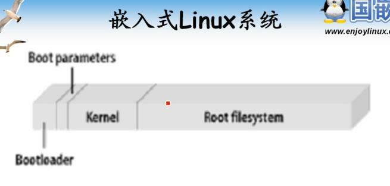
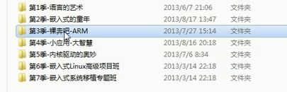

# 第20课-展望未来

培训课程还有几个月时间陪你折腾

      分别对着三个部分进行折腾，三大软件部分
      bootloader：初始化硬件，加载内核镜像，还有个启动参数
      kernel：硬件驱动
      rootfilesystem：应用程序，配置

> 课程预览

      bootloader：安排在第三季 裸奔吧ARM
      rootfilesystem：第四季
      kernel：第五季
