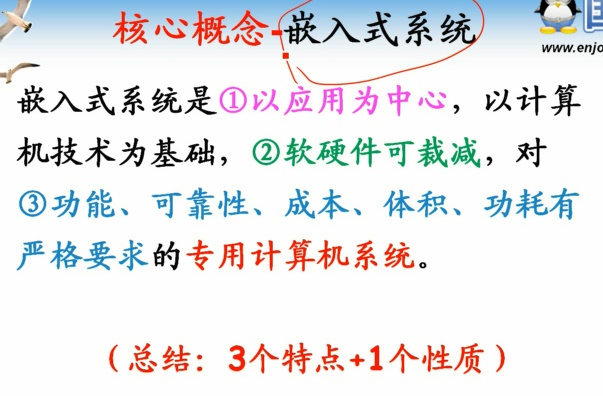
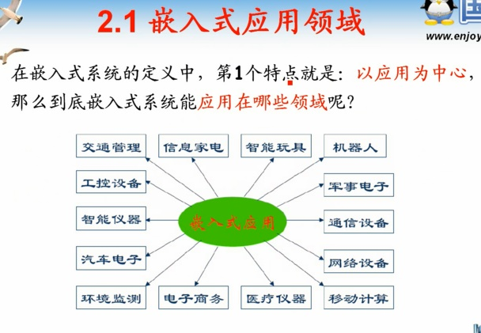
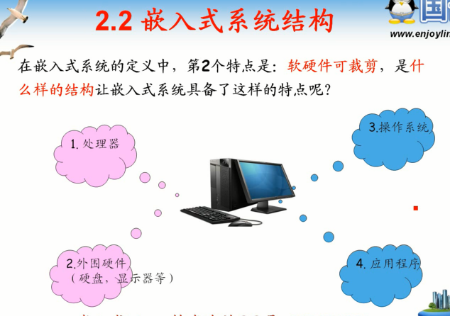
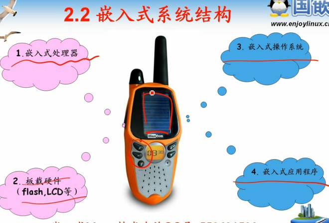
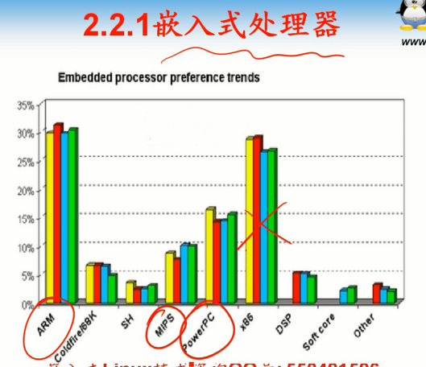
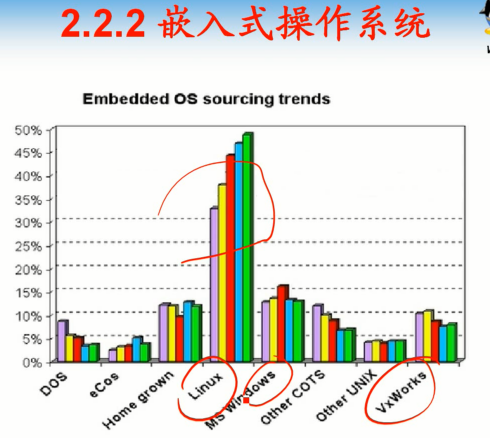
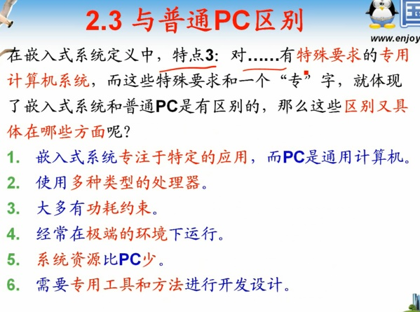

# 第2课-嵌入式系统概述

* 核心概念

      性质：专用计算机系统

* 核心理论

      以应用为中心

* 嵌入式系统结构

      区别于传统PC机
        软硬件可裁剪
        特殊硬件，嵌入式处理器，板载硬件
        嵌入式系统
        嵌入式应用程序

* 嵌入式处理器

* 嵌入式操作系统

      linux一枝独秀

* 嵌入式系统与普通PC的区别

      专用，特殊要求，特殊性能，特殊运行环境，特殊体积功耗

