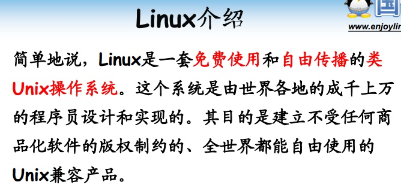
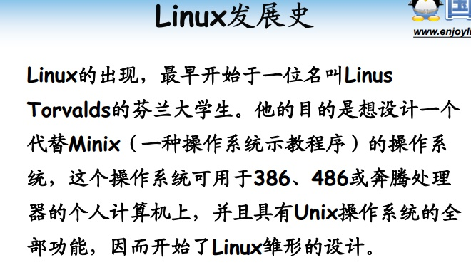
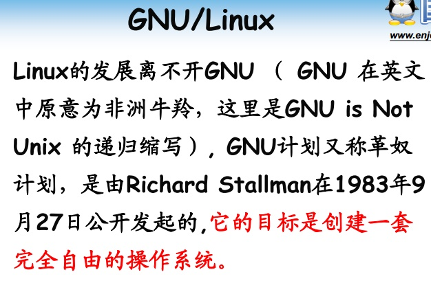
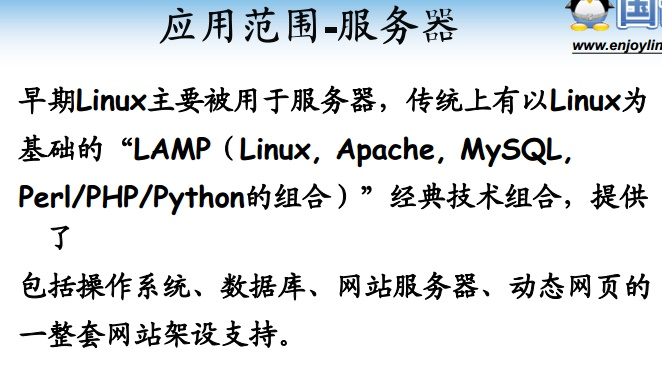
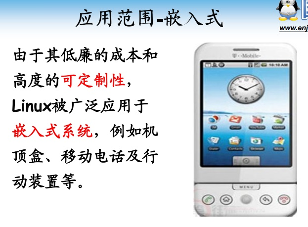
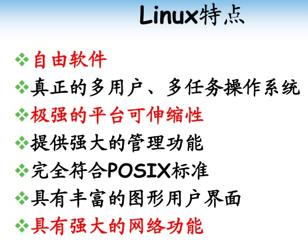
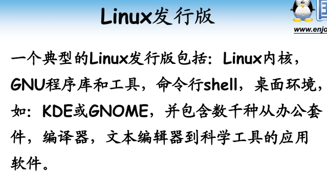

# 第3课-Linux系统概述

* Linux介绍

      免费试用，自由传播

* Linux发展史

      先有UNIX，然后Minix(教学)，然后Linux

* GNU/Linux

* Linux应用范围

      Linux一开始用于服务器，因其高性能可定制的特点用于嵌入式

* Linux特点

      自由，符合标准，扩展性

* Linux发行版

      Linux本身只是内核，发行版增加了很多外围工具
        Redhat/CentOS/Fedora
        Debian/Ubuntu
      课程主要用CentOS6

