# 第5课-Linux快速体验

      图形界面没啥玩的，随便点，Linux主要用命令行界面CLI，终端更高效

* Linux目录

      Linux目录跟Unix很像，符合POSIX
      Linux目录树结构，可以分区，但是都要在根分区下，造成只有一个盘的假象
        boot目录要单独分区，而且分区格式要grub能够识别，因为grub需要从该分区找内核镜像
        Linux一切接文件的反例就是网络设备，网络设备有socket
        每一个用户都有一个家目录，root家是/root，一般家目录在/home下

* Linux终端

      尽量在终端操作，不管是纯字符界面还是GUI GNOME界面

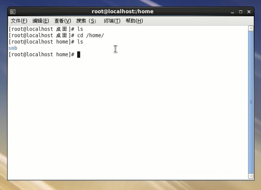

* Linux模式

      不同模式无非是启动的外围工具不同，是否开启图形界面？是否多用户运行？

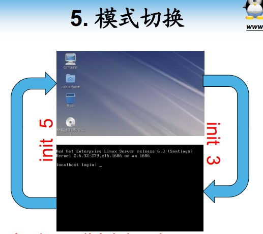

* Linux快捷键

      自动补全不可少，其实还有很多工具，然你输入的时候更快捷

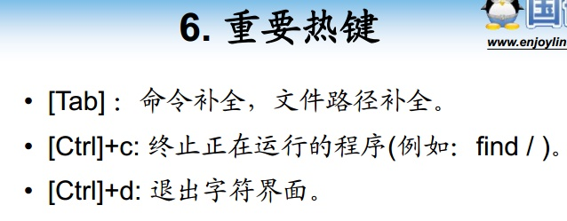

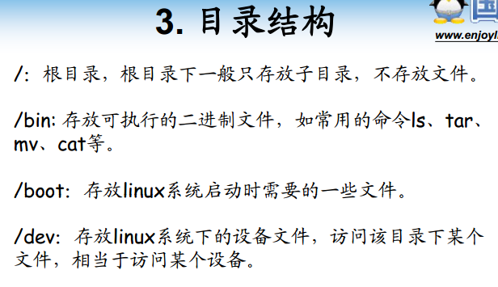

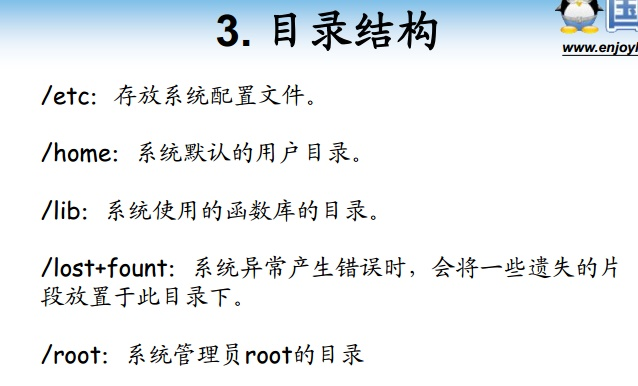

* Linux用户与用户组

      这两个概念相当重要，并且入门不好理解

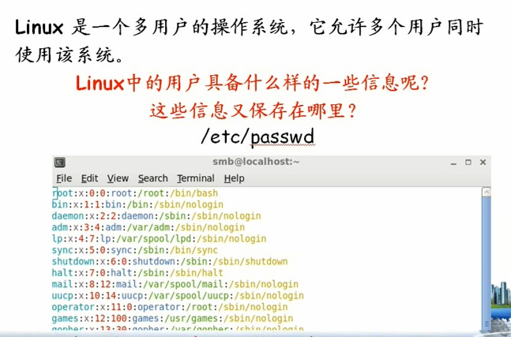

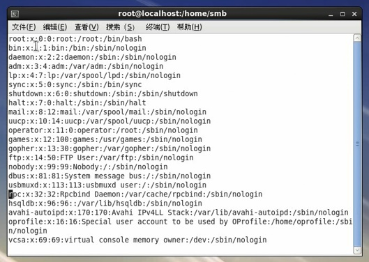

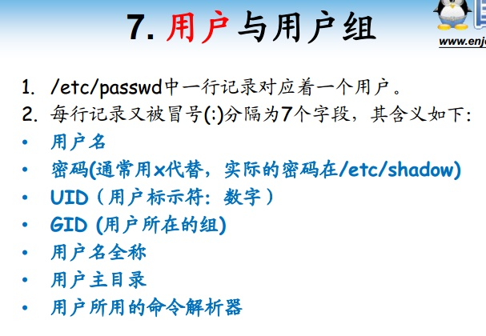

      这七个字段需要背一下，找工作刷题什么的常出现，国内就这么考死记硬背

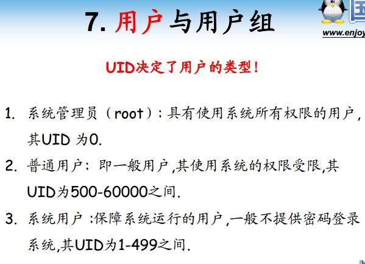

      分组，物以类聚，人以群分，典型的考驾照分C1,C2,C3等

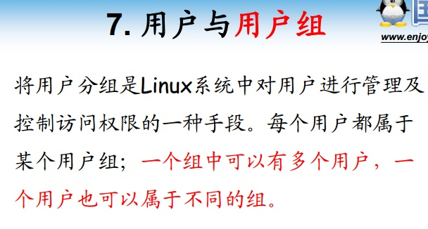

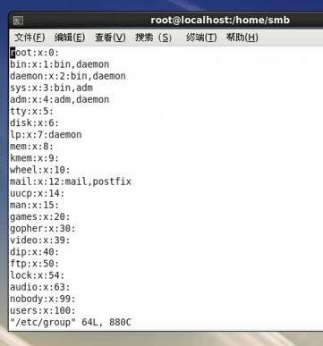

      一般组密码为空。多个成员，每个成员逗号隔开，如果组成员与组名一样就没必要列出来。

* Linux文件属性

      这也是找工作常被问到的内容，每个字段意思
      还有SUID，SGID和SBIT这几个字段，大多数教程都没提，毕竟抽象，让你懵逼让你晕

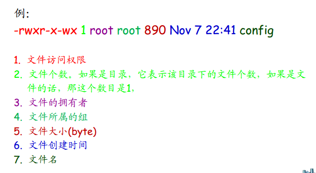

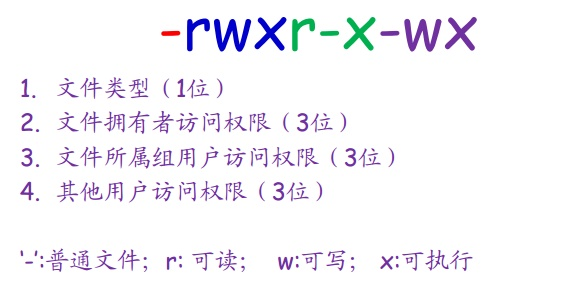
