# 第6课-Linux命令详解

## 用户管理类命令

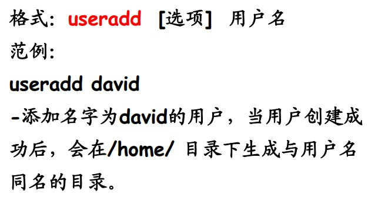

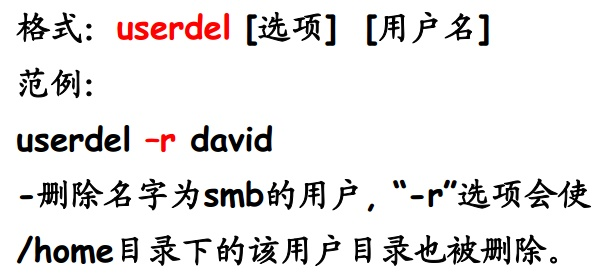

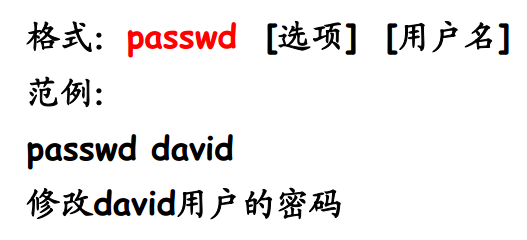

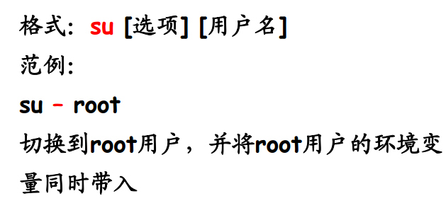

        root用户切换到普通用户不需要密码，反过来就需要密码
        Linux下只有root和非root两大类

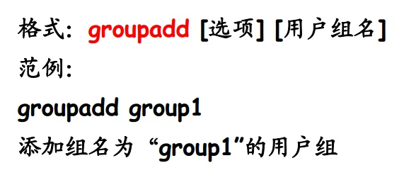

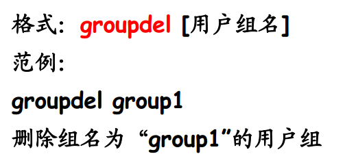

## 文件与目录类命令

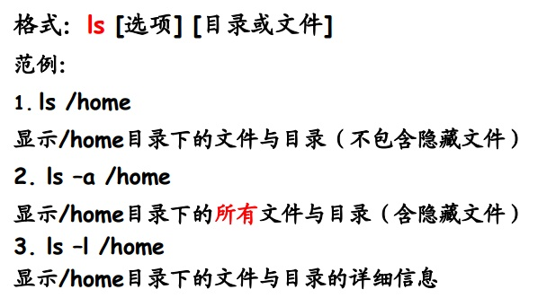

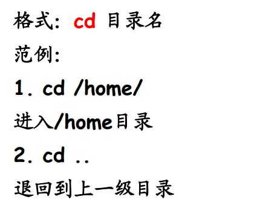

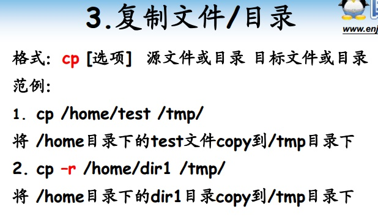

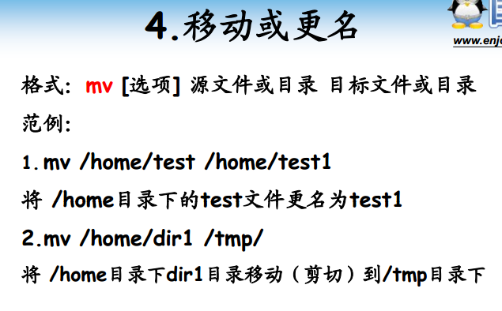

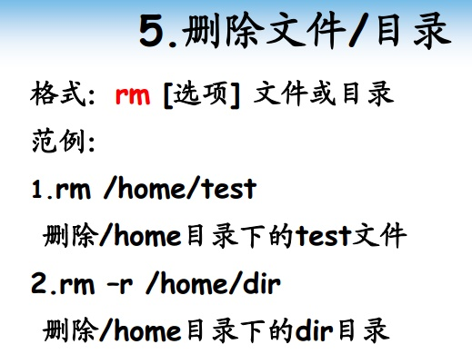

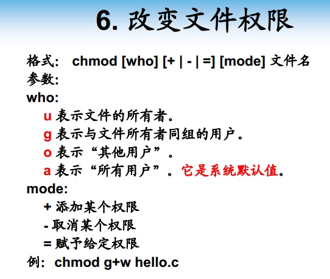

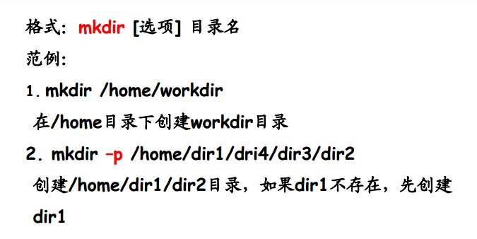

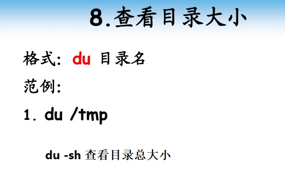

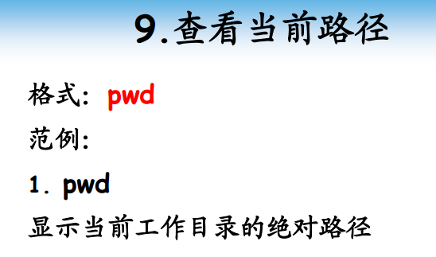

## 压缩打包类命令

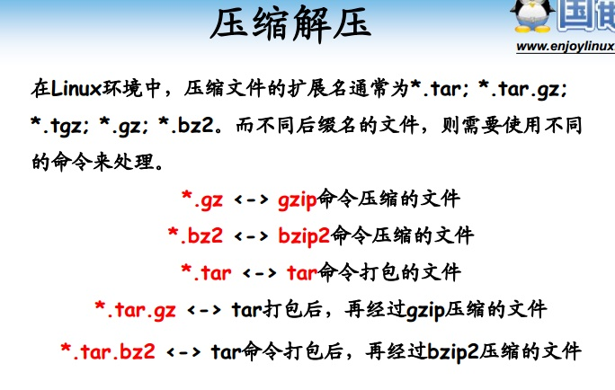

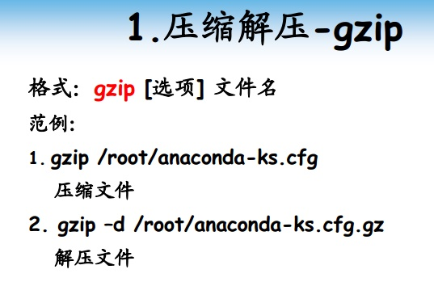

      压缩解压缩操作文件默认不保留，gzip压缩率要高于bzip2，也就是压缩后体积更小

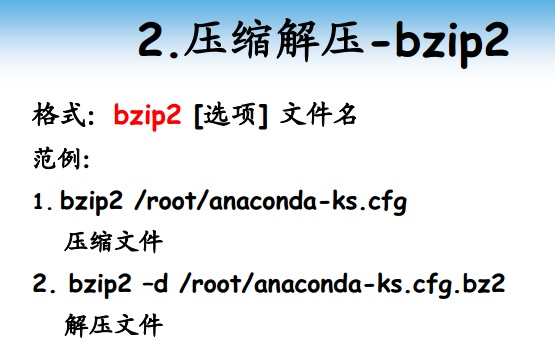

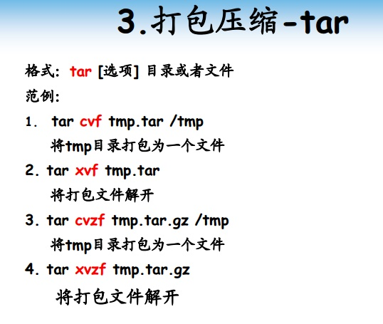

## 磁盘管理类命令

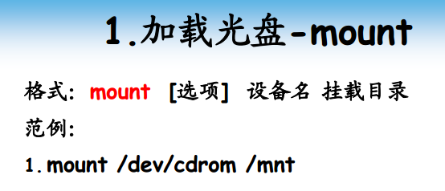

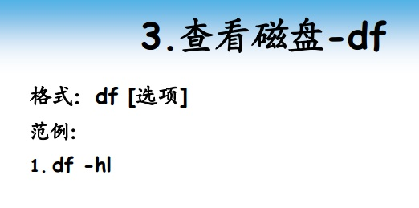

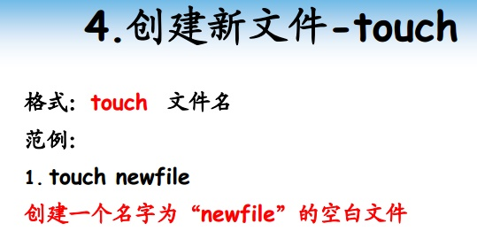

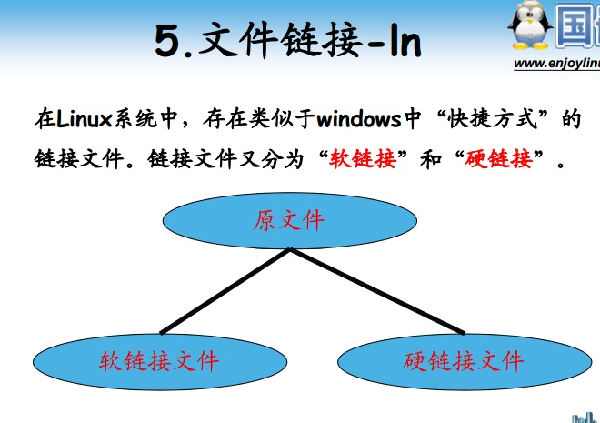

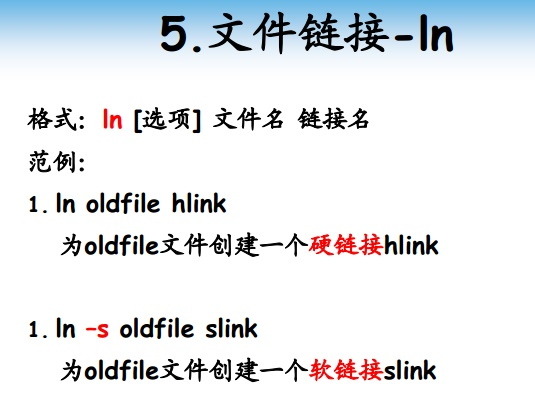

      软链接、硬链接区别
        软链接删除后源文件保持不变
        硬链接只在引用计数为0的时候才删除源文件

## 查找类命令

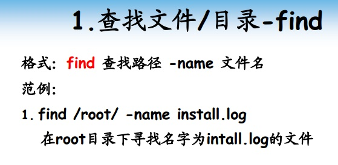

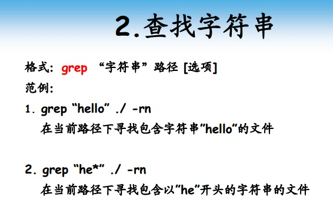

## 进程管理类命令

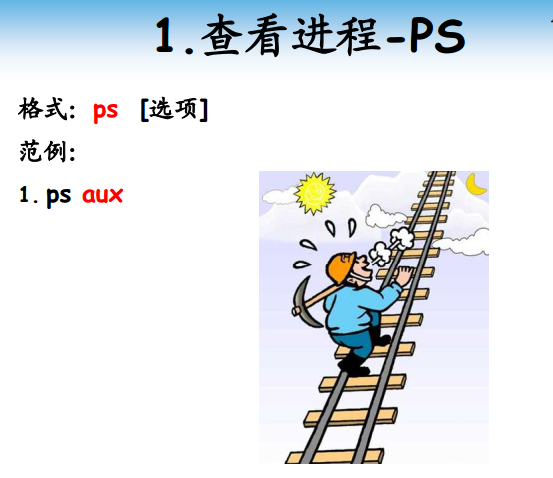

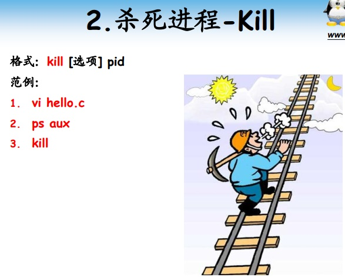

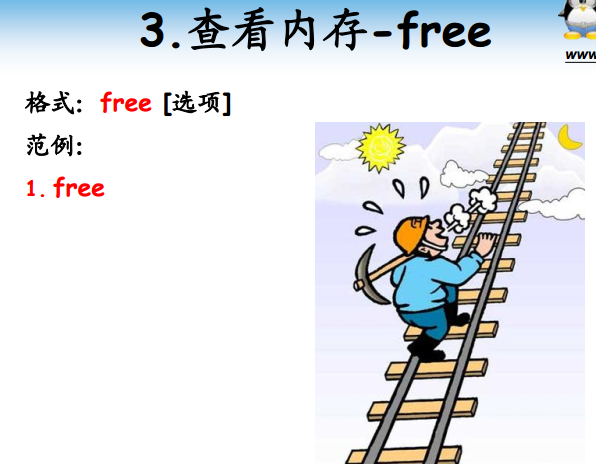

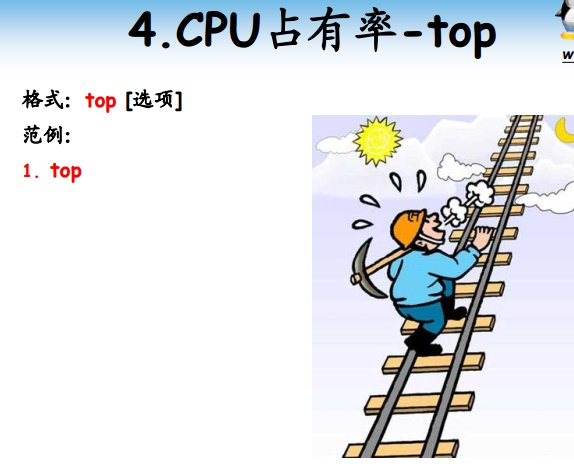

## 杂项命令

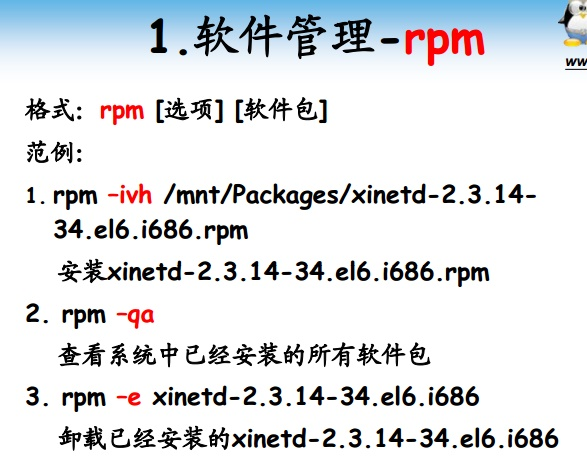

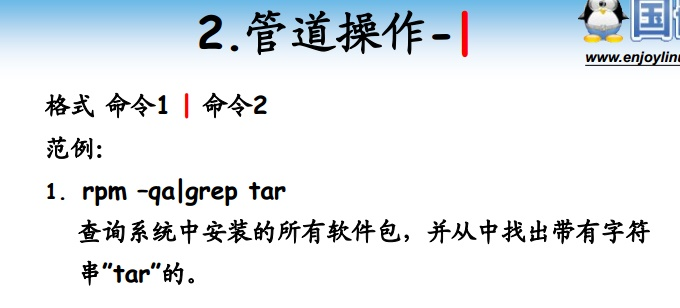

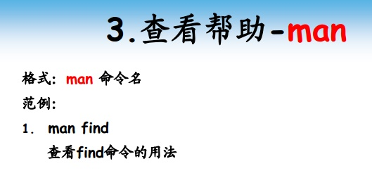

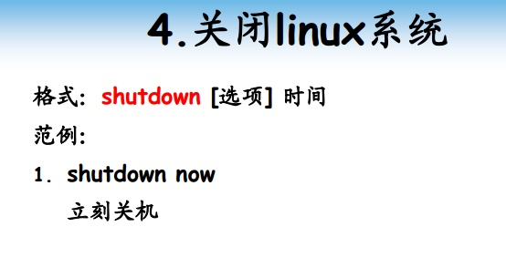
