<!-- TOC depthFrom:1 depthTo:6 withLinks:1 updateOnSave:1 orderedList:0 -->

- [第10课-时间编程](#第10课-时间编程)
	- [课程索引](#课程索引)
	- [时间类型](#时间类型)
	- [时间操作](#时间操作)
	- [函数学习方法](#函数学习方法)
	- [获取日历时间time](#获取日历时间time)
		- [获取函数名称](#获取函数名称)
		- [函数原型](#函数原型)
		- [函数功能](#函数功能)
		- [头文件](#头文件)
		- [返回值](#返回值)
		- [函数参数](#函数参数)
		- [编程实例](#编程实例)
	- [获取格林威治时间gmtime](#获取格林威治时间gmtime)
		- [获取函数名](#获取函数名)
		- [函数原型](#函数原型)
		- [函数功能](#函数功能)
		- [函数返回值](#函数返回值)
		- [函数参数](#函数参数)
		- [编程实例](#编程实例)
	- [获取本地时间localtime](#获取本地时间localtime)
		- [获取函数名](#获取函数名)
		- [函数原型](#函数原型)
		- [函数功能](#函数功能)
		- [头文件](#头文件)
		- [函数返回值](#函数返回值)
		- [函数参数](#函数参数)
		- [编程实例](#编程实例)
	- [字符串显示时间asctime](#字符串显示时间asctime)
		- [获取函数名](#获取函数名)
		- [函数原型](#函数原型)
		- [函数功能](#函数功能)
		- [头文件](#头文件)
		- [函数返回值](#函数返回值)
		- [函数参数](#函数参数)
		- [编程实例](#编程实例)
	- [获取高精度时间函数gettimeofday](#获取高精度时间函数gettimeofday)
		- [获取函数名](#获取函数名)
		- [函数原型](#函数原型)
		- [函数功能](#函数功能)
		- [头文件](#头文件)
		- [函数返回值](#函数返回值)
		- [函数参数](#函数参数)
		- [编程实例](#编程实例)
	- [总结](#总结)

<!-- /TOC -->
# 第10课-时间编程

## 课程索引

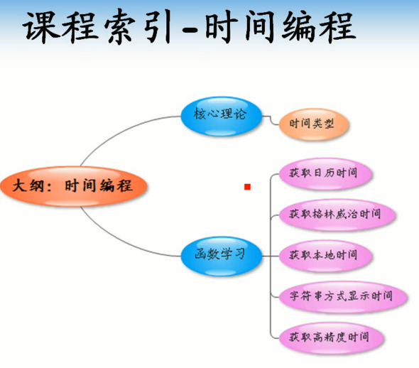

## 时间类型

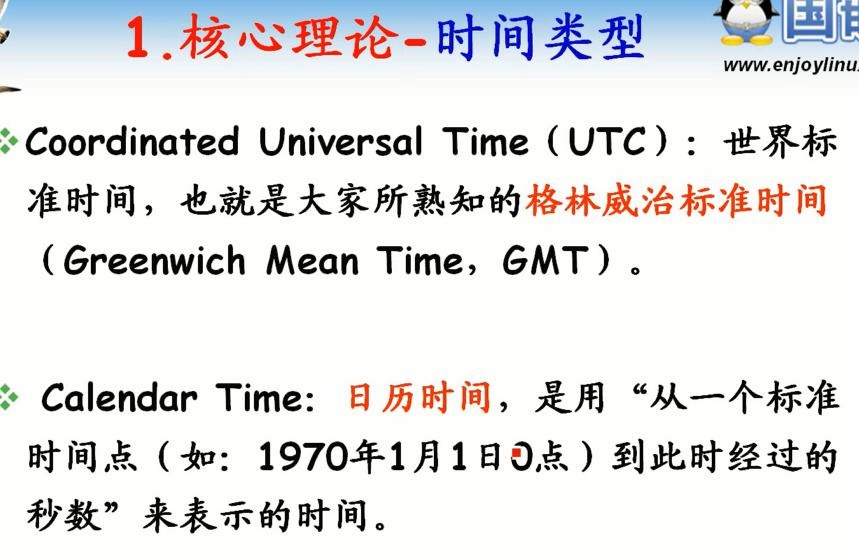

      世界标准时间

## 时间操作

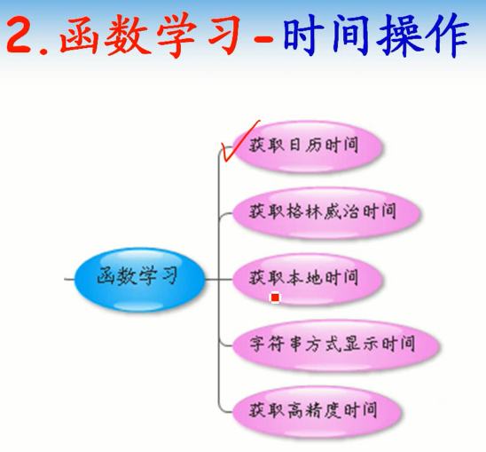

## 函数学习方法

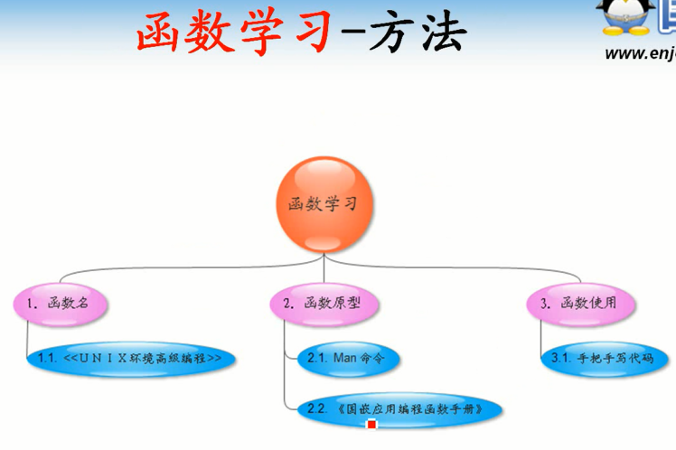

      三步学习法
        获取函数名
        函数原型
        函数功能
        函数返回值
        函数参数

## 获取日历时间time

### 获取函数名称

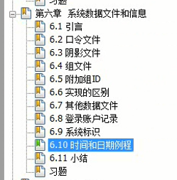

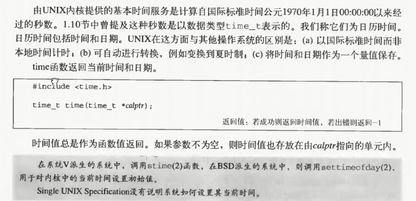

### 函数原型

      man time 会默认显示命令time的man手册
      man 2 time  系统调用找
      man 3 time 库函数找

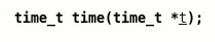

### 函数功能

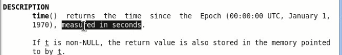

### 头文件

### 返回值

      成功返回日历时间，失败返回-1

### 函数参数

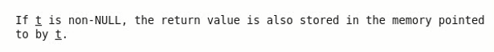

      t不为空则保存返回值

### 编程实例

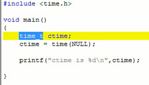

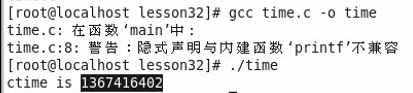

## 获取格林威治时间gmtime

### 获取函数名

### 函数原型

      在第三章节中存在

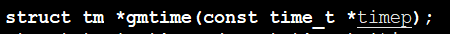

### 函数功能

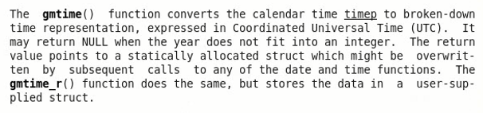

      将参数timep所指定的日历时间转化为世界标准时间

### 函数返回值

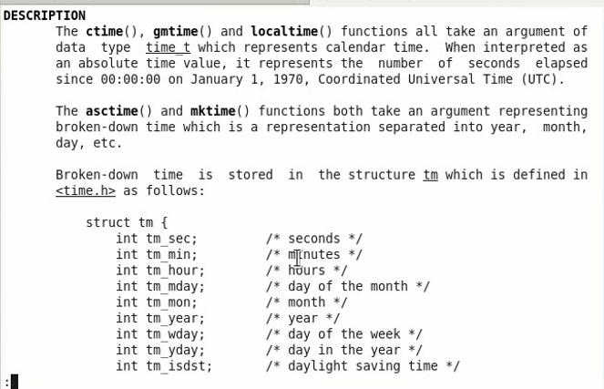

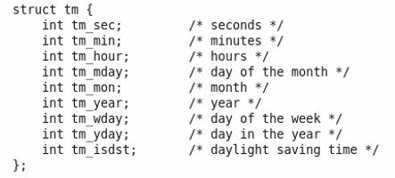

      返回世界标准时间，以struct tm形式存储
      失败返回-1

### 函数参数

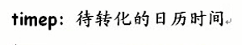

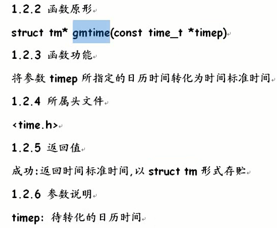

### 编程实例

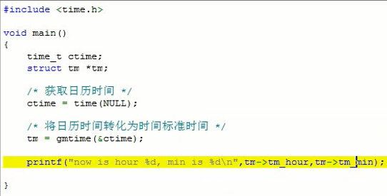

## 获取本地时间localtime

### 获取函数名

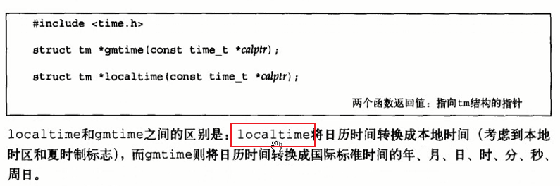

### 函数原型

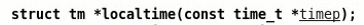

### 函数功能

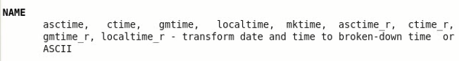

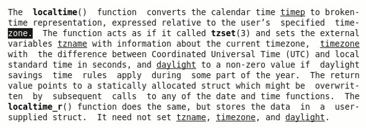
      转化为本地时间

### 头文件

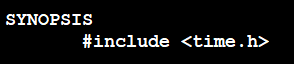

### 函数返回值

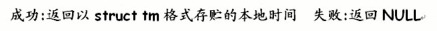

### 函数参数

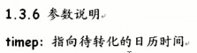

### 编程实例

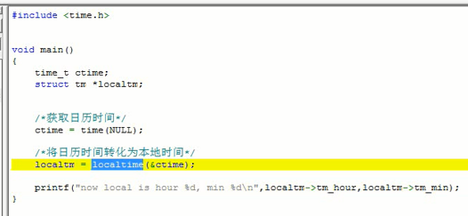

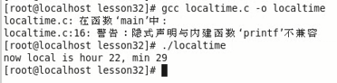

## 字符串显示时间asctime

### 获取函数名

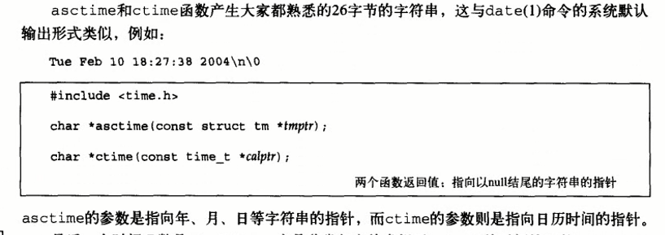

### 函数原型

### 函数功能

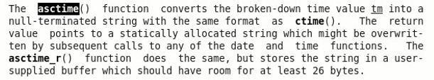

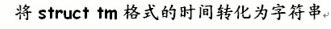

### 头文件

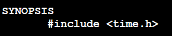

### 函数返回值

      字符串显示的时间

### 函数参数

### 编程实例

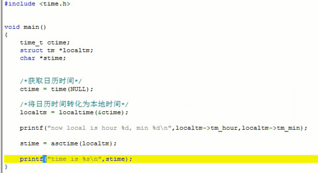

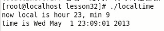

## 获取高精度时间函数gettimeofday

### 获取函数名

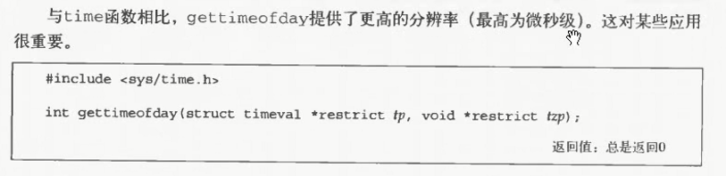

### 函数原型

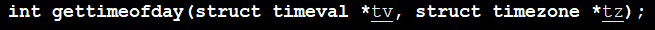

### 函数功能

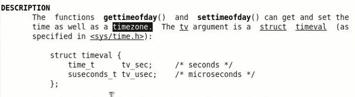

      微秒级别精度

### 头文件

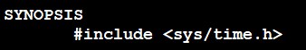

### 函数返回值

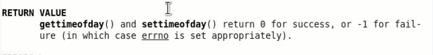

### 函数参数

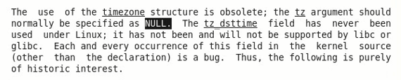

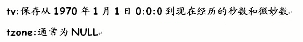

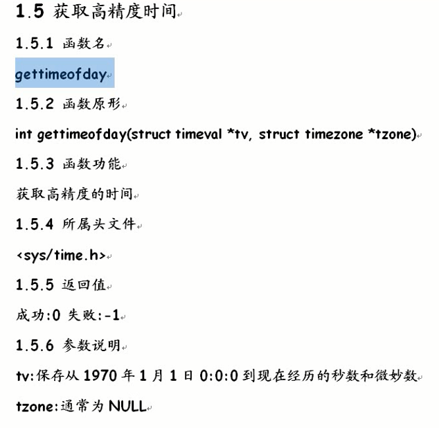

### 编程实例

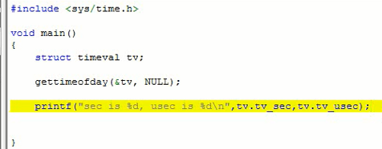

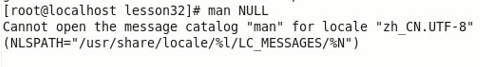

      没有包含标准头文件

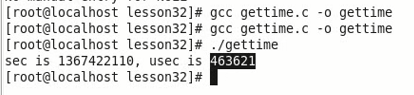

统计函数运行时间

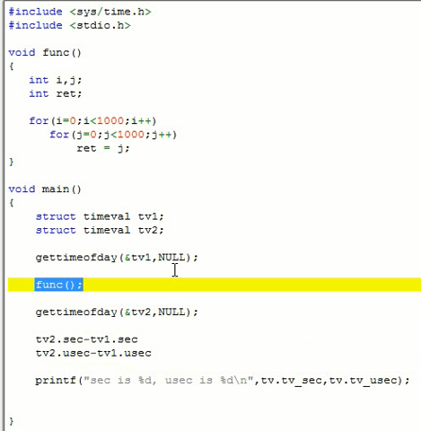

## 总结

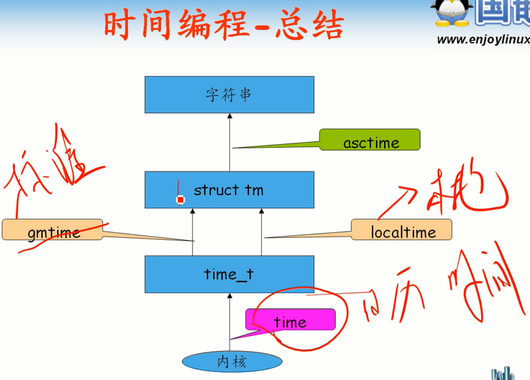
