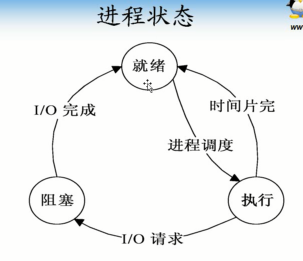
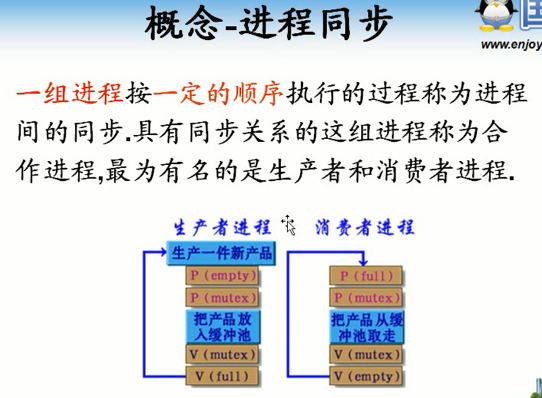
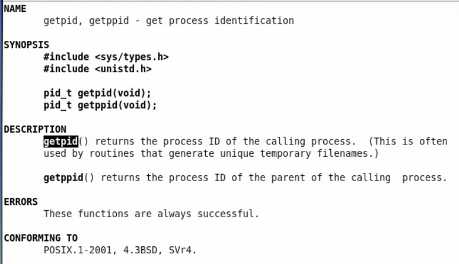
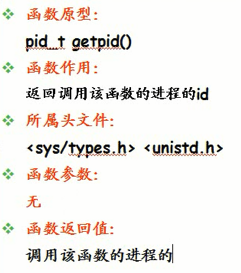
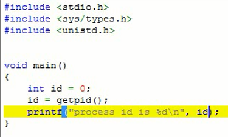
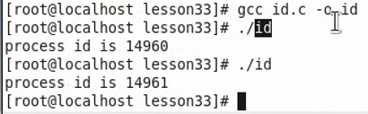

<!-- TOC depthFrom:1 depthTo:6 withLinks:1 updateOnSave:1 orderedList:0 -->

- [第11课-进程控制理论](#第11课-进程控制理论)
	- [进程概念](#进程概念)
	- [进程的特点](#进程的特点)
	- [进程的状态](#进程的状态)
	- [进程ID](#进程id)
	- [进程互斥](#进程互斥)
	- [临界资源](#临界资源)
	- [临界区](#临界区)
	- [进程同步](#进程同步)
	- [进程调度](#进程调度)
	- [调度算法](#调度算法)
	- [进程时机](#进程时机)
	- [死锁](#死锁)
	- [getpid函数](#getpid函数)
	- [获取进程ID](#获取进程id)
	- [总结](#总结)

<!-- /TOC -->
# 第11课-进程控制理论

      进程、调度、同步互斥、死锁

## 进程概念

      进程是活的，程序是死的

## 进程的特点

## 进程的状态

      选择进程执行 = 调度

## 进程ID

## 进程互斥

## 临界资源

## 临界区

      访问临界资源的代码

## 进程同步

      两个或这里两个以上

## 进程调度

## 调度算法

## 进程时机

## 死锁

## getpid函数

      永远返回成功

## 获取进程ID

      pid_t 其实就是一个整型

      没运行一次产生一个进程

## 总结
