<!-- TOC depthFrom:1 depthTo:6 withLinks:1 updateOnSave:1 orderedList:0 -->

	- [课程索引](#课程索引)
	- [创建进程fork](#创建进程fork)
		- [函数名称](#函数名称)
		- [函数原型](#函数原型)
		- [函数功能](#函数功能)
		- [头文件](#头文件)
		- [返回值](#返回值)
		- [参数](#参数)
		- [编程实例](#编程实例)
	- [创建进程vfork](#创建进程vfork)
		- [函数名称](#函数名称)
		- [函数原型](#函数原型)
		- [函数功能](#函数功能)
		- [头文件](#头文件)
		- [返回值](#返回值)
		- [参数](#参数)
		- [编程实例](#编程实例)
	- [进程退出](#进程退出)
	- [进程等待wait](#进程等待wait)
		- [函数名称](#函数名称)
		- [函数原型](#函数原型)
		- [函数功能](#函数功能)
		- [头文件](#头文件)
		- [返回值](#返回值)
		- [参数](#参数)
		- [编程实例](#编程实例)
	- [执行程序 exec](#执行程序-exec)
		- [函数名称](#函数名称)
		- [函数原型](#函数原型)
		- [函数功能](#函数功能)
		- [头文件](#头文件)
		- [返回值](#返回值)
		- [参数](#参数)
		- [编程实例](#编程实例)
	- [总结](#总结)

<!-- /TOC -->

## 课程索引

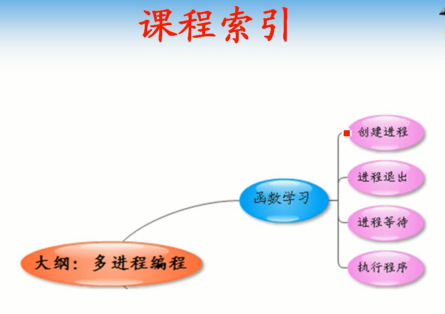

## 创建进程fork

### 函数名称

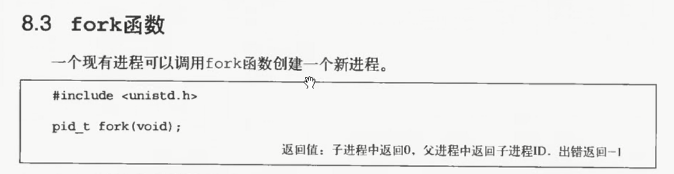

### 函数原型

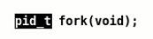

### 函数功能

### 头文件

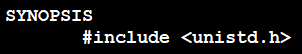

### 返回值

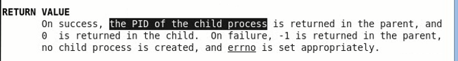

      父进程返回子进程PID
      子进程返回0。返回两次
      错误返回-1

### 参数

      无须参数

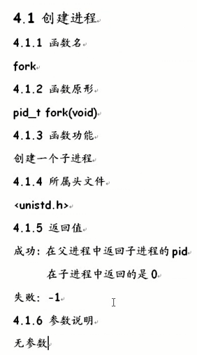

### 编程实例

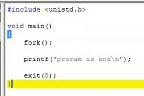

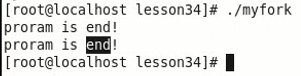

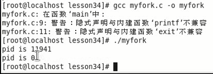

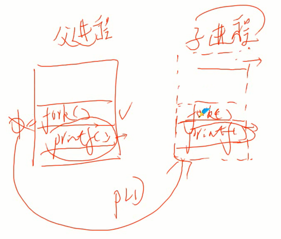

      子进程从fork之后开始执行

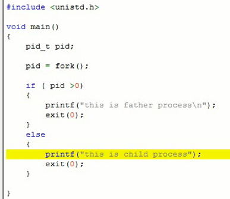

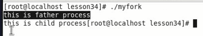

## 创建进程vfork

### 函数名称

### 函数原型

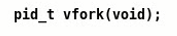

### 函数功能

      创建子进程并且阻塞父进程
### 头文件

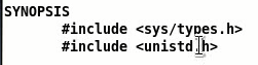

### 返回值

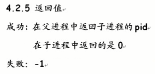

### 参数

      无参数

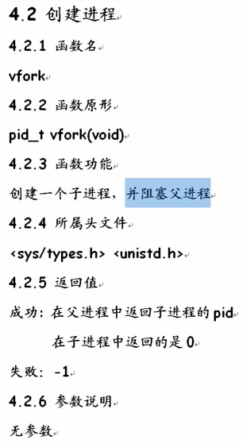

### 编程实例

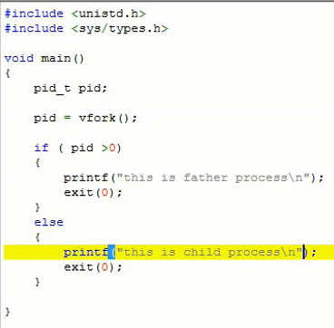

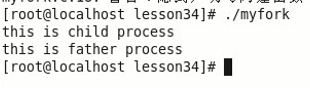

      会阻塞父进程，子进程执行完成后父进程继续运行。

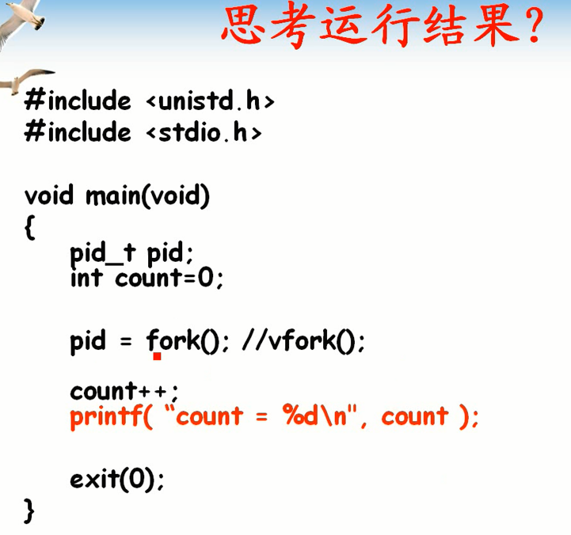

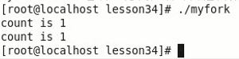

      子进程拥有独立的数据段

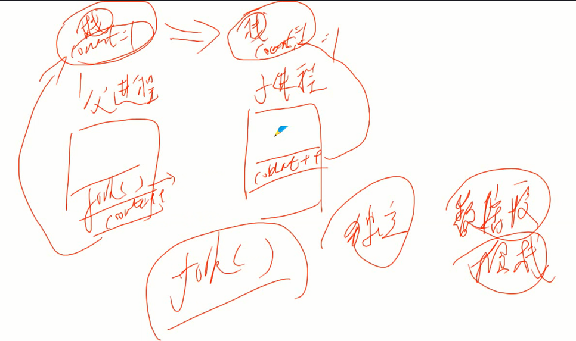

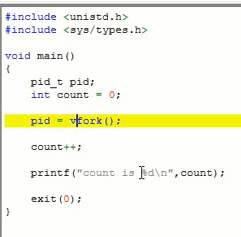

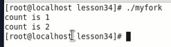

      vfork共享父进程数据段

## 进程退出

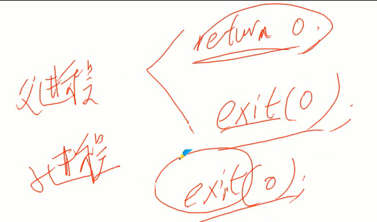

      子进程只用exit退出，不得用return

## 进程等待wait

### 函数名称

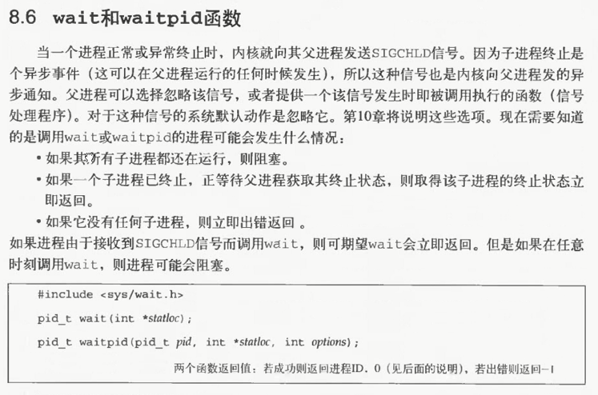

### 函数原型

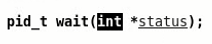

### 函数功能

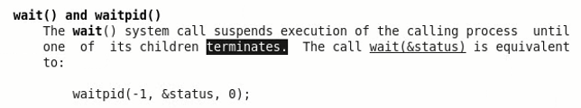

      挂起调动进程，直到其子进程结束

### 头文件

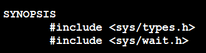

### 返回值

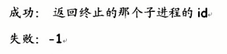

### 参数

      status记录子进程退出状态

### 编程实例

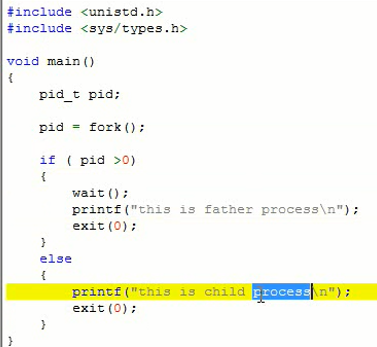

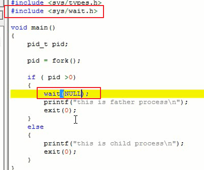

## 执行程序 exec

### 函数名称

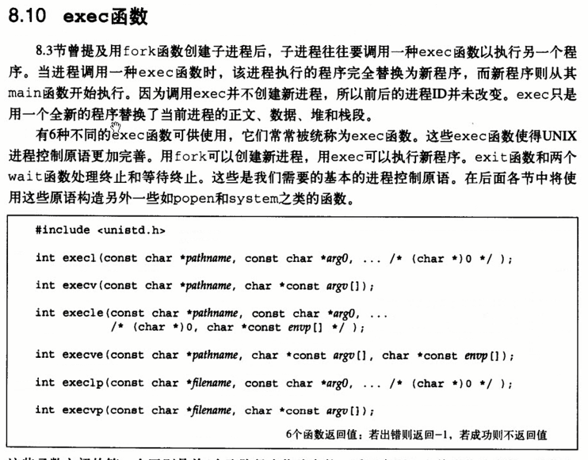

      函数族

### 函数原型

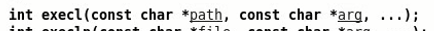

### 函数功能

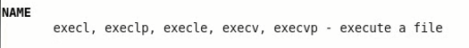

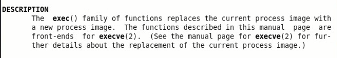

### 头文件

### 返回值

      成功不返回，失败返回

### 参数

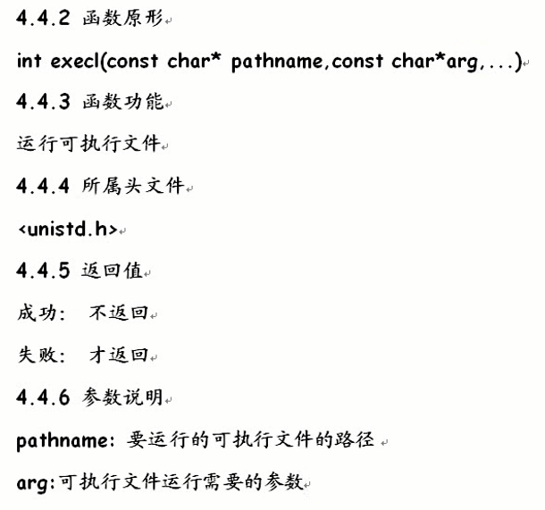

### 编程实例

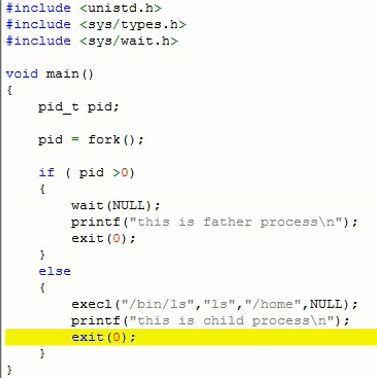

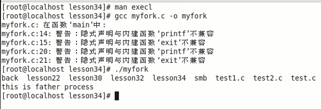

      exec之后其后代码不执行，替换了原有的代码段

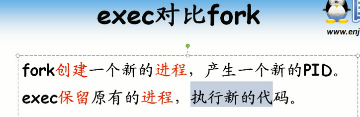

## 总结

