<!-- TOC depthFrom:1 depthTo:6 withLinks:1 updateOnSave:1 orderedList:0 -->

- [第13课-无名管道通讯编程](#第13课-无名管道通讯编程)
	- [课程索引](#课程索引)
	- [进程通信IPC](#进程通信ipc)
	- [进程通信的目的](#进程通信的目的)
	- [进程通信发展史](#进程通信发展史)
		- [POSIX标准](#posix标准)
	- [IPC通信方式](#ipc通信方式)
	- [管道通信](#管道通信)
	- [管道通信特点](#管道通信特点)
	- [无名管道](#无名管道)
	- [无名管道操作函数](#无名管道操作函数)
	- [学习方法](#学习方法)
	- [创建管道pipe](#创建管道pipe)
		- [函数名称](#函数名称)
		- [函数原型](#函数原型)
		- [函数功能](#函数功能)
		- [头文件](#头文件)
		- [返回值](#返回值)
		- [参数](#参数)
		- [编程实例](#编程实例)
	- [总结](#总结)

<!-- /TOC -->
# 第13课-无名管道通讯编程

## 课程索引

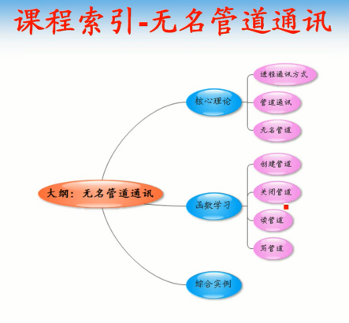

## 进程通信IPC

## 进程通信的目的

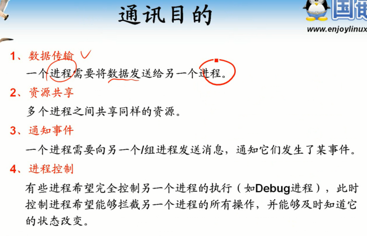

## 进程通信发展史

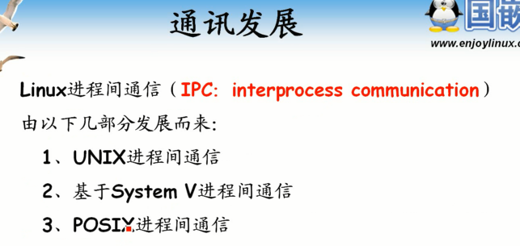

### POSIX标准

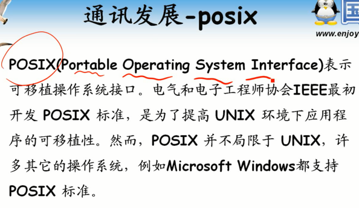

      提高程序可移植性

## IPC通信方式

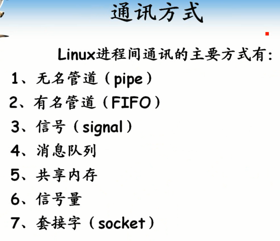

      不同通信方式用于不同目的

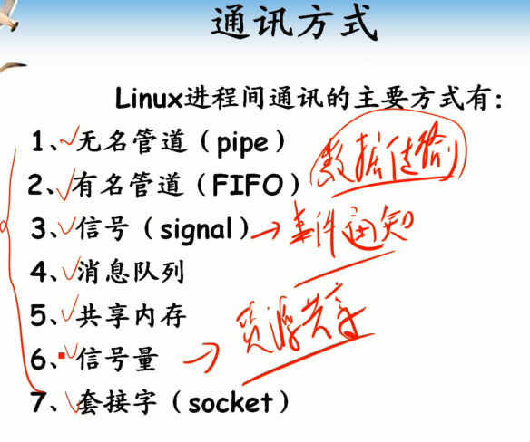

      最好记住

## 管道通信

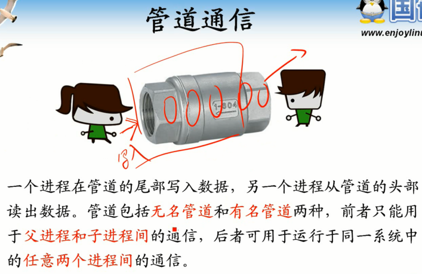

## 管道通信特点

      单向通信
      读写都会阻塞
      管道容量有限制

## 无名管道

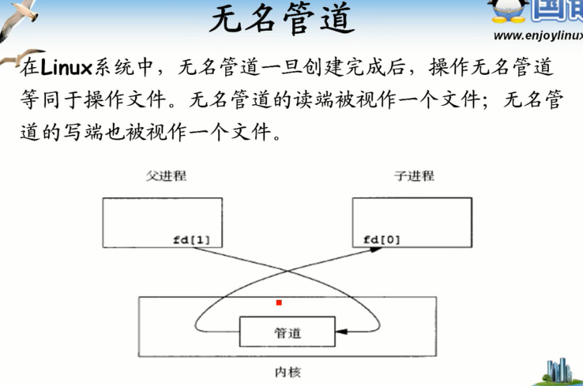

## 无名管道操作函数

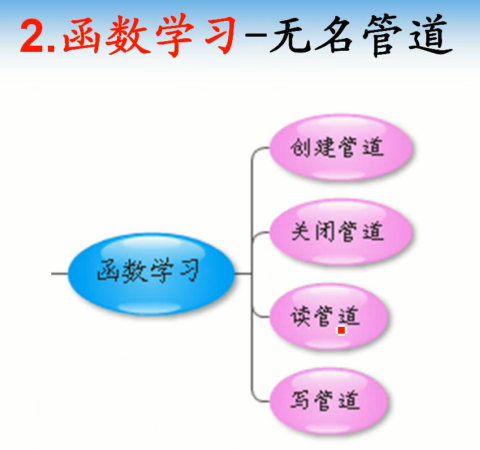

## 学习方法

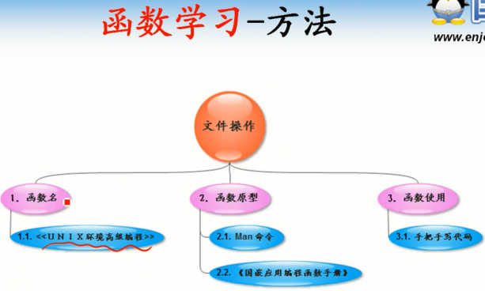

## 创建管道pipe

### 函数名称

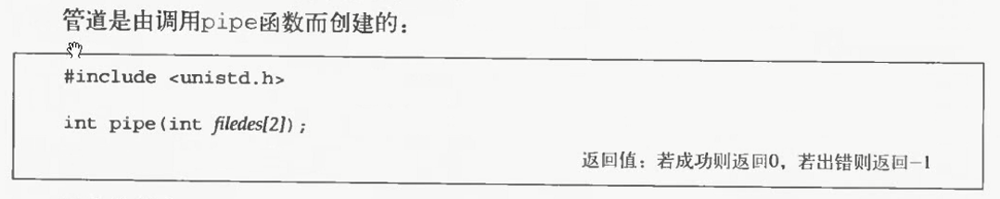

### 函数原型

### 函数功能

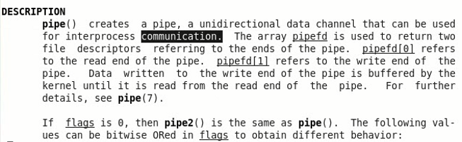

### 头文件

### 返回值

### 参数

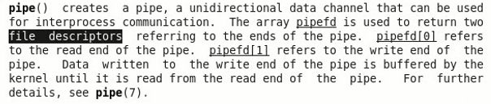

      fd数组用来接收返回值，分别表示两个文件描述符

      操作管道就是操作文件，虽然不能lseek

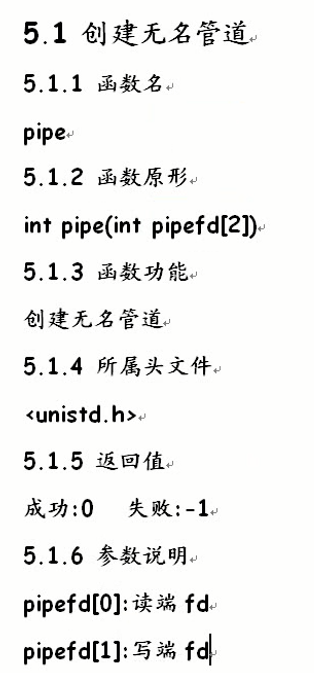

### 编程实例

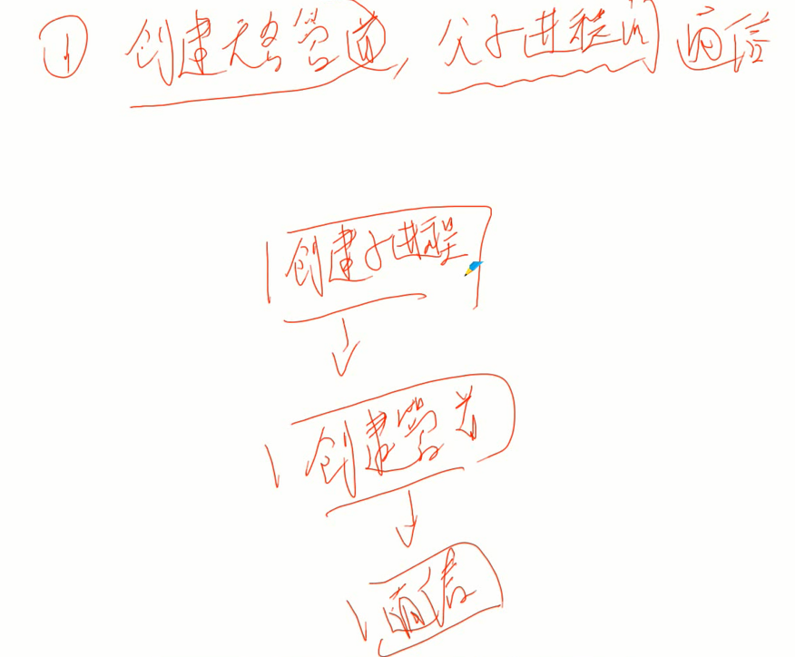

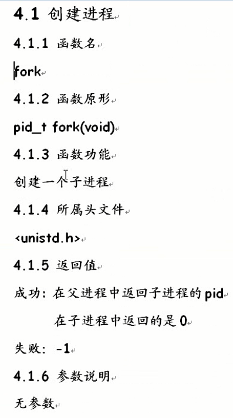

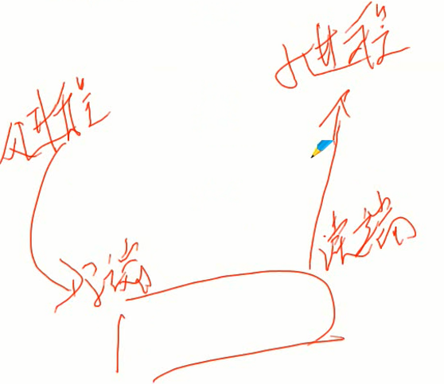

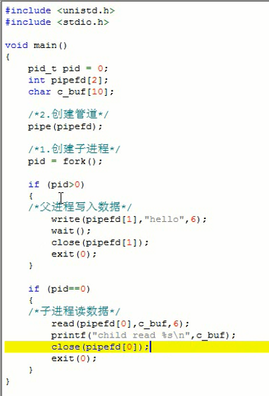

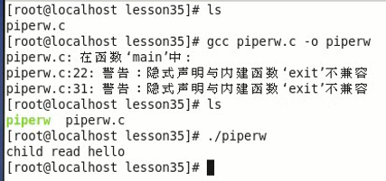

## 总结

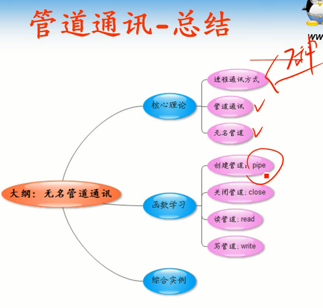
