<!-- TOC depthFrom:1 depthTo:6 withLinks:1 updateOnSave:1 orderedList:0 -->

- [第14课-有名管道通讯编程](#第14课-有名管道通讯编程)
	- [课程索引](#课程索引)
	- [有名管道](#有名管道)
	- [区别于普通文件](#区别于普通文件)
	- [函数学习](#函数学习)
	- [学习方法](#学习方法)
	- [创建有名管道](#创建有名管道)
		- [函数名称mkfifo](#函数名称mkfifo)
		- [函数原型](#函数原型)
		- [函数功能](#函数功能)
		- [头文件](#头文件)
		- [返回值](#返回值)
		- [参数](#参数)
	- [删除有名管道unlink](#删除有名管道unlink)
		- [函数名称](#函数名称)
		- [函数原型](#函数原型)
		- [函数功能](#函数功能)
		- [头文件](#头文件)
		- [返回值](#返回值)
		- [参数](#参数)
	- [综合实例编程](#综合实例编程)
	- [总结](#总结)

<!-- /TOC -->
# 第14课-有名管道通讯编程

## 课程索引

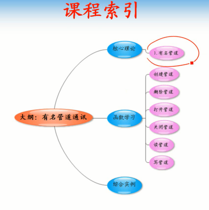

## 有名管道

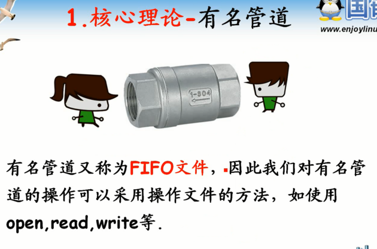

## 区别于普通文件

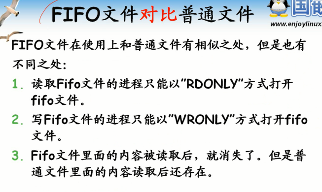

      权限控制：读端只能读，写端只能写
      读了就消失了

## 函数学习

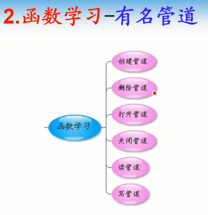

## 学习方法

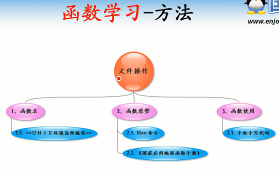

## 创建有名管道

### 函数名称mkfifo

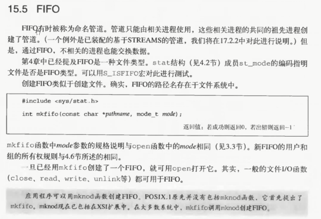

      类似于创建文件

### 函数原型

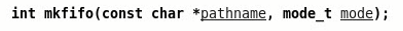

### 函数功能

      创建有名管道文件

### 头文件

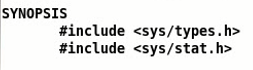

### 返回值

      成功返回0
      失败返回-1

### 参数

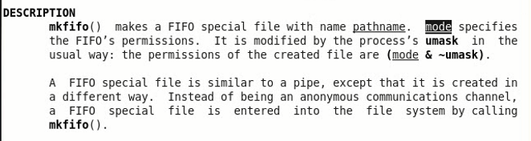

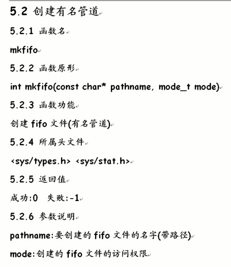

## 删除有名管道unlink

### 函数名称

### 函数原型

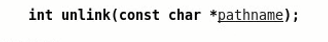

### 函数功能

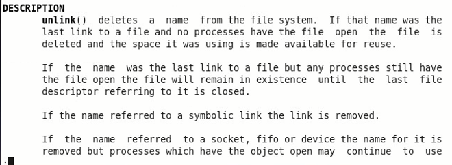

      删除文件，包括fifo

### 头文件

### 返回值

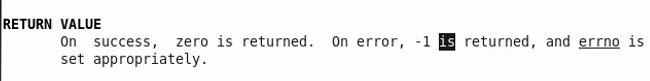

### 参数

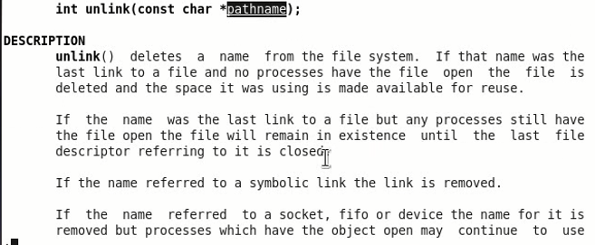

      指明要删除文件名字

## 综合实例编程

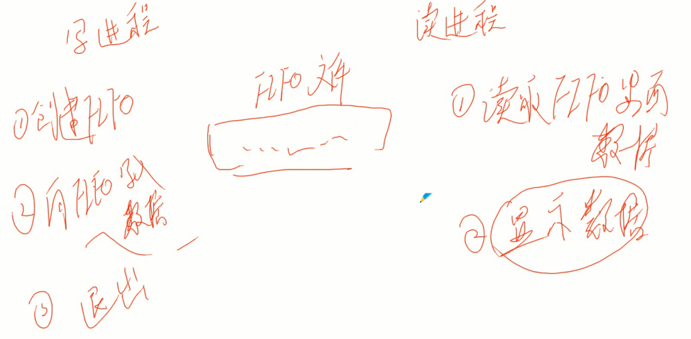

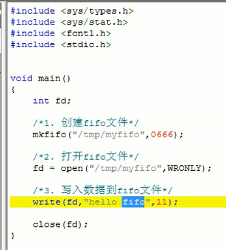

      O_WRONLY

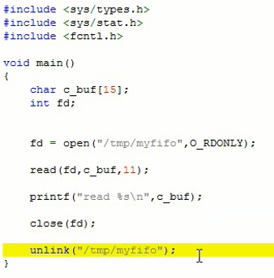

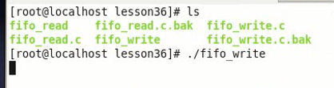

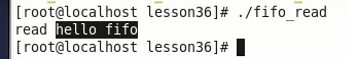

      写进程会阻塞等待读进程

## 总结

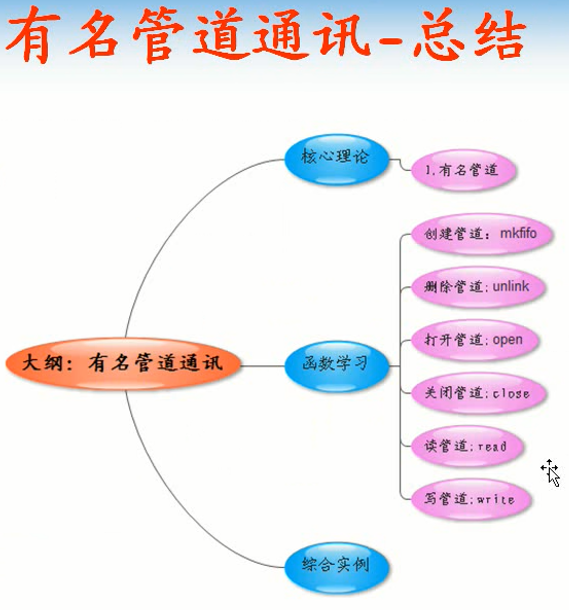
