<!-- TOC depthFrom:1 depthTo:6 withLinks:1 updateOnSave:1 orderedList:0 -->

	- [课程索引](#课程索引)
	- [核心理论-信号](#核心理论-信号)
	- [信号处理流程](#信号处理流程)
	- [信号类型](#信号类型)
	- [常用信号](#常用信号)
	- [函数学习](#函数学习)
	- [学习方法](#学习方法)
	- [发送信号](#发送信号)
		- [函数名称](#函数名称)
		- [函数原型](#函数原型)
		- [函数功能](#函数功能)
		- [头文件](#头文件)
		- [返回值](#返回值)
		- [参数](#参数)
	- [信号处理函数signal](#信号处理函数signal)
		- [函数名称](#函数名称)
		- [函数原型](#函数原型)
		- [函数功能](#函数功能)
		- [头文件](#头文件)
		- [返回值](#返回值)
		- [参数](#参数)
		- [综合编程实例](#综合编程实例)
	- [总结](#总结)

<!-- /TOC -->

## 课程索引

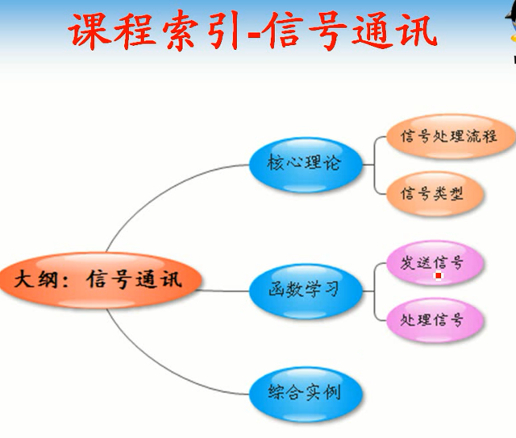


## 核心理论-信号

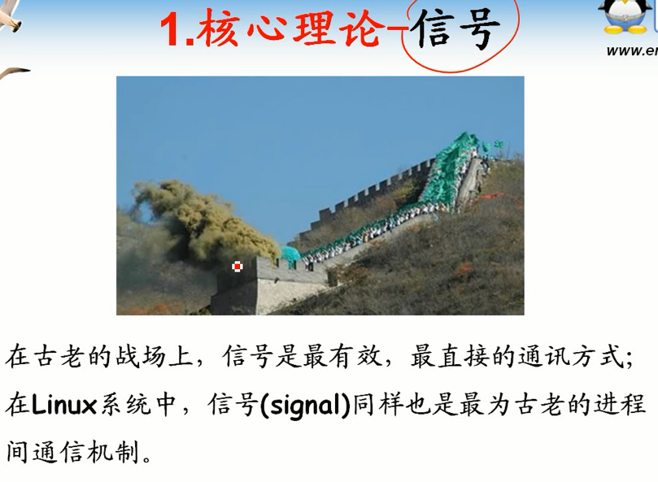

      信号-传递信息。古老通信机制，传递简单信息

## 信号处理流程

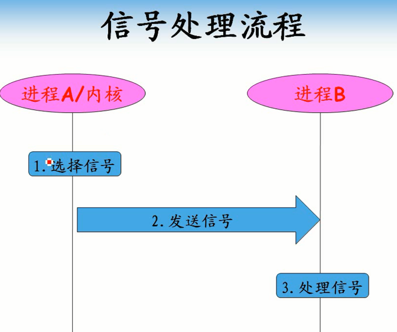

## 信号类型

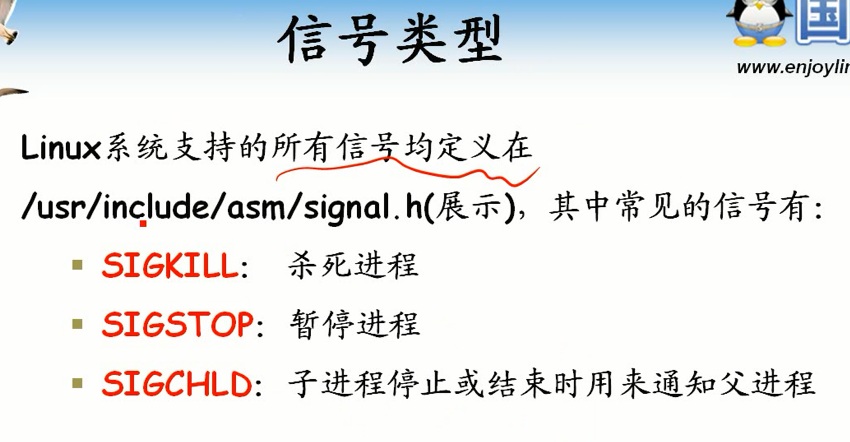

```
 #define SIGHUP		 1
 #define SIGINT		 2
 #define SIGQUIT		 3
 #define SIGILL		 4
 #define SIGTRAP		 5
 #define SIGABRT		 6
 #define SIGIOT		 6
 #define SIGBUS		 7
 #define SIGFPE		 8
 #define SIGKILL		 9
 #define SIGUSR1		10
 #define SIGSEGV		11
 #define SIGUSR2		12
 #define SIGPIPE		13
 #define SIGALRM		14
 #define SIGTERM		15
 #define SIGSTKFLT	16
 #define SIGCHLD		17
 #define SIGCONT		18
 #define SIGSTOP		19
 #define SIGTSTP		20
 #define SIGTTIN		21
 #define SIGTTOU		22
 #define SIGURG		23
 #define SIGXCPU		24
 #define SIGXFSZ		25
 #define SIGVTALRM	26
 #define SIGPROF		27
 #define SIGWINCH	28
 #define SIGIO		29
 #define SIGPOLL		SIGIO
/*
 #define SIGLOST		29
*/
 #define SIGPWR		30
 #define SIGSYS		31
 #define	SIGUNUSED	31

/* These should not be considered constants from userland.  */
 #define SIGRTMIN	32
 #define SIGRTMAX	_NSIG
```
## 常用信号

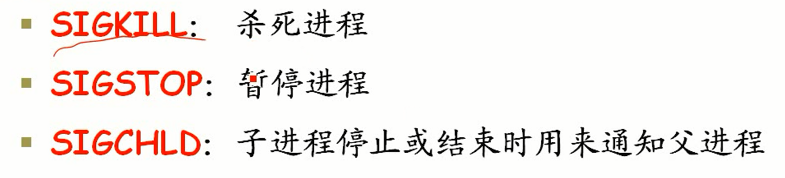

## 函数学习

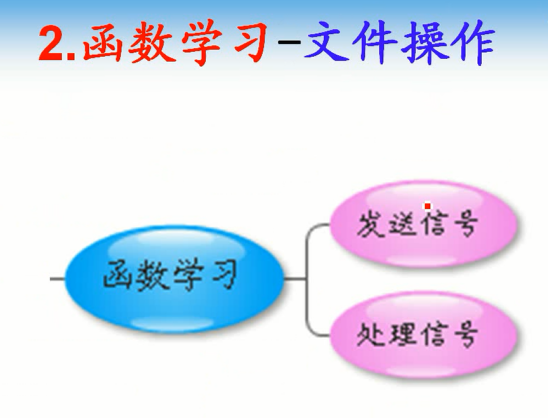

## 学习方法

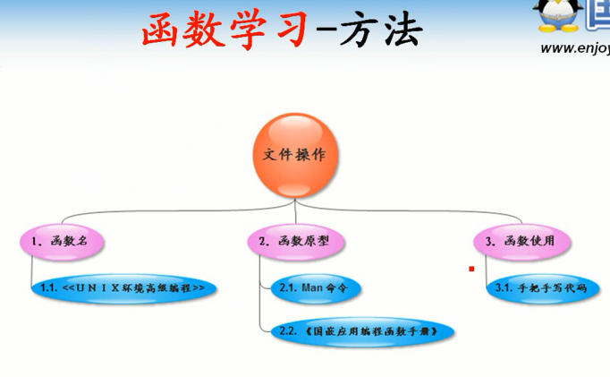

## 发送信号

### 函数名称

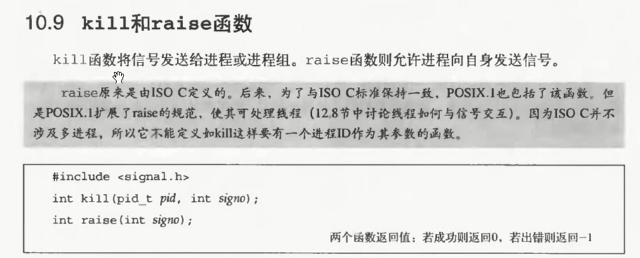


### 函数原型

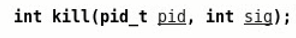


### 函数功能


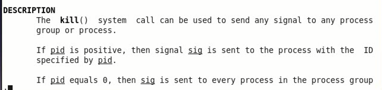

### 头文件

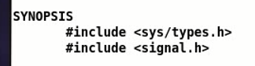

### 返回值


      成功返回0
      失败返回-1

### 参数

      pid：接收信号者的pid。>0 指明进程pid，否则就是自己进程组其他进程
      sig：发送的信号，宏定义常量

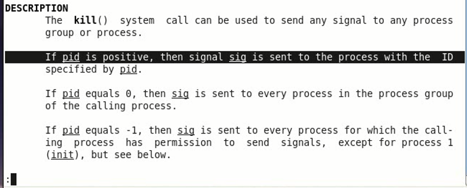

## 信号处理函数signal

### 函数名称

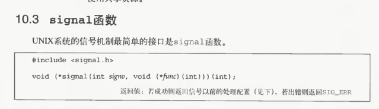

### 函数原型

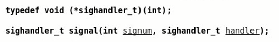


### 函数功能


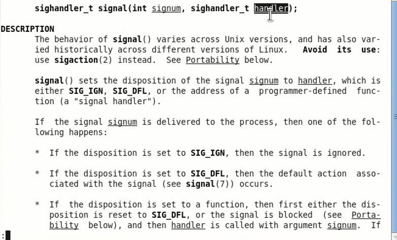

      设置信号处理方式，多是交给handle函数处理
      handle函数是回调函数

### 头文件

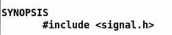

### 返回值


      成功返回处理函数指针，失败返回SIG_ERROR

### 参数

      signum：进程要处理的信号
      handle：信号处理回调函数

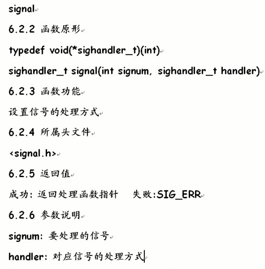

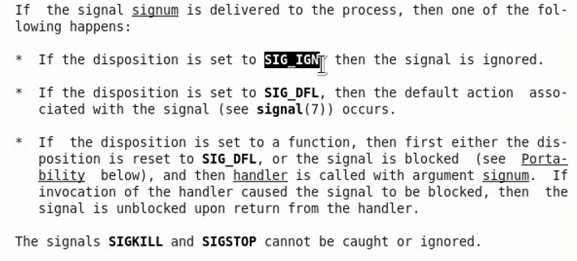

      可以忽略信号，可以使用默认处理方式处理。如果没有定义就用默认
      handler可以取值，也可以用回调函数

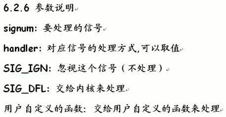

### 综合编程实例

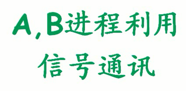

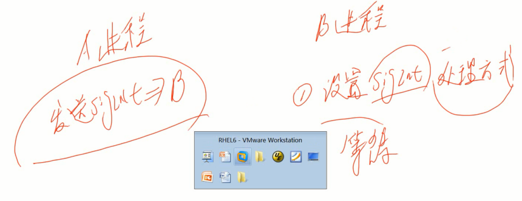

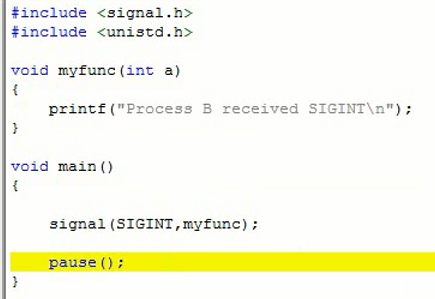

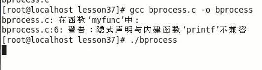

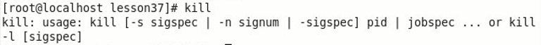

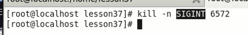

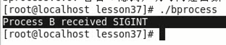

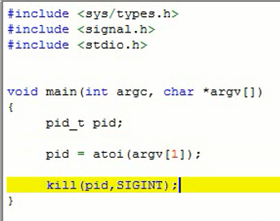

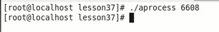


## 总结

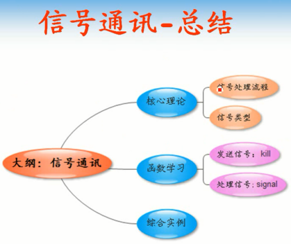

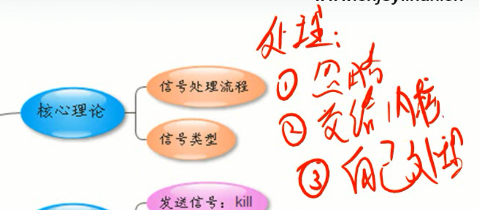
