<!-- TOC depthFrom:1 depthTo:6 withLinks:1 updateOnSave:1 orderedList:0 -->

- [第16课-信号量互斥编程](#第16课-信号量互斥编程)
	- [课程索引](#课程索引)
	- [问题引入-资源访问混乱](#问题引入-资源访问混乱)
	- [解决方案](#解决方案)
	- [信号量](#信号量)
	- [信号量分类](#信号量分类)
	- [函数学习](#函数学习)
	- [学习方法](#学习方法)
	- [打开/创建信号量semget](#打开创建信号量semget)
		- [函数名称](#函数名称)
		- [函数原型](#函数原型)
		- [函数功能](#函数功能)
		- [头文件](#头文件)
		- [返回值](#返回值)
		- [参数](#参数)
	- [键值](#键值)
	- [ftok工作原理](#ftok工作原理)
	- [操作信号量semop](#操作信号量semop)
		- [函数名称](#函数名称)
		- [函数原型](#函数原型)
		- [函数功能](#函数功能)
		- [头文件](#头文件)
		- [返回值](#返回值)
		- [参数](#参数)
		- [综合编程实例](#综合编程实例)
	- [总结](#总结)

<!-- /TOC -->
# 第16课-信号量互斥编程

## 课程索引

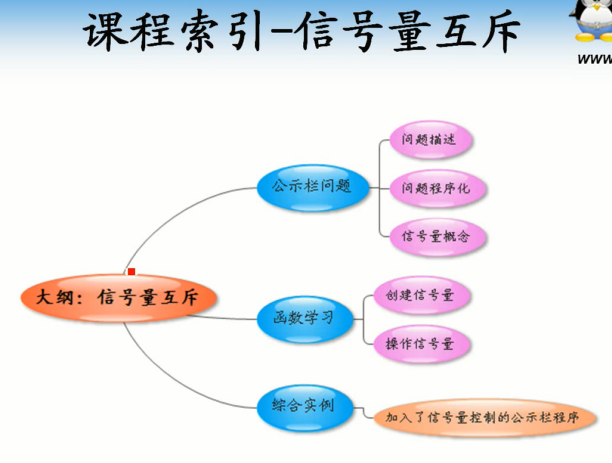

      提出问题，引入解决方案，解决问题

## 问题引入-资源访问混乱

      问题程序化

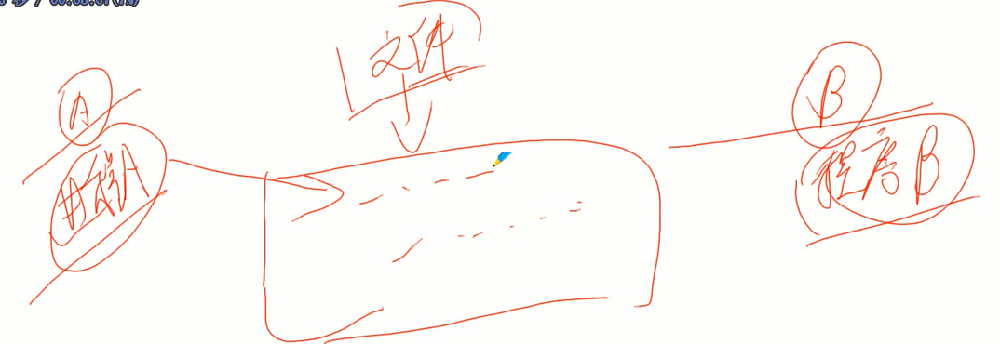

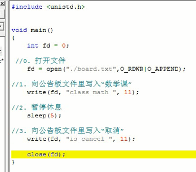

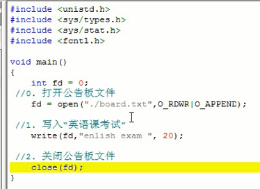

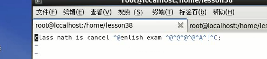

## 解决方案

      互斥访问-标志牌？
        互相排斥-信号量
          实质就是一个数字
      获取信号量 1 -> 0
      释放信号量 0 -> 1

## 信号量

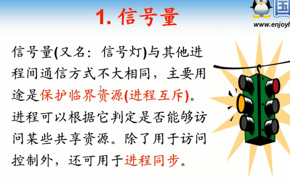

## 信号量分类

## 函数学习

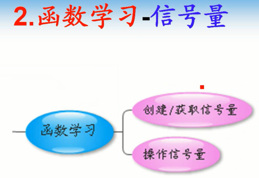

## 学习方法

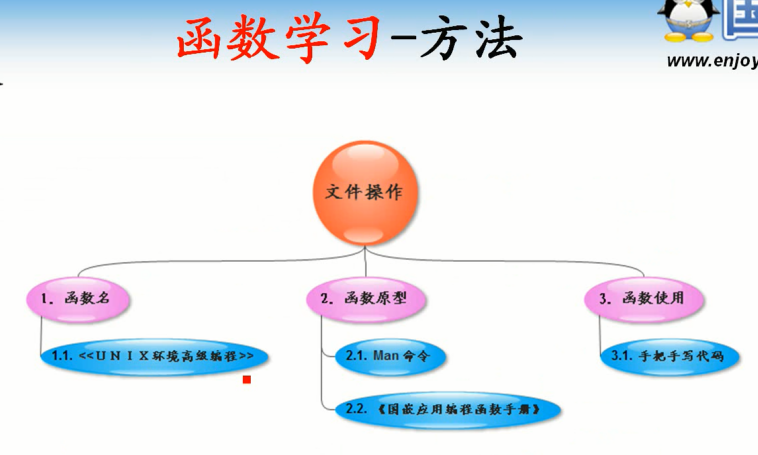

## 打开/创建信号量semget

      区别于文件编程

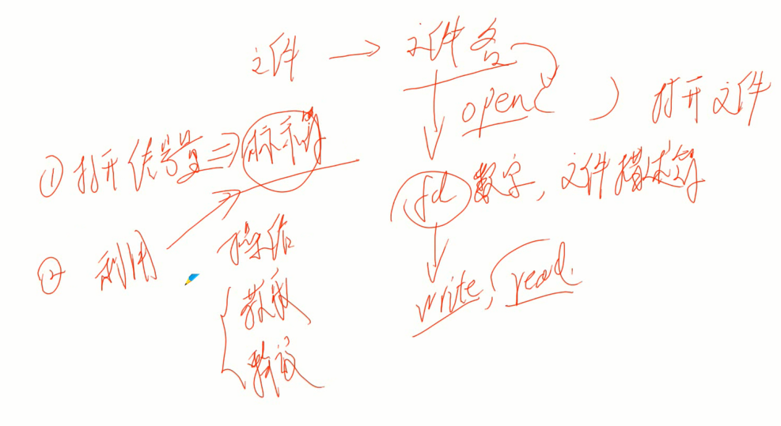

### 函数名称

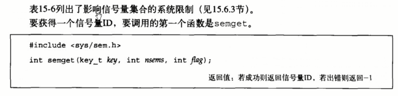

### 函数原型

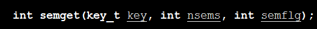

### 函数功能

      获取信号量集合的标识符

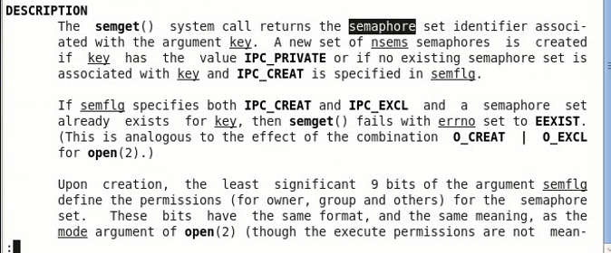

### 头文件

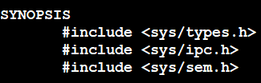

### 返回值

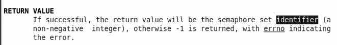

      信号量集合的标识符

### 参数

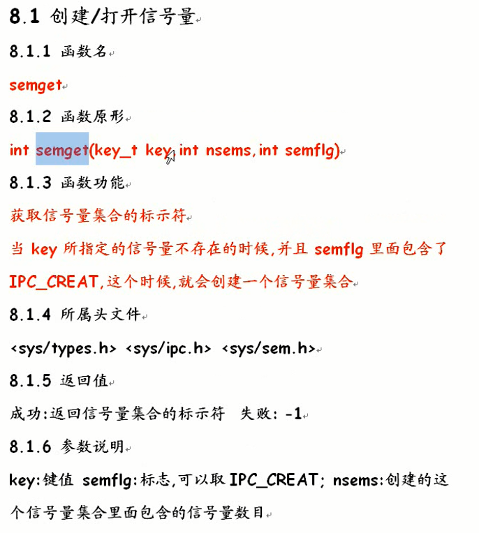

## 键值

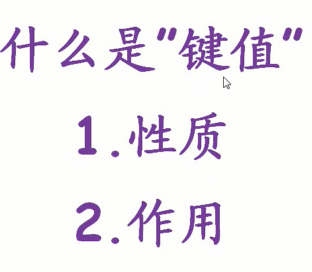

      类比文件操作，通过文件名操作文件
      信号量通过键值找到ipc对象

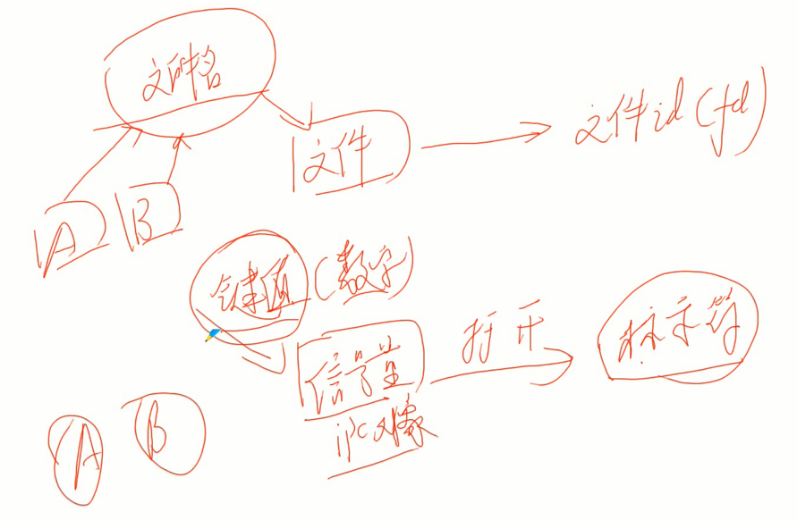

      创建信号量时指定键值

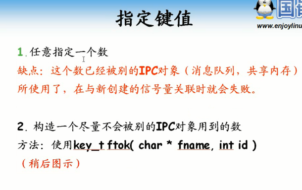

      ftok选择

## ftok工作原理

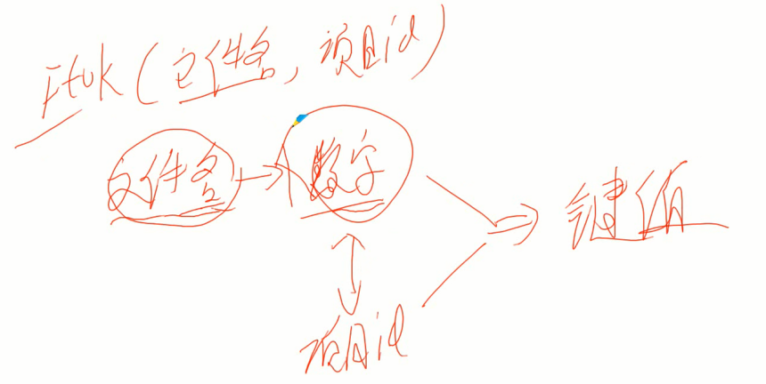

      把文件名及inode组合项目id构成键值

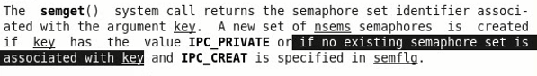

      如果没有与之对应的信号量时，如果指明IPC_CREAT则创建信号量

## 操作信号量semop

### 函数名称

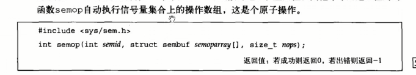

### 函数原型

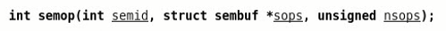

### 函数功能

### 头文件

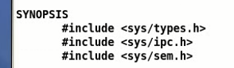

### 返回值

### 参数

      操作信号量集合中的信号量

### 综合编程实例

      每个信号量都有键值对应
        键值=文件名+项目id

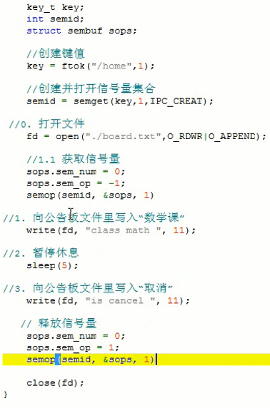

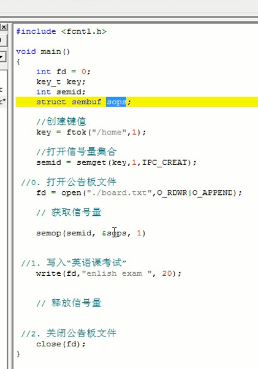

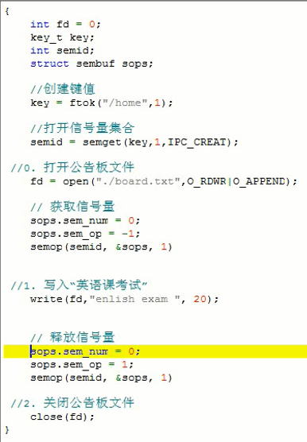

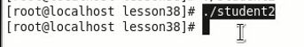

      信号量初始值需要自己设定

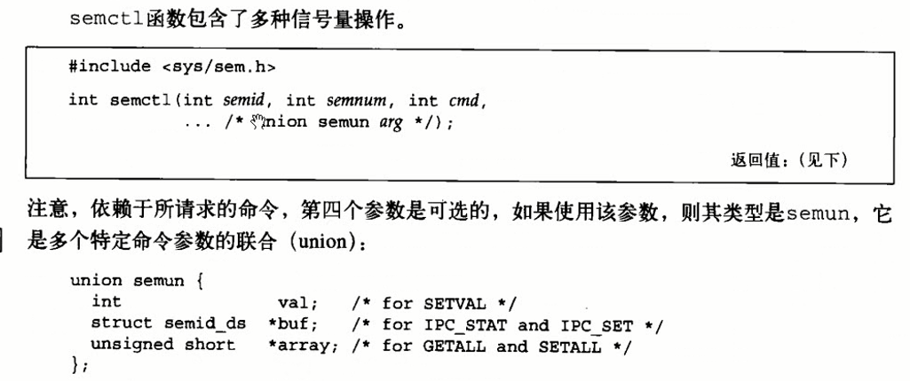

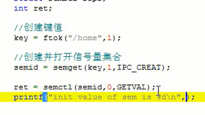

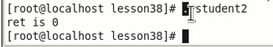

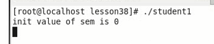

## 总结

      信号量组形式
      必须自己设定初始值
      有获取就必须有释放-避免死锁

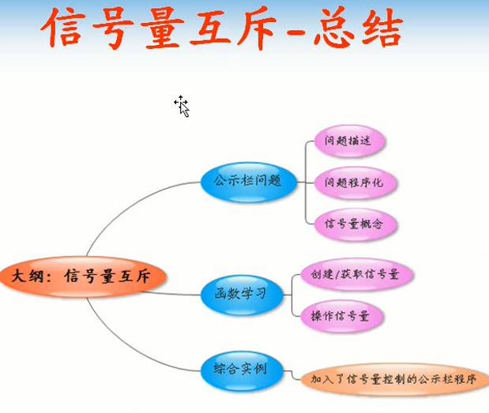
