<!-- TOC depthFrom:1 depthTo:6 withLinks:1 updateOnSave:1 orderedList:0 -->

- [第17课-信号量同步编程](#第17课-信号量同步编程)
	- [课程索引](#课程索引)
	- [进程同步](#进程同步)
	- [生产者消费者问题](#生产者消费者问题)
	- [总结](#总结)

<!-- /TOC -->
# 第17课-信号量同步编程

## 课程索引

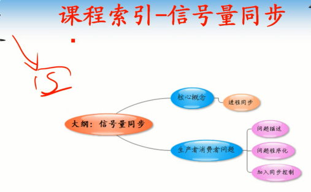

## 进程同步

      必须按照一定顺序执行，有规律可循即为顺序

## 生产者消费者问题

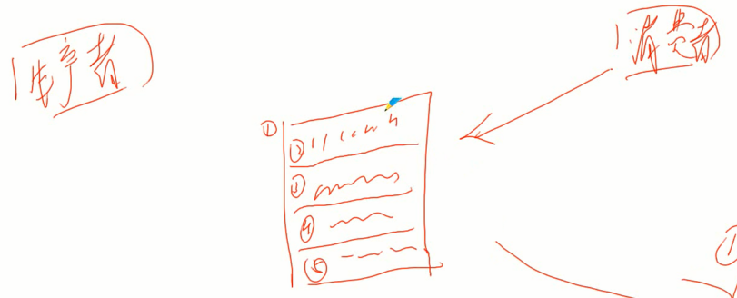

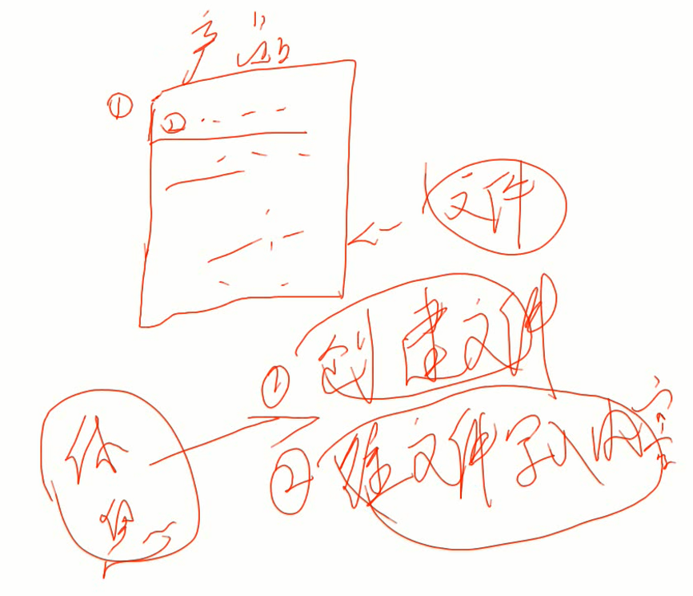

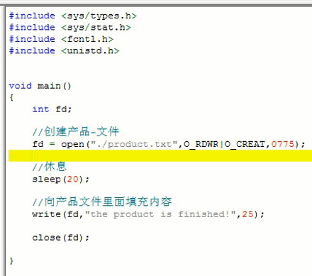

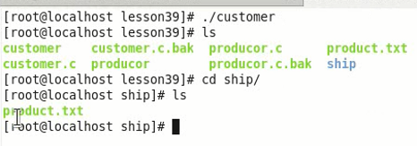

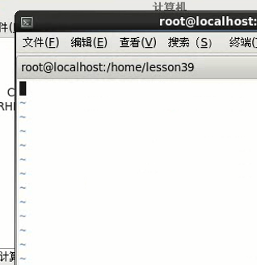

      取到的内容为空

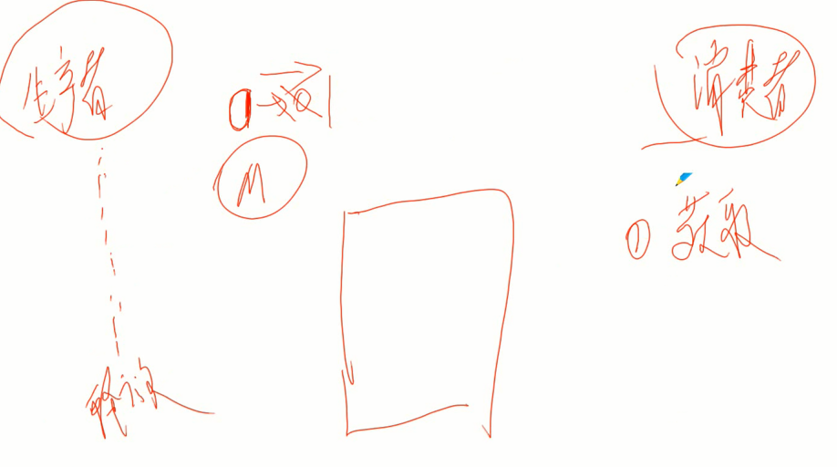

      生产者+1信号量
      消费者-1信号量

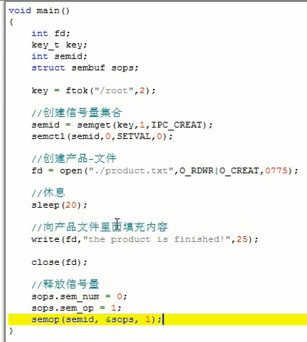

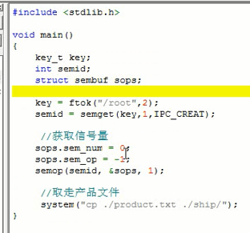

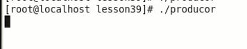

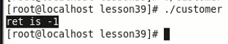

      缺少赋值

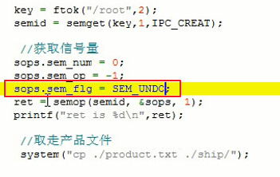

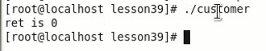

## 总结

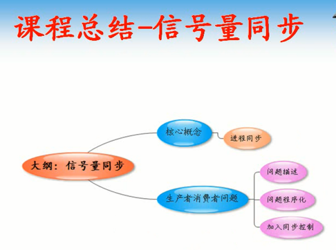
