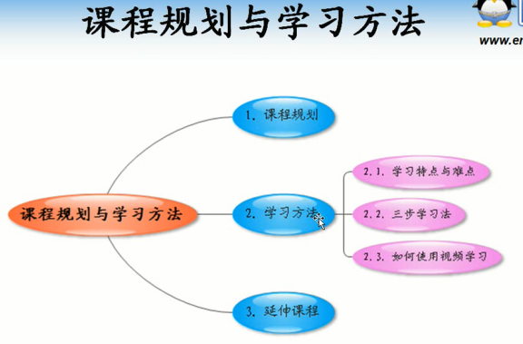
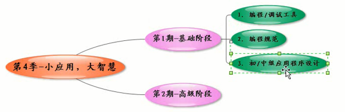
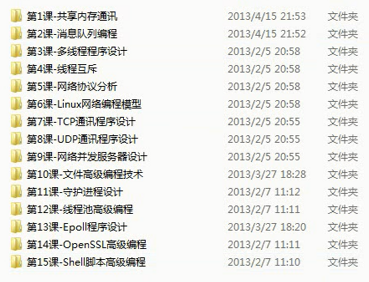
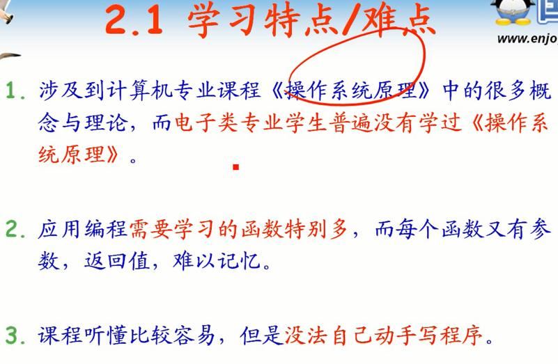
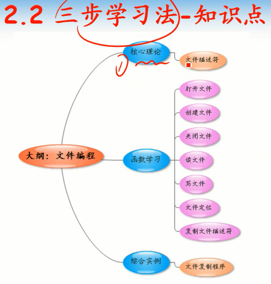
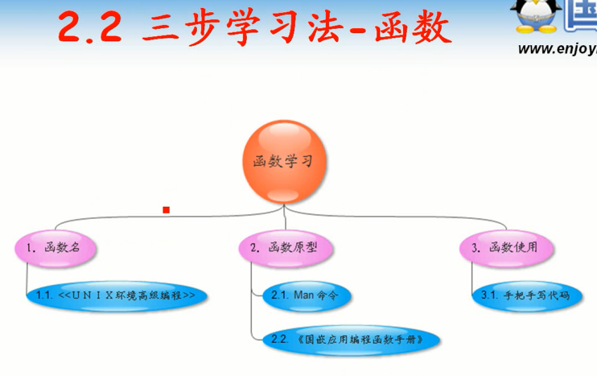
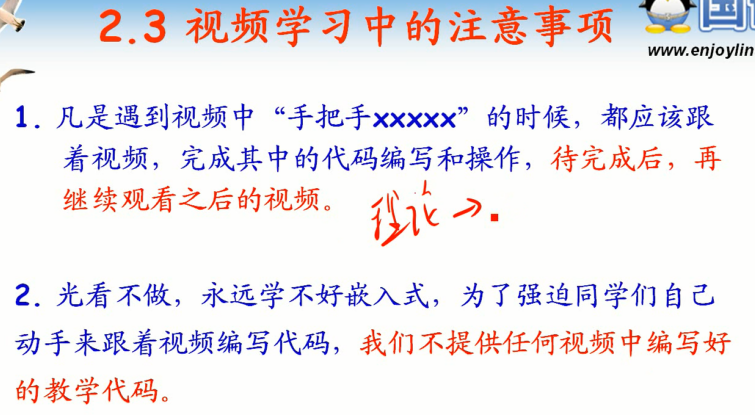

<!-- TOC depthFrom:1 depthTo:6 withLinks:1 updateOnSave:1 orderedList:0 -->

- [第1课-课程规划与学习方法](#第1课-课程规划与学习方法)
	- [课程索引](#课程索引)
	- [课程规划](#课程规划)
	- [学习方法](#学习方法)
		- [难点/特点](#难点特点)
		- [三步学习法](#三步学习法)
		- [如何使用视频教学](#如何使用视频教学)
	- [总结](#总结)

<!-- /TOC -->
# 第1课-课程规划与学习方法

> 小应用 大智慧

* 应用开发占比较高的比重，难度要低，工资低
* 底层开发难度高，比重低，工资高

> 开发和研发

* 开发 development
* 研发 research & development

重视应用开发，不吃亏

## 课程索引

## 课程规划

## 学习方法

### 难点/特点

### 三步学习法

### 如何使用视频教学

## 总结
