<!-- TOC depthFrom:1 depthTo:6 withLinks:1 updateOnSave:1 orderedList:0 -->

- [第2课-GDB程序调试](#第2课-gdb程序调试)
	- [GDB简介](#gdb简介)
	- [GDB使用流程](#gdb使用流程)
	- [GDB命令](#gdb命令)
	- [总结](#总结)

<!-- /TOC -->
# 第2课-GDB程序调试

逻辑问题一般会需要调试器跟踪调试

## GDB简介

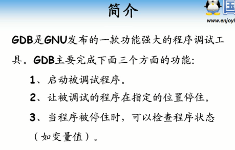

## GDB使用流程

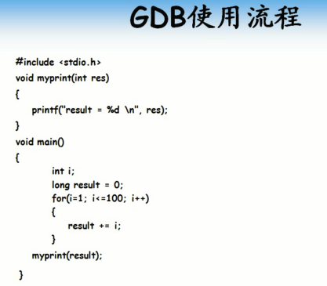

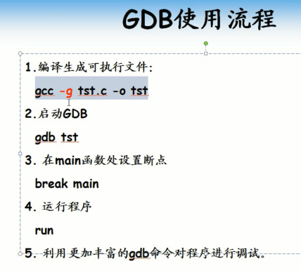

      -g 编译结果附带调试信息

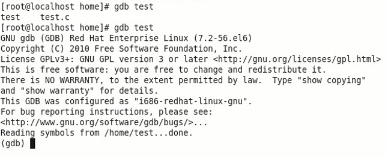

      设置断点 break main

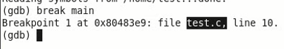

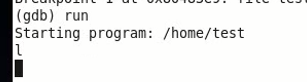

## GDB命令

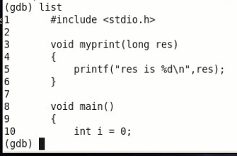

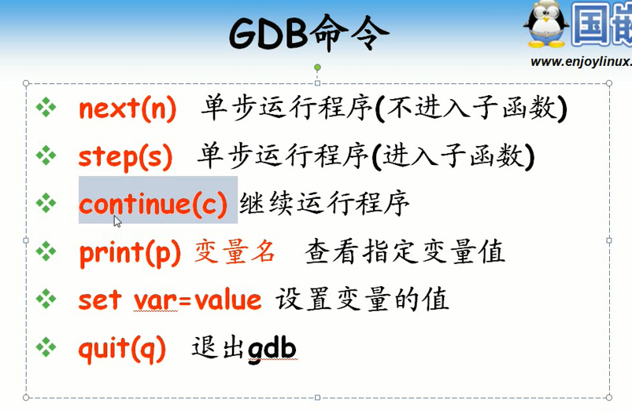

      连续输入会不断输出其后，不重复

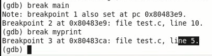

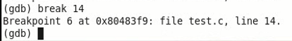

      如果有多个源文件编译而成

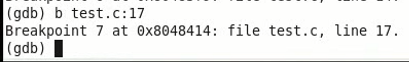

      查看断点

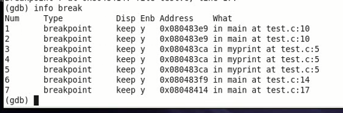

      删除断点

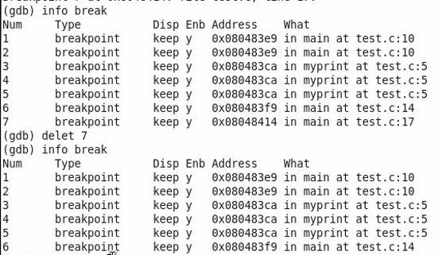

      next 单步执行

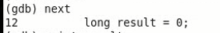

      print 查看变量值

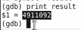

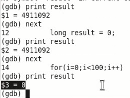

      continue 运行直到遇到下一个断点

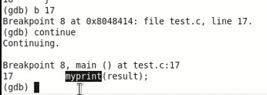

      step 单步步入

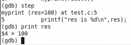

      quit退出

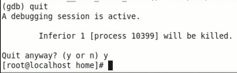

## 总结
