<!-- TOC depthFrom:1 depthTo:6 withLinks:1 updateOnSave:1 orderedList:0 -->

- [第3课-Coredump程序故障分析](#第3课-coredump程序故障分析)
	- [CoreDump定义](#coredump定义)
	- [Segment fault](#segment-fault)
	- [Core Dump使能](#core-dump使能)
	- [Core文件分析](#core文件分析)
	- [实例1-访问空指针](#实例1-访问空指针)
	- [实例2-访问只读内存](#实例2-访问只读内存)
	- [总结](#总结)

<!-- /TOC -->
# 第3课-Coredump程序故障分析

      程序比较大的时候怎么调试？

## CoreDump定义

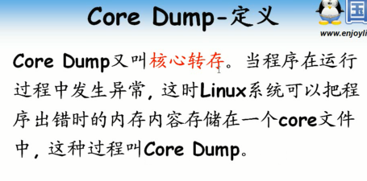

      Core Dump就是一种机制，能够把程序出错时内存内容存储到一个core文件中
      分析这个core文件即可

## Segment fault

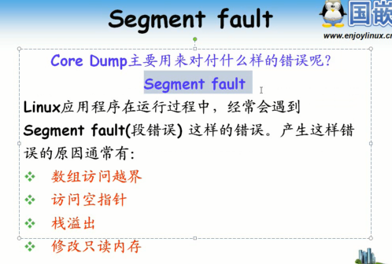

## Core Dump使能

      Linux该功能默认关闭

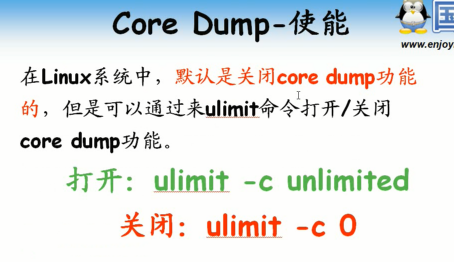

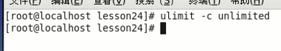

## Core文件分析

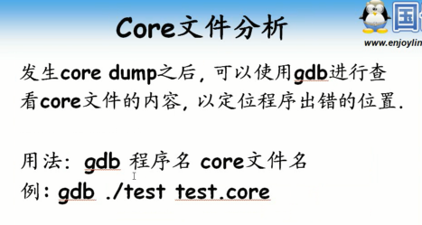

      程序当前目录下core文件

## 实例1-访问空指针

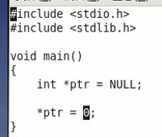

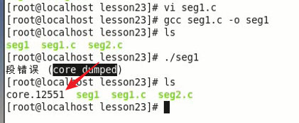

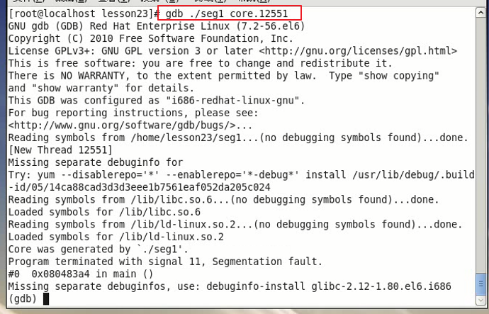

      gdb调试程序的时候必须保证有调试信息，不然调试很麻烦，很多符号没有别名，让人懵逼
      记得编译的时候加-g选项

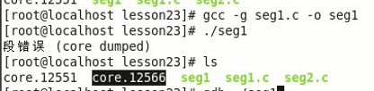

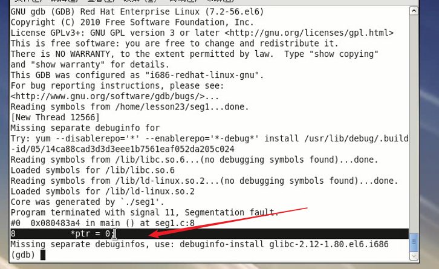

      直接定位到代码行，去修改举行了。so easy!

## 实例2-访问只读内存

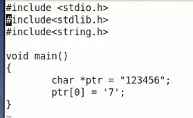

      企图修改字符串

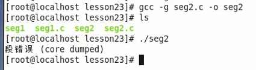

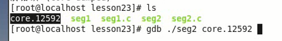

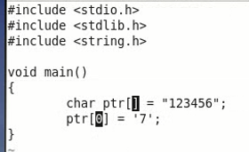

      修改成字符串数组就可以用了。

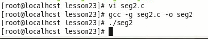

## 总结
