<!-- TOC depthFrom:1 depthTo:6 withLinks:1 updateOnSave:1 orderedList:0 -->

- [第4课-Linux应用程序地址布局](#第4课-linux应用程序地址布局)
	- [程序构成](#程序构成)
	- [内存分布](#内存分布)
	- [查看程序各个段](#查看程序各个段)
	- [各个段的内容](#各个段的内容)
	- [如何显示段的详细信息](#如何显示段的详细信息)
	- [总结](#总结)

<!-- /TOC -->
# 第4课-Linux应用程序地址布局

      Linux运行时在内存中地址分布如何？
      变量放在哪里？
      常量放在哪里?
      堆栈从哪里开辟？

## 程序构成

      堆栈就是栈
      堆是堆
      堆栈不是堆

## 内存分布

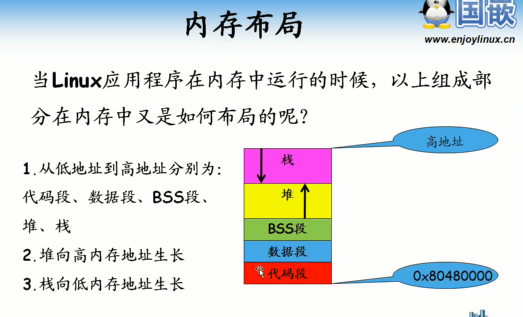

      代码段固定在0x80480000(虚拟地址)
      堆是低地址往高地址，栈是高地址往低地址

## 查看程序各个段

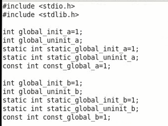

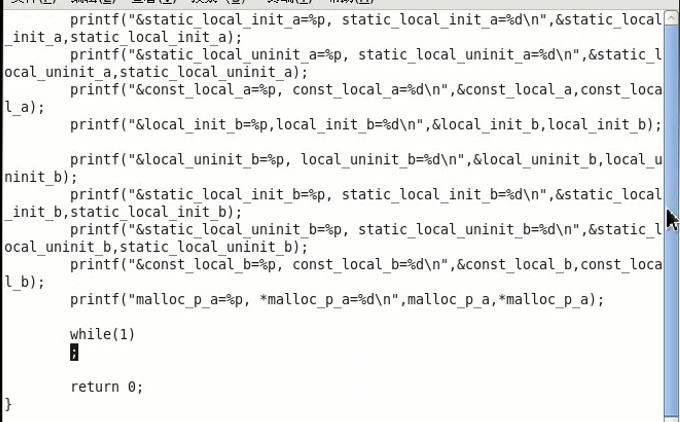

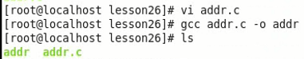

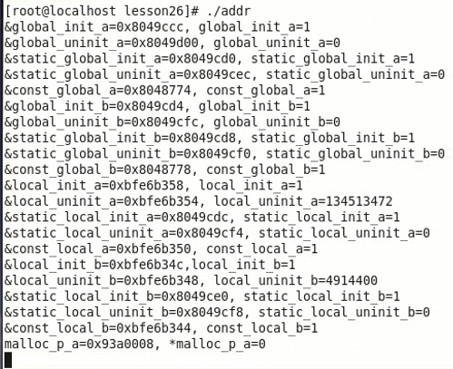

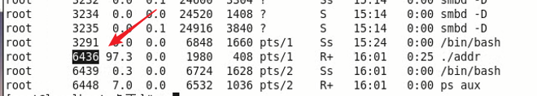

      通过/proc伪文件系统查看进程地址空间布局

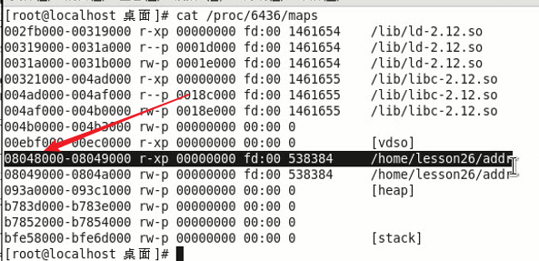

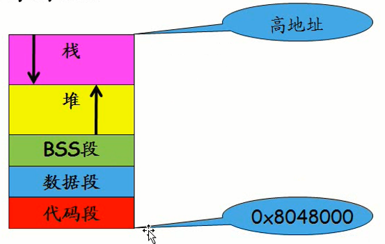

## 各个段的内容

* 全局初始化
* 全局未初始化
* 全局静态初始化
* 全局静态未初始化
* 全局常量
* 局部初始化变量
* 局部未初始化
* 静态局部初始化
* 静态局部未初始化
* 局部常量
* 通过malloc分配得到的局部堆内存

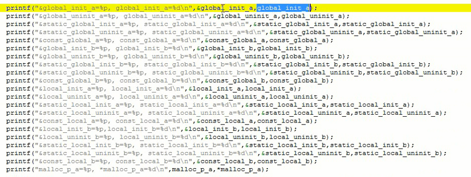

      打印变量的地址和值

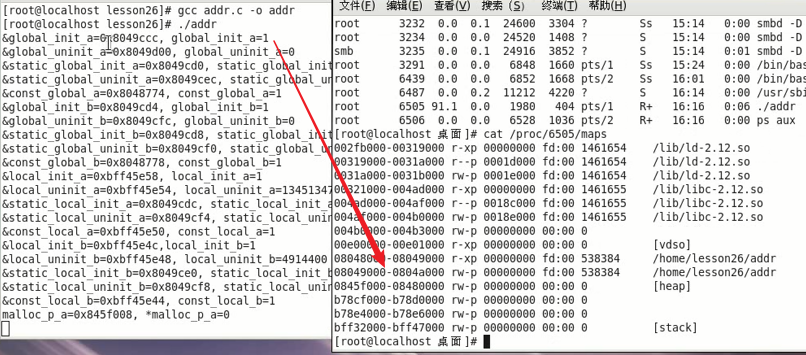

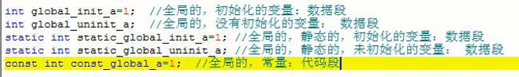

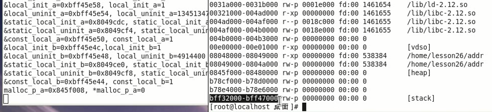

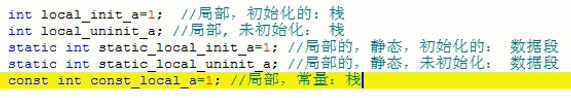

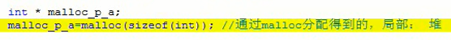

      代码段：代码、全局常量、字符串常量
      数据段：全局变量、静态变量
      堆：动态分配的变量
      栈：局部变量，不包含静态变量

## 如何显示段的详细信息

## 总结
