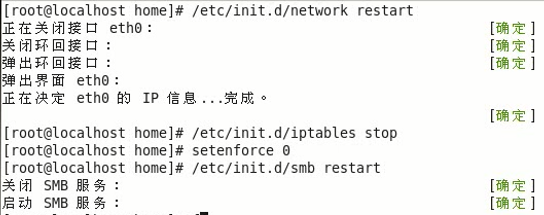
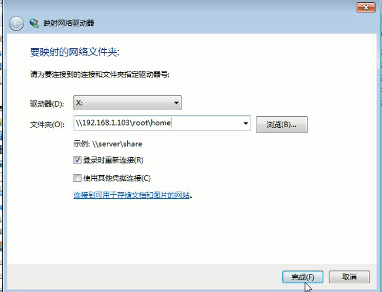
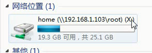
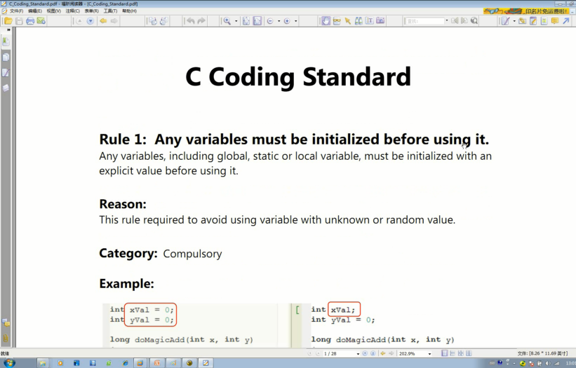
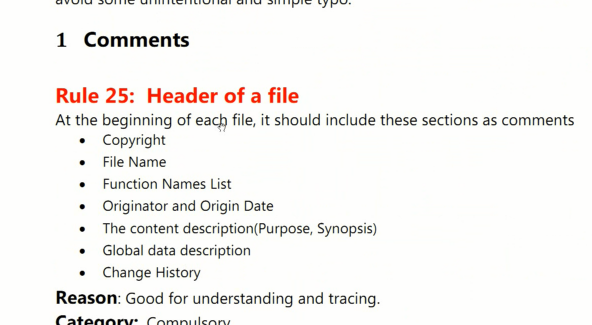
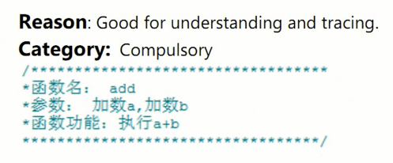
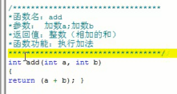
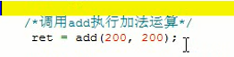
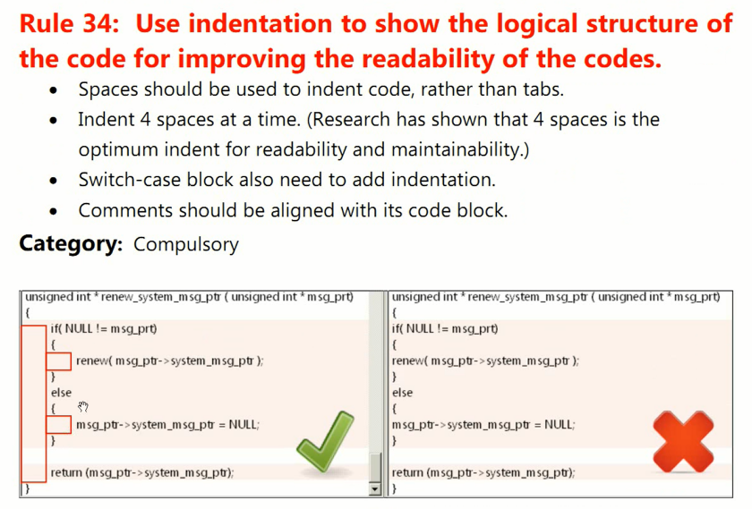

<!-- TOC depthFrom:1 depthTo:6 withLinks:1 updateOnSave:1 orderedList:0 -->

- [第5课-Linux编程规范](#第5课-linux编程规范)
	- [必知必会samba映射网络驱动器](#必知必会samba映射网络驱动器)
	- [开发规则](#开发规则)
	- [Linux应用程序编程规范](#linux应用程序编程规范)
		- [程序必须有头注释](#程序必须有头注释)
		- [函数必须有头注释](#函数必须有头注释)
		- [注释采用斜杠星](#注释采用斜杠星)
		- [缩进/括号对齐](#缩进括号对齐)
	- [总结](#总结)

<!-- /TOC -->
# 第5课-Linux编程规范

## 必知必会samba映射网络驱动器

## 开发规则

## Linux应用程序编程规范

      大公司人手多，不遵循规范，其他人看起来会很恼火的哦~

      红色rule为必须遵守

### 程序必须有头注释

### 函数必须有头注释

### 注释采用斜杠星

### 缩进/括号对齐

      默认采用四个空格tab缩进，有些编译器设定8个空格tab缩进

## 总结

      C编程规范，参看C-Coding-Standard.pdf
