<!-- TOC depthFrom:1 depthTo:6 withLinks:1 updateOnSave:1 orderedList:0 -->

- [第6课-静态函数库设计](#第6课-静态函数库设计)
	- [外部函数](#外部函数)
	- [函数库分类](#函数库分类)
	- [静态函数库&&动态函数库](#静态函数库动态函数库)
		- [静态函数库](#静态函数库)
		- [动态函数库](#动态函数库)
	- [函数库存放路径](#函数库存放路径)
	- [静态链接库-特点](#静态链接库-特点)
	- [使用静态库](#使用静态库)
	- [制作静态函数库](#制作静态函数库)
	- [使用静态库-编译选项](#使用静态库-编译选项)
	- [创建静态链接库](#创建静态链接库)
	- [总结](#总结)

<!-- /TOC -->
# 第6课-静态函数库设计

## 外部函数

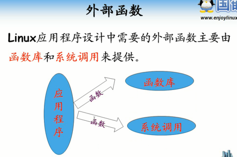

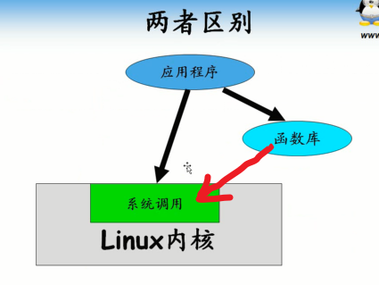

      函数库其实就是封装了系统调用，视频讲的有错误

## 函数库分类

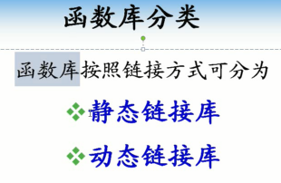

      根据链接方式不同划分

## 静态函数库&&动态函数库

### 静态函数库

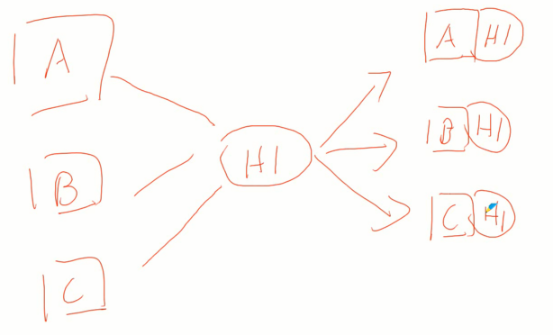

      每一个程序都有库函数备份

### 动态函数库

      内存中只有一份拷贝，其余皆引用该拷贝。更加节省空间。

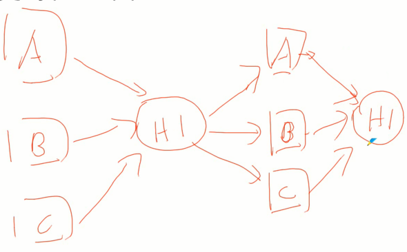

## 函数库存放路径

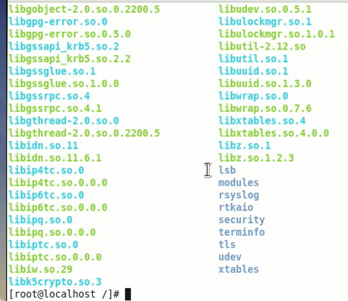

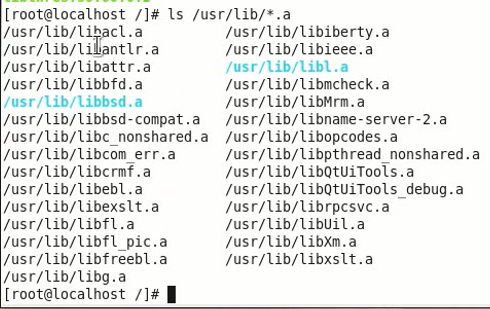

## 静态链接库-特点

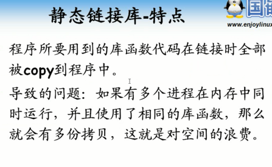

      空间浪费

## 使用静态库

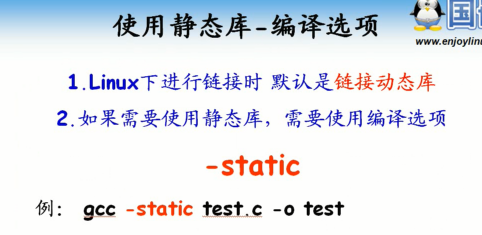

      Linux默认是用动态库，需要指定参数才能静态库 -static

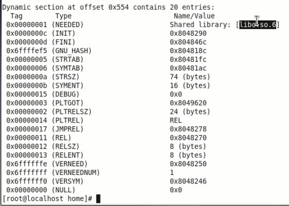

      无法找到静态c库，没有找到？怎么给？

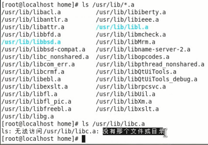

      系统库路径找不到静态c库，怎么办？
      红帽企业版6默认没有提供静态c库。安装包安装即可

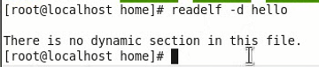

      程序和库的结合体。体积更大。100多倍体积

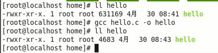

## 制作静态函数库

      做成只编译不链接的文件，然后打包

## 使用静态库-编译选项

      默认情况下Linux只会链接C库，要使用其他库就要用-l指定库

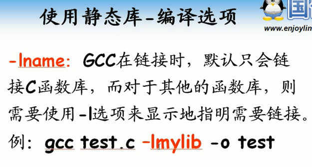

      库命名一般lib开头，库类型结尾.a或.so
      引用其他库只需要中间部分，不需要开头和结尾

## 创建静态链接库

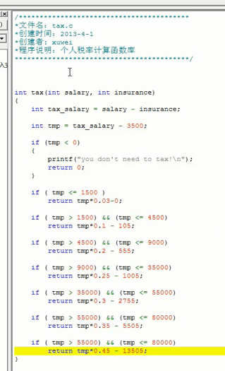

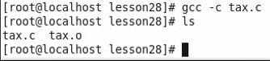

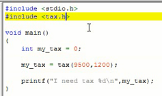

## 总结

      -static
