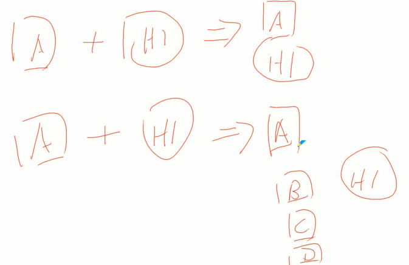
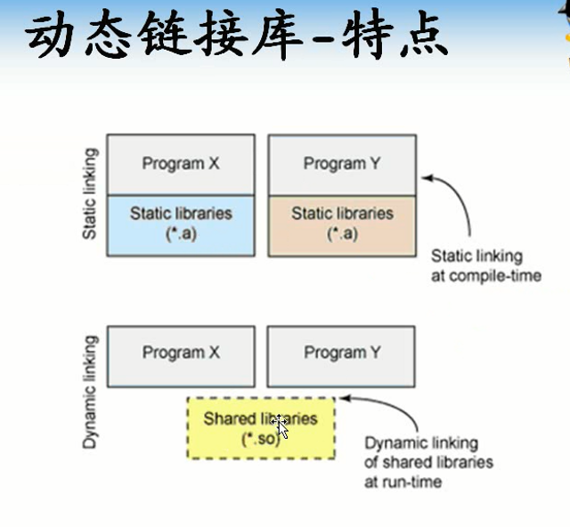
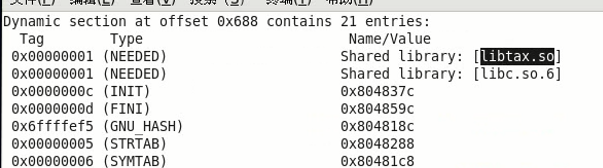

<!-- TOC depthFrom:1 depthTo:6 withLinks:1 updateOnSave:1 orderedList:0 -->

- [第7课-动态函数库设计](#第7课-动态函数库设计)
	- [动态链接库特点](#动态链接库特点)
	- [动态函数库的制作](#动态函数库的制作)
	- [总结](#总结)

<!-- /TOC -->
# 第7课-动态函数库设计

## 动态链接库特点

## 动态函数库的制作

      gcc -c mylib.c -o mylib.o
      gcc -shared -fPIC mylib.o -o libmylib.so
      cp libmylib.so /usr/lib/

## 总结

    -shared
