<!-- TOC depthFrom:1 depthTo:6 withLinks:1 updateOnSave:1 orderedList:0 -->

- [第8课-系统调用方式文件编程](#第8课-系统调用方式文件编程)
	- [课程索引](#课程索引)
	- [文件描述符](#文件描述符)
	- [函数学习-文件操作](#函数学习-文件操作)
	- [学习方法](#学习方法)
	- [打开文件open](#打开文件open)
		- [函数名](#函数名)
		- [函数原型](#函数原型)
		- [函数功能](#函数功能)
		- [头文件依赖](#头文件依赖)
		- [返回值](#返回值)
		- [参数说明](#参数说明)
		- [实例程序](#实例程序)
	- [创建文件-creat](#创建文件-creat)
		- [函数名](#函数名)
		- [函数原型](#函数原型)
		- [函数功能](#函数功能)
		- [头文件依赖](#头文件依赖)
		- [返回值](#返回值)
		- [参数pathname](#参数pathname)
		- [参数mode](#参数mode)
		- [实例程序](#实例程序)
	- [关闭文件](#关闭文件)
		- [函数名](#函数名)
		- [函数原型](#函数原型)
		- [函数功能](#函数功能)
		- [头文件依赖](#头文件依赖)
		- [返回值](#返回值)
		- [参数](#参数)
		- [实例程序](#实例程序)
	- [读文件](#读文件)
		- [函数名](#函数名)
		- [函数原型](#函数原型)
		- [函数功能](#函数功能)
		- [头文件依赖](#头文件依赖)
		- [返回值](#返回值)
		- [参数](#参数)
		- [实例程序](#实例程序)
	- [写文件](#写文件)
		- [函数名](#函数名)
		- [函数原型](#函数原型)
		- [函数功能](#函数功能)
		- [头文件依赖](#头文件依赖)
		- [返回值](#返回值)
		- [参数](#参数)
		- [实例程序](#实例程序)
	- [定位文件](#定位文件)
		- [文件读写指针](#文件读写指针)
		- [函数名](#函数名)
		- [函数原型](#函数原型)
		- [函数功能](#函数功能)
		- [头文件依赖](#头文件依赖)
		- [返回值](#返回值)
		- [参数](#参数)
		- [实例程序](#实例程序)
	- [复制文件描述符](#复制文件描述符)
		- [函数名](#函数名)
		- [函数原型](#函数原型)
		- [函数功能](#函数功能)
		- [头文件依赖](#头文件依赖)
		- [返回值](#返回值)
		- [参数](#参数)
		- [实例程序](#实例程序)
	- [综合实例-实现文件复制cp](#综合实例-实现文件复制cp)
		- [打开源文件](#打开源文件)
		- [打开目标文件](#打开目标文件)
		- [读取源文件数据写入目标文件](#读取源文件数据写入目标文件)
		- [关闭文件描述符](#关闭文件描述符)
		- [运行测试](#运行测试)
	- [总结](#总结)

<!-- /TOC -->
# 第8课-系统调用方式文件编程

## 课程索引

## 文件描述符

      性质：就是一串数字，每个进程都有一组文件描述符。也就是说不通进程编号可以一样。
      典型的标准描述符0,1,2
      0-标准输入
      1-标准输出
      2-标准错误

## 函数学习-文件操作

      掌握学习方法

## 学习方法

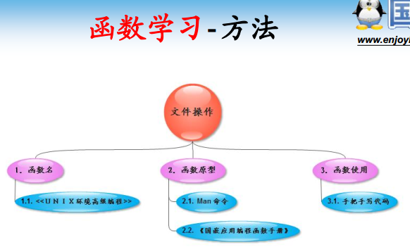

## 打开文件open

### 函数名

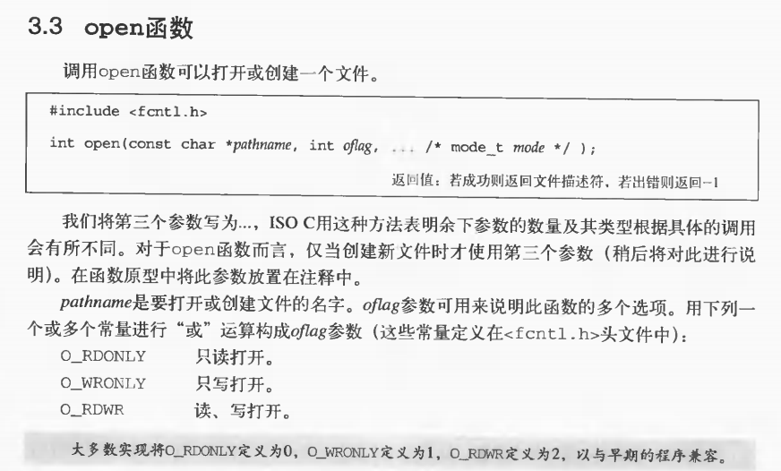

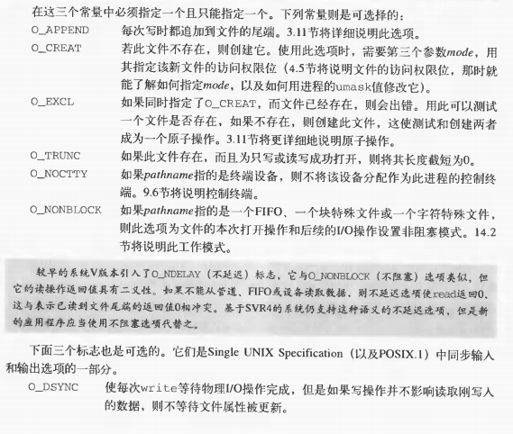

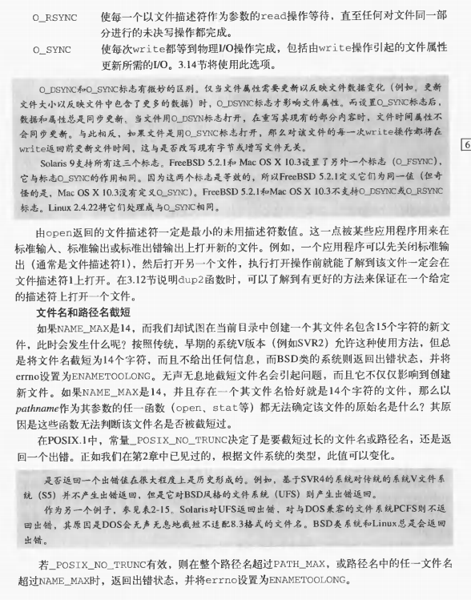

### 函数原型

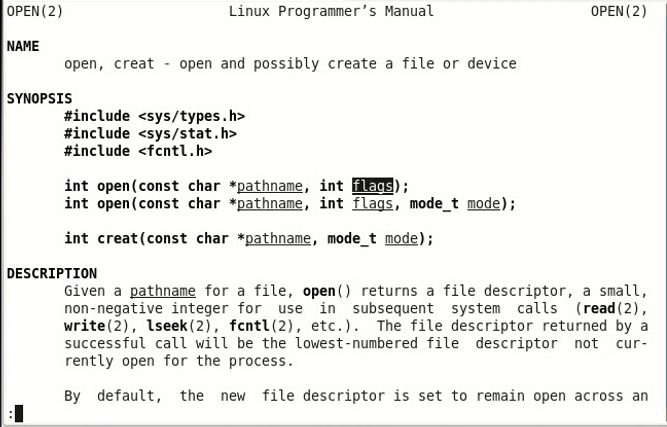

### 函数功能

### 头文件依赖

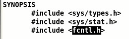

### 返回值

      成功返回文件描述符，失败返回-1

### 参数说明

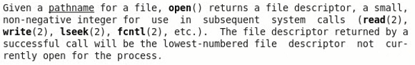

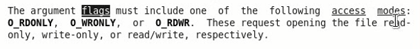

      必须包含三个权限中的一个。当然其他标志可选包含
      O_APPEND:以追加形式打开文件
      O_CREAT:如果打开文件不存在则创建文件。如果设定了就必须有第三个参数，设定文件权限，同chmod

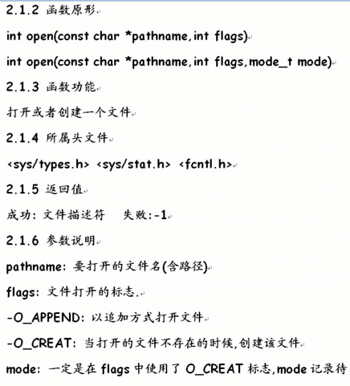

### 实例程序

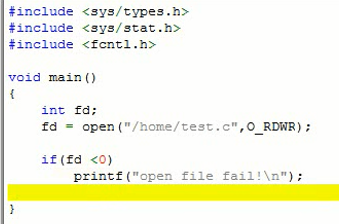

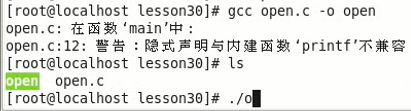

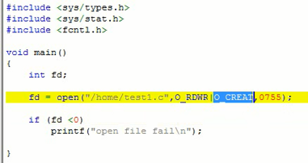

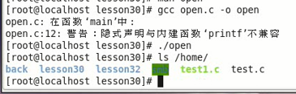

## 创建文件-creat

### 函数名

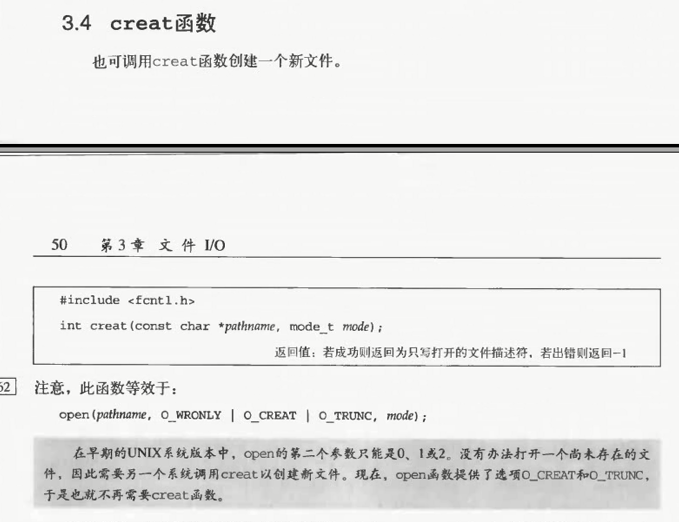

### 函数原型

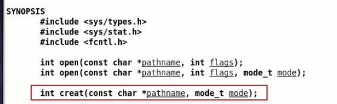

      与open公用一个说明手册

### 函数功能

创建一个文件并以flag方式操作文件

### 头文件依赖

### 返回值

      成功返回文件描述符，失败返回-1

### 参数pathname

      创建的文件名-包含路径

### 参数mode

      创建文件的读写权限

### 实例程序

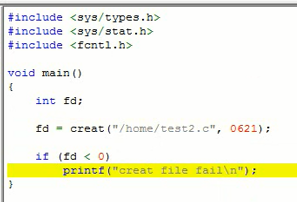

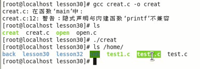

## 关闭文件

### 函数名

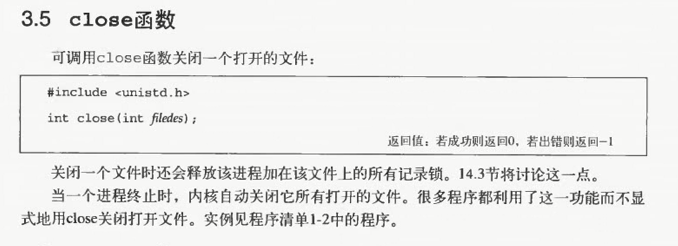

### 函数原型

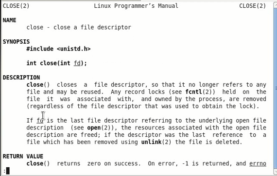

### 函数功能

      关闭文件描述符

### 头文件依赖

### 返回值

### 参数

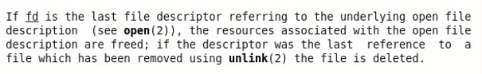

      fd为待关闭的文件描述符

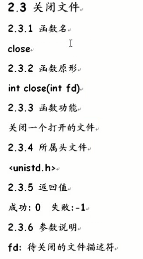

### 实例程序

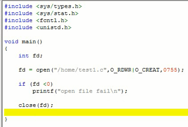

## 读文件

### 函数名

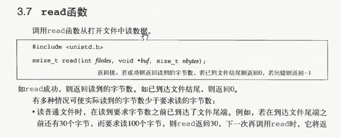

### 函数原型

      指定章节

### 函数功能

      从一个打开的文件读取数据

### 头文件依赖

### 返回值

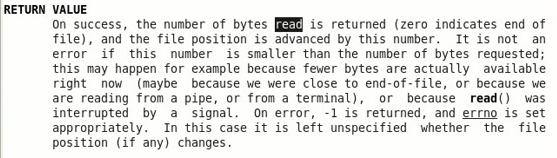

### 参数

      fd:要读取的文件描述符
      buf:提供的缓冲区
      count:指定读取大小

      从哪里开始读？

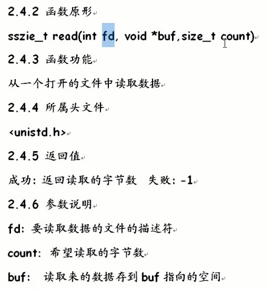

### 实例程序

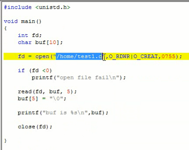

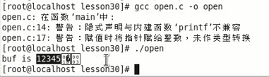

## 写文件

### 函数名

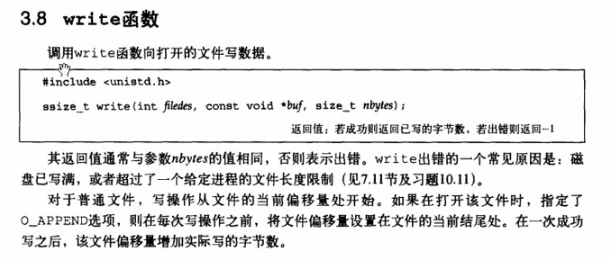

### 函数原型

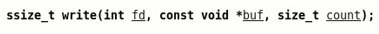

      原型跟read极度相似

### 函数功能

      给定文件描述符写入buf的count字节

### 头文件依赖

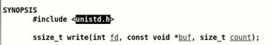

### 返回值

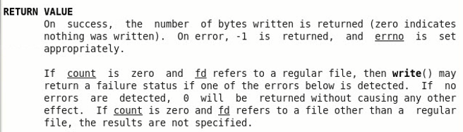

      返回写入字节数，失败固定-1

### 参数

      fd:要写入的文件描述符
      buf:提供的缓冲区
      count:指定从buf写入数据大小

### 实例程序

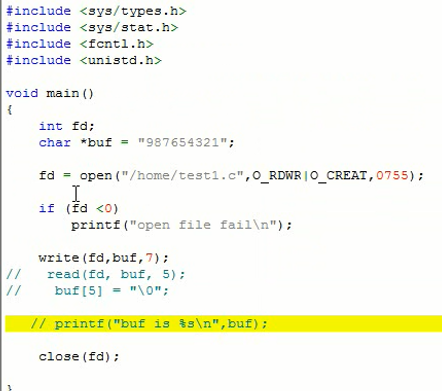

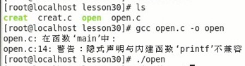

## 定位文件

### 文件读写指针

      文件游标，随着读写移动。当前文件偏移量

### 函数名

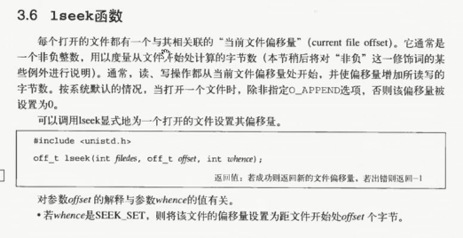

### 函数原型

### 函数功能

      重新定位文件读写位置

### 头文件依赖

### 返回值

      返回偏移位置，距离文件头的位置，非负数
      错误返回-1

### 参数

      fd:要写入的文件描述符
      offset:
      whence:提供的缓冲区

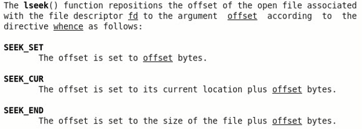

      SEEK_SET:以offset为准，或者说从文件头开始
      SEEK_CUR:以当前位置+/-offset为准
      SEEK_END:以文件结尾-offset为准，应该为负数，不然返回错误

有offset和whence共同决定偏移指针
offset可正可负，向前移，向后移

### 实例程序

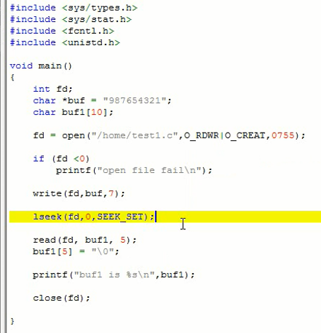

## 复制文件描述符

### 函数名

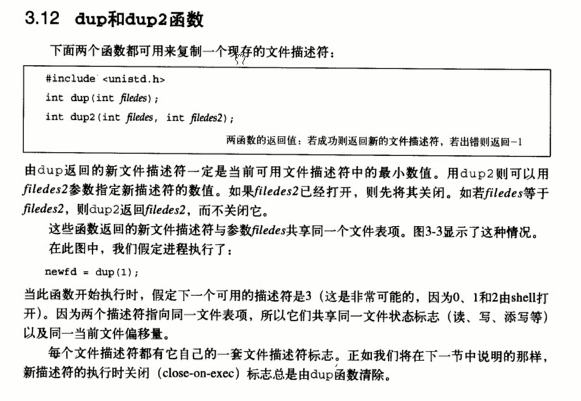

### 函数原型

### 函数功能

      复制文件描述符

### 头文件依赖

### 返回值

### 参数

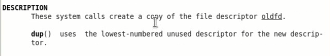

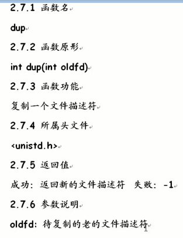

### 实例程序

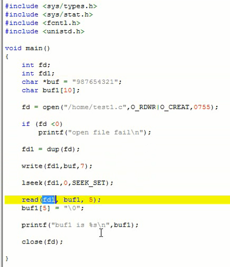

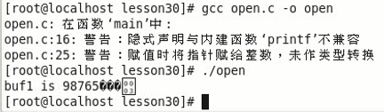

## 综合实例-实现文件复制cp

      需要两个参数

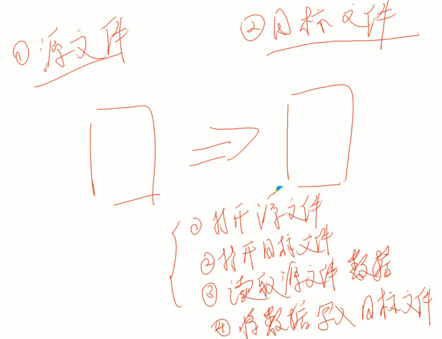

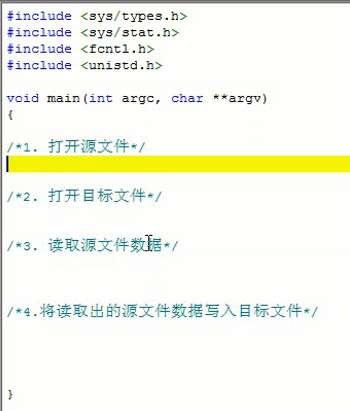

### 打开源文件

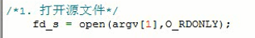

### 打开目标文件

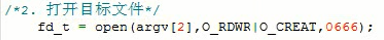

### 读取源文件数据写入目标文件

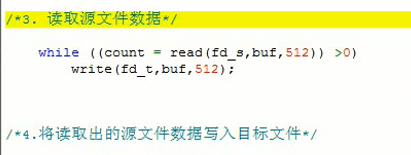

### 关闭文件描述符

### 运行测试

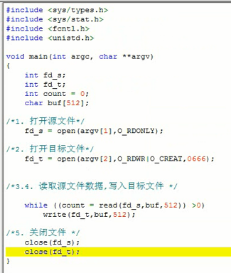

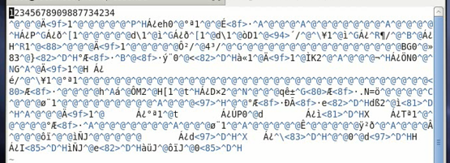

      拷贝多了，应该写入读取的字节数，而不是固定512字节，改改源码就可以了

## 总结

      《UNIX环境高级编程》结合man手册编程

      man分章节
      1、所有用户可以使用的命令
      2、系统内核调用，不是每个命令都有系统调用（如：man 2 read）
      3、库调用
      4、特殊文件，如：/dev/tty1
      5、文件格式（命令配置文件的语法，如：man 5 passwd）
      6、游戏相关
      7、杂项
      8、管理员命令，如：fdisk
      man chapter
      1、Standard commands （标准命令）
      2、System calls （系统调用）
      3、Library functions （库函数）
      4、Special devices （设备说明）
      5、File formats （文件格式）
      6、Games and toys （游戏和娱乐）
      7、Miscellaneous （杂项）
      8、Administrative Commands （管理员命令）
