<!-- TOC depthFrom:1 depthTo:6 withLinks:1 updateOnSave:1 orderedList:0 -->

- [第9课-库函数方式文件编程](#第9课-库函数方式文件编程)
	- [课程索引](#课程索引)
	- [库函数](#库函数)
	- [流](#流)
	- [文件指针](#文件指针)
	- [文件操作](#文件操作)
	- [学习方法](#学习方法)
	- [打开流](#打开流)
		- [函数名](#函数名)
		- [函数原型](#函数原型)
		- [函数功能](#函数功能)
		- [函数头文件](#函数头文件)
		- [函数返回值](#函数返回值)
		- [函数参数](#函数参数)
		- [编程实例](#编程实例)
	- [关闭流](#关闭流)
		- [函数名](#函数名)
		- [函数原型](#函数原型)
		- 
	- [总结](#总结)

<!-- /TOC -->
# 第9课-库函数方式文件编程

## 课程索引

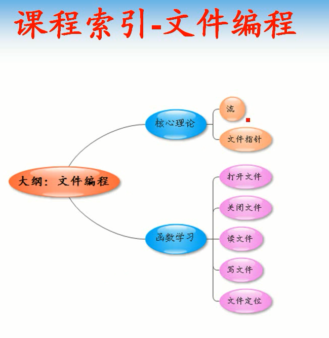

      区别于上一课，本科采用库函数方式操作文件

## 库函数

      库函数不单单方便了可移植性，也提高接口程序编程规范

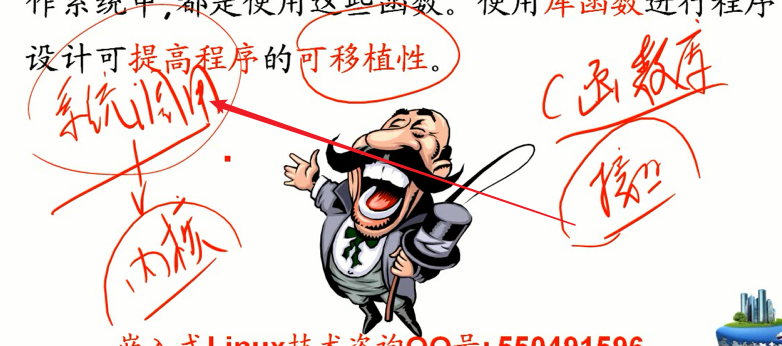

## 流

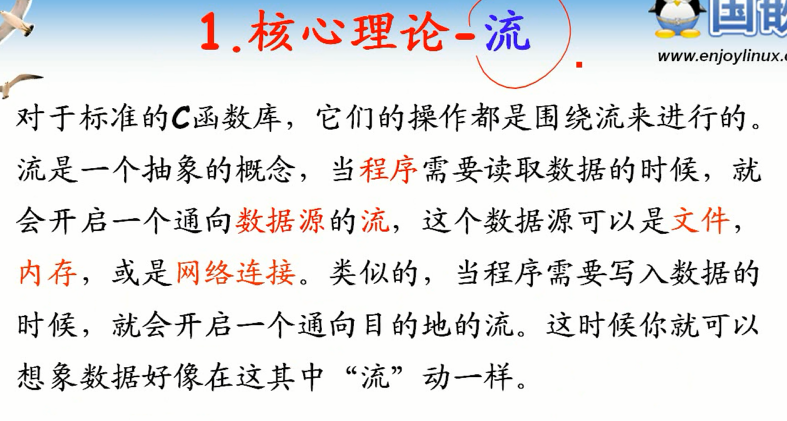

      动态概念，建立在源和目的的动态概念
      利用通道获取数据

## 文件指针

      文件描述符（整数） == 文件指针

## 文件操作

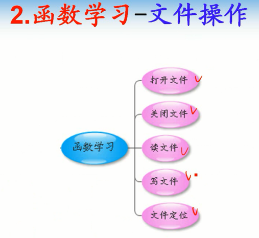

      对比系统调用学习

## 学习方法

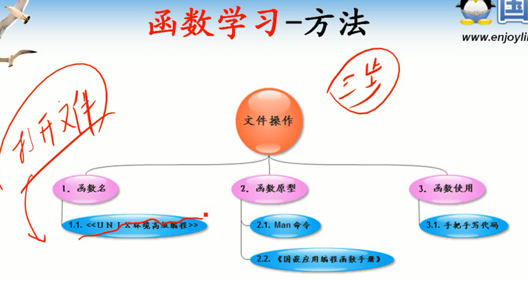

      找函数名
      找函数原型
      找头文件依赖
      找函数功能
      找函数参数
      找函数返回值

## 打开流

### 函数名

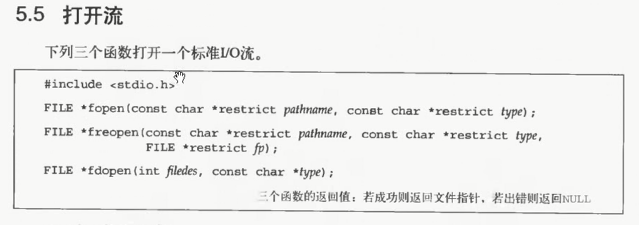

### 函数原型

### 函数功能

### 函数头文件

### 函数返回值

      返回文件指针区别于返回文件描述符
      失败返回NULL指针区别于返回-1

### 函数参数

      path:文件路径，包含相对绝对路径
      mode:文件打开模式

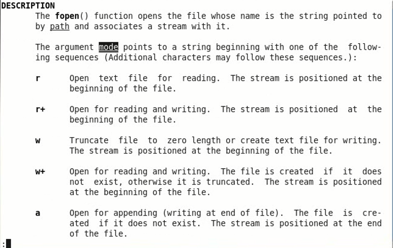

      r+：文件不存在不会自己创建，但是存在可读写
      w+：文件不存在创建，并且可读写

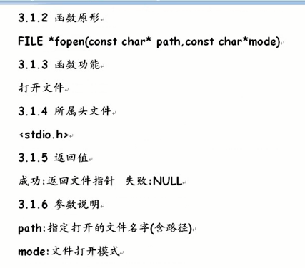

### 编程实例

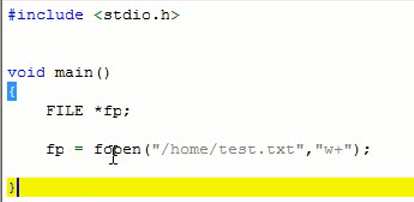

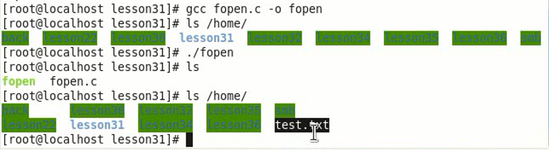

## 关闭流

### 函数名

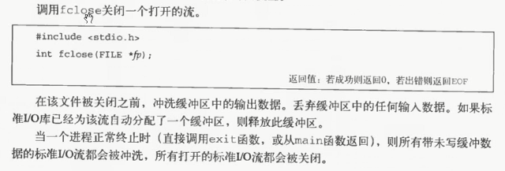

### 函数原型

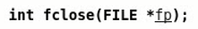

###

## 总结
