<!-- TOC depthFrom:1 depthTo:6 withLinks:1 updateOnSave:1 orderedList:0 -->

- [第9课-库函数方式文件编程](#第9课-库函数方式文件编程)
	- [课程索引](#课程索引)
	- [库函数](#库函数)
	- [流](#流)
	- [文件指针](#文件指针)
	- [文件操作](#文件操作)
	- [学习方法](#学习方法)
	- [打开流](#打开流)
		- [函数名](#函数名)
		- [函数原型](#函数原型)
		- [函数功能](#函数功能)
		- [函数头文件](#函数头文件)
		- [函数返回值](#函数返回值)
		- [函数参数](#函数参数)
		- [编程实例](#编程实例)
	- [关闭流](#关闭流)
		- [函数名](#函数名)
		- [函数原型](#函数原型)
		- [函数功能](#函数功能)
		- [头文件](#头文件)
		- [返回值](#返回值)
		- [参数](#参数)
		- [编程实例](#编程实例)
	- [读文件fread](#读文件fread)
		- [函数名称](#函数名称)
		- [函数原型](#函数原型)
		- [函数功能](#函数功能)
		- [头文件](#头文件)
		- [返回值](#返回值)
		- [参数](#参数)
		- [编程实例](#编程实例)
	- [写文件fwrite](#写文件fwrite)
		- [函数名称](#函数名称)
		- [函数原型](#函数原型)
		- [函数功能](#函数功能)
		- [头文件](#头文件)
		- [返回值](#返回值)
		- [参数](#参数)
		- [编程实例](#编程实例)
	- [定位文件](#定位文件)
		- [函数名称](#函数名称)
		- [函数原型](#函数原型)
		- [函数功能](#函数功能)
		- [头文件](#头文件)
		- [返回值](#返回值)
		- [参数](#参数)
		- [编程实例](#编程实例)
	- [总结](#总结)

<!-- /TOC -->
# 第9课-库函数方式文件编程

## 课程索引

      区别于上一课，本科采用库函数方式操作文件

## 库函数

      库函数不单单方便了可移植性，也提高接口程序编程规范

## 流

      动态概念，建立在源和目的的动态概念
      利用通道获取数据

## 文件指针

      文件描述符（整数） == 文件指针

## 文件操作

      对比系统调用学习

## 学习方法

      找函数名
      找函数原型
      找头文件依赖
      找函数功能
      找函数参数
      找函数返回值

## 打开流

### 函数名

### 函数原型

### 函数功能

### 函数头文件

### 函数返回值

      返回文件指针区别于返回文件描述符
      失败返回NULL指针区别于返回-1

### 函数参数

      path:文件路径，包含相对绝对路径
      mode:文件打开模式

      r+：文件不存在不会自己创建，但是存在可读写
      w+：文件不存在创建，并且可读写

### 编程实例

## 关闭流

### 函数名

### 函数原型

### 函数功能

			关闭文件指针

### 头文件

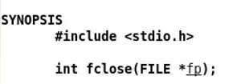

### 返回值

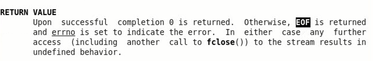

			EOF:END OF FILE

### 参数

			文件指针

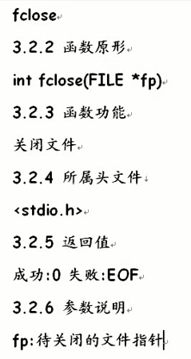

### 编程实例

## 读文件fread

### 函数名称

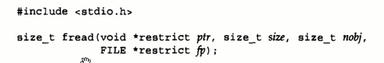

### 函数原型

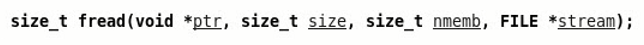

### 函数功能

			从文件中读取数据

### 头文件

### 返回值

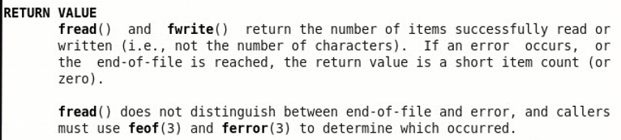

			返回成功读取到的数据量，失败返回0

### 参数

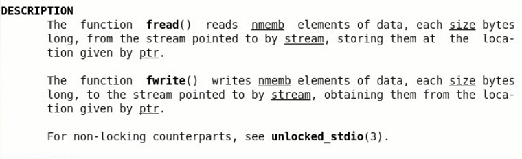

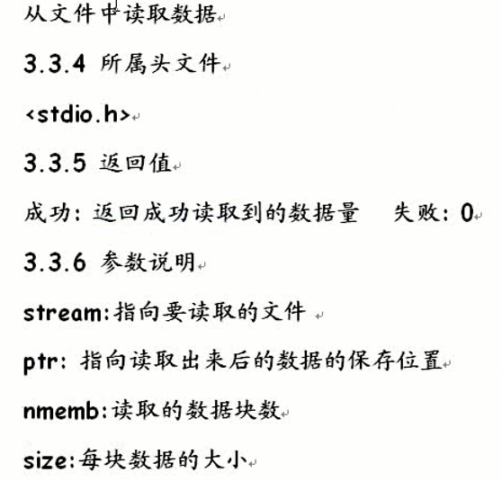

### 编程实例

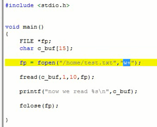

			执行后文件空了~

			w+参数，如果文件存在就会清空

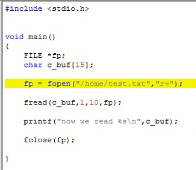

			文件已经存在使用r+

			记得加结束符

## 写文件fwrite

### 函数名称

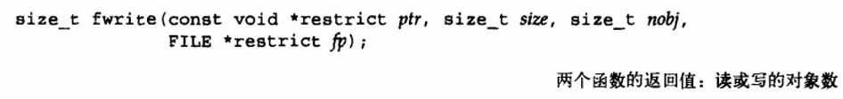

### 函数原型

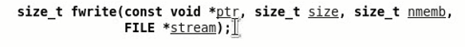

### 函数功能

			向文件写入数据

### 头文件

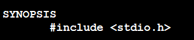

### 返回值

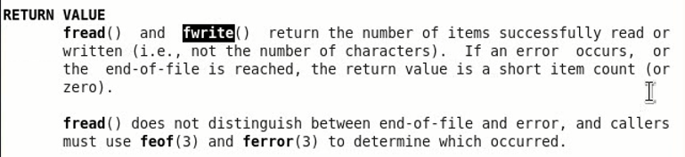

			返回成功写入的数据量。失败返回0

### 参数

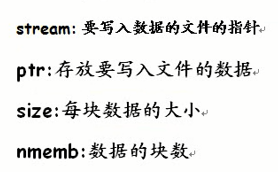

### 编程实例

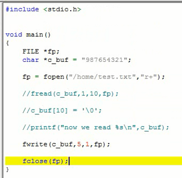

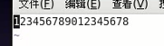

## 定位文件

### 函数名称

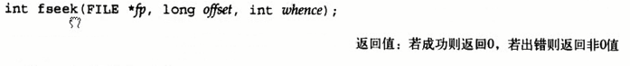

### 函数原型

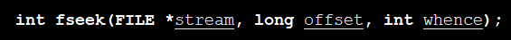

### 函数功能

### 头文件

### 返回值

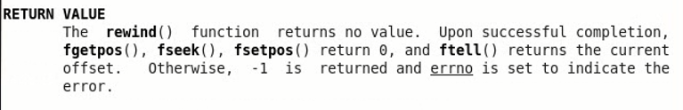

			成功返回0，失败返回-1

### 参数

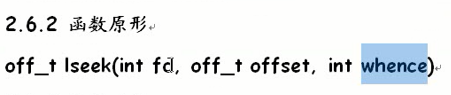

			区别于系统调用函数

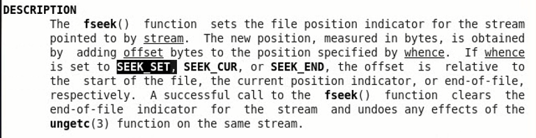

### 编程实例

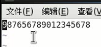

## 总结

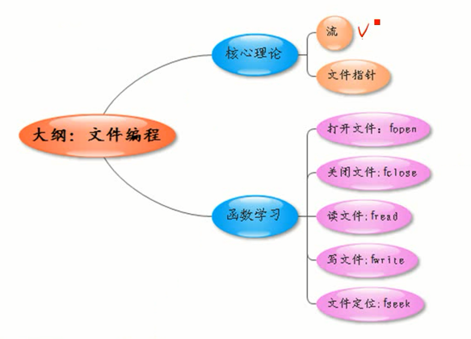
