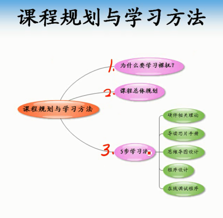
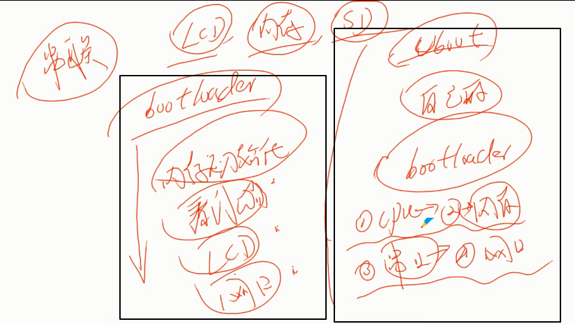
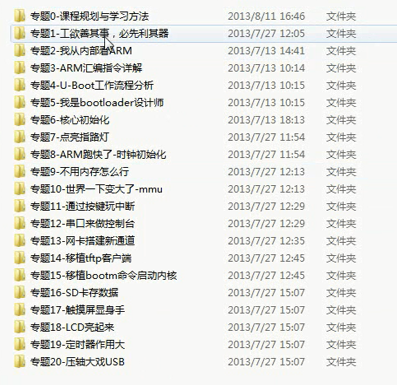
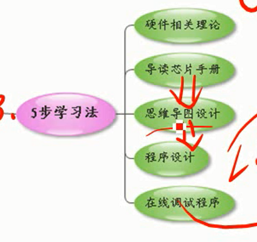

# 专题0-课程规划与学习方法

裸奔吧-ARM

* 为什么要学习裸机开发？

更深入了解硬件

什么时候会用到？应该不会像单片机时代在裸机上跑

现阶段更多可能是在某某系统基础上跑程序，比如Android，典型的Android系统的移植，
bootloader设计

还有一种，Linux驱动，包括软硬件设计，必须准守特定规范，你除了自身功能，接口规范才能运行。虽然驱动有些不涉及硬件，但是接口规范是不可少的。

基于以上两点

**bootloader**

**嵌入式驱动程序**

这两点才是真正要学的，以后可能用的，有意义价值的。

* 学习方法

如何串联知识？你可以认知某个驱动的编写能力，LCD,内存，SD等，但是，最基本的bootloader你会么？

首先bootloader的启动执行涉及到内存初始化，看门狗，LCD，网口。。等等初始化

**基于开源Uboot进行修改设计自己的bootloader，完成CPU、内存、串口、网卡初始化**

这样完成课程后，既学会了bootloader又学会了硬件设备的裸机驱动

* 课程安排

      按照专题来划分，专题可能有多个子专题

      1.开始裸机之前很多工具需要掌握
      2.硬件角度介绍ARM硬件的对比
      3.ARM汇编指令，裸机程序，硬编码
      4.参考Uboot设计，用的最广的bootloader，分析出Uboot工作原理
      5.基于之前的学习，做修改，二次开发
      6.通过led显示测试bootloader运行状况，调试手段，指路明灯
      7.时钟初始化让arm工作在更高频率
      8.内存使用
      9.mmu虚拟地址空间
      10.按键使用对中断有所了解
      11.通过串口输出开机信息
      12.网卡初始化
      13.通过tftp上传下载程序，内核等
      14.bootm启动内核

* 五步学习法

      **工作基本原理**
      **芯片手册阅读**
      **思维导图-流程图**
      **程序设计**
      **在线调试程序**

吹牛皮：学习了，你完全可以说精通，不用熟悉了
