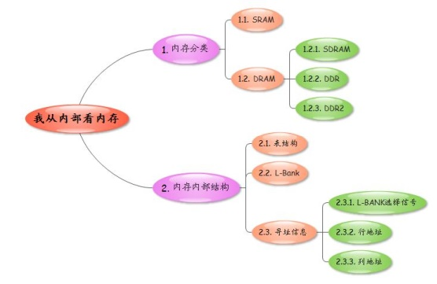
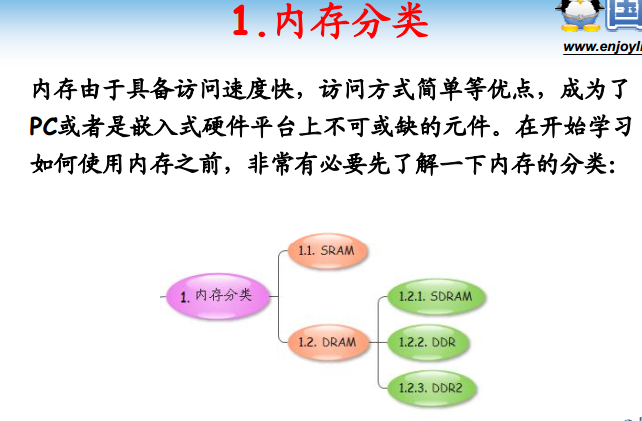
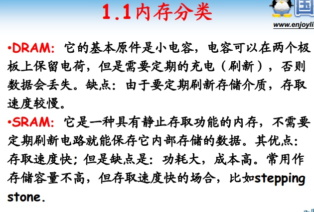
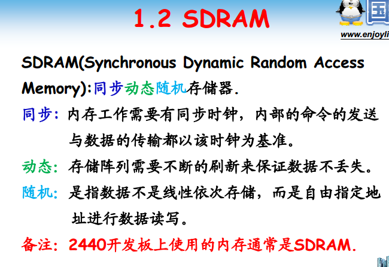
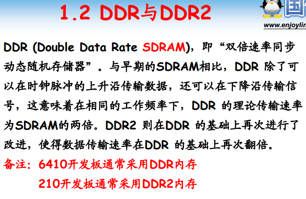
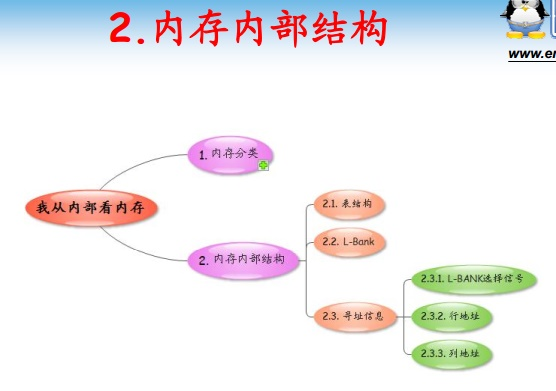
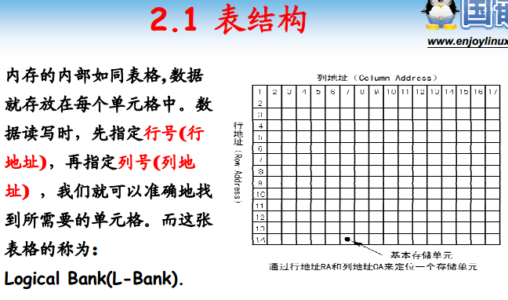
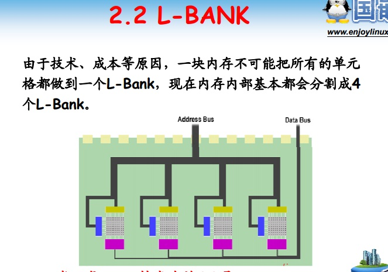
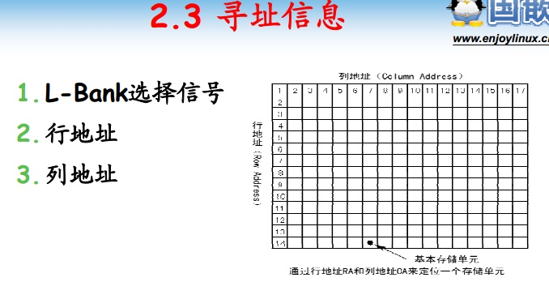
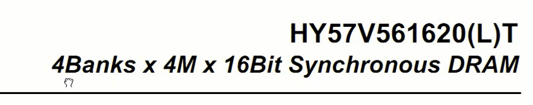

<!-- TOC depthFrom:1 depthTo:6 withLinks:1 updateOnSave:1 orderedList:0 -->

- [专题2-我从内部看ARM](#专题2-我从内部看arm)
	- [课程索引](#课程索引)
	- [内存分类](#内存分类)
	- [DRAM分类](#dram分类)
		- [SDRAM分类](#sdram分类)
		- [DDR与DDR2](#ddr与ddr2)
	- [内存内部结构](#内存内部结构)
		- [表结构](#表结构)
		- [L-BANK](#l-bank)
		- [寻址信息](#寻址信息)
		- [内存容量计算公式](#内存容量计算公式)
	- [总结](#总结)

<!-- /TOC -->

# 专题2-我从内部看ARM

## 课程索引

## 内存分类

      DRAM由很多电容组成，电容需要电荷维持，周期刷新。访问速度比较慢。开发板主要使用
      SRAM不需要定期刷新，访问速度更快，价格高。垫脚石

## DRAM分类

### SDRAM分类

      随机存取

### DDR与DDR2

      上升沿下降沿都可以传输数据，速度比SDRAM快一倍

## 内存内部结构

### 表结构

      内存内部就是一张表。
      行地址
      列地址
      L-BANK

### L-BANK

      一块内存可以有多张表。通常一块内存芯片分成4个L-BANK

### 寻址信息

      需要三个标记一个内存
      * L-bank
      * 行地址
      * 列地址

### 内存容量计算公式

    4*L-BANK
      L-BACK = 单元格数目 * 每个单元格容量
                单元格数目 = 行*列

      4个Bank
      4M单元格
      16bit每个单元格
      总容量：32MB

##总结

      easy going~
