<!-- TOC depthFrom:1 depthTo:6 withLinks:1 updateOnSave:1 orderedList:0 -->

- [专题7-ARM跑快了---时钟初始化](#专题7-arm跑快了-时钟初始化)
	- [课程索引](#课程索引)
	- [概念解析](#概念解析)
		- [时钟脉冲信号](#时钟脉冲信号)
		- [时钟脉冲频率](#时钟脉冲频率)
		- [时钟信号的产生](#时钟信号的产生)
	- [时钟体系](#时钟体系)
		- [S3C2440](#s3c2440)
		- [S3C6410](#s3c6410)
		- [S5PV210](#s5pv210)
	- [思维导图设计](#思维导图设计)
	- [代码书写](#代码书写)
	- [总结](#总结)

<!-- /TOC -->

# 专题7-ARM跑快了---时钟初始化

## 课程索引

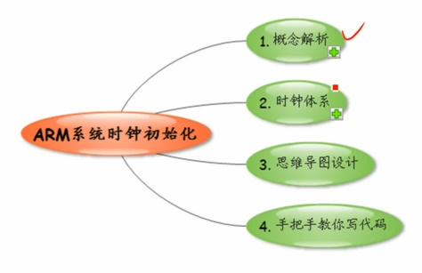

## 概念解析

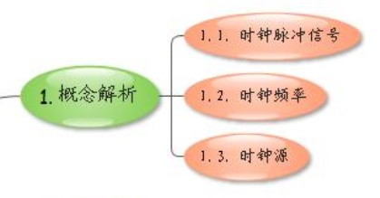

### 时钟脉冲信号

      谁来提醒你到点了，该干啥。饭点，觉点，醒点......

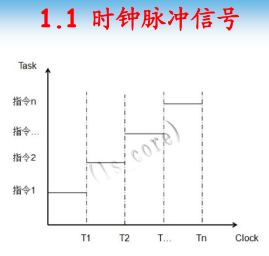

      提供时间度量的工具

### 时钟脉冲频率

      单位时间，单位到什么程序？
      假设时间是1S，如果有25个脉冲，那么单位时间25个脉冲

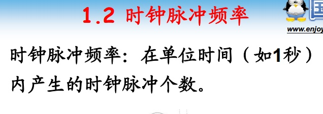

### 时钟信号的产生

      晶振
      锁相环

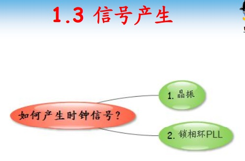

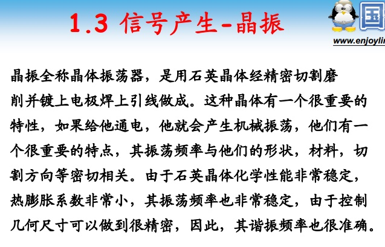

      压电效应 - 晶体振荡器
      石英晶体常被用来制作振荡器，在电子线路中充当信号源。
      石英晶体的固有频率只与晶片的几何尺寸（包括晶体切割的方位，大小和形状）有关，其精度高而稳定，因此是一种最理想的振荡源材料。
      石英晶体振荡器制作工艺简单，制作成本很低。只要在石英晶片的两个面上各喷涂一层银(或金)，然后引出电极并加以封装，就构成了一个石英晶体振荡器。

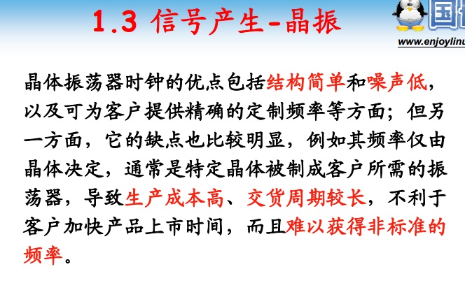

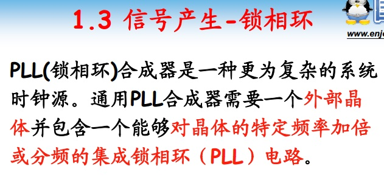

      通过晶体振荡器之后再有锁相环加倍频率
      可以更加灵活，通过寄存器配置，可以使频率不同

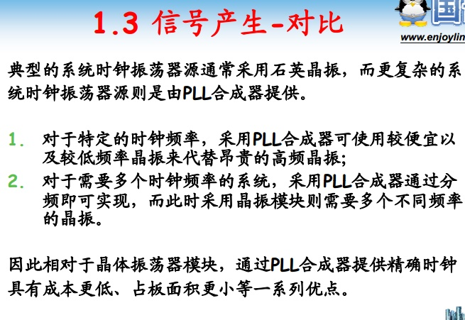

## 时钟体系

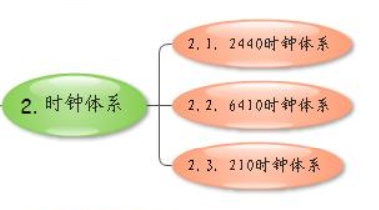

### S3C2440

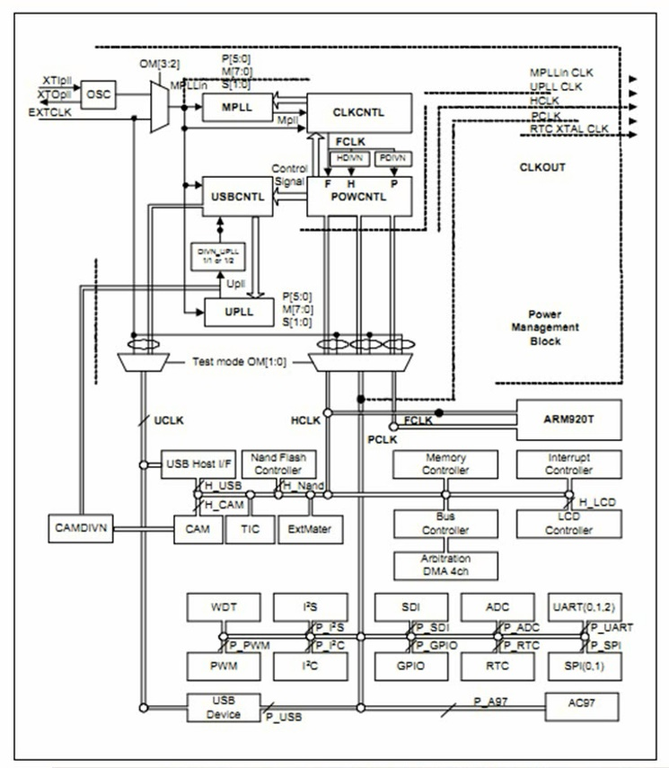

      S3C2440芯片手册
      了解一个处理器时钟体系，大同小异，了解一下内容
      1.了解晶振频率
      2.了解时钟里面有多少个PLL？
      3.这些PLL分别产生哪些时钟？
      4.这些时钟分别用来做什么？

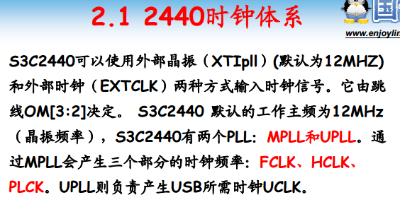

      1.12Mhz晶振
      2.MPLL、UPLL
      3.MPLL 产生FCLK、HCLK、PCLK
        UPLL 产生UCLK
      4.用来做什么？看下面表格

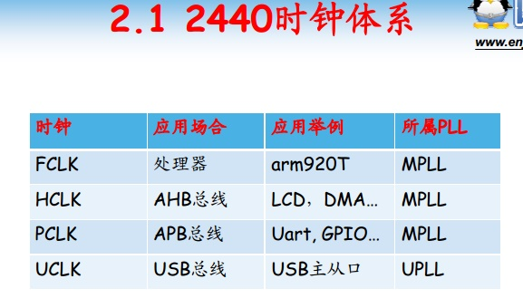

### S3C6410

      S3C6410芯片手册
      了解一个处理器时钟体系，大同小异，了解一下内容
      1.了解晶振频率 12Mhz晶振
      2.了解时钟里面有多少个PLL？3个PLL
      3.这些PLL分别产生哪些时钟？
          APLL:ARMCLK
          MPLL:HCLK,PCLK
          EPLL:SCLK
      4.这些时钟分别用来做什么？
          ARMCLK
          HCLK
          PCLK
          SCLK

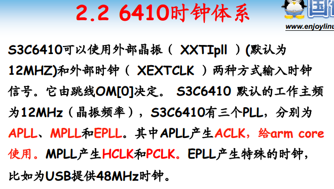

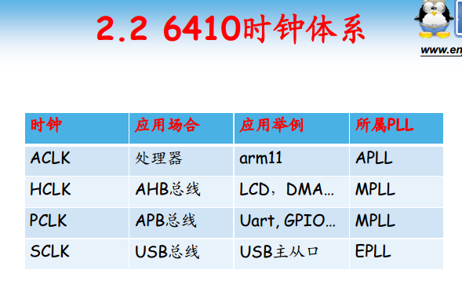

### S5PV210

      S5PV210芯片手册
      了解一个处理器时钟体系，大同小异，了解一下内容
      1.了解晶振频率 24Mhz晶振
      2.了解时钟里面有多少个PLL？4个PLL
      3.这些PLL分别产生哪些时钟？
					APLL
					MPLL
					EPLL
					VPLL
					210还有时钟分类MSYS、DSYS、PSYS
      4.这些时钟分别用来做什么？

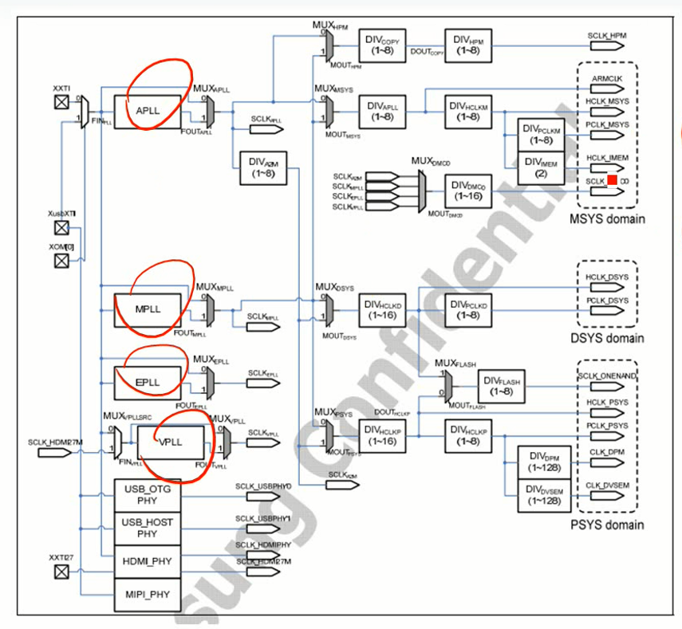

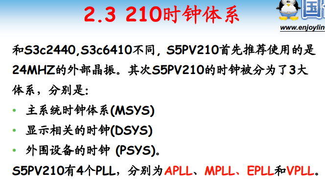

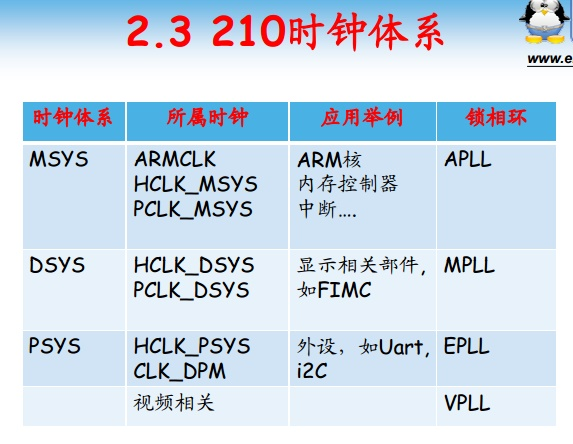

## 思维导图设计

			利用芯片手册的时序图，得到软件设计流程

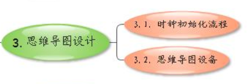

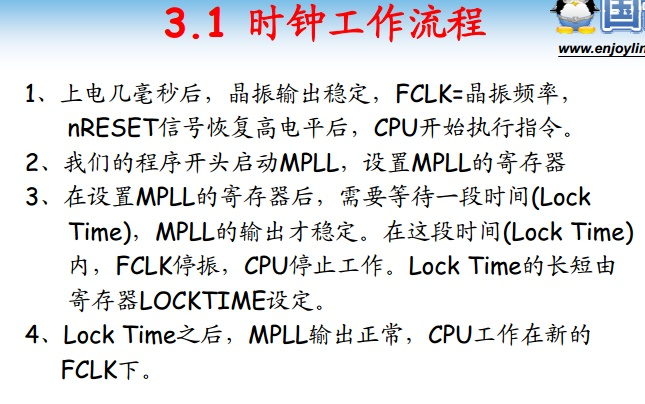

### 2440

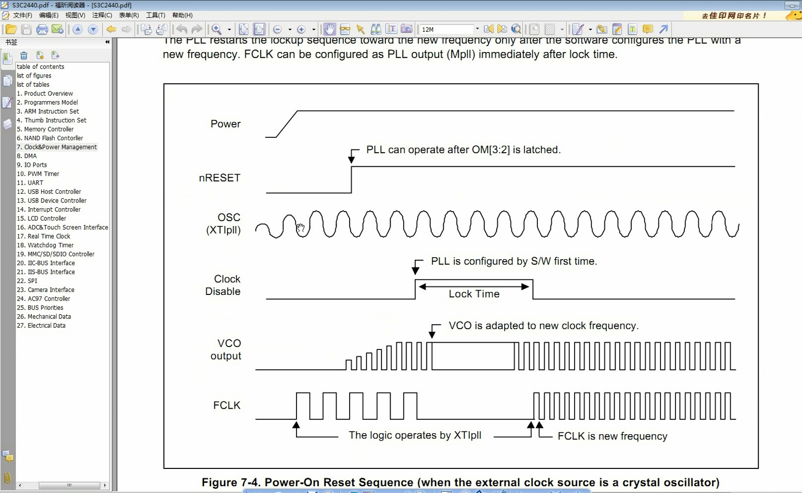

			FCLK提供给ARM核使用，工作在多少Mhz。上电后频率是按照晶振速度工作。比较慢。需要用软件配置PLL让处理器达到比较高的工作频率。
			当完成锁相环的配置时，处理器会处于一段时间lock time，不工作了，之后才开始按照新的频率进行工作。
			从低频率到高频率需要软件做什么？
				lock time可以配置么？
				PLL怎么设置?

* 配置Lock time
* 设置分频系数
* 配置FCLK
* 配置HCLK FCLK/2分频
* 配置PCLK FCLK/4分频
* 如果FCLK！= HCLK，设置CPU为异步模式(FCLK为核频率，HCLK为总线频率)

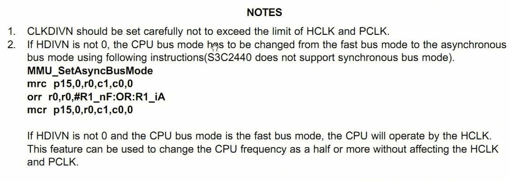

			带条件执行：总线工作模式切换到异步模式
			什么是HDIVN？

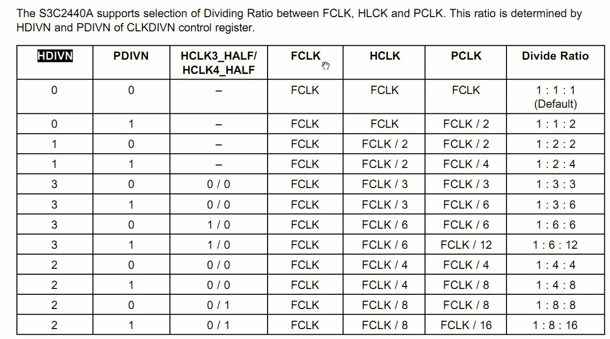

			FCLK为核频率，HCLK为总线频率。当频率不同的时候需要让其在异步工作模式。
			简单地说，根本不会让两者频率一致，太慢了。所以必须要设置异步模式

### 2440 初始化时钟

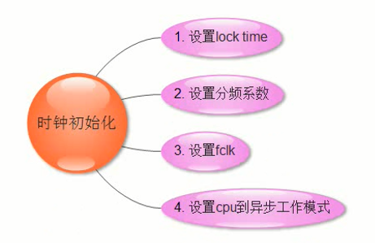

## 代码书写

### 2440
### 6410
### 210

## 总结
