<!-- TOC depthFrom:1 depthTo:6 withLinks:1 updateOnSave:1 orderedList:0 -->

- [专题9--代码搬移不可少](#专题9-代码搬移不可少)
	- [课程索引](#课程索引)
	- [回顾ARM启动流程](#回顾arm启动流程)
		- [2440](#2440)
		- [6410](#6410)
		- [210](#210)
	- [代码搬移规划](#代码搬移规划)
	- [链接地址](#链接地址)
		- [相对跳转](#相对跳转)
		- [绝对跳转](#绝对跳转)
	- [2440代码搬移](#2440代码搬移)
	- [6410代码搬移](#6410代码搬移)
	- [210代码搬移](#210代码搬移)
	- [总结](#总结)

<!-- /TOC -->
# 专题9--代码搬移不可少

## 课程索引

## 回顾ARM启动流程

      不管哪个处理器，提供的垫脚石尺寸无法满足大型启动程序的启动。
      因此需要垫脚石完成下一步拷贝工作。

### 2440

      处理器上电后，自动从NandFlash拷贝最前端4KB内容到SRAM(垫脚石 0x00000000)，然后PC指针从0地址处开始执行。
      4KB对于部分设备不够用的哦。剩下的怎么办？利用4KB程序完成下一步拷贝。从NandFlash的哪里拷贝到内存的哪里。这就是代码搬移的工作。

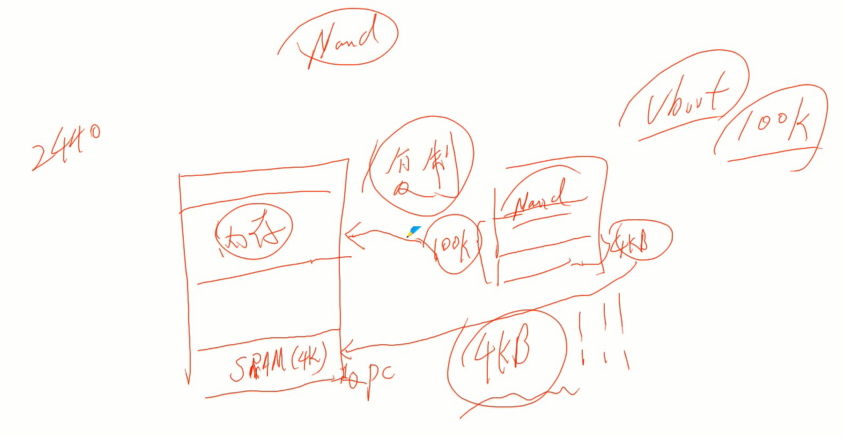

### 6410

      处理器上电后，首先运行SROM中运行的Bootloader0(厂家烧写)，会从NandFlash拷贝8KB（Bootloader1）到内存SRAM（8KB）中运行。剩下的Bootloader2怎么办？利用这8KB程序完成代码拷贝工作。

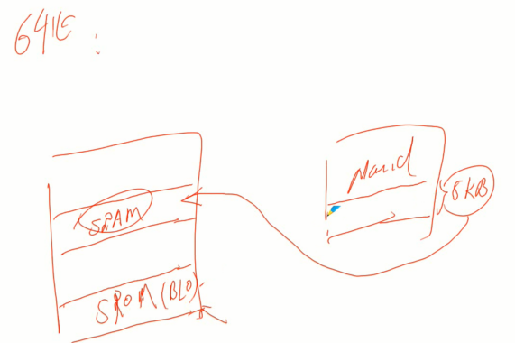

### 210

      处理器上电后，首先运行SROM中运行的Bootloader0(厂家烧写)，会从NandFlash拷贝8KB（Bootloader1）到内存IRAM（96KB）中运行。虽然96KB够大，但是需求更大。剩下的Bootloader2怎么办？利用这8KB程序完成代码拷贝工作。

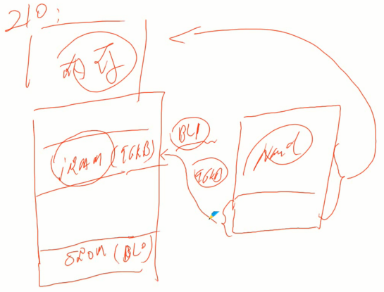

## 代码搬移规划

      从哪里搬到哪里？

      起点在SRAM中。因为gboot太小了，才几百字节，直接把自己拷贝到内存中的另一个地方继续运行。
      可是，明明应该从NandFlash拷贝运行的。大佬~~

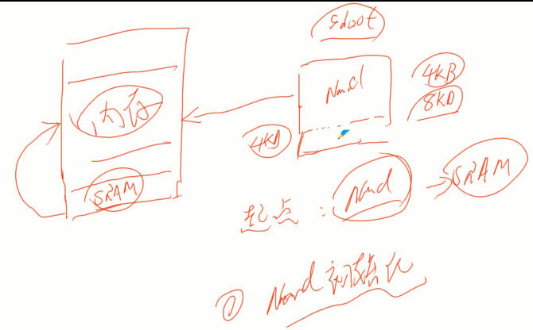

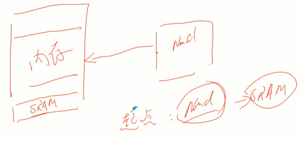

## 链接地址

      链接器脚本需要填写链接起始地址等等

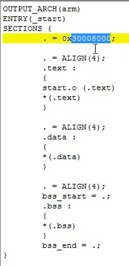

      这么个地址在哪里用到？其实就是程序流程中用到的地址，绝对地址

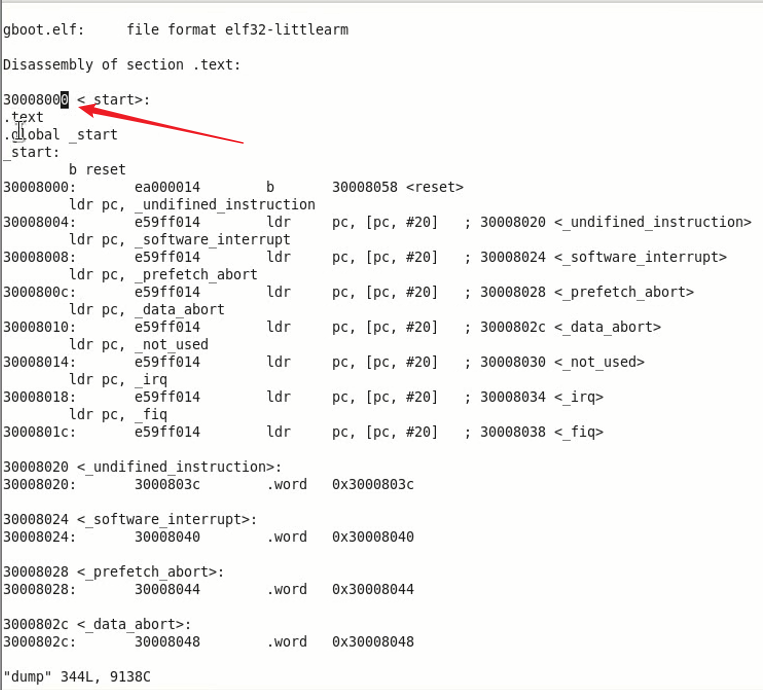

      其实就是程序自以为自己在哪里开始运行了，其内部用到的绝对地址都固定了。但是程序是不是真的加载到那个地址另说。如果不是加载到那个地址肯定会错误撒，错误在于执行了自己程序地址空间外的内容。

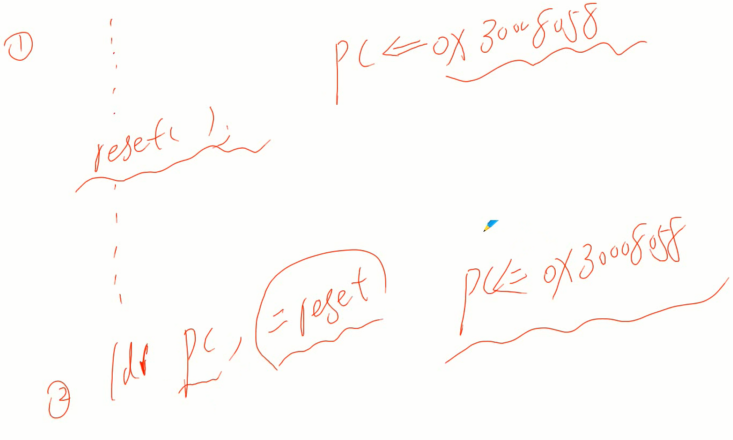

### 相对跳转

      b或者bl开头指令相对跳转
      相对位置偏移

### 绝对跳转

      直接修改PC指针属于绝对跳转

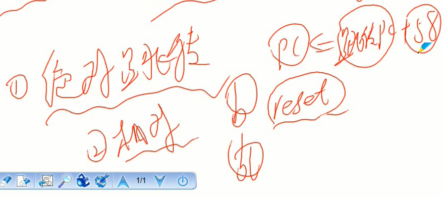

## 2440代码搬移

      垫脚石就是0地址处开始4KB

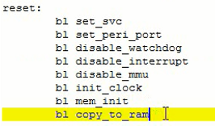

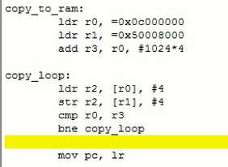

## 6410代码搬移

      垫脚石起点

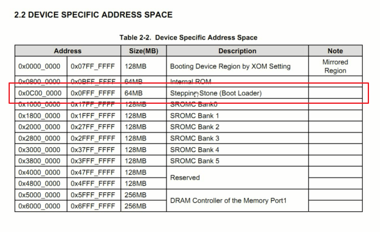

## 210代码搬移

      垫脚石起点

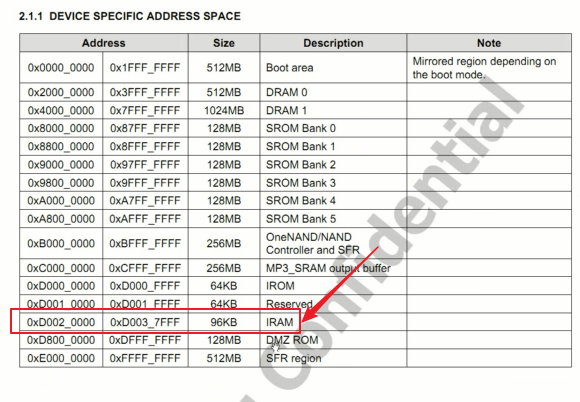

## 总结
