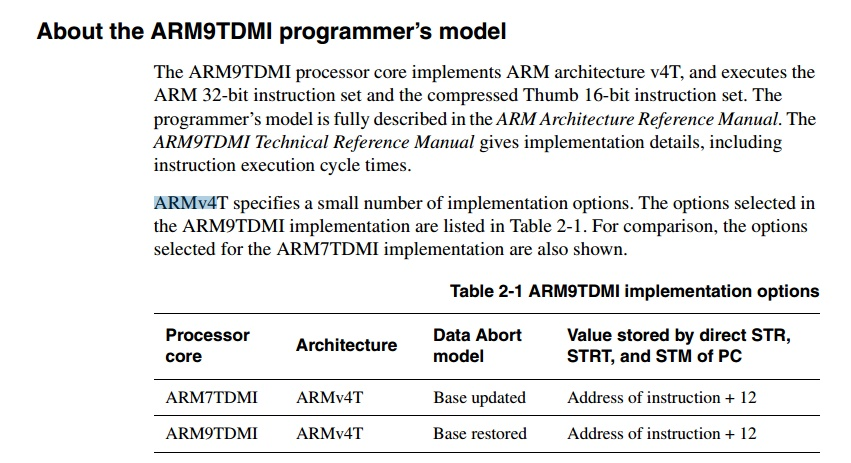
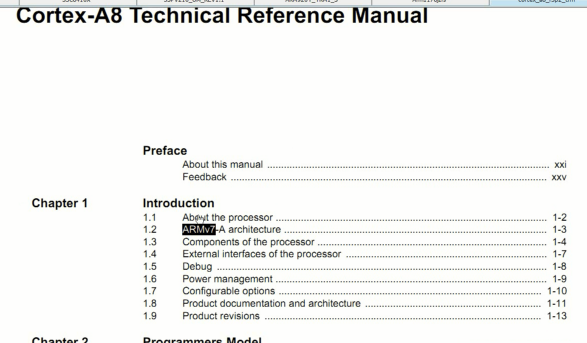
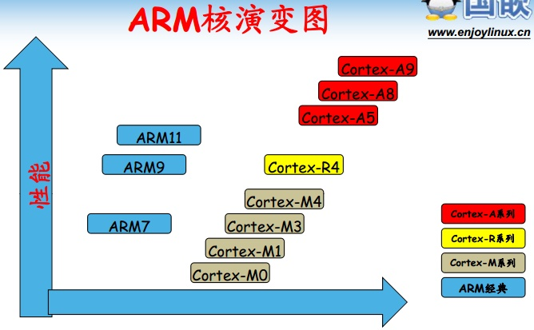
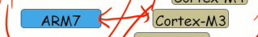
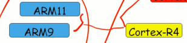

# 第1课-ARM家族大检阅

## ARM家族 -认祖归宗

* 6410
* 2440
* 210
* ARMA8
* ARM9
* ARM11
* ARMv7
* ARMv6

      芯片：6410、210、2440
      ARM核心：A8、ARM11、ARM9
      指令架构：ARMv7、ARMv6

### 芯片手册

> S3C2440

> S3C6410

> S5PV210

      芯片和ARM核是包含关系
        S3C2440：ARM9
        S3C6410: ARM11
        S5PV210: A8 = Cortex A8

### ARM指令集手册

      ARM9：对应的指令架构版本ARMv4
      ARM11：ARMv6
      Cortex A8：ARMv7

## ARM核演变图

      经典阵营 - 老的，老一辈的
      Cortex又被分成三个系列
          Cortex-A 系列 - 开放式操作系统的高性能处理器
            Cortex-A 应用程序处理器（Application Processors）在高级工艺节点中可实现高达 2GHz+ 标准频率的卓越性能，从而可支持下一代的移动 Internet 设备。这些处理器具有单核和多核种类，最多提供四个具有可选 NEON 多媒体处理模块和高级浮点执行单元的处理单元。
            应用包括智能手机、智能本和上网本、电子阅读器、数字电视、家用网络、家用网关和其他各种产品。
          Cortex-R 系列 - 面向实时应用的卓越性能
            Cortex-R 系列处理器的开发则面向深层嵌入式实时应用（Embedded Real-time  Applications Processors），对低功耗、良好的中断行为、卓越性能以及与现有平台的高兼容性这些需求进行了平衡考虑。
            应用领域有汽车制动系统、动力传输解决方案、大容量存储控制器、联网和打印机等。
          Cortex-M 系列 - 面向具有确定性的微控制器应用的成本敏感型解决方案
            Cortex-M 系列处理器（Embedded Microcontroller Processors）主要是针对微控制器领域开发的，在该领域中，既需进行快速且具有高确定性的中断管理，又需将门数和可能功耗控制在最低。
            应用领域有微控制器、混合信号设备、智能传感器、汽车电子和气囊等。

      ARM7 和 Cortex-M3 基本用来搞高性能单片机

      ARM9、ARM11介于Cortex-R4和Cortex-A5之间

## ARM处理器对比 - ARM处理器天梯图

      对比参数：
        处理速度
        缓存
        内存接口
        支持的OS
        其他

| 处理器 |    S3C2440   | S3C6410       |    S5PV210    |
| ------------- |------------- | ------------- | ------------- |
| 处理速度| 400~500 Mhz  | 533~667Mhz    |  800~1G Mhz   |
| 缓存| 16KB缓存      |16KB缓存       | 32KB缓存      |
| 内存接口| SDRAM内存接口 | SDRAM/DDR内存接口  | LPDDR1/LPDDR2内存接口 |
| 支持的OS| WinCE/Linux | WinCE/Linux/Android | WinCE/Linux/Android |
| 其他| 已经停产| 已经停产(2016年)| 在产？|
