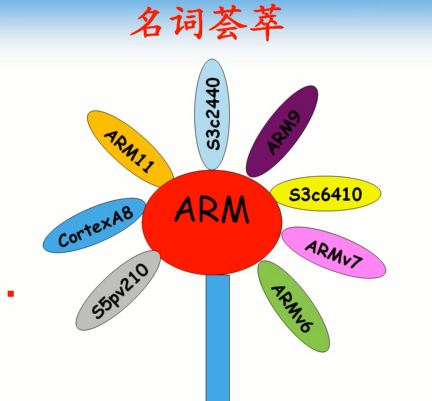
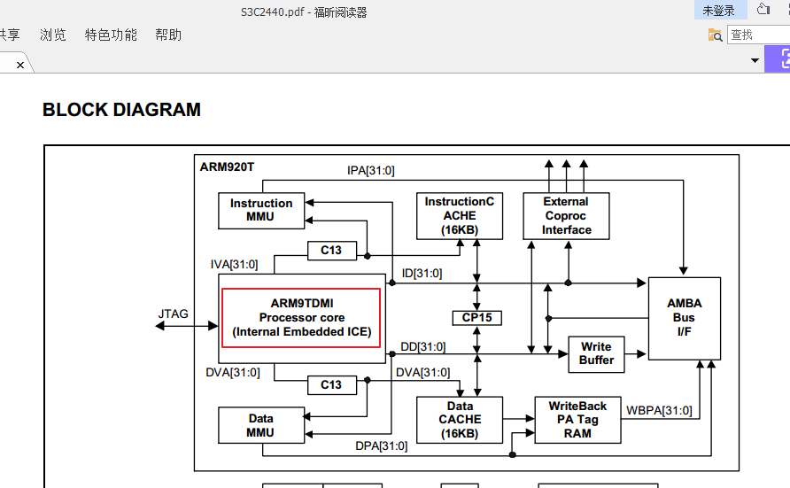
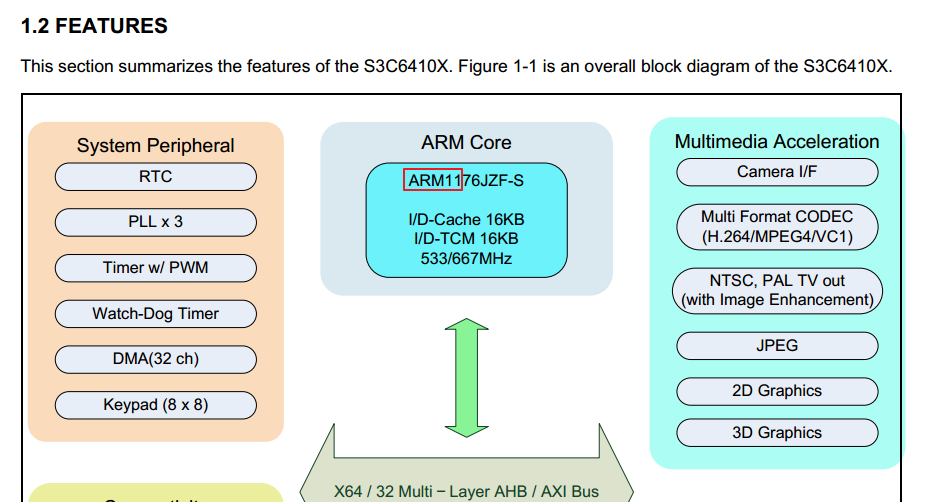
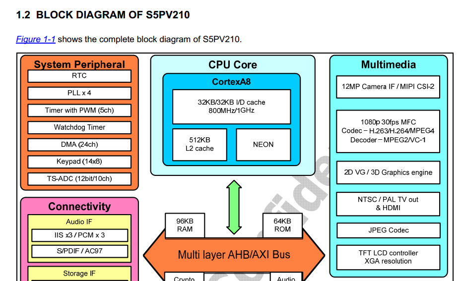

# 第1课-ARM家族大检阅

## ARM家族 -认祖归宗

* 6410
* 2440
* 210
* ARMA8
* ARM9
* ARM11
* ARMv7
* ARMv6

      芯片：6410、210、2440
      ARM核心：A8、ARM11、ARM9
      指令架构：ARMv7、ARMv6

> S3C2440

> S3C6410

> S5PV210

