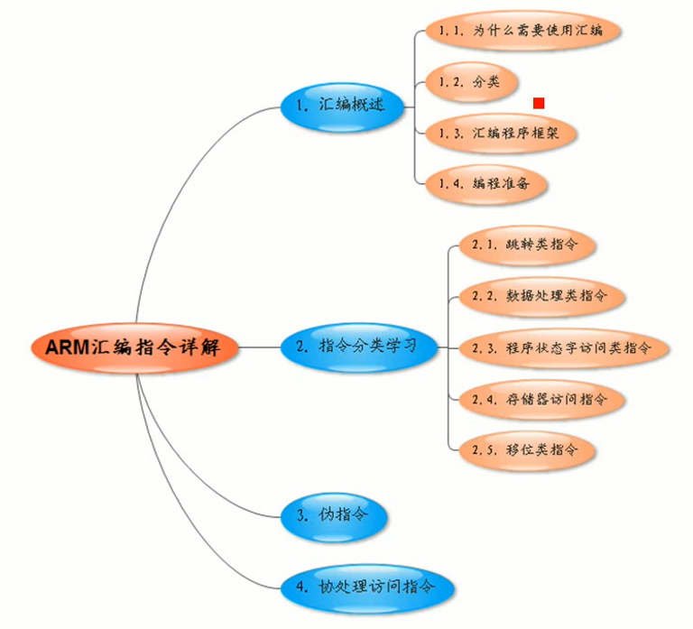
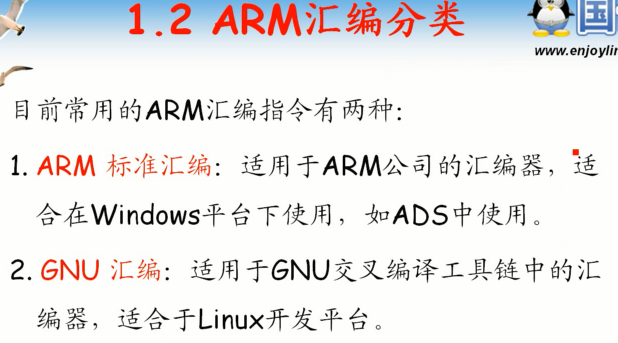
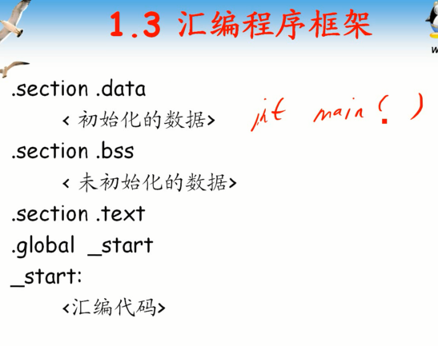
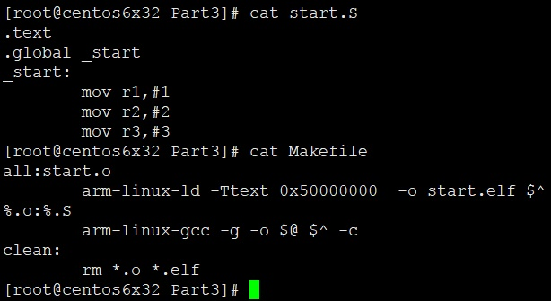
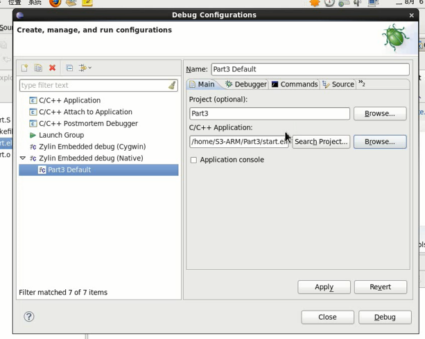
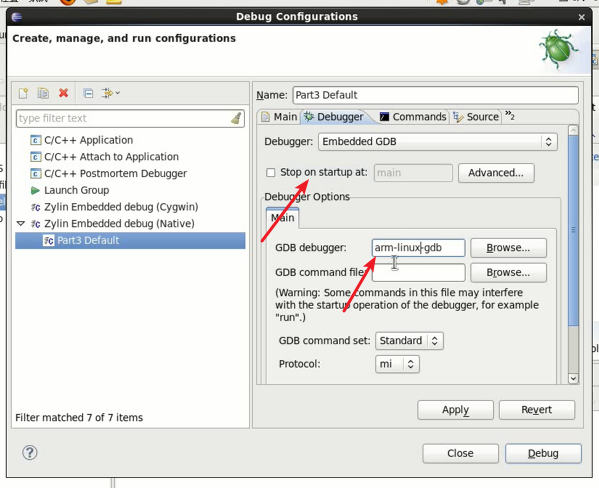
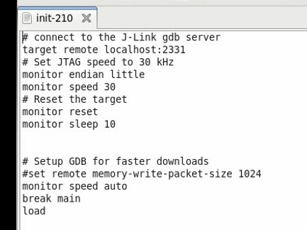

# 第1课-ARM汇编编程概述

## 课程索引

## 汇编概述

### 为嘛要学汇编程序？

      逆向必学汇编，时刻保持汇编观
      bootloader、内核初始化时候都要用汇编，因为这些指令C语言不支持，C语言不能直接操作寄存器。
      且C语言运行还要有堆栈支持。低级硬件初始化也必须用汇编。
      对效率有特殊要求的地方也必须用汇编。

* 启动代码
* 效率有特殊要求的地方

### ARM汇编分类

      指令集不同肯定不能运行
      汇编其实不管咋地也就Intel汇编和AT&T汇编
      这里分类有点乱

### 汇编程序框架

      分段，入口，起始地址，这些都是汇编通用概念
      ARM汇编和X86汇编无非就是指令不同，其他还有那些不同的地方？
      这些段名都是固定的，你可以随便命名的段(准确说是节)都会被搞到这些段里面

### 汇编程序helloworld

      有啥方法可以不用Jtag调试？

