# 第1课-Bootloader设计蓝图

先前的汇编都是为了Bootloader设计做准备。

不想做设计师的程序员不是好程序员。 **架构设计师**

## 课程索引

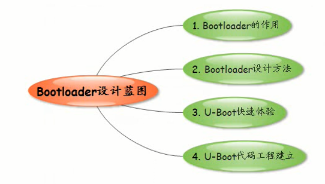

## bootloader的作用

      自举 - 助推器
      航天飞机为了能够延长形成，引入助推器
      点火后首当其冲的是bootloader，把航天飞机带到相应的轨道中

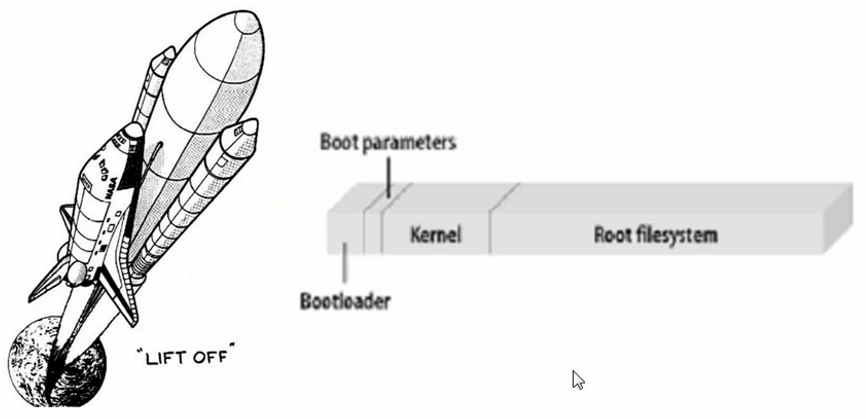

## booloader设计方法

      模仿 - copy，多模仿就有自己的想法。从模仿变成设计
      选择bootloader在嵌入式行业的老大，uboot
      uboot除了支持linux还支持多重嵌入式操作系统。
      PC机一般用grub，lilo已经彻底JJ了

## u-boot快速体验

      Uboot开机自动启动Linux系统。整个过程没有人为干预。
      Uboot工作在自主模式，还有一种模式叫开发模式

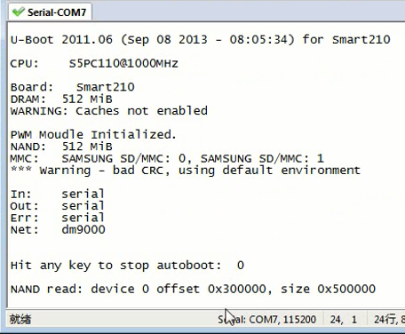

      进入命令模式，可以help显示帮助信息

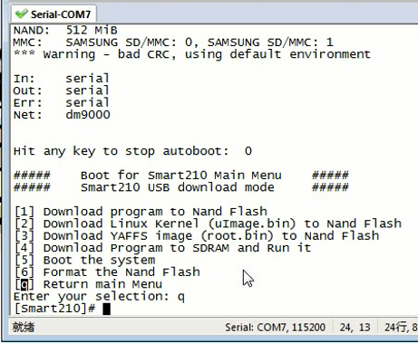

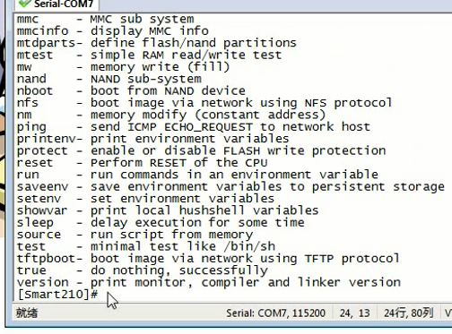

## u-boot代码工程建立

      使用SourceInsight，软件业界分析大量代码的神器

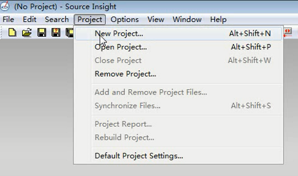

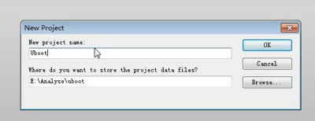

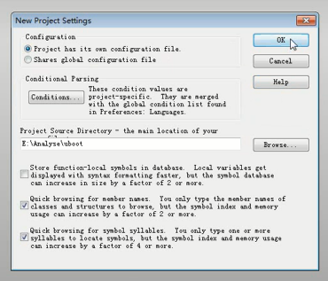

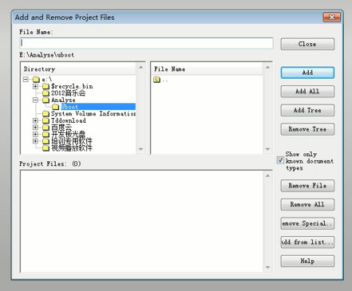

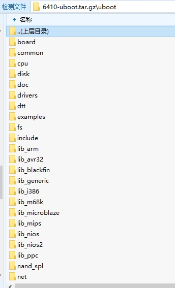

      uboot代码不能在win下解压缩，因为win不区分大小写，但是linux下区分，就会有些文件会被覆盖掉
      通过smb映射网络驱动器，然后就可以在SourceInsght中访问uboot源码

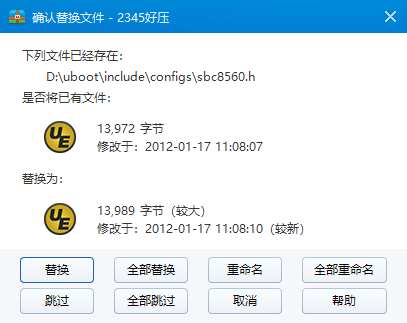

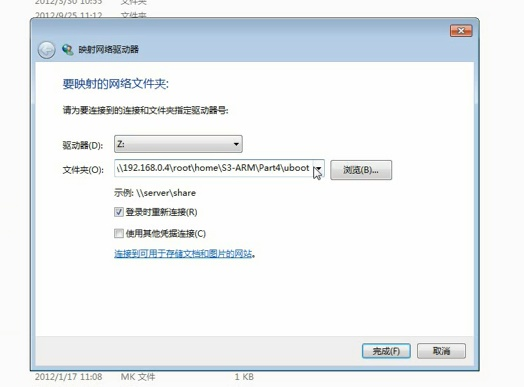

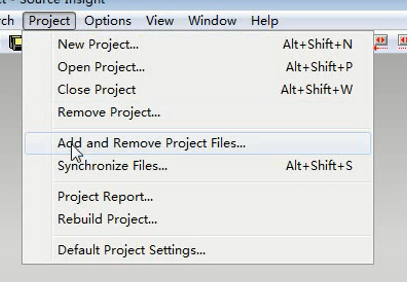

      工程目录中没有.S文件，要改配置。改完后再扫描一遍就好了

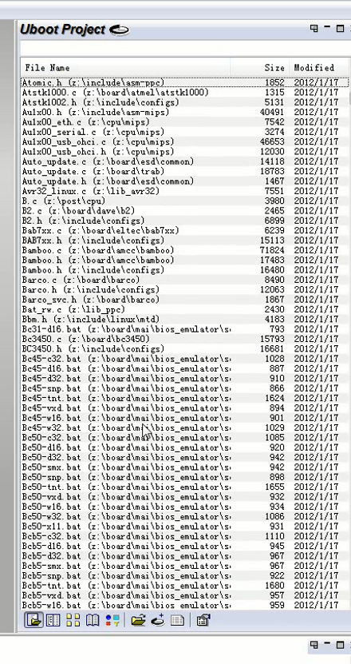

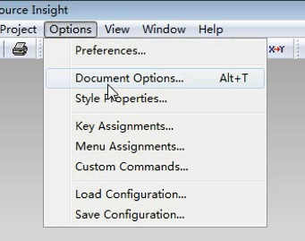

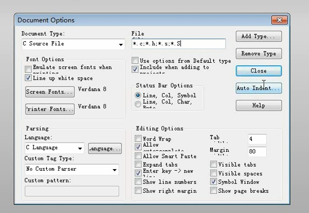

### 使用SourceInsight

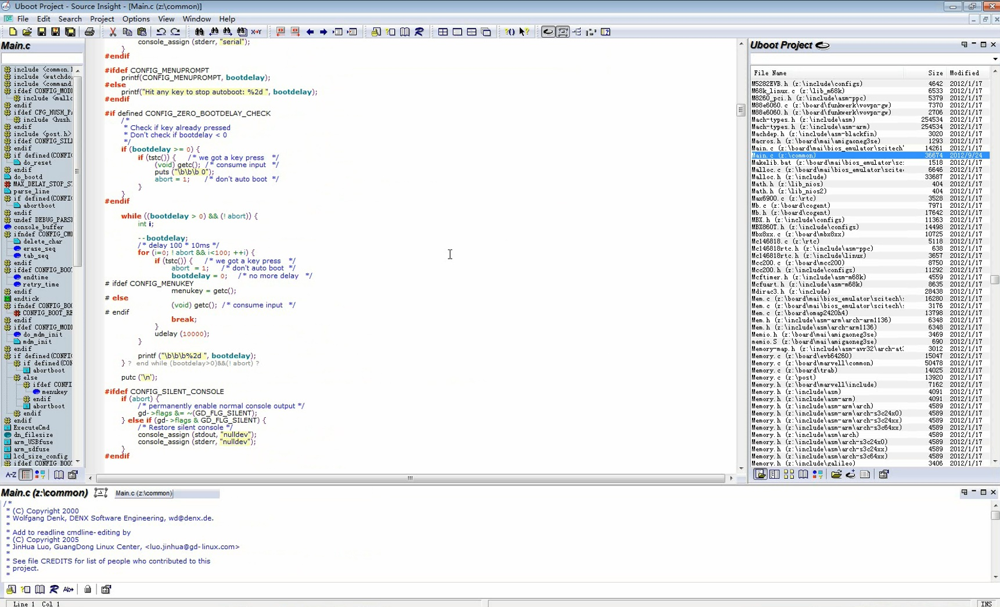

      > 同步,扫描所有符号。然后双击一个符号就可以跳转。非常方便分析

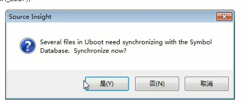

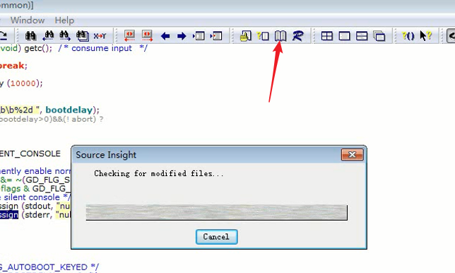
