- [第1课-异常向量表](#第1课-异常向量表)
	- [课程索引](#课程索引)
	- [异常的定义](#异常的定义)
	- [异常的类型](#异常的类型)
	- [异常向量](#异常向量)
	- [异常向量表](#异常向量表)
	- [代码编写 - start.S](#代码编写-starts)
	- [代码编写 - gboot.lds](#代码编写-gbootlds)
	- [代码编写 - Makefile](#代码编写-makefile)
	- [210 用户后续工作](#210-用户后续工作)

# 第1课-异常向量表

## 课程索引


## 异常的定义


## 异常的类型


## 异常向量

      固定地址处理程序
        其实就是位一个异常向量表，所谓向量，其实就是个指针数组
      如果没有配置CP15就用默认的，否则用高端地址


## 异常向量表
1
      指针数组


## 代码编写 - start.S


      定义代码段 .text
      定义入口  _start
      入口必须是全局的 .global修饰


      定义一波异常处理函数
      如果rootkit，可以修改异常处理的地址，hook处理函数


			ldr pc,_undefined_instruction
			_undifined_instruction: .word _undifined_instruction
			把ldr伪指令转换为装载指令
			完成中断向量表框架

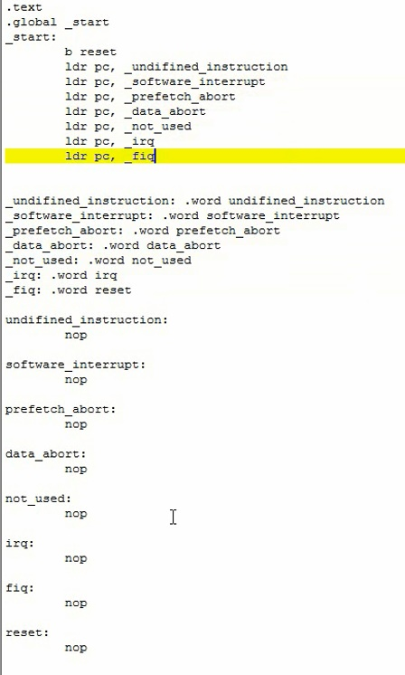

## 代码编写 - gboot.lds

			OUTPUT_ARCH(arm)  宏指明架构
			ENTRY(_start)		指明入口
			SECTIONS{} 指明段
			.text 代码段
			.data 数据段
			.bss 未初始化数据段
			. 表示当前行地址

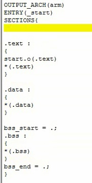

			定义起始地址
			6410
				. = 0x50008000;
			210
				. = 0x20008000;
			2440
				. = 0x30008000;
			对齐处理 ALIGN
				每个段开始之前四字节对齐

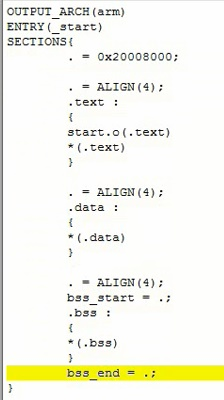

## 代码编写 - Makefile

			$@ 目标
			$^ 所有依赖
			$< 第一个依赖
			%.s 所有以.s结尾的文件

			目标 :依赖
			<tab> 命令

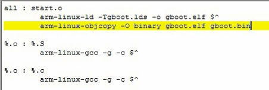

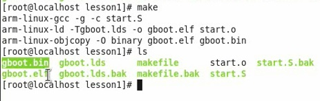


## 210 用户后续工作

6410和2440编写完以上代码就可以了。
但是210还要弄点东西

			还需要用工具给编译好的文件添加头信息


			格式化NandFlash

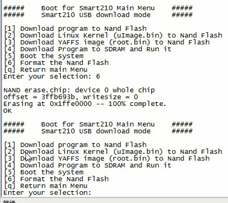

			编译生成没有加头的二进制

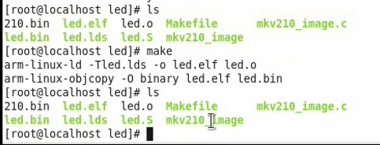

			生成带头的二进制

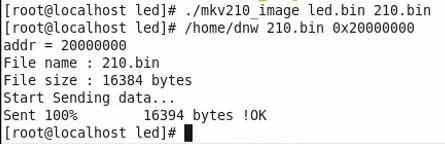

			运行效果，LED亮

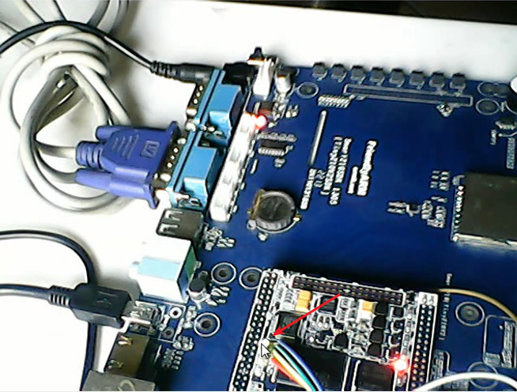

			如果没有加头呢？LED没有亮

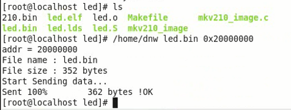

			为什么210需要加头呢？加点什么锤子头？？

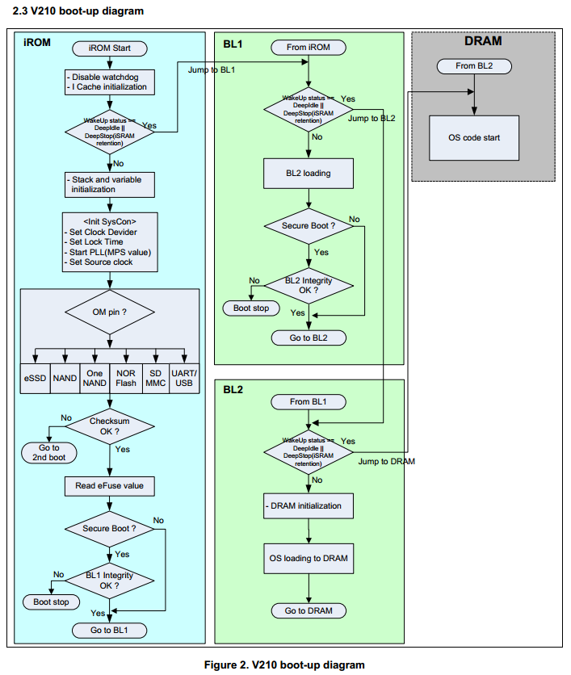

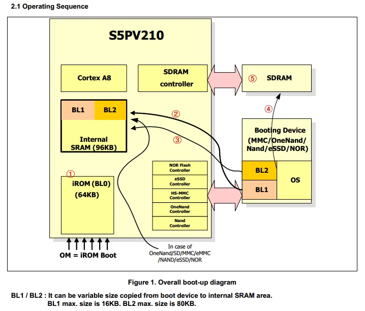

			IROM中有固话好的bootloader0
			裸机程序在bootloader1
			IROM拷贝bootloader1后还做了校验，放在头中
			使用mkv210_image生成头

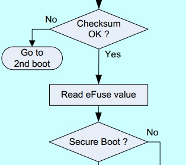

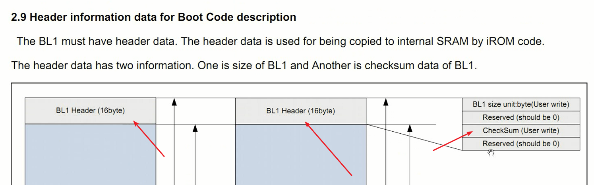

			根据头中给出的大小，开辟空间，拷贝到IROM。
			用户校验码，自己再计算一遍进行比较。校验算法也比较简单，计算有多少个1

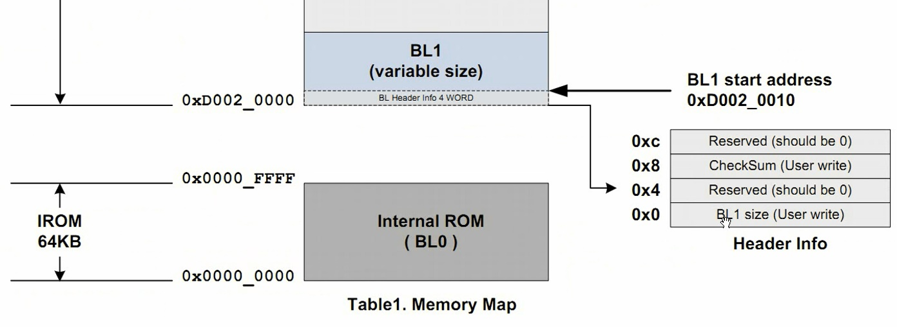


			mkv210_image源码

```
/* 在BL0阶段，Irom内固化的代码读取nandflash或SD卡前16K的内容，
 * 并比对前16字节中的校验和是否正确，正确则继续，错误则停止。
 */
#include <stdio.h>
#include <string.h>
#include <stdlib.h>

#define BUFSIZE                 (16*1024)
#define IMG_SIZE                (16*1024)
#define SPL_HEADER_SIZE         16
#define SPL_HEADER              "S5PC110 HEADER  "

int main (int argc, char *argv[])
{
	FILE		*fp;
	char		*Buf, *a;
	int		BufLen;
	int		nbytes, fileLen;
	unsigned int	checksum, count;
	int		i;

	// 1. 3个参数
	if (argc != 3)
	{
		printf("Usage: mkbl1 <source file> <destination file>\n");
		return -1;
	}

	// 2. 分配16K的buffer
	BufLen = BUFSIZE;
	Buf = (char *)malloc(BufLen);
	if (!Buf)
	{
		printf("Alloc buffer failed!\n");
		return -1;
	}

	memset(Buf, 0x00, BufLen);

	// 3. 读源bin到buffer
	// 3.1 打开源bin
	fp = fopen(argv[1], "rb");
	if( fp == NULL)
	{
		printf("source file open error\n");
		free(Buf);
		return -1;
	}
	// 3.2 获取源bin长度
	fseek(fp, 0L, SEEK_END);
	fileLen = ftell(fp);
	fseek(fp, 0L, SEEK_SET);
	// 3.3 源bin长度不得超过16K-16byte
	count = (fileLen < (IMG_SIZE - SPL_HEADER_SIZE))
		? fileLen : (IMG_SIZE - SPL_HEADER_SIZE);
	// 3.4 buffer[0~15]存放"S5PC110 HEADER  "
	memcpy(&Buf[0], SPL_HEADER, SPL_HEADER_SIZE);
	// 3.5 读源bin到buffer[16]
	nbytes = fread(Buf + SPL_HEADER_SIZE, 1, count, fp);
	if ( nbytes != count )
	{
		printf("source file read error\n");
		free(Buf);
		fclose(fp);
		return -1;
	}
	fclose(fp);

	// 4. 计算校验和
 	// 4.1 从第16byte开始统计buffer中共有几个1
	a = Buf + SPL_HEADER_SIZE;
	for(i = 0, checksum = 0; i < IMG_SIZE - SPL_HEADER_SIZE; i++)
		checksum += (0x000000FF) & *a++;
	// 4.2 将校验和保存在buffer[8~15]
	a = Buf + 8;
	*( (unsigned int *)a ) = checksum;

	// 5. 拷贝buffer中的内容到目的bin
	// 5.1 打开目的bin
	fp = fopen(argv[2], "wb");
	if (fp == NULL)
	{
		printf("destination file open error\n");
		free(Buf);
		return -1;
	}
	// 5.2 将16k的buffer拷贝到目的bin中
	a = Buf;
	nbytes	= fwrite( a, 1, BufLen, fp);
	if ( nbytes != BufLen )
	{
		printf("destination file write error\n");
		free(Buf);
		fclose(fp);
		return -1;
	}

	free(Buf);
	fclose(fp);

	return 0;
}

```
