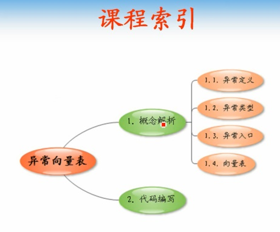
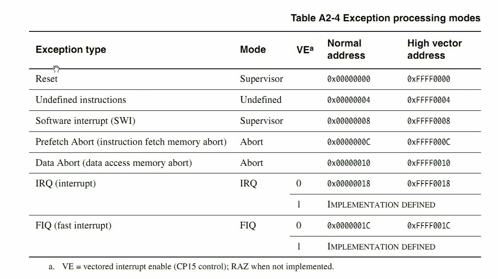
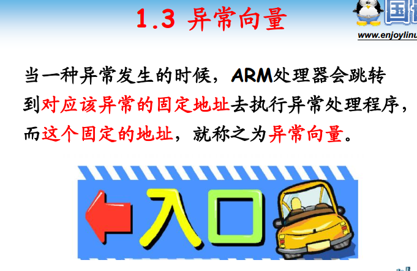
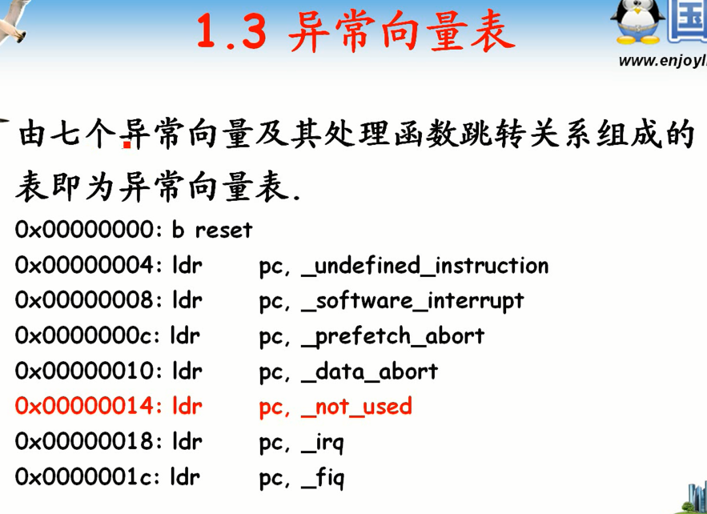
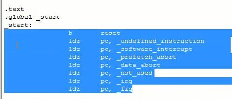
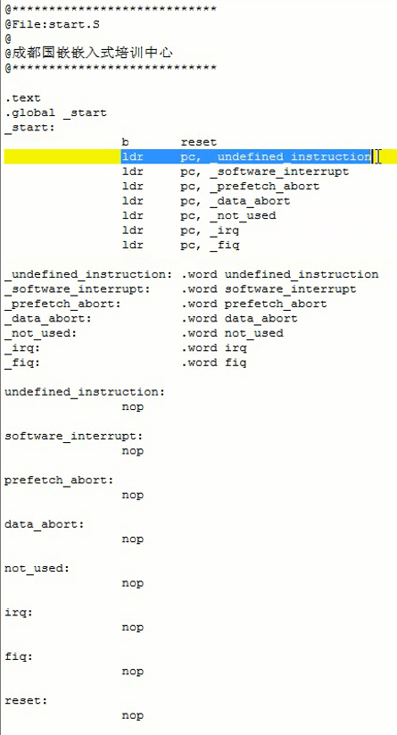
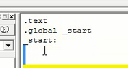
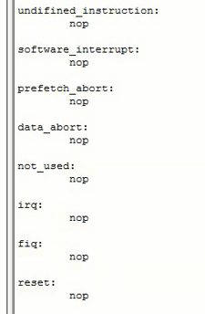

<!-- TOC depthFrom:1 depthTo:6 withLinks:1 updateOnSave:1 orderedList:0 -->

- [第1课-异常向量表](#第1课-异常向量表)
	- [课程索引](#课程索引)
	- [异常的定义](#异常的定义)
	- [异常的类型](#异常的类型)
	- [异常向量](#异常向量)
	- [异常向量表](#异常向量表)
	- [代码编写](#代码编写)

<!-- /TOC -->

# 第1课-异常向量表

## 课程索引

## 异常的定义

## 异常的类型

## 异常向量

      固定地址处理程序
        其实就是位一个异常向量表，所谓向量，其实就是个指针数组
      如果没有配置CP15就用默认的，否则用高端地址

## 异常向量表

      指针数组

## 代码编写

      定义代码段 .text
      定义入口  _start
      入口必须是全局的 .global修饰

      定义一波异常处理函数
      如果rootkit，可以修改异常处理的地址，hook处理函数

