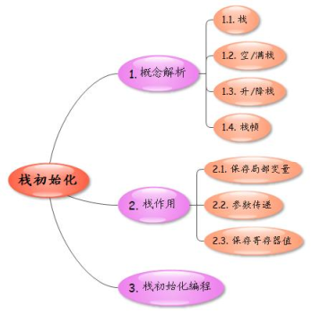
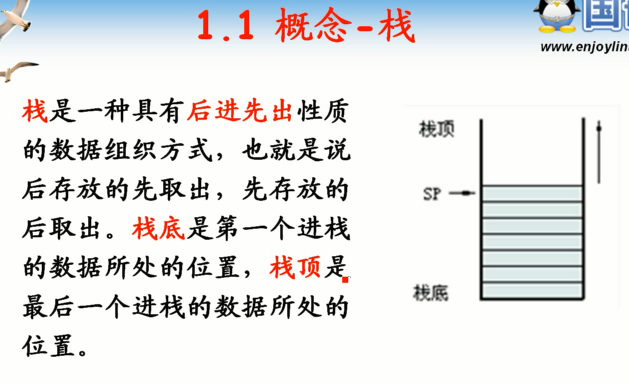
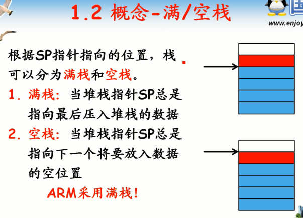
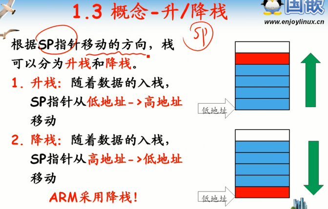
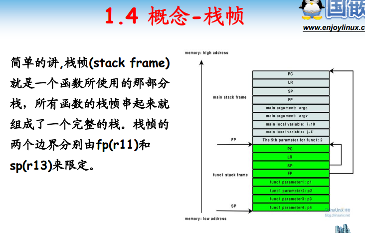
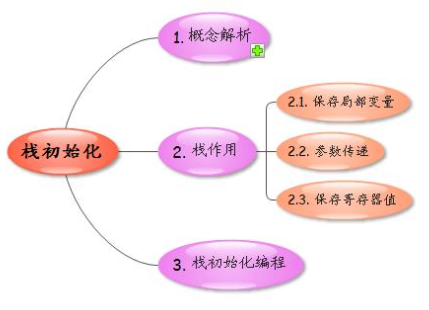

<!-- TOC depthFrom:1 depthTo:6 withLinks:1 updateOnSave:1 orderedList:0 -->

- [第1课-栈初始化](#第1课-栈初始化)
	- [课程索引](#课程索引)
	- [栈概念解析](#栈概念解析)
		- [满栈/空栈](#满栈空栈)
	- [升栈/降栈](#升栈降栈)
	- [栈帧](#栈帧)
	- [栈作用](#栈作用)
	- [栈初始化编程](#栈初始化编程)
	- [总结](#总结)

<!-- /TOC -->
# 第1课-栈初始化

## 课程索引
      第一阶段汇编启动，第二阶段C语言初始化

## 栈概念解析

      栈是数据组织方式之一
      后进先出
      栈底
      栈顶

### 满栈/空栈

## 升栈/降栈

## 栈帧

## 栈作用

## 栈初始化编程

## 总结
