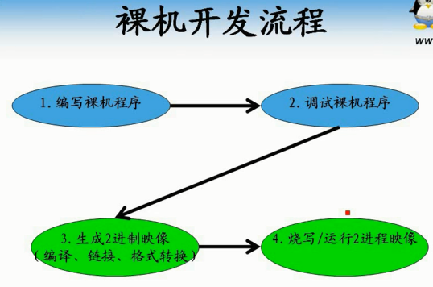
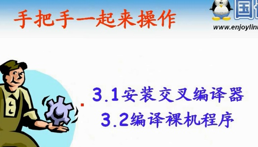
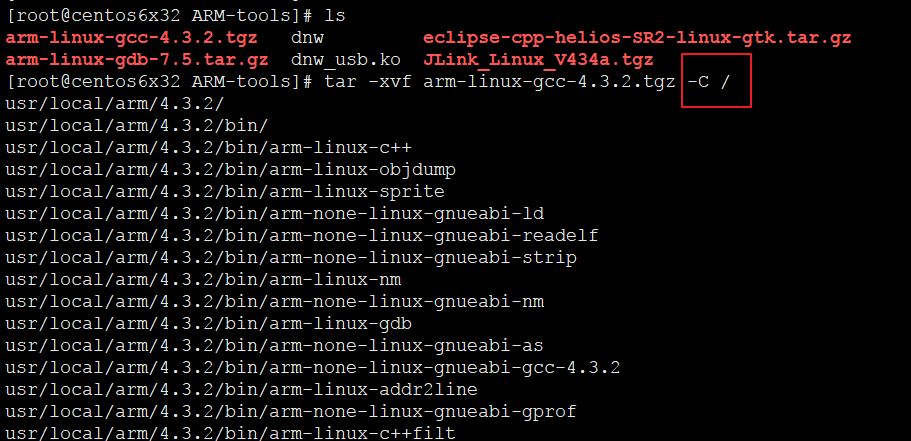
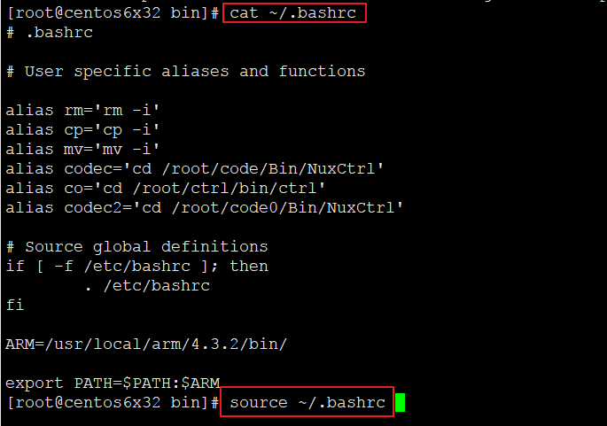
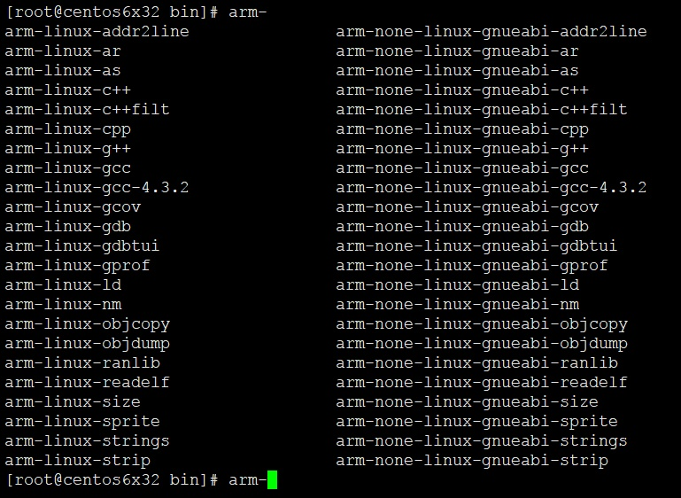
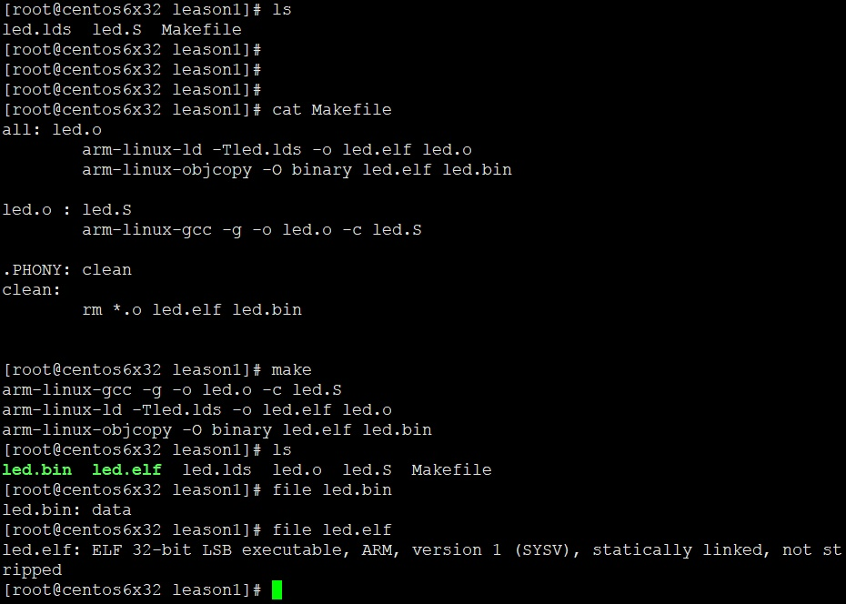
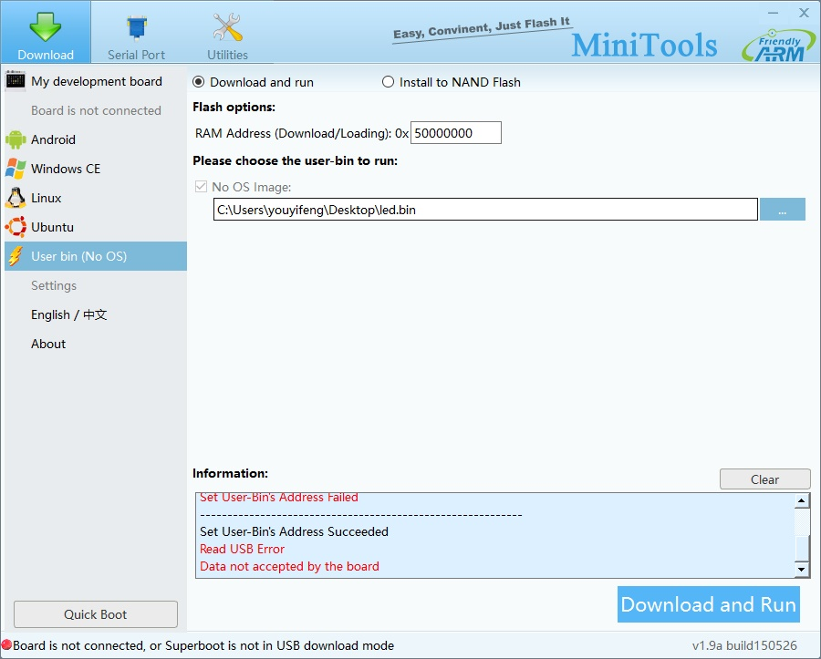
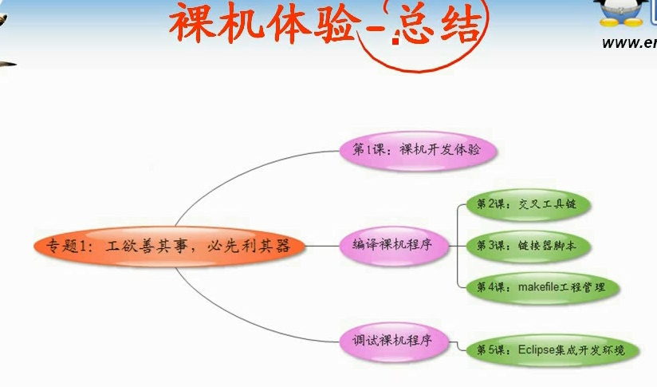

# 第1课-裸机开发快速体验

> 裸机开发流程



先体验一把二进制程序运行，感受一把，总结一波。



> 安装交叉工具链

* 上传交叉编译工具，解压

      上传方法多了去了，xshell建议安装了lrzsz之后直接拖进去，或者xftp，
      smb都弱爆了，最新的win10不支持smb1.0，需要在程序管理里面添加支持




      -C 大C，指定解压目录

* 修改环境变量



```
ARM=/usr/local/arm/4.3.2/bin/
export PATH=$PATH:$ARM
```




    执行arm- tab补齐


> 编译裸机程序



```
	arm-linux-gcc -g -o led.o -c led.S
	arm-linux-ld -Tled.lds -o led.elf led.o
	arm-linux-objcopy -O binary led.elf led.bin
```

目前已经使用到了交叉工具链，链接器脚本，Makefile三个工具体验一把


> 烧写程序


      开发板上有类似于硬盘的东西，NandFlash，运行程序，系统，配置等都在NandFlash中
      裸机程序最终应该烧写到NandFlash中去
      6410没有NorFlash，但是有SD卡哦，利用SD卡辅助程序和PC机建立链接下载

还是用minitools程序烧写程序并运行，一键解决



      点亮核心板四个Led灯，视频中用dnw在CentOS下烧写，其实大同小异有莫有


> 总结


