<!-- TOC depthFrom:1 depthTo:6 withLinks:1 updateOnSave:1 orderedList:0 -->

- [第2课-2440内存初始化](#第2课-2440内存初始化)
	- [课程索引](#课程索引)
	- [地址空间](#地址空间)
		- [地址线](#地址线)
		- [片选信号](#片选信号)
		- [存储控制器](#存储控制器)
		- [内存芯片连接](#内存芯片连接)
	- [设置存储控制器](#设置存储控制器)
	- [代码编写](#代码编写)
	- [总结](#总结)

<!-- /TOC -->

# 第2课-2440内存初始化

## 课程索引

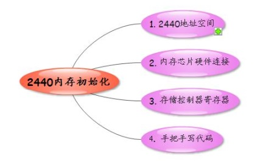

## 地址空间

### 地址线

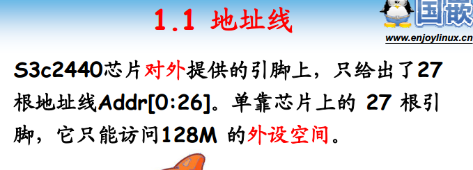

### 片选信号

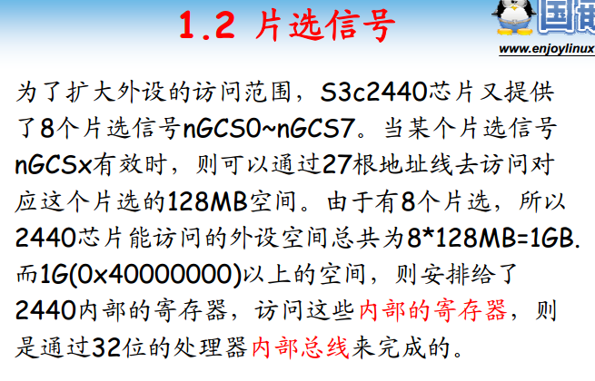

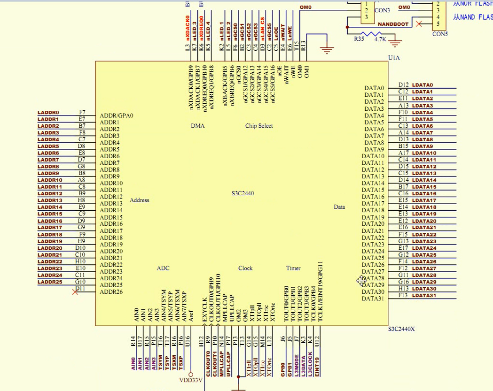

      对外提供27根地址线 2的27次方 128MB 太小了，如何扩大？
      片选地址线 - 选中不同的处理器芯片，一下扩大了。

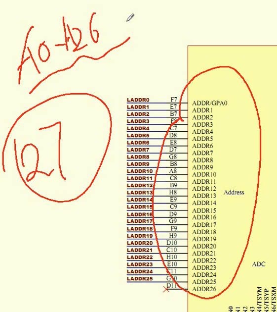

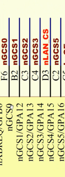

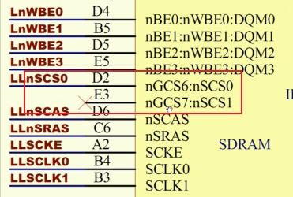

      128MB * 8 = 1 GB 扩大访问地址空间。只是不能直接访问，必须先选定片选

      片选分布图
      内存一般放在片选6和7。
      **因为内存放在片选6和7所以地址从0x3000_0000**

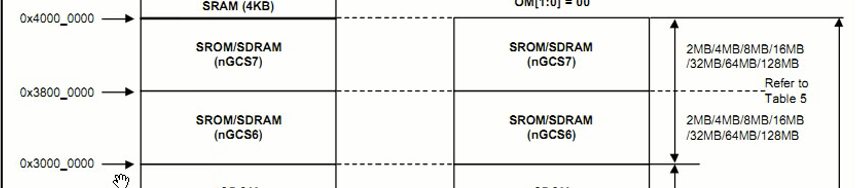

### 存储控制器

      通过存储控制器处理才能访问相应的内存地址
      如何转换成bank、行地址、列地址?
      **其实内存初始化就是初始化存储控制器进行初始化**

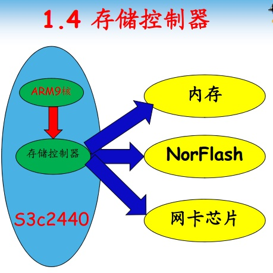

### 内存芯片连接

      MINI2440

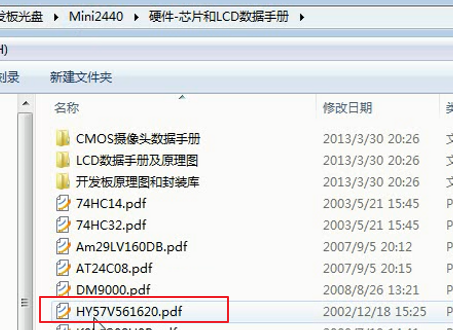

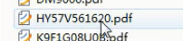

      TQ2440

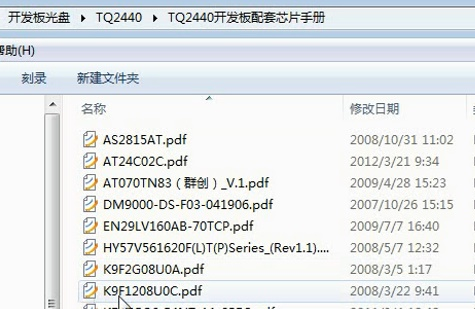

      两个开发板使用的内存芯片一样

      每个单元格16bit
      一个芯片4M个单元格
      4个BANK - 四块芯片
      采用2个32MB内存并联使用，一个32位地址，一半在片1一半在片二

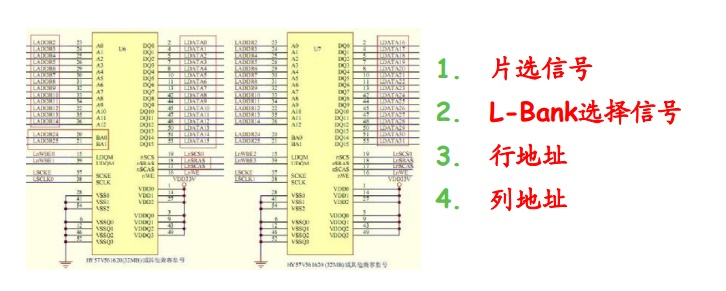

## 设置存储控制器

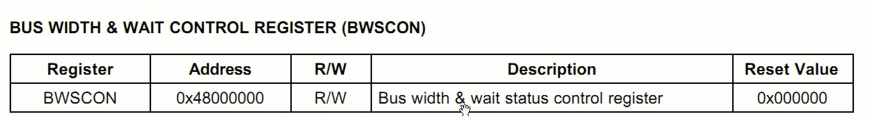

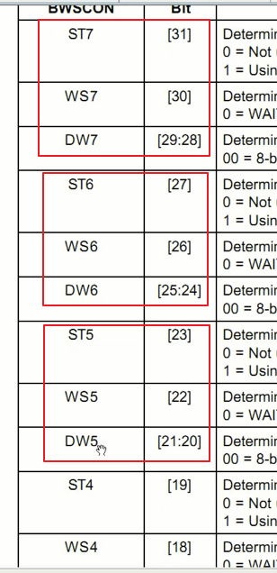

      分成8个组，一个有8个bank，每四个位控制一个bank

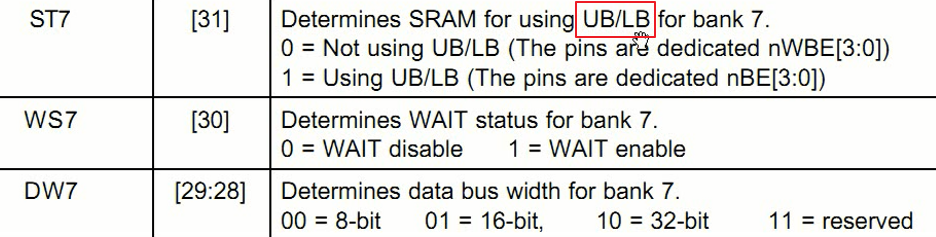

      UB/LB是啥不管，但是原理图里面没有这东西，那就设定为0

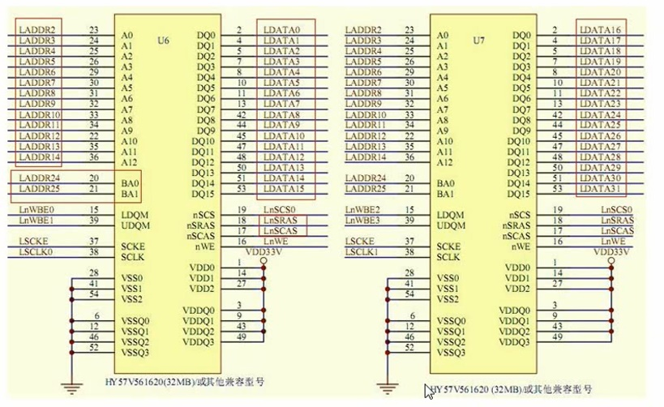

      两个16位内存芯片拼接成32位内存芯片

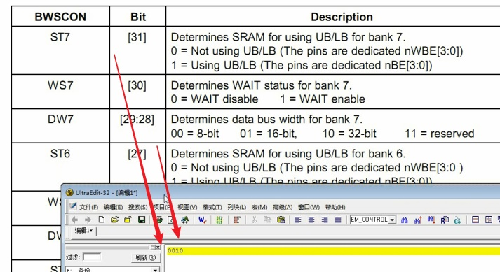

      BANK6和BANK7一伙的，设置成一样，其他不用都设置为0

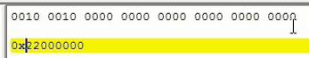

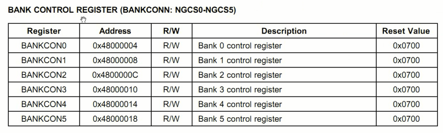

      SDRAM放在BANK6和BANK7。这几个不属于，暂时不用设置为0

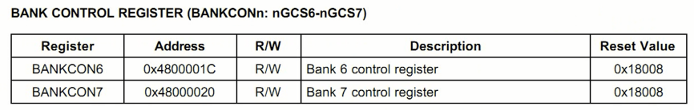

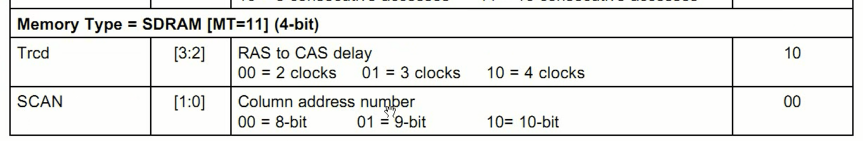

      列地址

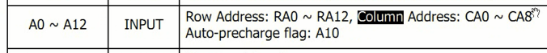

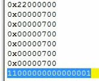

      BANK6和BANK7一伙的，设置的值都一样。

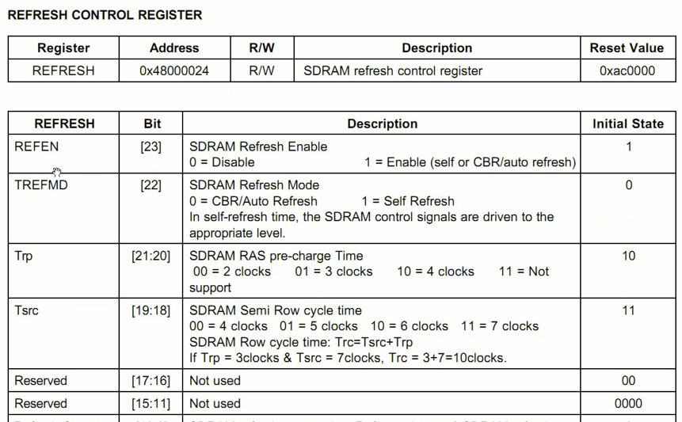

      刷新控制寄存器
        自动刷新

      刷新时间计算

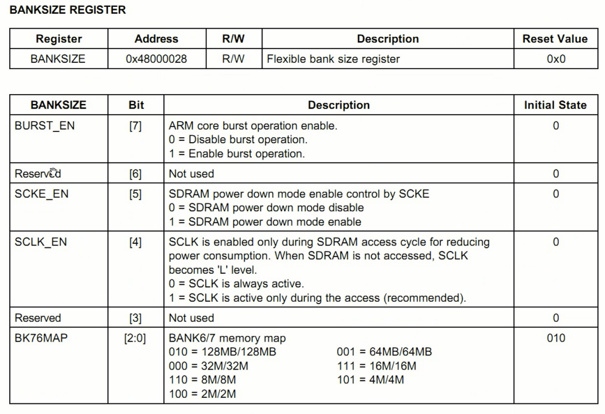

      设置节电模式

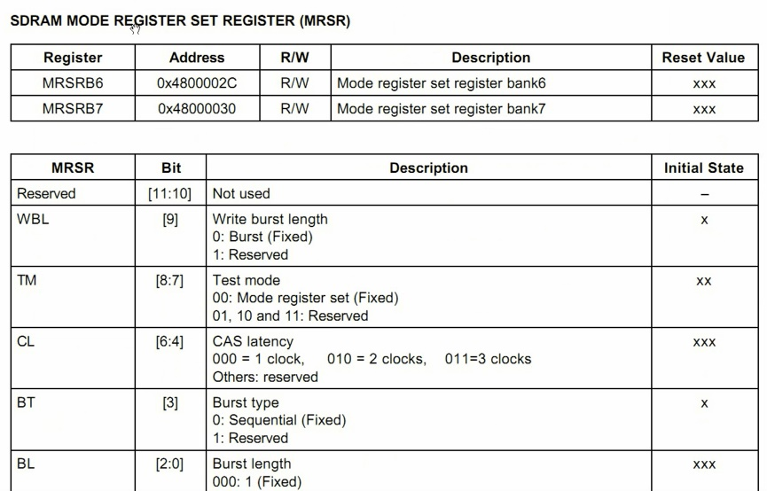

      设置模式寄存器

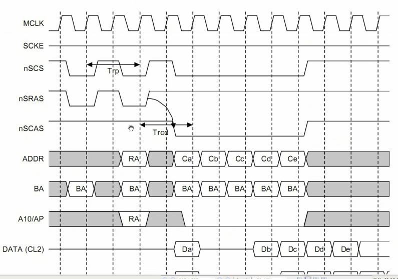

## 代码编写

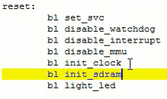

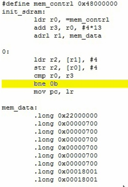

## 总结
