!-- TOC depthFrom:1 depthTo:6 withLinks:1 updateOnSave:1 orderedList:0 -->

- [第2课-ARM处理器启动流程](#第2课-arm处理器启动流程)
	- [课程索引](#课程索引)
	- [S3C2440处理器](#s3c2440处理器)
		- [启动方式](#启动方式)
		- [地址布局](#地址布局)
		- [启动流程](#启动流程)
	- [S3C6410处理器](#s3c6410处理器)
		- [启动方式](#启动方式)
		- [地址布局](#地址布局)
		- [启动流程](#启动流程)
	- [S5PV210处理器](#s5pv210处理器)
		- [启动方式](#启动方式)
		- [地址布局](#地址布局)
		- [启动流程](#启动流程)

<!-- /TOC -->

# 第2课-ARM处理器启动流程

启动流程是处理器固定的。PC机启动的时候就是先跑bios，第一条指令在CS:IP 0XF000:FFF0 = 0XFFFF0，然后读取启动设备的第一个扇区，加载到内存的0x7c00的内存地址。

## 课程索引

      对比学习，知道其他处理器是怎么处理的。相同之处，不同之处。
      对比更先进的处理器是如何操作的。
      锻炼起一种学习的能力，酱紫给你一个新的板子你就会知道该如何处理

## S3C2440处理器

### 启动方式

      1.NorFlash启动：2MB容量
      2.NandFlash启动：256MB容量，内核文件系统存放处

### 地址布局

      阅读芯片手册，搜索mapping

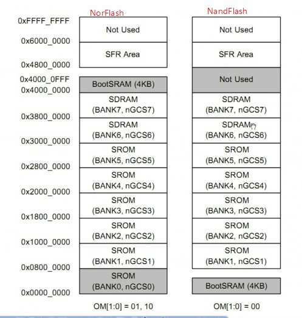

### 启动流程

      第一条指令在哪里？
      0地址处获取，不同启动方式，第一条指令在不同地方。
      NandFlash不能直接访问，不参与ARM统一编制，必须经过寄存器访问。
        0地址处在BootSRAM,也叫stapping stone，垫脚石。
        垫脚石和NandFlash有啥关系？
          如果选择NandFlash启动，那么处理器开机时候会先把NandFlash的最前端4K拷贝到垫脚石，然后从垫脚石开始执行。
          通常Bootloader一般不止4K，那么剩下的怎么办？垫脚石怎么处理？
          垫脚石不单单要初始化硬件，还需要把剩下的Bootloader加载到内存，然后跳转到内存中继续运行。
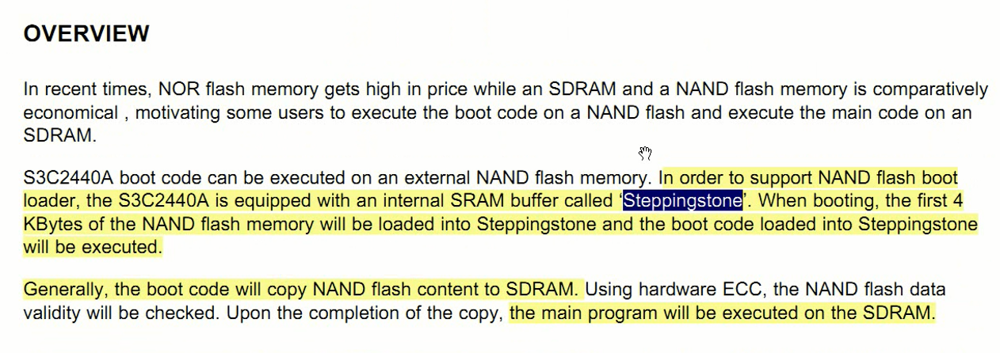

      总结：NandFlash不支持统一编制。将启动代码传送到垫脚石，垫脚石拷贝剩下的启动代码，初始化硬件后跳转执行。且处理器要求存放到地址0x30000000,片选6。所以调试程序的时候，由垫脚石跳转到改地址执行，前提是垫脚石初始化硬件完毕~

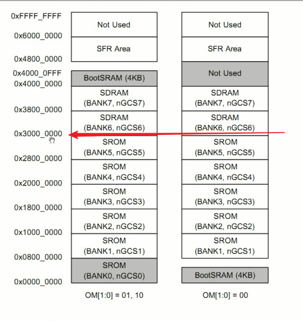

## S3C6410处理器

### 启动方式

打开芯片手册，搜索booting

      支持NorFlash
      支持OneNand启动
      支持Modem启动
      支持IROM启动 - IROM不是垫脚石 - SD、NandFlash

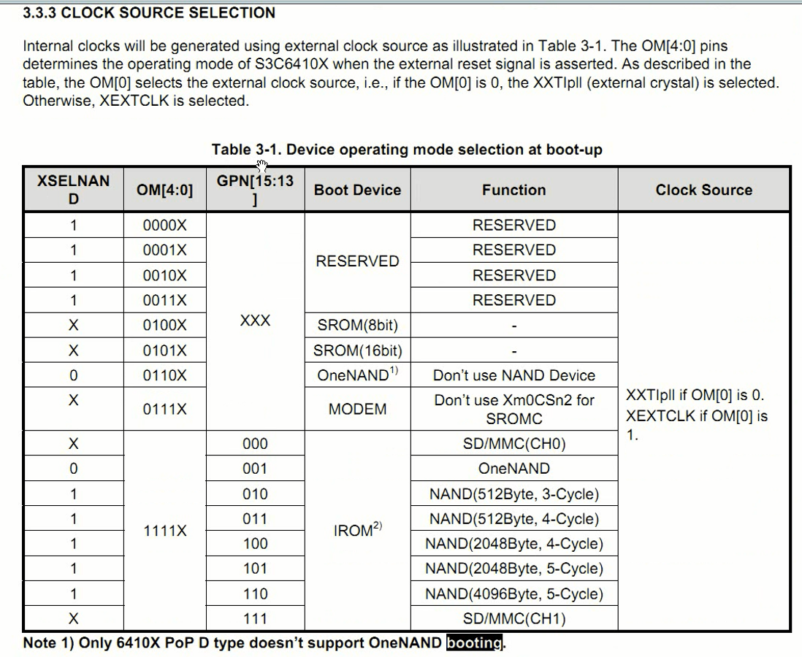

      IROM - Internal IROM
      处理器内存的固件，存储器。不是垫脚石
      NandFlash和SD卡启动都是通过IROM启动，通过引脚配置。

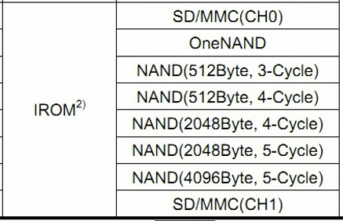

### 地址布局

打开芯片手册，搜索memory map

      IROM在什么位置？0x80000000开始
      垫脚石在哪里？作用？
      内存？0x50000000开始

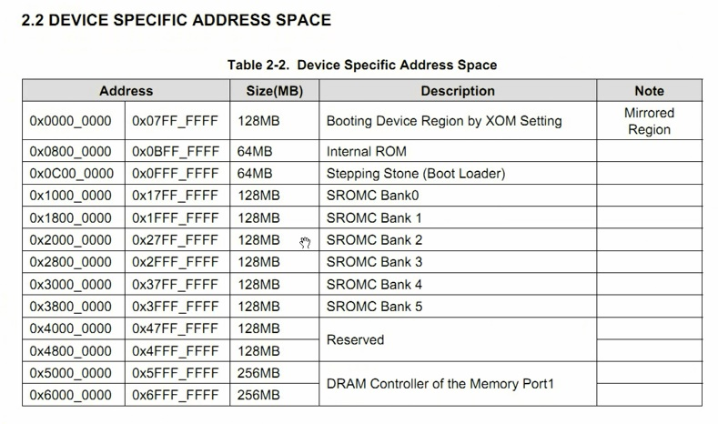

      ARM处理器一旦上电，首先肯定是零地址处开始运行。
      S3C6410 在零地址处是镜像区域。这个镜像区域会把IROM/NorFlash等映射到该区域。
      根据不同的启动选择，然后把相应区域映射到镜像区域，0地址处。

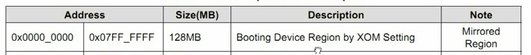

### 启动流程

      主要关注NandFlash启动过程
      IROM映射到0地址处，IROM内容是芯片厂商固化的0阶段的bootloader。
      1.先执行IROM的booloader0，硬件初始化
      2.IROM要把NandFlash的bootloader1的最前面的8KB放到垫脚石后跳转垫脚石执行
      3.垫脚石执行bootloader1，还要把剩下的启动代码拷贝到SDRAM
      4.bootloader1结束后跳转到SDRAM继续bootloder2

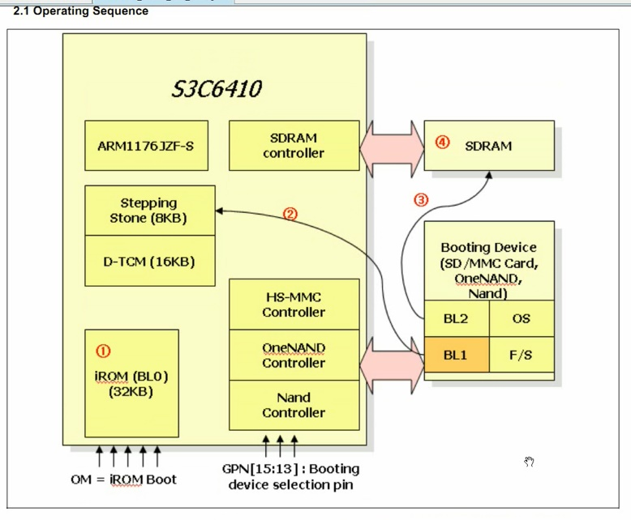

## S5PV210处理器

### 启动方式

芯片手册阅读

      IROM启动
      串口
      NandFlash启动
      SD卡启动
      USB启动

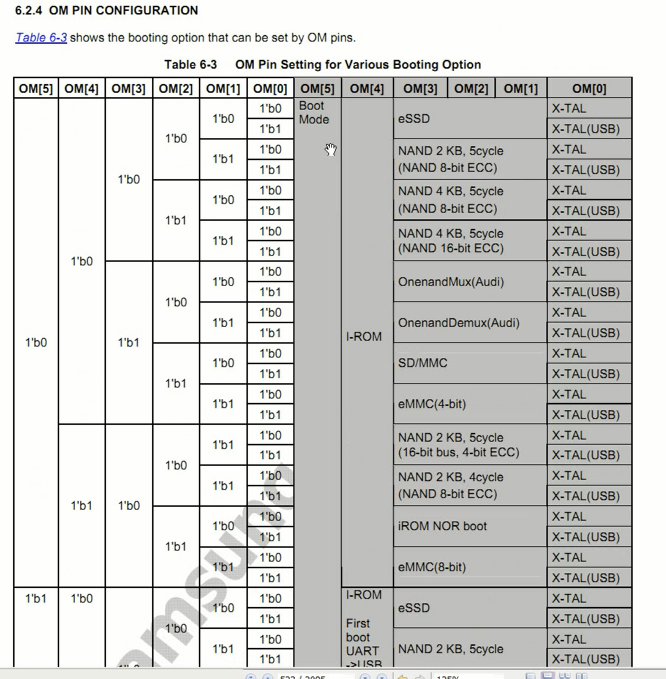

### 地址布局

      IROM - 64KB
      垫脚石 - 0xD002-0000 ~ 0XD003-7FFF
      内存 - 0x20000000 开始

### 启动流程

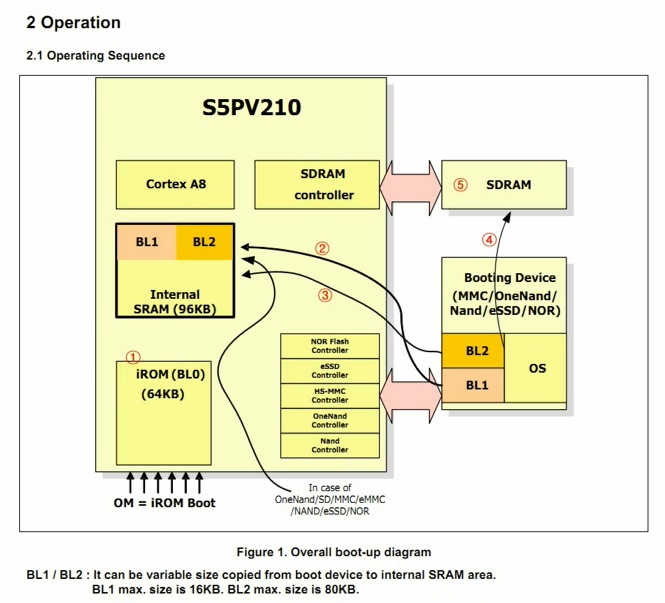

      主要关注NandFlash启动过程
      1.执行IROM（Bootloader0），初始化硬件
      2.IROM将bootloader1拷贝到垫脚石，然后跳转垫脚石（垫脚石居然从8KB变成96KB）
      3.优先考虑将bootloader2仍然拷贝到垫脚石中，否则拷贝到内存
      4.垫脚石执行完后跳转内存。
      bootloader2多大就不拷贝到垫脚石？？80KB

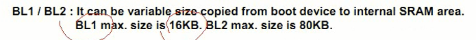
