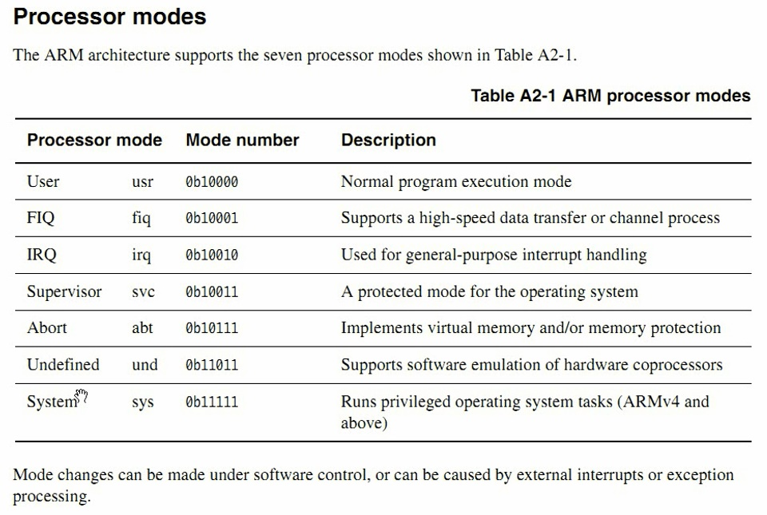

# 第2课-ARM处理器工作模式

      ARM学习必不可少架构参考手册
      

      不同工作模式，指令集不同，可访问资源不同
      ARM分成其中不同工作模式

      User模式-usr：普通应用程序运行模式
      FIQ模式-fiq：快速中断模式
      IRQ模式-irq：普通中断模式
      Supervisor模式-svc：提供给操作系统的保护模式
      Abort模式-abt：异常模式，访问虚拟内存异常等
      Undefined模式-und：未定义模式，指令不支持
      System模式-sys：ARMv4及其以上的模式
      注意：
          普通应用程序工作于User模式
          Linux内核运行于svc模式
