# 第2课-交叉工具链


## 什么是交叉工具链

      交叉工具链是一系列工具的集合
```
arm-linux-addr2line  arm-linux-g++        arm-linux-gprof    arm-linux-readelf
arm-linux-ar         arm-linux-gcc        arm-linux-ld       arm-linux-size
arm-linux-as         arm-linux-gcc-4.3.2  arm-linux-nm       arm-linux-sprite
arm-linux-c++        arm-linux-gcov       arm-linux-objcopy  arm-linux-strings
arm-linux-c++filt    arm-linux-gdb        arm-linux-objdump  arm-linux-strip
arm-linux-cpp        arm-linux-gdbtui     arm-linux-ranlib
```
     PC机上x86架构的程序在开发板上肯定不能用啊
     虽然说都是二进制，但是底层架构不一样，指令集不一样
     使用交叉编译器编译的肯定可以在ARM上运行，但是在x86上不能运行

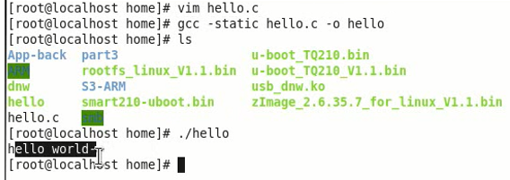

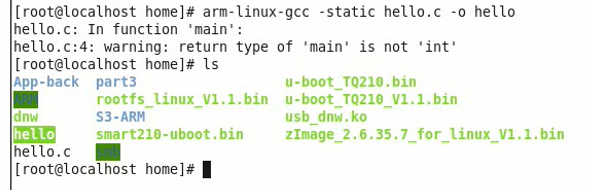

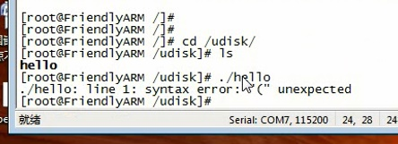

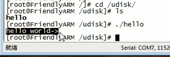

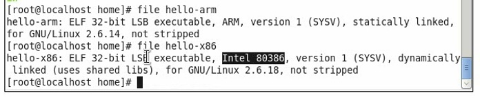

## 交叉开发模型

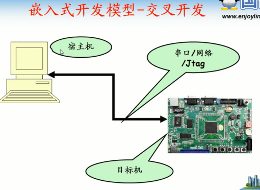


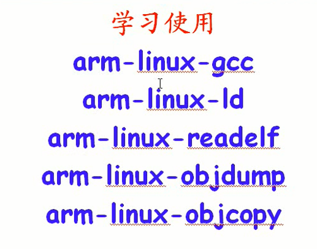

      命名规律：
        前面arm-linux-：目标平台-系统。还有典型的mips-linux
        gcc：编译器
        ld：链接器
        elf：elf解析工具
        objdump：obj工具

## arm-linux-gcc

      每一种编译器都会到固定的地方寻找头文件
      gcc在/usr/include找


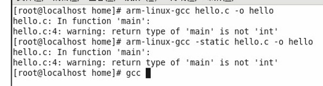

        arm-linux-gcc可以通过从参数找
        arm-linux-gcc --print-search-dir

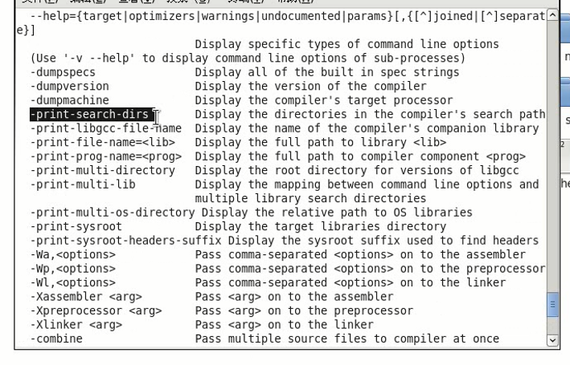

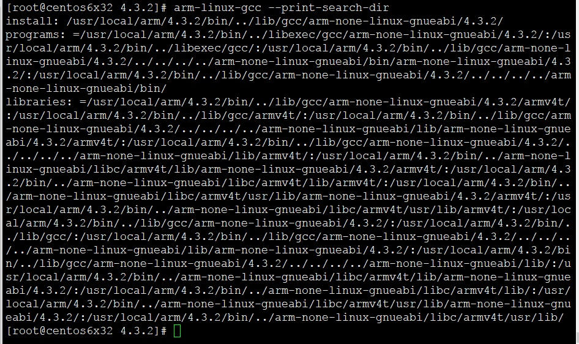

## arm-linux-ld

      用法简单
      gcc -c只编译不链接
      arm-linux -T使用链接器脚本,啥是链接器脚本？

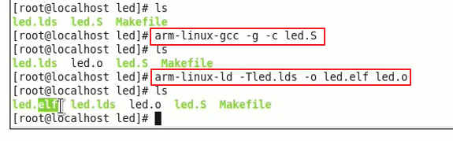

## arm-linux-elf

      elf文件解析工具，根据文件头获取一波信息
      -a：查看文件全部信息
      重要信息包括：
        大小端 - 大部分是小端，网络序是大端序
        运行平台

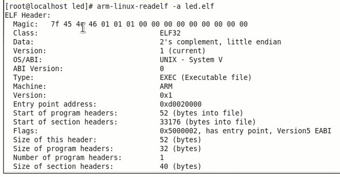


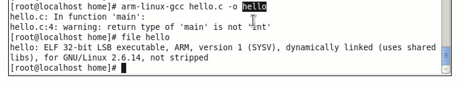

      对比elf工具和file工具的大小端平台信息是否一致，如果还不能运行，很可能是库依赖问题
      -d参数显示必须要的依赖库

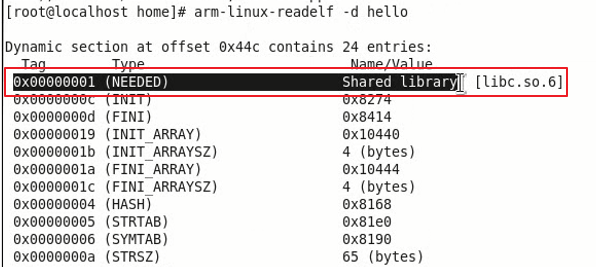

## arm-linux - objdump ARM平台反汇编器


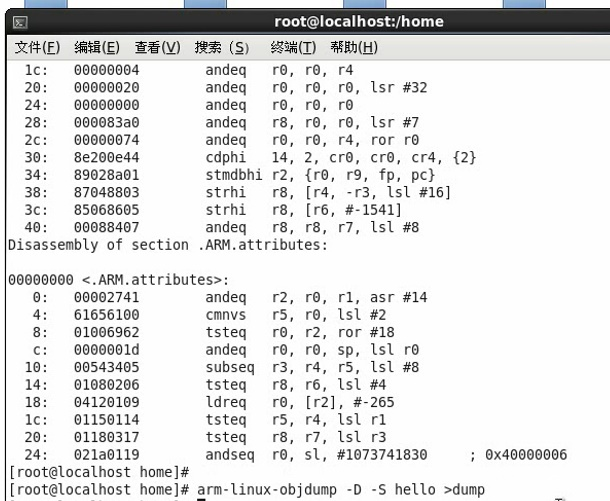


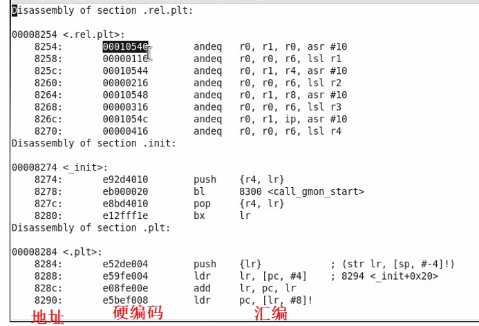

      尴尬。arm汇编不会用
      信息很少，编译时候添加-g选项，附加调试信息，完美对应

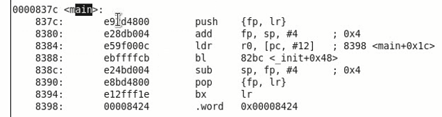

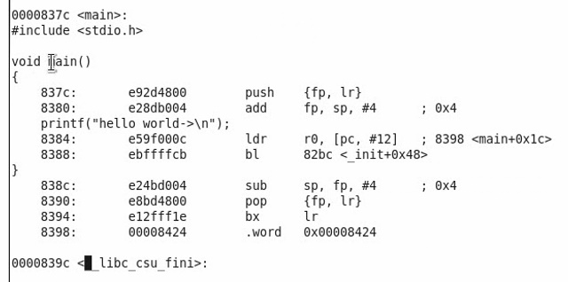


## arm-linux-objcopy - 文件格式转换器

      如果运行环境没有程序加载器，那么就必须用纯二进制。多数情况是连Linux系统都没有的情况下运行
      如何把elf文件转换成纯二进制程序？

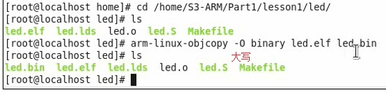
