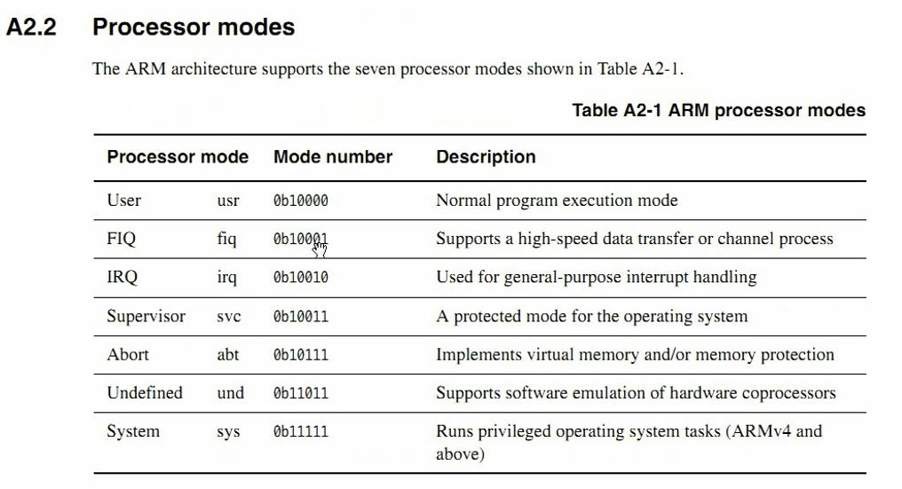
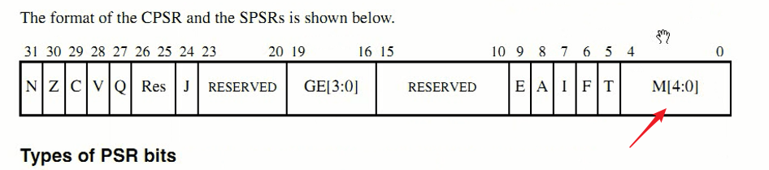
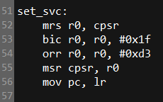

# 第2课-设置svc模式


##  ARM工作模式



## 工作模式设置

      通过状态寄存器CPSR。
      修改最后五位即可




      MSR
      MRS
      BIC
      ORR
      不能直接修改CPSR
      必须先把CPSR导入到寄存器，修改后导回。导回前先清零CPSR后五位

## 修改工作模式代码编写



      模式位设置成10011


```
@****************************
@File:start.S
@
@成都国嵌嵌入式培训中心
@****************************

.text
.global	_start
_start:
		b	reset
		ldr	pc, _undefined_instruction
		ldr	pc, _software_interrupt
		ldr	pc, _prefetch_abort
		ldr	pc, _data_abort
		ldr	pc, _not_used
		ldr	pc, _irq
		ldr	pc, _fiq

_undefined_instruction: .word undefined_instruction
_software_interrupt:	.word software_interrupt
_prefetch_abort:	.word prefetch_abort
_data_abort:		.word data_abort
_not_used:		.word not_used
_irq:			.word irq
_fiq:			.word fiq

undefined_instruction:
		nop

software_interrupt:
		nop

prefetch_abort:
		nop

data_abort:
		nop

not_used:
		nop

irq:
		nop

fiq:
		nop

reset:
		bl set_svc

set_svc:
		mrs r0, cpsr
		bic r0, r0, #0x1f ;置1
		orr r0, r0, #0xd3 ;清零
		msr cpsr, r0 ;写回
		mov pc, lr

```
