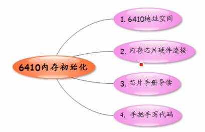
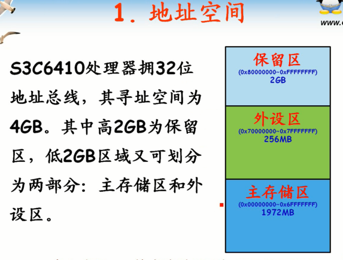
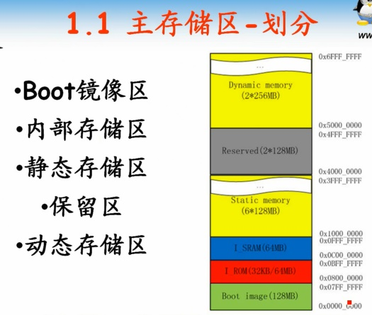
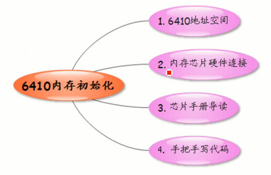
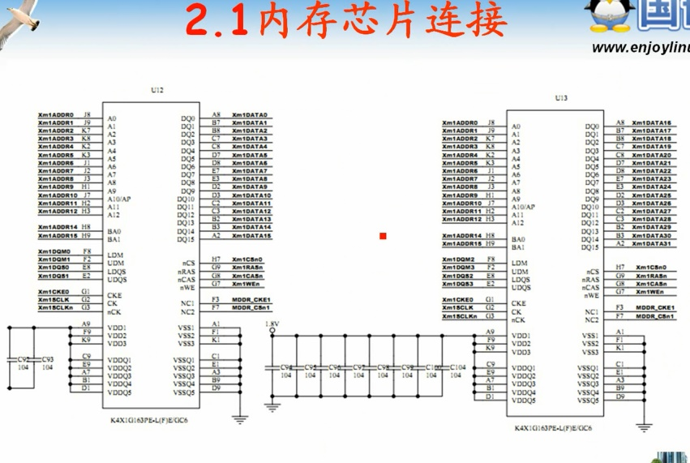
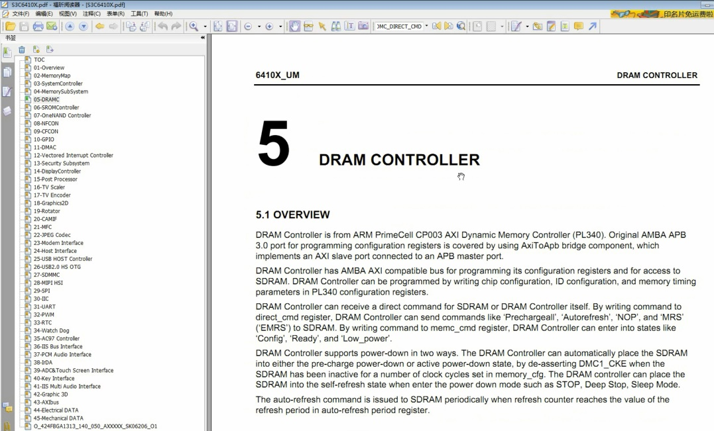

<!-- TOC depthFrom:1 depthTo:6 withLinks:1 updateOnSave:1 orderedList:0 -->

- [第3课-6410内存初始化](#第3课-6410内存初始化)
	- [课程索引](#课程索引)
	- [6410地址空间](#6410地址空间)
		- [主存储区-划分](#主存储区-划分)
	- [内存芯片硬件连接](#内存芯片硬件连接)
	- [芯片手册导读](#芯片手册导读)
	- [手把手写代码](#手把手写代码)
	- [总结](#总结)

<!-- /TOC -->

# 第3课-6410内存初始化

## 课程索引

## 6410地址空间

      拥有32位地址空间，被分成三个区域。
      保留区：0x80000000~0xFFFFFFFF 2GB 暂时不使用区域
      外设区：0x70000000~0x70xFFFFF 256MB 寄存器映射
      主存储区：0x00000000~0x6FFFFFFF 1972MB

### 主存储区-划分

      Boot镜像区：不会固定某个硬件区域，当开关拨动SD或者NandFlash时会把相应区域加载过来。
        IROM 32KB,垫脚石8KB
      内部存储区：128MB大小，分成两个64MB区间。
      静态存储区：外接NorFlash，OneNand。分成6个片组，每个128MB
      保留区域：128MB，没有使用。
      动态存储区：很重要区域。
        0x50000000内存起始地址。
        该地址为此，因为把内存放到了动态存储区。这种映射应该在非常底层完成。

## 内存芯片硬件连接

      2440内存容量是64MB = 32MB*2
      6410内存容量是128MB*2 = 256MB
				两块芯片地址线一样，但是数据线用的不一样。总共32位数据线。

## 芯片手册导读

### 6410芯片存储控制器

## 手把手写代码

## 总结
