<!-- TOC depthFrom:1 depthTo:6 withLinks:1 updateOnSave:1 orderedList:0 -->

- [第3课-ARM伪指令](#第3课-arm伪指令)
	- [课程索引](#课程索引)
	- [ARM机器码(ARM硬编码)](#arm机器码arm硬编码)
		- [MOV指令硬编码](#mov指令硬编码)
	- [伪指令](#伪指令)
	- [定义类伪指令](#定义类伪指令)
		- [global](#global)
		- [ascii](#ascii)
		- [byte](#byte)
		- [word](#word)
		- [data](#data)
		- [equ](#equ)
		- [align](#align)
	- [操作类伪指令](#操作类伪指令)
		- [ldr](#ldr)
		- [nop](#nop)

<!-- /TOC -->

# 第3课-ARM伪指令

## 课程索引

## ARM机器码(ARM硬编码)

      任何一款处理器都有自己的指令集，指令集对应自己的硬编码
      硬编码定长32位整数

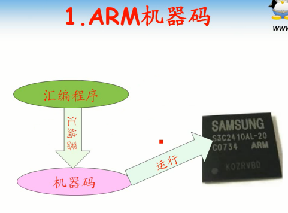

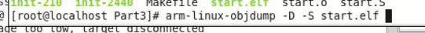

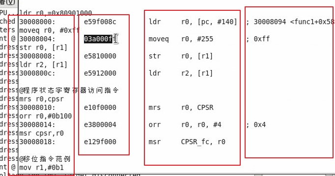

      ARM手册详细介绍硬编码，X86也有一套。任何处理器都有手册

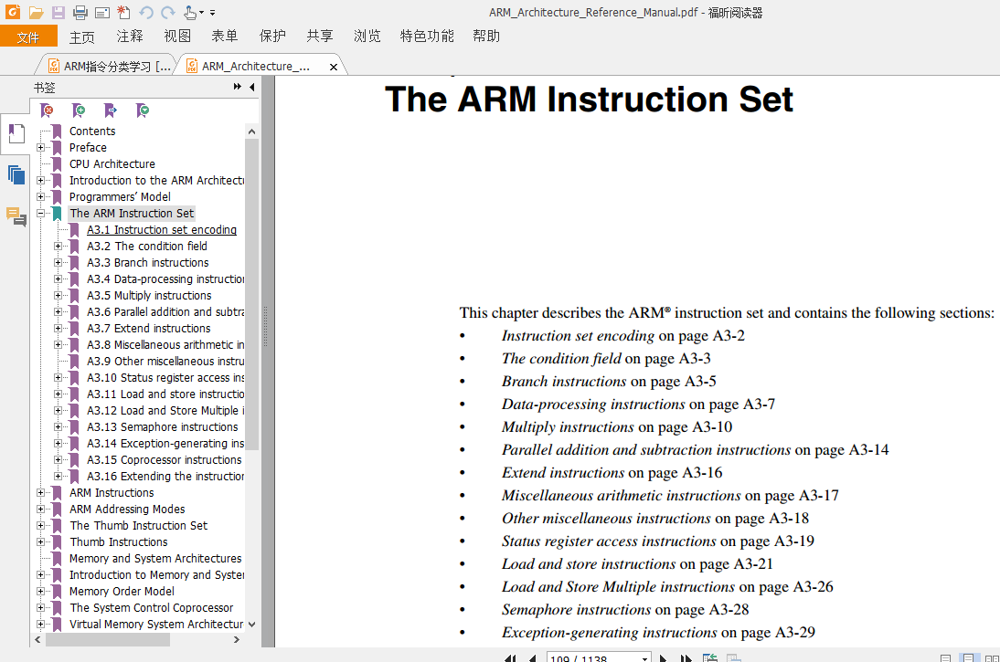

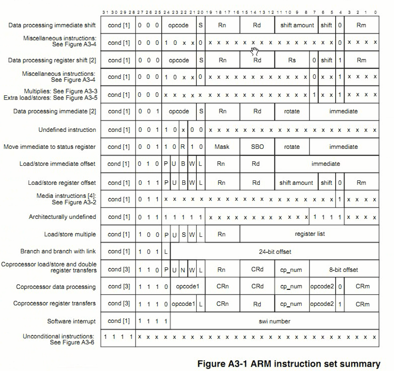

### MOV指令硬编码

      数据处理类硬编码
        cond：条件位，具体查看条件表
        00：保留位
        I：操作数是立即数还是寄存器？
        opcode：操作码，可能操作码一样条件不同指令不大一样
        s：是否影响CPSR,指令指针寄存器
        Rn：source寄存器，0~14
        Rd：dest寄存器，0~14
        shifter_operand：源操作数。12位源操作数表示大小有限，如果是立即数的话。超过会报错。
        报错可以通过伪指令解决。引入本节课

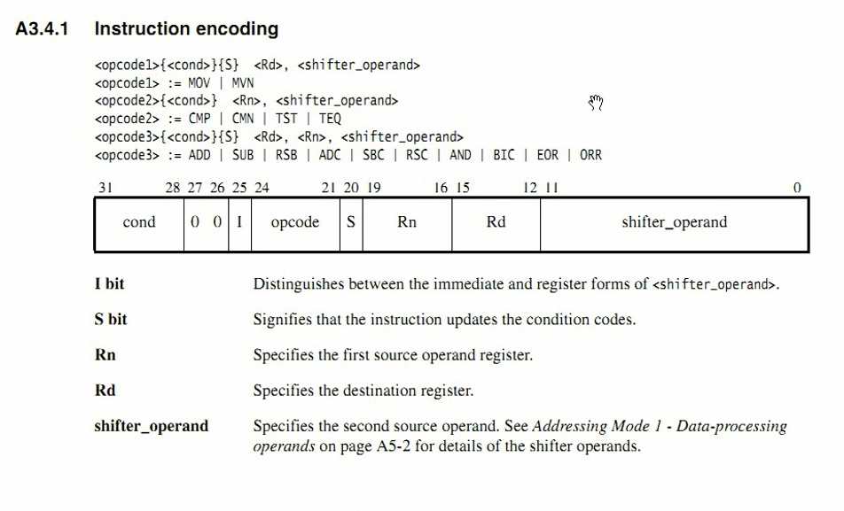

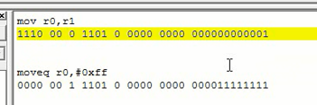

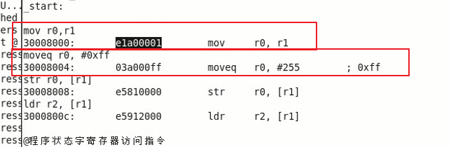

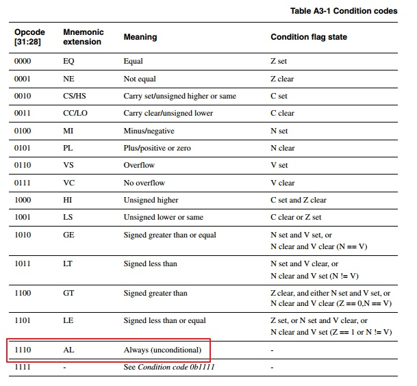
## 伪指令

      看似指令，但是没有对应的硬编码。而只是给汇编器使用，不产生机器码。

## 定义类伪指令

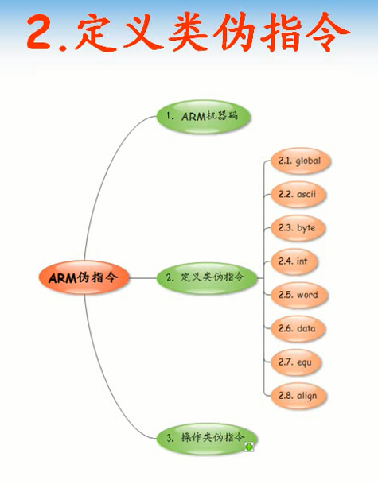

      典型的标号，譬如
        hello:
      定义类伪指令只在汇编时起作用

### global

      global以点开头，定义成全局符号，类似于函数。汇编标号可以被C语言互调

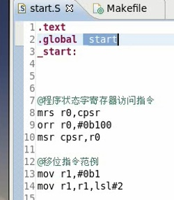

### ascii

      定义ascii字符
      .ascii:“hello world”

### byte

      定义byte
      .byte:0x01

### word

      定义字
      .word:0xffff

### data

      .data表明数据段
      数据段起始位置通过readelf查看
      数据段定义了三种类型的数据
      使用的时候直接使用标号即可

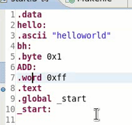

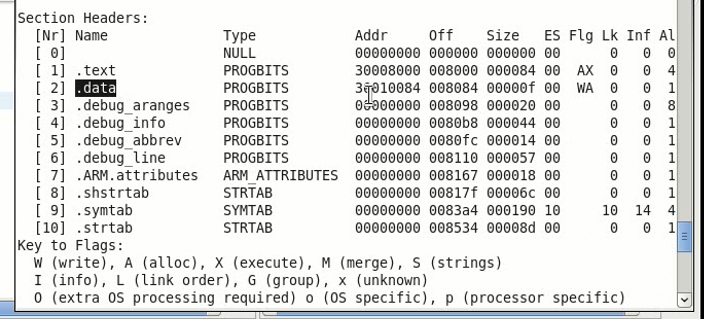

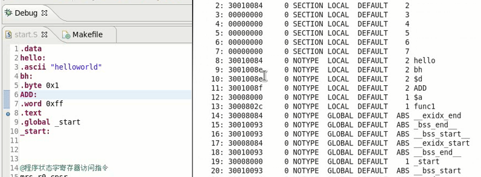

### equ

      类似于C语言中的宏定义

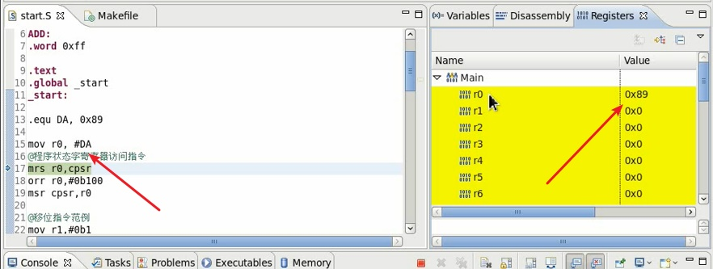

### align

      控制对齐，让汇编器给一个对齐的地址

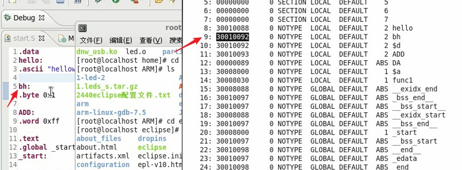

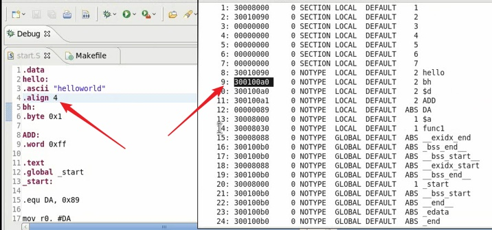

## 操作类伪指令

### ldr

      mov指令立即数不能超过8位
      指令格式虽然最后有12位可以作为立即数，但是有4位作为左移右移的情况，能用的只有四位
      这个是从CPU架构到指令定义规定的

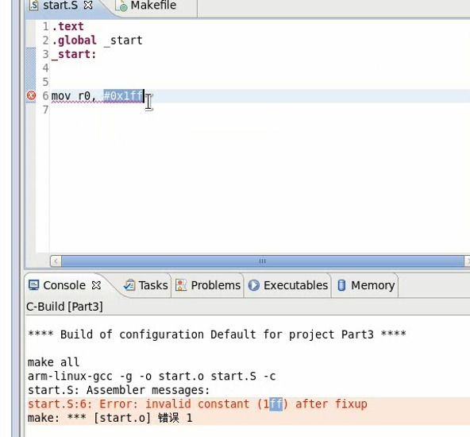

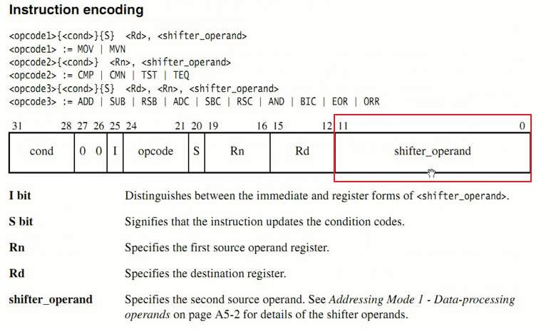

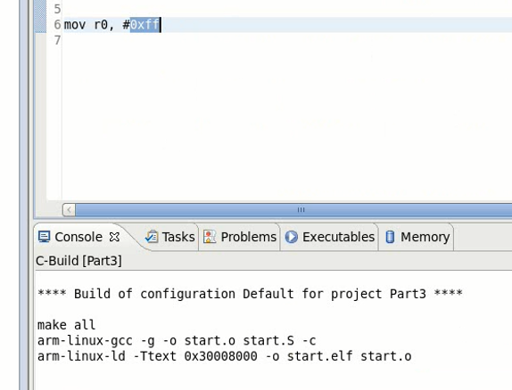

      ldr可以填充大于8位的立即数，但是这个格式不对
      在ldr指令中，立即数用 = 号开始，不用#开始
      伪指令终究是假的，它最终怎么转换？

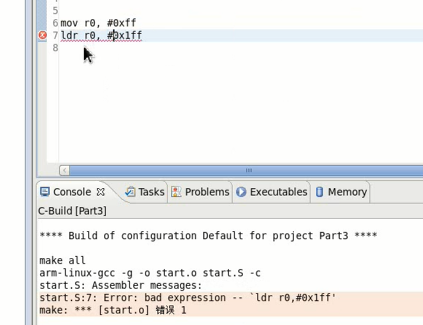

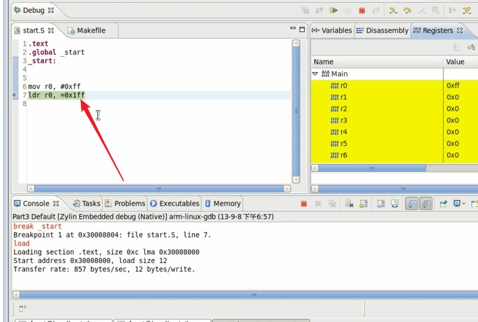

      伪指令ldr用于大于8位立即数存取
      硬编码ldr用于读取内存值到寄存器
      很明显，伪指令ldr在会汇编的时候会把立即数放到堆栈

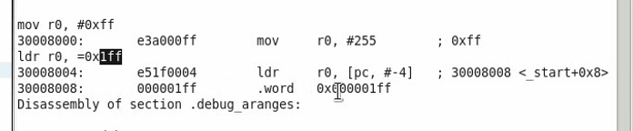

### nop

      空操作 - 主要用于延时
      空操作本质就是mov r0,r0

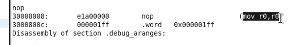
